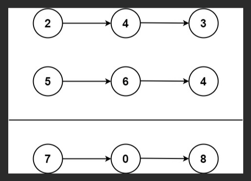

# LeetCode 热题 HOT 100

[TOC]

# 2、两数之和

## 2.1 我的思路和代码

### 2.1.1 思路

1、链表的的值都取出来放入ArrayList中

2、然后做补齐的操作（填0）。

3、然后反转一下链表。

4、从最后一位开始按位求和，求和过程中，进行链表重构

### 2.1.2 代码

```java
class Solution {
   public ListNode addTwoNumbers(ListNode l1, ListNode l2) {
      // 都取出来 重新构建
      List<Integer> l1List = new ArrayList<>();
      List<Integer> l2List = new ArrayList<>();
      while (l1 != null) {
         l1List.add(l1.val);
         l1 = l1.next;
      }
      while (l2 != null) {
         l2List.add(l2.val);
         l2 = l2.next;
      }
      if (l1List.size() > l2List.size()) {
         int tempSize = l2List.size();
         for (int i = 0; i < l1List.size() - tempSize; i++) {
            l2List.add(0);
         }
      } else {
         int tempSize = l1List.size();
         for (int i = 0; i < l2List.size() - tempSize; i++) {
            l1List.add(0);
         }
      }
      Collections.reverse(l1List);
      Collections.reverse(l2List);
      ListNode res = new ListNode();
      ListNode pre = new ListNode();
      pre = res;
      // before 表示进位 now 表示当前位
      int before = 0;
      int now = 0;
      for (int i = l1List.size() - 1; i >= 0; i--) {
         // 获取当前值
         int val1 = l1List.get(i);
         int val2 = l2List.get(i);
         // 进行加操作
         if (val1 + val2 + before > 9) {
            // 需要进位
            now = val1 + val2 - 10 + before;
            before = 1;
         } else {
            now = val1 + val2 + before;
            before = 0;
         }

         pre.next = new ListNode(now);
         pre = pre.next;
      }
      if (before > 0) {
         pre.next = new ListNode(before);
         pre = pre.next;
      }
      return res.next;
   }
}
//leetcode submit region end(Prohibit modification and deletion)
```

## 2.2 递归思路




### 2.2.1 思路

这个题感觉可以用递归的思想，先计算2+5，然后再计算后面的。

如果有短的链表的话，后面的值只保存长链表部分与进位的和就行了。

> 传入helper的链表节点如果为空，不能直接写p.next，会报错的，因为p有可能是空的，需要判断一下

### 2.2.2 代码

```java
ListNode res = new ListNode();
ListNode pre = new ListNode();
int before = 0;
int now = 0;

public ListNode addTwoNumbers(ListNode l1, ListNode l2) {
   pre = res;
   helper(l1, l2);
   if (before > 0) {
      pre.next = new ListNode(before);
      pre = pre.next;
   }
   return res.next;
}

public void helper(ListNode l1, ListNode l2) {
   if (l1 == null && l2 == null) {
      return;
   }
   int l1Val = (l1 != null ? l1.val : 0);
   int l2Val = (l2 != null ? l2.val : 0);

   // 进行加操作
   if (l1Val + l2Val + before > 9) {
      // 需要进位
      now = l1Val + l2Val - 10 + before;
      before = 1;
   } else {
      now = l1Val + l2Val + before;
      before = 0;
   }

   pre.next = new ListNode(now);
   pre = pre.next;
   helper(l1 != null ? l1.next : null, l2 != null ? l2.next : null);
}
```

# 3、无重复字符的最长子串

## 3.1 我的思路和代码

### 3.1.1 思路

给定一个子串，我们从头开始进行遍历，以abcabcbb为例，我们可以申请一个哈希表，用于存储已经出现过的字母，每次遍历到一个字符都与哈希表中对应位置进行比较，如果出现过，那么记录下当前子串的长度，然后清空哈希表继续进行后面的遍历。

空格ASCII  32

数字 48～57

还是败了。常规方法解不出来。比如dvdk，d处重复，应该考虑的是从v重新开始找，而如果按照我的想法，他就是从d开始找了，结果就是2（dk），而实际上结果应该是3（vdk）


## 3.2 滑动窗口解决方案

### 3.2.1 思路

设定两个指针，left和right，二者之间的是一个滑动窗口。

我们每次先记录下right所在位置字符，将其加入到哈希表中，然后right进行右移的操作。

紧接着，我们需要进行一个判断，就是当前滑动窗口内的内容是否有重复的情况，也就是hashStr[(int)s.charAt(right)] != 0 是否不等于0，不等于0说明之前是出现过这个字符的。所以我们需要收缩窗口。

收缩之前先记录下当前的长度（与res）取最大

然后需要把left字符在哈希表中做移除操作，然后left向右移动，相当于更新了滑动窗口。

最终返回Math.max(res,right - left)，因为有可能最大字符串在上一次更新res之后是不重复的，所以会导致res不会更新，在返回结果的时候，我们需要进行一次更新。

### 3.2.2 代码

```java
int left = 0;
int right = 0;
int res = 0;
int[] hashStr = new int[128];
while(right < s.length()){
   // 记录出现的字符
   hashStr[(int)s.charAt(right)]++;
   right++;

   while(right < s.length() && hashStr[(int)s.charAt(right)] != 0){// 说明之前出现过这个字符了，需要收缩窗口
      // 先记录下最大长度
      res = Math.max(res,right - left);
      // 把这个字符移除哈希表
      hashStr[(int)s.charAt(left)]--;
      // 指针向右移动
      left++;
   }
}
return Math.max(res,right - left);
```

# 4、两两交换链表中的节点

## 4.1 常规思路及代码

### 4.1.1 思路

既然要求两两交换，并且不能修改节点的值，例如1-2-3-4-5，那么我们把这个链表拆分为两个链,1-3-5和2-4，然后再按照先遍历2-4的一个，再遍历1-3-5的一个，串起来即可。


# 48、图像旋转

## 48.1 思路

