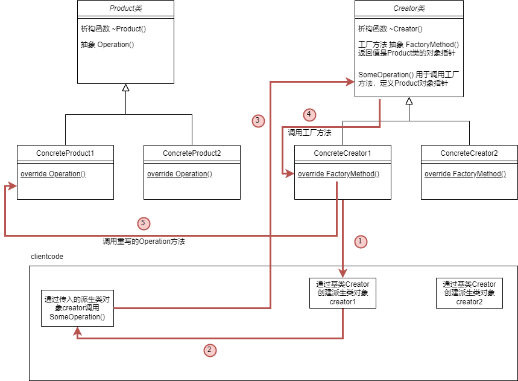

# 设计模式

[TOC]

# 1. 工厂方法

## **1.1 意图**

工厂方法模式也称为：**虚拟构造函数。**工厂方法模式允许在**父类**中提供一个**创建对象**的**方法**，允许**子类**决定**实例化对象的类型**。

## 1.**2 问题**

假设现在有一个物流管理系统，为了省时间，只涉及了处理卡车运输的类，也就是大部分代码都在卡车类中。

如果现在想要一个海上运输的功能，由于大部分代码都在卡车类中，所以添加轮船类就需要新建一个轮船类，并重新写代码。更为麻烦的是，如果不断的增加运输方式，那么就意味着你需要一直写相应的类。

## 1.**3 解决方案**

使用特殊的工厂方法代替对于对象构造函数的直接调用（即使用new运算符）


子类可以修改工厂方法返回的对象类型。可以在子类中重写工厂方法，从而改变其创建产品的类型。

要注意的是，这些产品需要具有共同的基类或者接口，子类才能返回不同类型的产品。同时基类中的工厂方法还应该将其返回类型生命为这一共有接口。

还是以上面的轮船和卡车为例，卡车类和轮船类都必须实现运输的接口，接口中有一个交付方法。所以每个类都能够用不同的方式其实现这个方法，只不过类中的工厂方法返回的对象不同。

## 1.**4 工厂方法模式结构**


① 产品（product）对于接口进行声明，对于所有由创建者及其子类构建的对象，这些接口都是通用的

② 具体产品（concrete products）是产品接口的不同实现

③ 创建者（creator）返回的是产品对象的工厂方法。该方法的返回对象类型必须与产品接口相匹配

④ 具体创建者（concrete creators）会重写基础工厂方法，使其返回不同类型的产品

## 1.**5 工厂方法模式适合的应用场景**

① 无法准确预知对象的确切类型及其依赖关系，可以使用工厂方法。

工厂方法能够将创建产品的代码与实际使用产品的代码分离，并且能够在不影响其他代码的情况下扩展产品创建部分代码。

② 如果希望用户能够扩展你软件库或者框架的内部组件，可以使用工厂方法

将框架中构造组件的代码集中到单个工厂方法中，并在继承该组件之外允许任何人对该方法进行重写。

例如：你想要使用一个圆形按钮，但是原框架只有矩形按钮，这个时候你就需要根据基础的按钮框架写一个圆形按钮的子类，并返回圆形按钮的对象。而在基类中，返回的是按钮的对象。

③ 如果希望复用现有对象来节省系统资源，而不是每次都想重新创建对象，可以使用工厂方法。

可以定义一个方法，既能够创建新对象，又能够重用现有对象。

## 1.**6 实现方式**

1. 让所有产品都遵循同一接口。 该接口必须声明对所有产品都有意义的方法。
2. 在创建类中添加一个空的工厂方法。 该方法的返回类型必须遵循通用的产品接口。
3. 在创建者代码中找到对于产品构造函数的所有引用。 将它们依次替换为对于工厂方法的调用， 同时将创建产品的代码移入工厂方法。
   
    你可能需要在工厂方法中添加临时参数来控制返回的产品类型。
    
    工厂方法的代码看上去可能非常糟糕。 其中可能会有复杂的 `switch`分支运算符， 用于选择各种需要实例化的产品类。 但是不要担心， 我们很快就会修复这个问题。
    
4. 现在， 为工厂方法中的每种产品编写一个创建者子类， 然后在子类中重写工厂方法， 并将基本方法中的相关创建代码移动到工厂方法中。
5. 如果应用中的产品类型太多， 那么为每个产品创建子类并无太大必要， 这时你也可以在子类中复用基类中的控制参数。
   
    例如， 设想你有以下一些层次结构的类。 基类 `邮件`及其子类 `航空邮件`和 `陆路邮件` ；  `运输`及其子类 `飞机`, `卡车`和 `火车` 。  `航空邮件`仅使用 `飞机`对象， 而 `陆路邮件`则会同时使用 `卡车`和 `火车`对象。 你可以编写一个新的子类 （例如 `火车邮件` ） 来处理这两种情况， 但是还有其他可选的方案。 客户端代码可以给 `陆路邮件`类传递一个参数， 用于控制其希望获得的产品。
    
6. 如果代码经过上述移动后， 基础工厂方法中已经没有任何代码， 你可以将其转变为抽象类。 如果基础工厂方法中还有其他语句， 你可以将其设置为该方法的默认行为。

## 1.**7 工厂方法模式优缺点**

你可以避免创建者和具体产品之间的紧密耦合。

单一职责原则。 你可以将产品创建代码放在程序的单一位置， 从而使得代码更容易维护。

开闭原则。 无需更改现有客户端代码， 你就可以在程序中引入新的产品类型。

应用工厂方法模式需要引入许多新的子类， 代码可能会因此变得更复杂。 最好的情况是将该模式引入创建者类的现有层次结构中。

## 1.**8 与其他模式的关系**

- 在许多设计工作的初期都会使用[工厂方法模式](https://refactoringguru.cn/design-patterns/factory-method) （较为简单， 而且可以更方便地通过子类进行定制）， 随后演化为使用[抽象工厂模式](https://refactoringguru.cn/design-patterns/abstract-factory)、 [原型模式](https://refactoringguru.cn/design-patterns/prototype)或[生成器模式](https://refactoringguru.cn/design-patterns/builder) （更灵活但更加复杂）。
- [抽象工厂模式](https://refactoringguru.cn/design-patterns/abstract-factory)通常基于一组[工厂方法](https://refactoringguru.cn/design-patterns/factory-method)， 但你也可以使用[原型模式](https://refactoringguru.cn/design-patterns/prototype)来生成这些类的方法。
- 你可以同时使用[工厂方法](https://refactoringguru.cn/design-patterns/factory-method)和[迭代器模式](https://refactoringguru.cn/design-patterns/iterator)来让子类集合返回不同类型的迭代器， 并使得迭代器与集合相匹配。
- [原型](https://refactoringguru.cn/design-patterns/prototype)并不基于继承， 因此没有继承的缺点。 另一方面， *原型*需要对被复制对象进行复杂的初始化。 [工厂方法](https://refactoringguru.cn/design-patterns/factory-method)基于继承， 但是它不需要初始化步骤。
- [工厂方法](https://refactoringguru.cn/design-patterns/factory-method)是[模板方法模式](https://refactoringguru.cn/design-patterns/template-method)的一种特殊形式。 同时， *工厂方法*可以作为一个大型*模板方法*中的一个步骤。

## 1.**9 C++代码实现**

```cpp
//
// Created by lyf on 2022/4/19.
//
#include <iostream>

using namespace std;

/**
 * The Product interface declares the operations that all concrete products must
 * implement.
 */

class Product {
public:
    virtual ~Product() {}
    virtual std::string Operation() const = 0;
};

/**
 * Concrete Products provide various implementations of the Product interface.
 */
class ConcreteProduct1 : public Product {
public:
    std::string Operation() const override {
        return "{Result of the ConcreteProduct1}";
    }
};
class ConcreteProduct2 : public Product {
public:
    std::string Operation() const override {
        return "{Result of the ConcreteProduct2}";
    }
};

/**
 * The Creator class declares the factory method that is supposed to return an
 * object of a Product class. The Creator's subclasses usually provide the
 * implementation of this method.
 */

class Creator {
    /**
     * Note that the Creator may also provide some default implementation of the
     * factory method.
     */
public:
    virtual ~Creator(){};
    virtual Product* FactoryMethod() const = 0;
    /**
     * Also note that, despite its name, the Creator's primary responsibility is
     * not creating products. Usually, it contains some core business logic that
     * relies on Product objects, returned by the factory method. Subclasses can
     * indirectly change that business logic by overriding the factory method and
     * returning a different type of product from it.
     */

    std::string SomeOperation() const {
        // Call the factory method to create a Product object.
        Product* product = this->FactoryMethod();
        // Now, use the product.
        std::string result = "Creator: The same creator's code has just worked with " + product->Operation();
        delete product;
        return result;
    }
};

/**
 * Concrete Creators override the factory method in order to change the
 * resulting product's type.
 */
class ConcreteCreator1 : public Creator {
    /**
     * Note that the signature of the method still uses the abstract product type,
     * even though the concrete product is actually returned from the method. This
     * way the Creator can stay independent of concrete product classes.
     */
public:
    Product* FactoryMethod() const override {
        return new ConcreteProduct1();
    }
};

class ConcreteCreator2 : public Creator {
public:
    Product* FactoryMethod() const override {
        return new ConcreteProduct2();
    }
};

/**
 * The client code works with an instance of a concrete creator, albeit through
 * its base interface. As long as the client keeps working with the creator via
 * the base interface, you can pass it any creator's subclass.
 */
void ClientCode(const Creator& creator) {
    // ...
    std::cout << "Client: I'm not aware of the creator's class, but it still works.\n"
              << creator.SomeOperation() << std::endl;
    // ...
}

/**
 * The Application picks a creator's type depending on the configuration or
 * environment.
 */

int main() {
    std::cout << "App: Launched with the ConcreteCreator1.\n";
    Creator* creator = new ConcreteCreator1();
    ClientCode(*creator);
    std::cout << std::endl;
    std::cout << "App: Launched with the ConcreteCreator2.\n";
    Creator* creator2 = new ConcreteCreator2();
    ClientCode(*creator2);

    delete creator;
    delete creator2;
    return 0;
}
```

## 1.**10 图解总结**

**重新梳理一下工厂方法的模式**

① 通过new 基类Creator的派生子类，返回基类的对象creator

```cpp

Creator* creator = new ConcreteCreator1();
```

② 在用户调用方法传入基类对象creator

```cpp

ClientCode(*creator);
```

③ 用户方法中调用了SomeOperation()方法，该方法中，调用了工厂方法FactoryMethod()，注意，虽然传入的是基类对象，但是当调用工厂方法FactoryMethod()时，实际上是子类对象的调用

```cpp

void ClientCode(const Creator& creator) {
    // ...
    std::cout << "Client: I'm not aware of the creator's class, but it still works.\n"
              << creator.SomeOperation() << std::endl;
    // ...
}
```

④ 子类的工厂方法返回的是Product类的子类对象product

```cpp

    Product* FactoryMethod() const override {
        return new ConcreteProduct1();
    }
```

⑤ 通过product对象可以调用其子类ConcreteProduct1中的Operation方法，执行相应的操作。

```cpp

product->Operation();
```

```cpp

class ConcreteProduct1 : public Product {
public:
    std::string Operation() const override {
        return "{Result of the ConcreteProduct1}";
    }
};
```

这样的好处就是，当我们需要新的Product类时，只需要新建一个ConcreteProduct类和ConcreteCreator类，二者的基类都是不需要修改的抽象或者是通用函数，并且写新的子类时，也很简单。

**最终代码的执行结果如下：**

```cpp

App: Launched with the ConcreteCreator1.
Client: I'm not aware of the creator's class, but it still works.
Creator: The same creator's code has just worked with {Result of the ConcreteProduct1}

App: Launched with the ConcreteCreator2.
Client: I'm not aware of the creator's class, but it still works.
Creator: The same creator's code has just worked with {Result of the ConcreteProduct2}
```

**调用关系图解如下：**

