# Git

[TOC]

# 学习路线图


# 1、Git基础

## 1.1 工作区

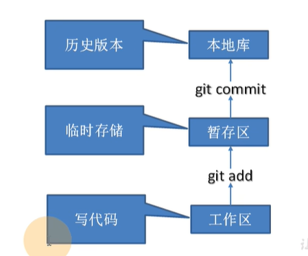

- 工作区：就是本地的开发环境
- 暂存区：是一个临时存储的地方，可以增加，也可以减少
- 本地库：一旦进来就会生成一个历史版本，这个历史版本不可删除

## 1.2 远程库

一般有局域网或者是互联网，可以将本地库的版本推送到远程库。比如GItHub、Gitee、Gitlab

## 1.3 Git 常用命令

### 1.3.1 在本地的一些操作

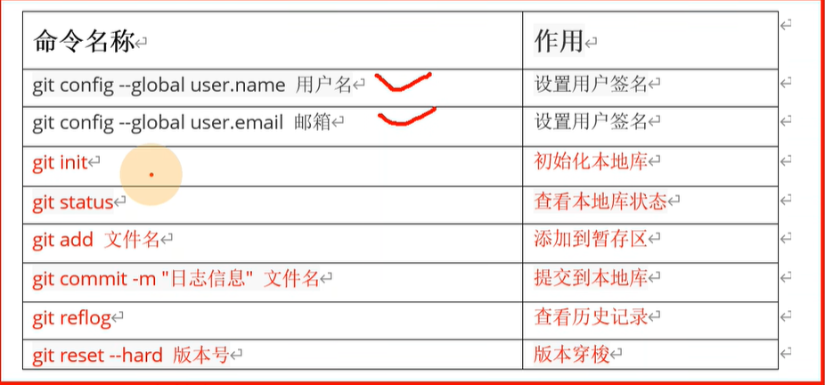

① git init 

执行命令后，会在当前根目录生成一个.git隐藏目录

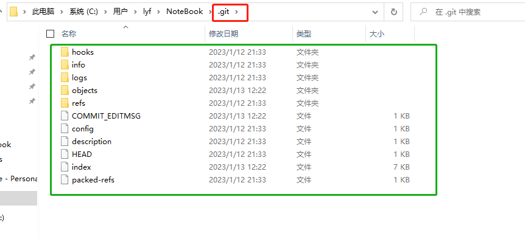

② git status

查看状态

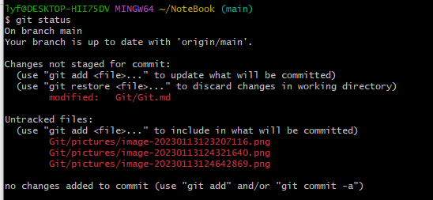

相关解释：

On branch main 表示主分支

Changes not staged for commit: 表示当前在暂存区的都有什么

Untracked files: 表示还有那些新增的文件，没有被将他放到暂存区

③ git add

将文件添加到暂存区中

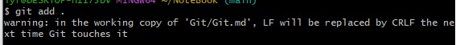

④ git commit -m "提交信息" filename

⑤ git reflog 查看历史版本 前七位 (git log是查看完成的版本号)

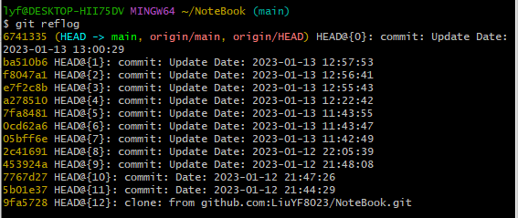

⑥ git reset --hard 版本 

版本穿梭

## 1.4 版本分支

版本控制过程中，同时推进多个任务，每个程序员可以在自己的分支上进行开发。

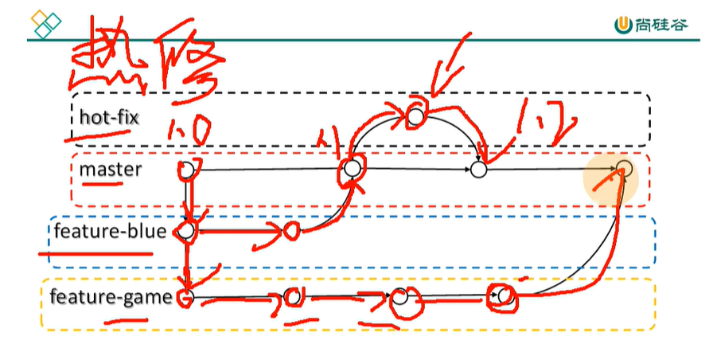

例如我们的主分支master是用户看到的一个版本，那么我们在1.0的版本上，分离出一个分支，用于进行更新操作，更新好了之后，就把分支合并到主分支上，等等。所以可以通过分支的方式，实现用户使用，然后开发人员开发并实时更新的一个操作。

如果某个分支开发失败，那么也不会对其他的分支造成影响。

### 1.4.1 查看分支

```shell
 git branch -v
```

### 1.4.2 创建分支

```
git branch branchname
```

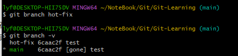

### 1.4.3 切换分支

```
git checkout hot-fix
```

在hot-fix上修改之后，进行提交到本地库

### 1.4.4. 合并分支

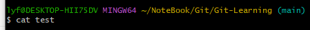

我们可以注意到，当我们切换回main分支，查看test文件，发现是空的，也就是说我们刚才只是在hot-fix分支上进行了操作，还没有合并到主分支，那么我们需要做合并主分支的操作。

```
git merge 分支
```

需要在main分支上进行合并。合并之后发现已经合并过来了。

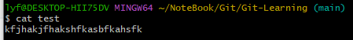

### 1.4.5 合并冲突

两个分支在同一个文件的同一个位置有两套完全不同的修改。

例如我们在master上进行修改，然后在分支上也进行修改。然后我们把分支合并到master上。

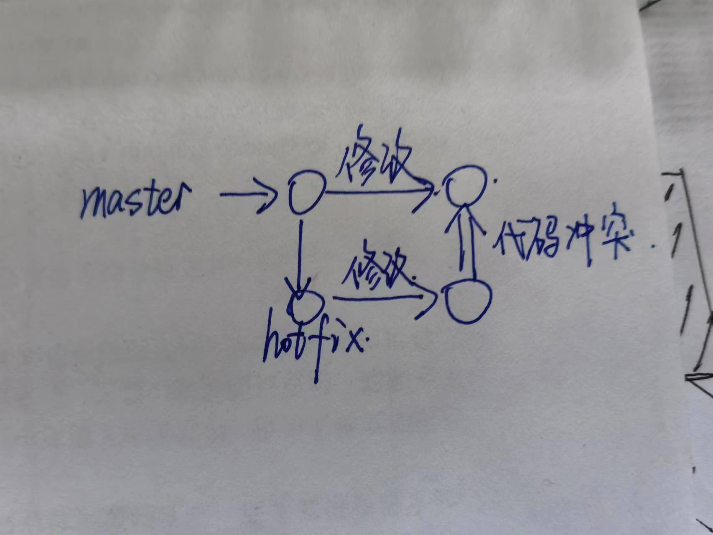

首先，我们在main分支上，分离出一个hot-fix2分支

test中的内容此时应该与main分支上的内容相同，如下

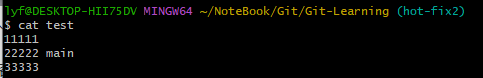

现在我们在hot-fix上把test内容修改成这样

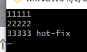

然后，将hot-fix分支提交上去，我们切换到主分支，把主分支的东西重新提交

这时候就会出现分支冲突，因为合并的文件并不相同。那么我们需要人为的修改代码，然后在主分支重新进行提交

```
git add test
git commit -m "xxx" 
```

😊注意在这个时候 git commit -m "xxx"  千万不能再带文件名了。

合并完成之后，并不会影响hot-fix2中的内容，所以hot-fix2中的内容还是

11111

22222

33333 hot-fix

而main分支中，内容是

11111

22222 main

33333 hot-fix

## 1.5 团队合作

### 1.5.1 团队内合作

clone push poll 

### 1.5.2 跨团队合作

将远程仓库fork过来，然后clone到本地，修改好之后，push到代码托管中心，然后Pull request，经过审核之后，然后另一个团队merge一下。然后就可以把代码poll本地库。

😆clone 是本地没有repository 时，将远程repository 整个下载过来。 pull 是本地有repository 时，将远程repository 里新的commit 数据(如有的话)下载过来，并且与本地代码merge。

# 2、GitHub基础


# 3、Git进阶


# 4、GitHub进阶


# 5、项目实战问题

## 5.1 将git链接到项目

### 5.1.1 github创建ssh秘钥

首先使用本地的git，创建一个秘钥

```bash
ssh-keygen
```

然后将秘钥添加到github中，这个秘钥一般在C盘的用户目录下


### 5.1.2 github仓库链接到本地项目

找一个空的目录把github仓库ssh到本地，然后需要注意的是，需要把隐藏的一个.git文件，显示出来，然后再将其整个拷贝到自己本地的目录


然后右上角就会有，相应的git选项

