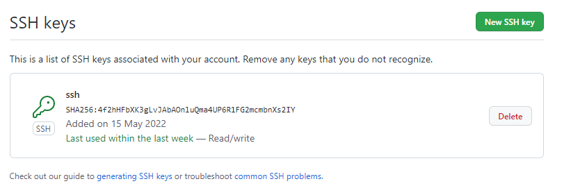

# Git

[TOC]

# 学习路线图


# 1、Git基础

## 1.1 工作区


- 工作区：就是本地的开发环境
- 暂存区：是一个临时存储的地方，可以增加，也可以减少
- 本地库：一旦进来就会生成一个历史版本，这个历史版本不可删除

## 1.2 远程库

一般有局域网或者是互联网，可以将本地库的版本推送到远程库。比如GItHub、Gitee、Gitlab

## 1.3 Git 常用命令

### 1.3.1 在本地的一些操作


① git init 

执行命令后，会在当前根目录生成一个.git隐藏目录


② git status

查看状态


相关解释：

On branch main 表示主分支

Changes not staged for commit: 表示当前在暂存区的都有什么

Untracked files: 表示还有那些新增的文件，没有被将他放到暂存区

③ git add

将文件添加到暂存区中


# 2、GitHub基础

# 3、Git进阶

# 4、GitHub进阶

# 5、项目实战问题

## 5.1 将git链接到项目

### 5.1.1 github创建ssh秘钥

首先使用本地的git，创建一个秘钥

```bash
ssh-keygen
```

然后将秘钥添加到github中，这个秘钥一般在C盘的用户目录下



### 5.1.2 github仓库链接到本地项目

找一个空的目录把github仓库ssh到本地，然后需要注意的是，需要把隐藏的一个.git文件，显示出来，然后再将其整个拷贝到自己本地的目录


然后右上角就会有，相应的git选项

