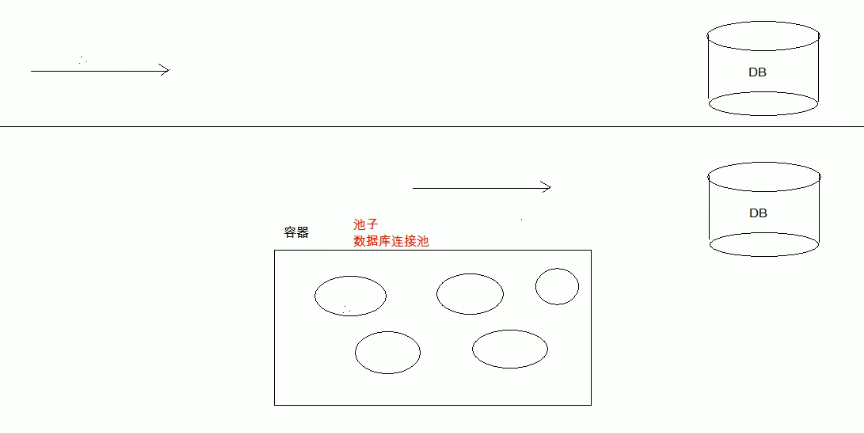

# JDBC

[TOC]

# **1、JDBC的本质**

JDBC实际上是面向接口编程，面向接口编程能够降低程序的耦合度，提高程序的扩展力。

**java.sql.*;**

不要面向具体编程，最好面向抽象编程。

**一个程序如果只有接口，而没有接口的实现类，是永远无法运行的。**

## 1.1 JDBC本质

其实是官方定义的一套操作所有关系型数据库的规则，即接口。各个数据库厂商去实现这套接口，提供数据库驱动jar包。我们可以使用这套接口编程，真正执行的代码是驱动jar包中的实现类。

# **2、JDBC编程六步**

**注册驱动**（作用：告诉Java程序，即将要连接的是哪个品牌的数据库）

**获取连接**（表示JVM的进程和数据库进程之间的通道打开了，这属于进程之间的通信，重量级的，使用完之后一定要关闭）

**获取数据库操作对象**（专门执行sql语句的对象）

**执行SQL语句**（DQL DML）

**处理查询结果集**（只有当第四步执行的是select语句的时候，才有这第五步处理查询结果集）

**释放资源**（使用完资源之后一定要关闭资源。Java和数据库属于进程间的通信，开启之后一定要关闭）

## **2.1 INSERT DELETE UPDATE**

```java
import java.sql.*;
/* 插入 */
public class JDBCTest01 {
    public static void main(String[] args) {
        Driver driver = null; // 数据库驱动对象
        Connection conn = null; // 数据库连接对象
        Statement stmt = null; // 数据库操作对象
        try {
            // 1、注册驱动
            // driver = new com.mysql.cj.jdbc.Driver();
            // DriverManager.registerDriver(driver);

            // 注册驱动的第二种方式 反射机制的方式执行静态代码块
            Class.forName("com.mysql.cj.jdbc.Driver");
            // 2、获取连接
            /*
            *   url:统一资源定位符（网络中某个资源的绝对路径）
            *   例如：http://182.61.200.7:80/index.html
            *   协议 http:// 通信协议
            *   IP  182.61.200.7
            *   PORT 80端口
            *   资源名 index.html
            *
            *    "jdbc:mysql://127.0.0.1:3306/shop"
            *    jdbc:mysql:// 协议
            * */
            String url = "jdbc:mysql://localhost:3306/shop"; // 注意MyDB是服务器名，而其下面的shop才是数据库的名字
            String user = "root";
            String password = "1577655659";
            conn = DriverManager.getConnection(url,user,password);
            System.out.println("数据库连接对象：" + conn);

            // 3、获取数据库操作对象
            stmt = conn.createStatement();

            // 4、执行sql
            String sql = "INSERT INTO product VALUES ('0009','西服','衣服',5999,3999,'2009-04-19')";
            /*
            *   专门执行DML(数据操作语言)语句 (DELETE  INSERT UPDATE)
            *   返回值是"影响数据库中的记录条数"
            * */
            int count = stmt.executeUpdate(sql);
            System.out.println(count == 1 ? "插入成功" : "插入失败");
            // 5、处理查询结果集 上一步是查询的话，这一步再写

        } catch (SQLException e) {
            e.printStackTrace();
        } finally {
            // 6、释放资源 后打开的先关闭
            if(stmt != null){
                try {
                    stmt.close();
                } catch (SQLException e) {
                    e.printStackTrace();
                }
            }
            if(conn != null){
                try {
                    conn.close();
                } catch (SQLException e) {
                    e.printStackTrace();
                }
            }
        }
    }
}
```

```java
import java.sql.*;
/* 删除 和 更新 */
public class JDBCTest02 {
    public static void main(String[] args) {
        Driver driver = null;
        Connection conn = null;
        Statement stmt = null;
        try {
            // 1、注册驱动
            driver = new com.mysql.cj.jdbc.Driver();
            DriverManager.registerDriver(driver);

            // 2、获取数据库对象
            String url = "jdbc:mysql://localhost:3306/shop";
            String user = "root";
            String password = "1577655659";
            conn = DriverManager.getConnection(url,user,password);

            // 3、获取数据库操作对象
            stmt = conn.createStatement();

            // 4、执行数据库操作 删除数据 和 更新数据 sql语句不需要提供分号 ;
//            String sql = "DELETE FROM product WHERE product_id = '0009'";
            String sql = "UPDATE product SET product_name='钢笔' WHERE product_id = '0008'";
            int count = stmt.executeUpdate(sql);
            System.out.println(count == 1 ? "删除成功" : "删除失败");

            // 5、查询结果处理
        } catch (SQLException e) {
            e.printStackTrace();
        } finally {
            // 6、释放资源
            if(stmt != null){
                try {
                    stmt.close();
                } catch (SQLException e) {
                    e.printStackTrace();
                }
            }
            if(conn != null){
                try {
                    conn.close();
                } catch (SQLException e) {
                    e.printStackTrace();
                }
            }
        }
    }
}
```

**将数据库的注册信息写入到properties文件中，通过ResourceBundle调用。**

```java
import java.sql.Connection;
import java.sql.DriverManager;
import java.sql.SQLException;
import java.sql.Statement;
import java.util.ResourceBundle;

public class JDBCTest03 {
    /*
    *   将连接数据库的所有信息配置到配置文件中
    * */
    public static void main(String[] args) {
        // 使用资源绑定器绑定属性配置文件
        ResourceBundle bundle = ResourceBundle.getBundle("jdbc");
        String driver = bundle.getString("driver");
        String url = bundle.getString("url");
        String user = bundle.getString("user");
        String password = bundle.getString("password");

        // 对象
        Connection conn = null; // 数据库对象
        Statement stmt = null; // 数据库操作对象

        try {
            // 1、驱动注册
            Class.forName(driver);
            // 2、获取数据库对象
            conn = DriverManager.getConnection(url,user,password);
            // 3、获取数据库操作对象
            stmt = conn.createStatement();
            // 4、数据操作 这里做个插入操作
            String sql = "INSERT INTO product VALUES ('0009','西服','衣服','5999','3999','2009-02-23')";
            int count = stmt.executeUpdate(sql);
            System.out.println(count == 1 ? "插入成功" : "插入失败");
            // 5、查询结果处理
        } catch (ClassNotFoundException e) {
            e.printStackTrace();
        } catch (SQLException throwables) {
            throwables.printStackTrace();
        } finally {
            // 6、资源释放
            if(stmt != null){
                try {
                    stmt.close();
                } catch (SQLException e) {
                    e.printStackTrace();
                }
            }
            if(conn != null){
                try {
                    conn.close();
                } catch (SQLException e) {
                    e.printStackTrace();
                }
            }
        }
    }
}
```

## **2.2 SELECT**

```java
import java.sql.*;
import java.util.ResourceBundle;

public class JDBCTest04 {
    public static void main(String[] args) {
        // 使用资源绑定器绑定属性配置文件
        ResourceBundle bundle = ResourceBundle.getBundle("jdbc");
        String driver = bundle.getString("driver");
        String url = bundle.getString("url");
        String user = bundle.getString("user");
        String password = bundle.getString("password");

        // 对象
        Connection conn = null; // 数据库对象
        Statement stmt = null; // 数据库操作对象
        ResultSet rs = null; // 查询的结果集合
        try {
            // 1、驱动注册
            Class.forName(driver);
            // 2、获取数据库对象
            conn = DriverManager.getConnection(url,user,password);
            // 3、获取数据库操作对象
            stmt = conn.createStatement();
            // 4、数据操作 查询操作
            String sql = "SELECT * FROM product";
            rs = stmt.executeQuery(sql);
            // 5、查询结果处理
            // 最好使用列名 如果是使用别名 那么就要使用别名
            // 如果想要取出 int 则使用getInt()
            // 如果想要取出 Double 则使用getDouble()
            while(rs.next()){
                String product_id = rs.getString("product_id");
                String product_name = rs.getString("product_name");
                String product_type = rs.getString("product_type");
                String sale_price = rs.getString("sale_price");
                String purchase_price = rs.getString("purchase_price");
                String regist_date = rs.getString("regist_date");
                System.out.println("product_id = " + product_id +
                        " product_name = " + product_name +
                        " product_type = " + product_type +
                        " sale_price = " + sale_price +
                        " purchase_price = " + purchase_price +
                        " regist_date = " + regist_date);
            }
        } catch (ClassNotFoundException e) {
            e.printStackTrace();
        } catch (SQLException throwables) {
            throwables.printStackTrace();
        } finally {
            // 6、资源释放
            if(rs != null){
                try {
                    rs.close();
                } catch (SQLException e) {
                    e.printStackTrace();
                }
            }
            if(stmt != null){
                try {
                    stmt.close();
                } catch (SQLException e) {
                    e.printStackTrace();
                }
            }
            if(conn != null){
                try {
                    conn.close();
                } catch (SQLException e) {
                    e.printStackTrace();
                }
            }
        }
    }
}
```

## **2.3 小练习**

### 2.3.1 小练习1 登录案例

```java
import java.sql.*;
import java.util.ResourceBundle;
import java.util.Scanner;

/*
* 实现功能：
*   运行程序 提供一个输入的入口 用户可以输入用户名和密码
*   用户提交信息之后，java程序收集用户的信息
*   java程序连接数据库验证用户名和密码是否合法
*   合法显示登录成功 不合法显示登录失败
*
*   实际开发中使用PowerDesigner进行数据库建模建模
* */
public class JDBCTest05 {
    public static void main(String[] args) {
        // 获取properties文件
        ResourceBundle bundle = ResourceBundle.getBundle("jdbc");
        String driver =  bundle.getString("driver");
        String url = bundle.getString("url2");
        String user = bundle.getString("user");
        String psw = bundle.getString("password");

        // 对象
        Connection conn = null;
        Statement stmt = null;
        ResultSet rs = null;

        // 给用户一个输入
        String uname = null;
        String pword = null;
        Scanner in = new Scanner(System.in);
        System.out.println("请输入用户名：");
        uname = in.next();
        System.out.println("请输入密码：");
        pword = in.next();

        try {
            // 1、注册驱动
            Class.forName(driver);
            // 2、获取数据库对象
            conn = DriverManager.getConnection(url,user,psw);
            // 3、获取数据库操作对象
            stmt = conn.createStatement();
            // 4、操作数据库
            String sql = "SELECT * FROM userinfo WHERE username = " + "'"+ uname +"'";
            rs = stmt.executeQuery(sql);
            if(rs.next()){
                // 说明能查到这个账号 那么我们获取一下这个账号对应的密码
                String password = rs.getString("password");
                if(password.equals(pword)){
                    // 说明密码也正确
                    System.out.println("登录成功");
                }else {
                    System.out.println("密码错误！请重新输入密码！");
                }
            }else {
                // 说明查不到这个账号
                System.out.println("账号不存在！");
            }

        } catch (ClassNotFoundException e) {
            e.printStackTrace();
        } catch (SQLException throwables) {
            throwables.printStackTrace();
        } finally {
            if(rs != null){
                try {
                    rs.close();
                } catch (SQLException e) {
                    e.printStackTrace();
                }
            }
            if(stmt != null){
                try {
                    stmt.close();
                } catch (SQLException e) {
                    e.printStackTrace();
                }
            }
            if(conn != null){
                try {
                    conn.close();
                } catch (SQLException e) {
                    e.printStackTrace();
                }
            }
        }

    }
}
```

### 2.3.2 小练习2 数据库绑定到集合中

将数据库绑定到对象集合中

```java
package cn.itcast.domain;

import java.util.Date;

public class Emp {
    private int id;
    private String name;
    private int balance;

    public int getId() {
        return id;
    }

    public void setId(int id) {
        this.id = id;
    }

    public String getName() {
        return name;
    }

    public void setName(String name) {
        this.name = name;
    }

    public int getBalance() {
        return balance;
    }

    public void setBalance(int balance) {
        this.balance = balance;
    }

    @Override
    public String toString() {
        return "Emp{" +
                "id=" + id +
                ", name='" + name + '\'' +
                ", balance=" + balance +
                '}';
    }
}
```

```java
package cn.itcast.jdbc;

import cn.itcast.domain.Emp;

import java.sql.*;
import java.util.ArrayList;
import java.util.List;

/**
 * 定义一个方法，查询emp表的数据将其封装为对象，然后装载集合，返回
 */
public class JdbcDemo4 {
    public static void main(String[] args) {
        List<Emp> all = new JdbcDemo4().findAll();
        System.out.println(all);
    }

    public List<Emp> findAll() {
        Connection conn = null;
        Statement stmt = null;
        ResultSet rs = null;
        List<Emp> list = new ArrayList<Emp>();
        Emp emp = null;
        try {
            // 注册驱动
            Class.forName("com.mysql.cj.jdbc.Driver");

            // 获取数据库链接
            String url = "jdbc:mysql:///db1";
            String user = "root";
            String password = "123456";

            conn = DriverManager.getConnection(url, user, password);

            // 获取数据库对象
            stmt = conn.createStatement();

            // 执行数据库操作
            String sql = "select * from Account";
            rs = stmt.executeQuery(sql);

            while(rs.next()){
                // 获取到数据
                int id = rs.getInt("id");
                String name = rs.getString("name");
                int balance = rs.getInt("balance");

                emp = new Emp();
                // 数据库的对象封装到对象中
                emp.setId(id);
                emp.setName(name);
                emp.setBalance(balance);

                // 添加到集合中
                list.add(emp);
            }
        } catch (ClassNotFoundException e) {
            throw new RuntimeException(e);
        } catch (SQLException e) {
            throw new RuntimeException(e);
        }finally {
            if (rs != null) {
                try {
                    rs.close();
                } catch (SQLException e) {
                    throw new RuntimeException(e);
                }
            }
            if (stmt != null) {
                try {
                    stmt.close();
                } catch (SQLException e) {
                    throw new RuntimeException(e);
                }
            }
            if (conn != null) {
                try {
                    conn.close();
                } catch (SQLException e) {
                    throw new RuntimeException(e);
                }
            }
        }
        return list;
    }
}
```

# **3、SQL注入**

## **3.1 SQL注入原理**

如果是账户名和密码同时进行判断，会出现这样一个问题。

```
String sql = "SELECT * FROM userinfo WHERE username = " + "'"+ uname +"'" + "AND password = '" + pword +"'";
```

如果我们输入用户名：lyf 密码：lyf OR '1'='1

那么这条SQL语句就会变成

```
"SELECT * FROM userinfo WHERE username = 'lyf' AND password = 'lyf OR '1'='1'";
```

注意:  下面这条语句就变成了恒成立 不论AND两边是什么 '1'='1' 永远为TRUE，这就是SQL注入（**原SQL语句的原意被扭曲**）。

```
username = 'lyf' AND password = 'lyf OR '1'='1'
```

## **3.2 SQL注入解决方案**

原始代码：

```
// 3、获取数据库操作对象
stmt = conn.createStatement();
// 4、操作数据库
String sql = "SELECT * FROM userinfo WHERE username = " + "'"+ uname +"'";
rs = stmt.executeQuery(sql);
```

改进：

```
// 3、获取预编译的数据库操作对象
String sql = "SELECT * FROM userinfo WHERE username = ?"; // ? 占位符 不能使用单引号括起来
ps = conn.prepareStatement(sql); // 在这个位置已经将SQL编译完成，后面填入的占位符部分不会再进行编译，所以用户的信息就不会参与预编译过程
// 给占位符?传值 第一个问号下标是1 如果有多个可以传入多个
ps.setString(1,uname);
// 4、操作数据库
rs = ps.executeQuery(); // 这里不需要传入sql了 因为上面已经编译过了
```

完整代码：

```java
import java.sql.*;
import java.util.ResourceBundle;
import java.util.Scanner;
/*
 *   SQL注入的解决方案
 *      要想用户信息不参与SQL语句的编译，那么必须使用java.sql.PreparedStatement
 *      PreparedStatement继承了java.sql.Statement
 *      PreparedStatement属于预编译的数据库对象
 *      PreparedStatement原理是预先对SQL语句的框架进行编译，然后再给SQL语句传值
 * */
public class JDBCTest06 {
    public static void main(String[] args) {
        // 获取properties文件
        ResourceBundle bundle = ResourceBundle.getBundle("jdbc");
        String driver =  bundle.getString("driver");
        String url = bundle.getString("url2");
        String user = bundle.getString("user");
        String psw = bundle.getString("password");

        // 对象
        Connection conn = null;
        PreparedStatement ps = null; // 预编译的数据库操作对象
        ResultSet rs = null;

        // 给用户一个输入
        String uname = null;
        String pword = null;
        Scanner in = new Scanner(System.in);
        System.out.println("请输入用户名：");
        uname = in.next();
        System.out.println("请输入密码：");
        pword = in.next();

        try {
            // 1、注册驱动
            Class.forName(driver);
            // 2、获取数据库对象
            conn = DriverManager.getConnection(url,user,psw);
            // 3、获取预编译的数据库操作对象
            String sql = "SELECT * FROM userinfo WHERE username = ?"; // ? 占位符 不能使用单引号括起来
            ps = conn.prepareStatement(sql);
            // 给占位符?传值 第一个问号下标是1
            ps.setString(1,uname);
            // 4、操作数据库
            rs = ps.executeQuery();
            if(rs.next()){
                // 说明能查到这个账号 那么我们获取一下这个账号对应的密码
                String password = rs.getString("password");
                if(password.equals(pword)){
                    // 说明密码也正确
                    System.out.println("登录成功");
                }else {
                    System.out.println("密码错误！请重新输入密码！");
                }
            }else {
                // 说明查不到这个账号
                System.out.println("账号不存在！");
            }

        } catch (ClassNotFoundException e) {
            e.printStackTrace();
        } catch (SQLException throwables) {
            throwables.printStackTrace();
        } finally {
            if(rs != null){
                try {
                    rs.close();
                } catch (SQLException e) {
                    e.printStackTrace();
                }
            }
            if(ps != null){
                try {
                    ps.close();
                } catch (SQLException e) {
                    e.printStackTrace();
                }
            }
            if(conn != null){
                try {
                    conn.close();
                } catch (SQLException e) {
                    e.printStackTrace();
                }
            }
        }

    }
}
```

# **4、Statement和PreparedStatement的区别**

一般情况下，PreparedStatement效率更高，并且可以进行安全检查，但是Statement也有使用的场景，如果是想要用户输入按照升序还是降序进行排列。

```
SELECT ename FROM product ORDER BY ename ?
```

如果使用PreparedStatement占位符，那么我们输入占位符之后，实际上输入的是一个字符串类型 也就是说最终的SQL语句如下：

```
SELECT ename FROM product ORDER BY ename 'DESC'
```

会报错，这时候只能用字符串拼接的方式，也就是 (DESCstring = "DESC")

```
String sql = "SELECT ename FROM product ORDER BY ename" + DESCstring;
```

# **5、PreparedStatement 实现增删改**

```java
import java.sql.*;
import java.util.ResourceBundle;

/*
*  使用PreparedStatement 完成增删改查
* */
public class JDBCTest07 {
    public static void main(String[] args) {
        // 获取properties文件
        ResourceBundle bundle = ResourceBundle.getBundle("jdbc");
        String driver = bundle.getString("driver");
        String url = bundle.getString("url2");
        String user = bundle.getString("user");
        String password = bundle.getString("password");

        Connection conn = null;
        PreparedStatement ps = null;
        ResultSet rs = null;
        try {
            // 1、 注册驱动
            Class.forName(driver);

            // 2、获取数据库对象
            conn = DriverManager.getConnection(url,user,password);

            // 3、获取预编译数据库操作对象
            // 插入操作
//            String sql = "INSERT INTO userinfo VALUES(?,?)";
//            ps = conn.prepareStatement(sql);
//            ps.setString(1,"liuyaofeng222");
//            ps.setString(2,"1245135");
//
//            String sql2 = "UPDATE userinfo SET username = ?,password = ? WHERE username = ?";
//            ps = conn.prepareStatement(sql2);
//            ps.setString(1,"liuyaofeng333");
//            ps.setString(2,"1245112335");
//            ps.setString(3,"liuyaofeng222");

            String sql3 = "DELETE FROM userinfo WHERE username = ?";
            ps = conn.prepareStatement(sql3);
            ps.setString(1,"liuyaofeng333");
            // 4、执行数据库操作
//            int count = ps.executeUpdate();
//            System.out.println(count == 1 ? "插入成功" : "插入失败");

//            int count2 = ps.executeUpdate();
//            System.out.println(count2 == 1 ? "更新成功" : "更新失败");

            int count3 = ps.executeUpdate();
            System.out.println(count3 == 1 ? "删除成功" : "删除失败");
            // 5、查询结果的操作 ResultSet
        } catch (ClassNotFoundException e) {
            e.printStackTrace();
        } catch (SQLException throwables) {
            throwables.printStackTrace();
        } finally {
            // 6、资源释放
            if(ps != null){
                try {
                    ps.close();
                } catch (SQLException e) {
                    e.printStackTrace();
                }
            }
            if(conn != null){
                try {
                    conn.close();
                } catch (SQLException e) {
                    e.printStackTrace();
                }
            }
        }
    }
}

```

# **6、事务**

三行代码

事务开启

```
// 将自动提交机制修改为手动提交机制
conn.setAutoCommit(false); // 开启事务
```

事务关闭

```
// 程序能够走到这里说明上面的程序没有异常，事务结束，手动提交数据
conn.commit(); // 结束事务
```

事务回滚

```
// 回滚事务
if(conn != null){
    try {
    conn.rollback();
    } catch (SQLException ex) {
    ex.printStackTrace();
    }
}
```

事务完整代码：

```java
import java.sql.*;
import java.util.ResourceBundle;

/*
* JDBC事务机制
*   1、JDBC中的事务是自动提交的
*       只要执行任意一条DML语句，则自动提交一次。这是JDBC默认的事务行为
*       但是在实际的业务当中，通常都是N条DML语句共同联合才能完成
* */
public class JDBCTest08 {
    public static void main(String[] args) {
        // 获取properties文件
        ResourceBundle bundle = ResourceBundle.getBundle("jdbc");
        String driver = bundle.getString("driver");
        String url = bundle.getString("url2");
        String user = bundle.getString("user");
        String password = bundle.getString("password");

        Connection conn = null;
        PreparedStatement ps = null;
        ResultSet rs = null;
        try {
            // 1、 注册驱动
            Class.forName(driver);

            // 2、获取数据库对象
            conn = DriverManager.getConnection(url,user,password);

            // 将自动提交机制修改为手动提交机制
            conn.setAutoCommit(false); // 开启事务

            // 3、获取预编译数据库操作对象
            String sql = "UPDATE userinfo SET balance = ? WHERE actno = ?";
            ps = conn.prepareStatement(sql);
            ps.setDouble(1,10000);
            ps.setInt(2,111);
            int count = ps.executeUpdate();

            // 人工异常 会导致上面语句执行 但是下面没有执行
            String s = null;
            s.toString();

            ps = conn.prepareStatement(sql);
            ps.setDouble(1,10000);
            ps.setInt(2,222);
            count += ps.executeUpdate();

            System.out.println(count == 2 ? "转账成功" : "转账失败");

            // 程序能够走到这里说明上面的程序没有异常，事务结束，手动提交数据
            conn.commit(); // 结束事务
        } catch (Exception e) {
            // 回滚事务
            if(conn != null){
                try {
                    conn.rollback();
                } catch (SQLException ex) {
                    ex.printStackTrace();
                }
            }
        } finally {
            // 6、资源释放
            if(ps != null){
                try {
                    ps.close();
                } catch (SQLException e) {
                    e.printStackTrace();
                }
            }
            if(conn != null){
                try {
                    conn.close();
                } catch (SQLException e) {
                    e.printStackTrace();
                }
            }
        }
    }
}
```

# **7、对数据库进行工具类封装**

```java
import java.sql.*;
import java.util.ResourceBundle;

public class DButil {
    /**
     * 工具类方法一般都是私有的
     * */
    private DButil(){

    }
    // 静态代码块在类加载时只执行一次
    static {
        try {
            Class.forName("com.mysql.cj.jdbc.Driver");
        } catch (ClassNotFoundException e) {
            e.printStackTrace();
        }
    }

    /**
     * 获取数据库连接
     * @return
     * @throws SQLException
     */
    public static Connection getConnection() throws SQLException {
        return DriverManager.getConnection("jdbc:mysql://localhost:3306/shop","root","1577655659");
    }

    /**
     * 关闭资源
     * @param conn
     * @param ps
     * @param rs
     */
    public static void close(Connection conn, Statement ps, ResultSet rs){
        if(rs != null){
            try {
                rs.close();
            } catch (SQLException e) {
                e.printStackTrace();
            }
        }
        if(ps != null){
            try {
                ps.close();
            } catch (SQLException e) {
                e.printStackTrace();
            }
        }
        if(conn != null){
            try {
                ps.close();
            } catch (SQLException e) {
                e.printStackTrace();
            }
        }
    }
}
```

# **8、模糊查询**

```java
import java.sql.Connection;
import java.sql.PreparedStatement;
import java.sql.ResultSet;
import java.sql.SQLException;

public class JDBCTest09 {
    public static void main(String[] args) {
        Connection conn = null;
        PreparedStatement ps = null;
        ResultSet rs = null;
        try {
            // 1、注册驱动 在加载类的过程中调用静态代码块
            // 2、获取数据库连接对象
            conn = DButil.getConnection();
            // 3、获取预编译数据库操作对象
            String sql = "SELECT * FROM userinfo WHERE actno LIKE ?";
            ps = conn.prepareStatement(sql);
            ps.setString(1,"_1%");
            rs = ps.executeQuery();
            while(rs.next()){
                System.out.println(rs.getString("actno") + " " + rs.getString("balance"));
            }
            // 4、执行数据库操作

            // 5、对查询结果进行操作

        } catch (SQLException e) {
            e.printStackTrace();
        } finally {
            DButil.close(conn,ps,rs);
        }
    }
}
```

# **9、乐观锁和悲观锁**

悲观锁（行级锁 for update）：事务必须排队执行。数据锁住了，不允许并发，其他事务不能访问。

乐观锁：支持并发，事务也不需要排队，只不过需要一个版本号。

# 10、数据库连接池

## 10.1 概念

一个容器，存放数据库链接的容器。当系统初始化好后，容器被创建，容器中会申请一些连接对象，当用户来访问数据库时，从容器中获取链接对象，用户访问完之后，会将连接对象归还给容器。



## 10.2 实现

### 10.2.1 标准接口：DataSource

方法：

获取连接：getConnection()

归还连接：如果链接对象是从连接池中获取，那么调用Connection.close() 方法，则不会关闭连接，而是归还连接。

### 10.2.2 常用的数据库连接池

C3P0：数据库连接池技术

Druid：数据库连接池实现技术，由阿里巴巴提供\

### 10.2.3 C3P0连接池技术

步骤

1）导入jar包（两个）

下载的链接

[c3p0:JDBC DataSources/Resource Pools](https://sourceforge.net/projects/c3p0/)

2）定义配置文件

名称：c3p0.properties 或者 c3p0-config.xml

路径：直接将文件放在src目录下即可

3）创建核心对象 数据库连接池对象 ComboPoolDataSource

4）获取链接：getConnection

基本使用的代码：

```java
package cn.itcast.dataSource.c3p0;

import com.mchange.v2.c3p0.ComboPooledDataSource;
import com.mchange.v2.c3p0.DataSources;

import javax.sql.DataSource;
import java.sql.Connection;
import java.sql.SQLException;

public class c3p0Demo2 {
    public static void main(String[] args) {
        // 获取连接池对象
//        DataSource ds = new ComboPooledDataSource();

        // 也可以使用指定名称配置
        DataSource ds = new ComboPooledDataSource("otherc3p0");
        Connection conn = null;
        // 获取数据库链接对象 假设我们获取10个
        for (int i = 0; i < 8; i++) {
            try {
                conn = ds.getConnection();
                System.out.println("i=" + (i+1) + "链接对象：" + conn);
            } catch (SQLException e) {
                throw new RuntimeException(e);
            }
        }
    }
}
```

### 10.2.4 Druid连接池技术

步骤

1）导入jar包

2）定义配置文件

properties形式，可以叫任意的名字，可以放在任意的目录下（注意不能自动加载，区别于c3p0）

3）获取数据库连接池对象：通过工厂来获取 DruidDataSourceFactory

4）获取链接：getConnection

```java
package cn.itcast.dataSource.Druid;

import com.alibaba.druid.pool.DruidDataSourceFactory;

import javax.sql.DataSource;
import java.io.IOException;
import java.io.InputStream;
import java.sql.Connection;
import java.sql.SQLException;
import java.util.Properties;

public class druidDemo1 {
    public static void main(String[] args) {

        // 加载配置文件
        Properties pro = new Properties();
        // 获取在classpath路径下的资源文件的输入流。
        InputStream is = druidDemo1.class.getClassLoader().getResourceAsStream("druid.properties");
        try {
            pro.load(is);
        } catch (IOException e) {
            throw new RuntimeException(e);
        }
        // 获取数据库连接池对象
        DataSource ds = null;
        try {
            ds = DruidDataSourceFactory.createDataSource(pro);
        } catch (Exception e) {
            throw new RuntimeException(e);
        }
        // 获取数据库链接对象
        Connection conn = null;
        try {
            conn = ds.getConnection();
        } catch (SQLException e) {
            throw new RuntimeException(e);
        }
        // 打印
        System.out.println(conn);
    }
}
```

## 10.3 工具类

1）定义一个类 JDBCUtils

2）提供静态代码块加载配置文件，初始化链接池对象

3）提供方法

获取链接方法：通过数据库连接池获取链接

释放资源

获取连接池的方法

```java
package cn.itcast.dataSource.utils;

import cn.itcast.dataSource.Druid.druidDemo1;
import com.alibaba.druid.pool.DruidDataSourceFactory;
import com.mchange.v2.c3p0.DataSources;

import javax.sql.DataSource;
import java.io.IOException;
import java.io.InputStream;
import java.sql.Connection;
import java.sql.ResultSet;
import java.sql.SQLException;
import java.sql.Statement;
import java.util.Properties;

public class JDBCUtils {
    // 定义成员变量 DataSource
    private static DataSource ds;

    static {
        // 加载配置文件
        Properties pro = new Properties();
        // 获取在classpath路径下的资源文件的输入流。
        try {
            pro.load(druidDemo1.class.getClassLoader().getResourceAsStream("druid.properties"));
            ds = DruidDataSourceFactory.createDataSource(pro);
        } catch (IOException e) {
            throw new RuntimeException(e);
        } catch (Exception e) {
            throw new RuntimeException(e);
        }
    }

    /**
     * 获取链接
     */
    public static Connection getConnection() {
        try {
            return ds.getConnection();
        } catch (SQLException e) {
            throw new RuntimeException(e);
        }
    }

    /**
     * 释放资源
     */
    public static void close(ResultSet rs, Statement stmt, Connection conn){
        if (rs != null) {
            try {
                rs.close();
            } catch (SQLException e) {
                throw new RuntimeException(e);
            }
        }
        if (stmt != null) {
            try {
                stmt.close();
            } catch (SQLException e) {
                throw new RuntimeException(e);
            }
        }
        if (conn != null) {
            try {
                conn.close();
            } catch (SQLException e) {
                throw new RuntimeException(e);
            }
        }
    }
}
```

测试工具类

```java
package cn.itcast.dataSource.Druid;

import cn.itcast.dataSource.utils.JDBCUtils;

import java.sql.Connection;

public class druidDemo2 {
    public static void main(String[] args) {
       Connection conn = JDBCUtils.getConnection();

       System.out.println(conn);
    }
}
```

# 11、JDBC template（Spring JDBC）

Spring框架对于JDBC进行了简单的封装，提供了一个JDBCTemplate对象简化JDBC的开发

## 11.1 步骤

1）导入jar包

2）创建JdbcTemplate对象。依赖于数据源DataSource

3）调用JdbcTemplate的方法来完成DRUD的操作

update()：执行DML语句。增删改查

queryForMap()：查询结果将结果集封装为map集合，结果集长度只能是1

queryForList()：将查询的结果集封装为list集合，将每一条记录封装为一个Map对象，再将Map集合装载到List集合中

query()：查询结果，将结果封装为JavaBean对象，query的参数：RowMapper

一般我们使用BeanPropertyRowMapper实现类。可以完成数据到JavaBean的自动封装

`new BeanPropertyRowMapper<类型>(类型.class)`

queryForObject：查询结果，将结果封装为对象

一般用于聚合函数的查询

## 11.2 基础使用

```java
package cn.itcast.jdbctemplate;

import cn.itcast.dataSource.utils.JDBCUtils;
import org.springframework.jdbc.core.JdbcTemplate;

public class JdbcTemplateDemo1 {
    public static void main(String[] args) {
        // 1、jar包
        // 2、创建JDBCTemplate对象
        JdbcTemplate template = new JdbcTemplate(JDBCUtils.getDataSource());
        // 3、调用方法
        String sql = "update account set balance = ? where id = ?";
        int count = template.update(sql,3000,3);
        System.out.println(count);
    }
}

```

## 11.3 执行DML语句

**需求**

1）修改1号数据的 salary 为 10000

```java
/**
     * 修改1号数据的 salary 为 10000
     */
    @Test
    public void test1(){

        // 2、调用方法
        String sql = "update emp set salary=? where id = ?";
        int count = jdbcTemplate.update(sql, 10000, 100);
        System.out.println(count);
    }
```

2）添加一条记录

```java
/**
     * 添加一条记录
     */
    @Test
    public void test2(){

        // 2、调用方法
        String sql = "insert emp values(?,?,?,?,?,?,?,?)";
        int count = jdbcTemplate.update(sql,1015,"小明",2,1006,"2002-09-03",15000,2000,20);
        System.out.println(count);
    }
```

3）删除刚才添加的记录

```java
/**
     * 删除刚才添加的记录
     */
    @Test
    public void test3(){
        String sql = "delete from emp where id = ?";
        int count = jdbcTemplate.update(sql,1015);
        System.out.println(count);
    }
```

4）查询id为100的记录，将其封装为Map对象

```java
/**
     * 查询id为100的记录，并将其封装为Map对象
     */
    @Test
    public void test4(){
        String sql = "select * from emp where id = ?";
        Map<String, Object> map = jdbcTemplate.queryForMap(sql, 100);
        System.out.println(map);
    }
```

5）查询所有记录，将其封装为List

```java
/**
     * 查询所有记录，将其封装为List
     */
    @Test
    public void test5(){
        String sql = "select * from emp";
        List<Map<String, Object>> list = jdbcTemplate.queryForList(sql);
        for (Map<String, Object> l :list) {
            System.out.println(l);
        }
    }
```

6）查询所有记录，将其封装为Emp对象的List集合

```java
/**
     * 查询所有记录，将其封装为Emp对象的List集合
     */
    @Test
    public void test6(){
        String sql = "select * from emp";
//        List<Emp2> list = jdbcTemplate.query(sql, new RowMapper<Emp2>() {
//
//            @Override
//            public Emp2 mapRow(ResultSet rs, int i) throws SQLException {
//                Emp2 emp = new Emp2();
//                int id = rs.getInt("id");
//                String ename = rs.getString("ename");
//                int job_id = rs.getInt("job_id");
//                int mgr = rs.getInt("mgr");
//                Date joindate = rs.getDate("joindate");
//                double salary = rs.getDouble("salary");
//                double bonus = rs.getDouble("bonus");
//                int dept_id = rs.getInt("dept_id");
//
//                emp.setId(id);
//                emp.setEname(ename);
//                emp.setJob_id(job_id);
//                emp.setMgr(mgr);
//                emp.setSalary(salary);
//                emp.setJoindate(joindate);
//                emp.setBonus(bonus);
//                emp.setDept_id(dept_id);
//
//                return emp;
//            }
//        });
//        for (Emp2 emp : list) {
//            System.out.println(emp);
//        }
        List<Emp2> list = jdbcTemplate.query(sql, new BeanPropertyRowMapper<Emp2>(Emp2.class));
        for (Emp2 emp : list) {
            System.out.println(emp);
        }
    }
```

7）查询总记录数

```java
/**
     * 查询总记录数
     */
    @Test
    public void test7(){
        String sql = "SELECT count(*) FROM emp";
        Long total = jdbcTemplate.queryForObject(sql, Long.class);
        System.out.println(total);
    }
```

## 11.4 执行DQL语句