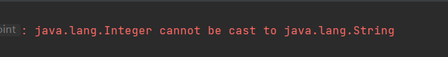
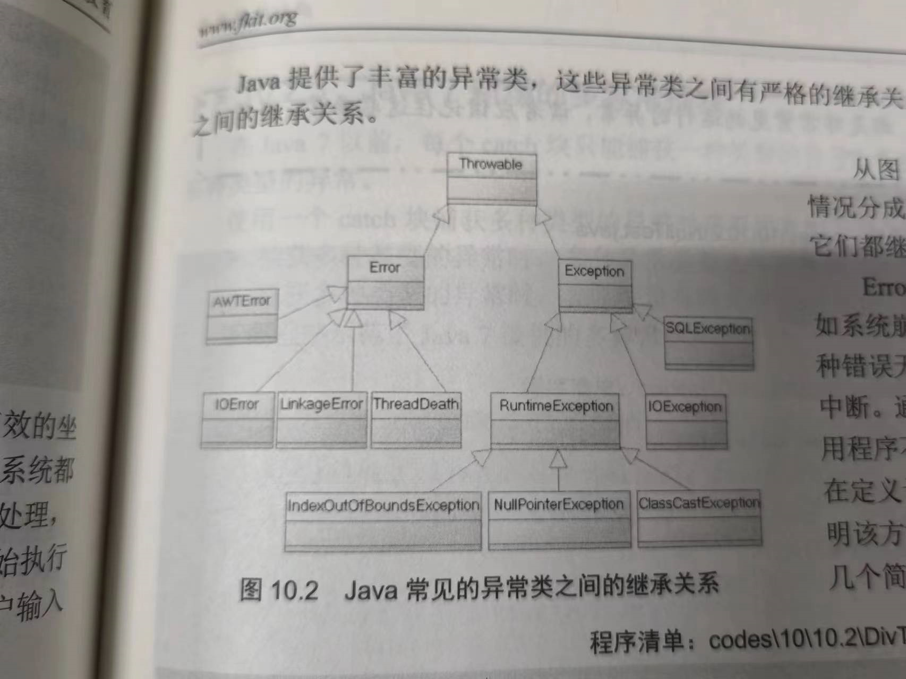
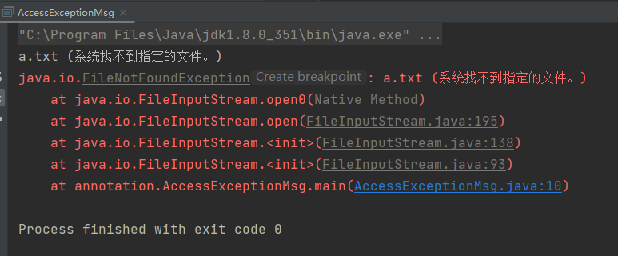
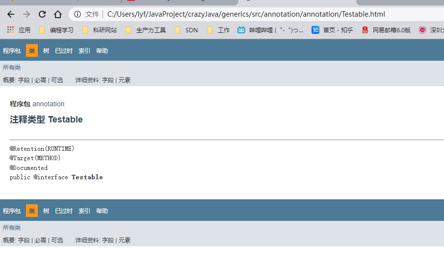
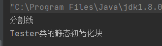
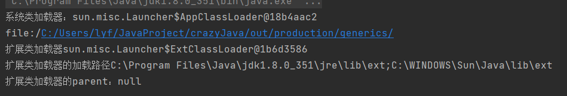

# Java SE

[TOC]


# 阅读笔记

# 第一章 Java语言概述与开发环境

## 1.1 Java语言的发展简史

JDK1.0 主要包括JRE和JDK两部分

JDK1.1 增加了JIT即时编译系统，JIT与传统编译器的区别在于他能够将之前编译过的指令保存。

JDK1.2 发布JSP/Servlet ESP规范，并且将Java分为了J2EE、J2SE、J2ME三个版本

JDK1.4 最为成熟的版本，大量框架涌现

JDK1.5 增加泛型等，并且发布新的企业规范

2009.4.20 收购

Java SE 7 oracle发布的第一个版本

Java SE 8 新增lambda表达式

。。。

## 1.2 Java程序运行机制

### 1.2.1 高级语言的运行机制

java程序先编译，后解释。所以称其为解释性语言和编译型语言都不为过。

### 1.2.2 Java程序的运行机制和JVM

编译过程

Java源程序（.java）经过javac编译生成（.class）文件，此时的class文件不可执行，并且与平台无关

解释过程

使用java解释器（JVM）解释，生成指定平台的机器码

**JVM向上提供给java字节码文件的借口完全相同，向下适应不同平台的接口互不相同。**这也是为什么java具有很好的跨平台特性。

## 1.3 开发Java的准备

JRE和JDK有什么区别？

JRE是运行时环境，如果只是运行java程序，那么不需要下载jdk

JDK是Java标准版开发套件，如果进行java程序的开发，那么一定安装JDK

## 1.4 安装

## 1.5 Java程序的基本规则

Java程序必须以类的形式存在，类是Java程序的最小程序单位。

由于一个Java源文件中文件名必须与public类相同，所以只能定义一个public类

## 1.7 Java的垃圾回收机制

JRE负责回收哪些不再使用的内存（堆内存）。

Java的堆内存是一个运行时数据区，存放的是正在运行的应用程序所建立的所有对象。

垃圾回收机制是一种动态内存管理技术。

在Java中，如果没有引用变量指向原先分配给某个对象的内存时，该内存便成为垃圾。

# 第二章 理解面向对象

## 2.1 面向对象

### 2.1.1 结构化程序设计简介

结构化分析、结构化设计、结构化编程

### 2.1.2 程序的三种结构

### 2.1.3 面向对象程序设计简介

### 2.1.4 面向对象的基本特征

注意：抽象不是面向对象的特征

Java不支持多继承

基于对象：简言之就是只能使用封装好的对象，而不能自己定义对象，例如JavaScript就是基于对象的

# 第三章 数据类型和运算符

## 3.1 注释

javadoc文档提取

## 3.2 标识符和关键字

### 3.2.1 分隔符

### 3.2.2 Java 9的标识符规则

### 3.2.3 Java关键字

## 3.3 数据类型分类

## 3.4 基本数据类型

byte short int long char float double

1       2      4    8      2      4       8

### 3.4.1 整型

```java

public class demo1 {
    public static void main(String[] args) {
        byte b = 54;
        System.out.println(b);

//        long a1 = 9999999999;
        long a2 = 9999999999L;
        System.out.println(a2);
    }
}
```

对于byte和short来说，如果赋值给他的数在其范围内，则可以正常赋值

对于long来说，如果没有超过int的范围，那么默认赋值的是int类型，只不过会转成long

但是，如果赋值的数超过了int的范围，而又没有指定其为L （long的标识），那么会报错。

### 3.4.2 字符型

\r 是换行符，简单来说前面的都不会打印（可能也与jdk版本有关）

```java
public static void main(String[] args) {
    String s = "abcde\r123\r\r\r\r\r1234";
    System.out.println(s); // 输出1234
    String s2 = s;
    System.out.println(s2); // 输出1234
    System.out.println(s.equals(s2)); // true
    System.out.println("abcde\r\r\r\r\r\r1234");
}
```

但是“1234” == “1234\t1234” 不是恒等的

### 3.4.3 浮点型

正无穷大和负无穷大

```java
double a = Double.POSITIVE_INFINITY;
System.out.println(a); //Infinity
double b = Double.NEGATIVE_INFINITY;
System.out.println(b);//-Infinity
```

### 3.4.4 数值中使用下划线

为了防止数字太多而看花眼，java7中就已经允许使用下划线

```java
public static void main(String[] args) {
        int bval = 0B1000_0000_0000_0000_0000_0000_0000_0011;
        double pi = 3.14_15_92_65_36;
        System.out.println(bval);// -2147483645
        System.out.println(pi);//3.1415926536
    }
```

### 3.4.5 布尔型

布尔型一般认为占用一个字节

## 3.5 基本数据类型转换

### 3.5.1 自动类型转换

转换规则如下，主要有两条规则转换线

第一条：byte short int long float double

第二条：char int long float double

这意味着char和byte和short之间不能自动类型转换。

### 3.5.2 强制类型转换

注意一个问题

`float x = 3.5;`是会报错的，因为3.5默认是double类型，所以必须加f

```java
float x = 3.5F;
```

字符串转换为int类型的方法

```java
String s = "123";
int i = Integer.parseInt(s);
System.out.println(i);
```

但是如果s=“abc”，会报错。

### 3.5.3 表达式的类型提升

两个规则

所有的byte、short、char自动被提升到int类型

算术表达式的数据类型自动提升到与表达式中最高等级操作数相同的类型

一个坑，下面的代码是有错误的，因为a-2会自动把short提升为int类型，所以再赋值给short会报错。

```java
short a = 4;
a = a - 2;
```

## 3.6 直接量

直接量就是在程序中通过源代码直接给出的值。

### 3.6.1 直接量的类型

通常来说只有下面的三种类型能够直接指定直接量

基本类型、字符串类型和null类型

### 3.6.2 直接量的赋值

String类型的直接量不能够赋值给其他的变量

null类型的直接量可以直接赋给任何引用类型的变量，包括String类型

boolean类型的变量只能赋值给其他类型的变量

字符串直接量：当程序第一次使用某个字符串直接量时，Java会使用常量池来缓存该字符串直接量，如果程序后面的部分需要用到该字符串直接量，那么会直接使用**常量池中**的字符串直接量。

String类是不可变类？

```java
public static void main(String[] args) {
        String s0 = "hello world";
        String s1 = "hello world";
        System.out.println(s0 == s1);
        String s3 = "hello " + "world";
        System.out.println(s3 == s0);
    }
```

在这个例子中，由于Java能够保证每个字符串常量只有一个。所以s0和s1都是字符串常量，并且在编译期就确定，所以判断二者是否恒等一定为真。而s3链接为一个字符串，其也是字符串常量。所以也是恒为true。

## 3.7 运算符

### 3.7.1 算术运算符

这里需要注意有关求余数运算

第一个原则：如果两个操作数都是整数，那么第二个操作数不能为0

第二个原则：如果两个操作数中有至少一个为浮点数，那么允许第二个操作数为0或0.0

```java
public static void main(String[] args) {
        System.out.println(5.0 % 0); // NaN
        System.out.println(5.0 % 0.0);// NaN
        System.out.println(5 % 0.0);// NaN
        System.out.println(5 % 0);// 异常
    }
```

### 3.7.2 赋值运算符

支持连续赋值

### 3.7.3 位运算符

& 按位与，同为1才是1

| 按位或，只要有一个为1即可为1

~ 按位非

^ 按位异或，两位相同返回0，不同返回1

<< 左移运算符

>> 右移运算符

<<< 无符号左移

这里举个例子看一下，无符号右移。无符号右移，填充位以0填充。

```java
System.out.println(-5 >>> 2); // 1073741822
```

移位运算符还需要遵循的一些规则

低于int的总是先自动转为int类型后再移位

对于int整数移位a>>b，如果b > 32，那么会先用b对32求余数，然后再移相应的位数。所以a>>33和a>>1是一样的。

```java
int a = 8;
int b = 8;
System.out.println(a >> 1  == b >> 33);
```

### 3.7.4 扩展后的赋值运算符

扩展后的运算符是指：+=、-=这种

注意：a = a+5 和 a+=5 虽然结果是一样的，但是底层实现的方式有所不同，所以最好是用扩展后的运算符。

### 3.7.5 比较运算符

基本类型的变量、值不能和引用类型的变量、值使用==进行比较

boolean类型的变量、值不能与其他任意类型的变量、值使用==进行比较

如果两个引用类型之间没有父子继承关系，那么他们的变量也不能使用==进行比较，下面的例子就会出现报错。

```java
String s = new String("hello");
List<Integer> l = new ArrayList<Integer>();
System.out.println(s == l);
```

### 3.7.6 逻辑运算符

注意&&和&，&如果表示逻辑运算符，此时称为不短路与，不会短路，而&&会短路。

注意||和|，|如果表示逻辑运算符，此时称为不短路或，不会短路，而||会短路。

！非，只需要一个操作符

^ 异或，当两个操作数不同时才会返回true

```java
boolean bb = false;
boolean aa = true;
System.out.println(bb ^ aa); // true
```

### 3.7.7 三目运算符

三目运算符不能有多个判断语句，但是可以进行嵌套。

### 3.7.8 运算符的结合性和优先级

# 第四章 流程控制与数组

## 4.1 顺序结构

## 4.2 分支结构

## 4.3 循环结构

## 4.4 控制结构

## 4.5 数组类型

### 4.5.1 数组也是一种类型

一个数组智能存放同一种类型的数据

### 4.5.2 定义数组

Java通常支持两种语法格式来定义数组

```java
int[] arr = new int[1];
int arr2[] = new int[1];
```

第一种通常用的比较多。

注意，当我们写

```java
int[] arr
```

的时候，只是定义了一个引用变量，此时还没有指向任何有效的内存空间

### 4.5.3 数组的初始化

① 静态初始化

静态初始化就是只需要我们指定数组元素，不需要指定长度

② 动态初始化

动态初始化只需要我们指定数组的大小，系统会为数组自动指定对应数据类型的初值。

### 4.5.4 使用数组

### 4.5.5 foreach循环

语法格式

```java
foreach(type variableName:array | collection){
	
}
```

foreach不需要知道数组的长度，也不需要根据索引来访问。

foreach最好不要进行赋值的操作，只用来进行数组遍历，看下面这个例子

```java
public static void main(String[] args) {
        int[] arr = new int[]{1,2,3,4};
        for(int temp : arr) {
           temp = 2; 
        }
        System.out.println(arr[0]); // 1
    }
```

按道理来说可能把数组进行全赋值为2，实际上并不是，temp只是一个临时的变量。

## 4.6 深入数组

### 4.6.1 内存中的数组

引用变量是访问真实对象的根本方式。

方法中的变量会逐个放入到栈内存里，随着方法的结束，这个方法的内存栈也会销毁。

在程序中创建一个对象的时候，这个对象是保存在堆内存中的，堆内存中的对象不会随着方法的结束而销毁。

### 4.6.2 基本类型数组的初始化

```java
int[] iArr;
iArr= new int[5];
```

从内存的角度来剖析上面的这段

首先，执行 int[] iArr; 时，会在栈内存中开辟一个用于存放空引用iArr的地址，此时并未指向任何有效的内存。

然后，执行 iArr= new int[5]; 此时会在堆内存中开辟相应大小的数组空间，然后将iArr引用指向堆内存的数组空间。

### 4.6.3 引用类型数组的初始化


```java
package com.lyf.chap4;

public class demo3 {
    public static void main(String[] args) {
        Person[] students;
        students = new Person[2];
        Person zhang = new Person();
        zhang.age = 11;
        zhang.height = 177;

        Person lee = new Person();
        lee.age = 13;
        lee.height = 127;

        students[0] = zhang;
        students[1] = lee;

        lee.info();
        students[1].info();
    }
}

class Person {
    public int age;
    public double height;

    public void info() {
        System.out.println("age =" + age + " height = " + height);
    }
}
```

当我们执行 Person[] students; 时，此时只在栈内存中定义了一个引用变量，并未指向任何内存区域。

students = new Person[2]; 此时在堆内存中开辟了一个大小为2的Person类型的空间

```java
Person zhang = new Person();
zhang.age = 11;
zhang.height = 177;
```

栈中创建zhang引用，并在堆中分配内存。

```java
students[0] = zhang;
```

student[0]此时存放的是zhang对象在堆内存中的地址，所以下面的式子成立。

```java
students[0].age == zhang.age
```

### 4.6.4 没有多维数组

### 4.6.5 Java 8增强的工具类：Arrays

binarySearch() 通过二分查找某个值，可以指定范围

```java
int[] arr = new int[]{1, 2, 3, 4, 5, 6, 7, 8};
System.out.println(Arrays.binarySearch(arr, 0, arr.length,7));
```

copyOf() 将一个数组进行复制，成为一个新的数组。

```java
int[] arr = new int[]{1, 2, 3, 4, 5, 6, 7, 8};
System.out.println(arr); // [I@2d98a335
        
int[] arr2 = arr;
System.out.println(arr2); //[I@2d98a335

int[] arr3 = Arrays.copyOf(arr, arr2.length);
System.out.println(arr3); //[I@16b98e56
```

注意，int[] arr2 = arr; 的结果是arr和arr2的地址是一样的，也就是两个引用都指向同一个堆内存。

而arr3的这种方法是复制到了一块新的内存。

fill() 将一个范围内的数组元素填充为指定的值

```java
int[] arr4 = new int[5];
Arrays.fill(arr4, 0, arr4.length,10);
```

sort() 对数组元素进行排序

```java
int[] arr5 = new int[]{3,5,2,7,4,6,7,5,6,7};
Arrays.sort(arr5);
```

输出数组元素值的方式

```java
System.out.println(Arrays.toString(arr5));
```

System类中提供的数组复制的方法

```java
public class demo5 {
    public static void main(String[] args) {
        int[] x = new int[]{1, 2, 3, 4, 5, 6, 7, 8};
        int[] y = new int[8];
        System.arraycopy(x, 0, y, 0, 8);
        System.out.println(Arrays.toString(y));
    }
}

```

还有一些其他的方法，利用CPU的并行提高效率，暂时用不到。

# 第五章 面向对象（上）

多个构造器如果包含了相同的初始化代码，可以把他们放到普通初始化块内完成，并且java还提供了一种静态初始化代码块，用于初始化类，在类的初始化阶段被执行。

如果继承树中的某个类被初始化时，系统会同时初始化该类的所有父类。

## 5.1 类和对象

类是一种引用类型

### 5.1.1 定义类

对于类名，每个单词首字母大写，其他字母全部小写。

> 需要注意的是，static修饰的成员（**静态成员**）不能访问没有static修饰的成员（**非静态成员**），没有static修饰的成员（**非静态成员**）能够访问static修饰的成员（**静态成员**）。
> 

```java
public class demo2 {
    public static void main(String[] args) {
add(); // 可以访问
    }

    public static void add(){
//        div(); 报错
    }

    public void div(){
add();
    }
}
```

**1）成员变量**

如果某个类没有定义构造器，那么系统会给一个默认的构造器，但是如果定义了构造器，那么不会再有默认的构造器

成员变量的命名规则，一般第一个单词的首字母小写，后面每个单词的首字母大写，其余的全部小写，可以赋值一个默认值。

**2）方法**

对于修饰符来说，public private protected三个最多同时出现一个，final和abstract最多出现一个，static可以与之前的组合起来修饰方法。

**static修饰的成员变量或者方法属于类的本身，而不是属于类的单个实例。不用static修饰的方法和成员变量，属于类的实例而不是类的本身。**

那么有一个问题，如果类中定义了一个count，用static修饰，那么我实例化两个对象去修改这个值，是独立的还是同步的？

**答案是：不同的对象都会修改这个值，并且不是独立修改的，是共同修改！ 所以说，论文的代码，如果用的static修饰的，很可能创建了多个对象都是改的同一个值！**

① 不用static修饰的情况 输出 1  1

```java
public class Demo1 {
    public int counter = 0;

    public Demo1(){

    }
    public void setCounter() {
        counter += 1;
    }

    public int getCounter() {
        return counter;
    } 
}

public class Test1 {
    public static void main(String[] args) {
        Demo1 demo11 = new Demo1();
        Demo1 demo12 = new Demo1();

        demo11.setCounter();
        System.out.println(demo11.counter);
        demo12.setCounter();
        System.out.println(demo12.counter);
    }
}
```

② 用static修饰的情况 输出1 2 

```java
public class Demo1 {
    public static int counter = 0;

    public Demo1(){
        
    }
    public void setCounter() {
        Demo1.counter += 1;
    }

    public int getCounter() {
        return counter;
    }
}

public class Test1 {
    public static void main(String[] args) {
        Demo1 demo11 = new Demo1();
        Demo1 demo12 = new Demo1();

        demo11.setCounter();
        System.out.println(Demo1.counter);
        demo12.setCounter();
        System.out.println(Demo1.counter);
    }
}
```

**3）构造器**

构造器可以由 public private protected的其中之一修饰。用private修饰的类只能自己使用，没办法在其他类中创建该类的对象。比如下面这种写法。

```java
public class Demo3 {
    private int count;
    private Demo3(){
        this.count = 0;
    }
    public static void main(String[] args) {
        Demo3 demo3 = new Demo3();
        demo3.count++;
        System.out.println(demo3.count);
    }
}
```

### 5.1.2 对象的产生和使用

static修饰的成员变量或方法，可以使用类也可以使用实例对象进行调用，没有使用static修饰的成员变量或方法，只能够通过实例对象进行调用。

### 5.1.3 对象、引用和指针

当我们在创建对象的时候，栈中存储的只是对象的引用地址，真正的对象存储在堆内存中，并且对象的成员变量数据实际也是放在堆内存，以引用的方式指向这些区域。并且，不允许程序员直接访问堆内存，只能通过引用的方式进行访问，（数组和对象都是如此）

> 堆内存中的对象可以有多个引用，多个引用变量可以指向同一个对象
> 

```java
Person p = new Person();
Person p2 = p;
```

上面这个代码，p和p2都指向同一块堆内存，所以不管使用哪个引用，修改的都是同一块内存区域。

> 如果某个堆内存对象没有任何变量指向，那么该内存将会被回收。
> 

### 5.1.4 对象的this引用

this的位置不同，作为对象的默认引用有两种情形

- 构造器中引用该构造器正在初始化的对象
- 在方法中引用调用该方法的对象（java允许对象的一个方法调用另一个方法）

```java
public class Demo4 {
    private int count;

    public Demo4(int count) {
        this.count = count; // 构造器中引用该构造器正在初始化的对象
    }

    public void func1(){
        System.out.println("something");
    }

    public void func2(){
        this.func1(); // 在方法中引用调用该方法的对象 省略this也是可以的
    }
}
```

> 可以把this当做普通方法的返回值，返回的类型是当前类的对象。这样可以多次连续调用同一个方法。
> 

## 5.2 方法详解

### 5.2.1 方法的所属性

static修饰的方法属于这个类，所以使用该类的任何对象调用这个方法时都会得到相同的执行结果。

使用不同对象调用同一个普通方法可能会得到不同的结果。

### 5.2.2 方法的参数传递机制

java方法的参数传递方式只有一种：**值传递**。传入的是复制品，参数本身不会受到任何影响。

首先我们来看一个经典的例子，交换两个数值（属于数值类型的）

```java
public class Demo5 {
    public static void swap(int a,int b){
        int temp = a;
        a = b;
        b = temp;
        System.out.println("交换结束之后，变量a的值" + a + "：变量b的值" + b);
    }
    public static void main(String[] args) {
        int a = 6;
        int b = 9;
swap(a,b);
        System.out.println("交换结束之后，变量a的值" + a + "：变量b的值" + b);
    }
}
```


引用类型的交换

```java

public class Demo6 {
    public static void swap(DataWarp dw){
        int temp = dw.a;
        dw.a = dw.b;
        dw.b = temp;
        System.out.println("交换结束之后，变量a的值" + dw.a + "：变量b的值" + dw.b);
    }
    public static void main(String[] args) {
        DataWarp dw = new DataWarp();
        dw.a = 6;
        dw.b = 9;
swap(dw);
        System.out.println("交换结束之前，变量a的值" + dw.a + "：变量b的值" + dw.b);
    }
}

class DataWarp{
    int a;
    int b;
}
```


为什么会发生这样？

首先，当我们在main中创建对象，我们在main的栈中放入的是dw对象的引用，在堆中真正的创建了一块内存区域，用来存放a和b两个值。当我们调用swap，在swap方法的栈中，我们也有一个dw对象的引用，而且也是指向了堆中同一个区域，所以操作的都是同一个区域


通过地址来看，实际是一样的。

### 5.2.3 形参个数可变的方法

方法指定数量不确定的形参，用三个点进行表示 …

具体可以看看下面这个例子

```java
public class Demo7 {
    public static void test(int a,String... books){
        for (String tmp: books) {
            System.out.println(tmp);
        }
        System.out.println(a);
    }
    public static void main(String[] args) {
test(1,"a","b","c","d","e","f","g","h","i","j");
    }
}
```

### 5.2.4 递归方法

### 5.2.5 方法重载

允许同一个类中定义多个同名的方法，只要形参列表不同就行，如果同一个类中包含了两个或两个以上方法的方法名相同，但是形参列表不同，则被称为方法重载。

- 地用着，方法的所属者，可以是类，也可以是对象
- 方法名，方法的标识
- 形参列表，当调用方法时，系统将会根据传入的实参列表匹配

方法名相同，参数列表不同，就是重载。其他部分（返回值类型、修饰符）跟方法重载没关系。

```java
public class Demo8 {
    public void test(String book) {
        System.out.println(1);
    }

    public void test(String... books) {
        System.out.println(2);
    }

    public static void main(String[] args) {
        Demo8 d = new Demo8();
        d.test("aa");
        d.test("aa","bb");
        d.test(new String[]{"aa"});
    }
}
```


一个参数的时候，默认是调用不是可变参的方法。

## 5.3 成员变量和局部变量

### 5.3.1 成员变量和局部变量是什么

成员变量是指在类中定义的变量，局部变量是指在方法中定义的变量

1）**成员变量**

成员变量又可以细分为

- 实例变量（不用static修饰）：从类的准备阶段开始存在，直到完全销毁这个类
- 类变量（static修饰）：从类的实例被创建开始存在，直到系统完全销毁这个实例

**2）局部变量**

- 形参：作用域是整个方法
- 方法局部变量：作用域从该变量定义的位置，到方法的结束
- 代码块局部变量：代码块中定义该变量的位置，到代码块的结束

### 5.3.2 成员变量的初始化和内存中的运行机制

成员变量，系统会自动为其分配内存空间并初始化

### 5.3.3 局部变量的初始化和内存中的运行机制

系统不会为局部变量进行初始化。

### 5.3.4 变量的使用规则

## 5.4 隐藏和封装

### 5.4.1 理解封装

封装：不允许外部程序直接访问对象内部的信息，而是通过该类所提供的的方法来实现对内部信息的操作和访问。

封装的目的：隐藏类的实现细节、让使用者只能通过预先定义的方法来访问数据、可以进行数据检查、便于修改

### 5.4.2 访问控制符

java一共有四个访问级别，访问控制级从小到大分别是

**private default protected public**

|  | private | default | protected | public |
| --- | --- | --- | --- | --- |
| 同一个类中 | √ | √ | √ | √ |
| 同一个包中 |  | √ | √ | √ |
| 子类中 |  |  | √ | √ |
| 全局范围内 |  |  |  | √ |

访问控制符的使用原则

- 绝大部分成员变量都应考虑使用private修饰，少数static修饰、类似全局变量的成员变量才考虑用public
- 如果某个类用于作为主类，那么这个类的方法只希望被子类使用，那么可以使用protected修饰
- 希望被其他的类自由调用的方法，应该用public修饰

### 5.4.3 package、import和import static

java允许将一组功能相关的类放在同一个package下，如果希望把一个类放在指定的包结构下，应该在java源程序的第一个非注释行放置如下格式的代码

```java
package packageName;
```

源文件使用了package语句，说明该源文件里定义的所有类都属于这个宝，位于包中的每个类的完整类名都应该是包名和类名的组合

### 5.4.4 Java的常用包

- java.lang 这个包下包含了Java语言的核心类，如String、Math、System、Thread等，这个包下的类无需使用import进行导入，系统会自动导入这个包下的所有类
- java.util 工具类 Arrays、List等
- [java.net](http://java.net) 网络编程相关的类和接口
- [java.io](http://java.io) java输入输出编程相关的类和接口
- java.text java格式化相关的类
- java.sql java进行jdbc编程的相关类和接口
- java.awt 包含了抽象窗口工具类
- java.swing

## 5.5 深入构造器

java必须包含一个或一个以上的构造器

### 5.5.1 使用构造器执行初始化

一般情况下都是进行默认的初始化，如果我们需要在对象创建的时候就实现初始化，那么可以通过构造器来实现。

如果某个类中有两个构造器A B，A中有两个参数，B中有三个参数，且这三个参数的其中两个是A的参数，那么可以在B中使用this.的方式调用A构造器，并且这个this语句必须在第一句。

```java
public class Demo9 {
    private int a;
    private int b;
    private int c;
    public Demo9(){

    }

    public Demo9(int a,int b){
        this.a = a;
        this.b = b;
    }

    public Demo9(int a,int b,int c){
        this(a,b);
        this.c = c;
    }
    public static void main(String[] args) {
        Demo9 demo = new Demo9(1,2,3);
    }
}
```

## 5.6 类的继承

java只有单继承，每个子类只能够继承一个父类。

### 5.6.1 继承的特点

java.lang.Object是所有类的父类

### 5.6.2 重写父类方法

子类包含与父类同名方法的现象被称为方法重写（override，也称为方法覆盖）

方法的重写要遵循**两同两小一大规则：方法名相同、形参列表相同；子类方法返回值类型比父类方法返回值类型要小或相等、子类方法抛出的异常类要比父类方法抛出的异常类小或相等；子类方法的访问权限应该比父类方法大或相等。**

覆盖方法和被覆盖方法必须同时是类方法或同时是实例方法。

> 子类中覆盖了父类的方法，那么子类的对象无法访问父类中被覆盖的方法，但是可以在子类方法中调用父类中被覆盖的方法，如果是实例方法可以用super，如果是类方法，可以用父类类名
> 

```java
public class Demo11 extends Demo10{
    public String name;
    public void printExample(){
        System.out.println("哈哈哈哈");
    }

    public void test(){
        super.printExample();
        Demo10.printExample2();
    }

    public static void main(String[] args) {
        Demo11 demo = new Demo11();
        demo.printExample();
        demo.test();
    }
}
```

> 注意：如果父类中的方法是private，不可被继承，但是子类中恰好定义了跟该方法相同方法名，相同形参、相同方法返回值的方法，这不是重写
> 


### 5.6.3 super限定

如果需要在子类方法中调用父类被覆盖的实例方法，则可使用super限定。

> 之前说过this不能用于static修饰的方法，同样的super也不能用于static修饰的方法
> 

如果super在构造器中使用，则表示super是用于限定该构造器初始化的是该对象从父类继承得到的实例变量，而不是该类自己定义的实例变量。方法也是同样的道理

对于子类父类的同名实例变量，系统查找的顺序是

- 查找该方法中是否有名为a的局部变量
- 查找当前类中是否包含名为a的成员变量
- 查找a的直接父类中是否包含名为a的成员变量

特殊情况，如果子类中覆盖父类成员变量的这个变量被声明为了private，则调用的时候会有权限不允许。要想访问父类的成员变量，可以先把子类对象向上转型为父类对象，然后通过父类对象.的方式访问父类的成员变量。

### 5.6.4 调用父类构造器

```java
package chap5;

/**
 *@projectName:crazyJava
 *@package:chap5
 *@className:Sub
 *@author:Yaofeng Liu
 *@description:TODO
*@date:2022/12/4 21:07
 *@version:1.0
 */
public class Sub extends Base {
    public String color;

    public Sub(double size, String name, String color) {
        super(size, name);
        this.color = color;
    }

    public static void main(String[] args) {
        Sub s = new Sub(5.6, "测试对象", "红色");
        System.out.println(s.size + " -- " + s.name + " -- " + s.color);
    }
}

class Base {
    public double size;
    public String name;

    public Base(double size, String name) {
        this.size = size;
        this.name = name;
    }
}

```

super调用的是父类的构造器，其必须出现在子类构造器执行体的第一行，所以this调用和super调用不会同时出现

子类构造器调用父类构造器有以下几种情况

- 子类构造器执行体的第一行使用super显式调用父类构造器，系统将根据super调用里传入的实参列表调用父类对应的构造器
- 子类构造器执行体的第一行使用this调用本类中重载的构造器，系统根据this调用另一个构造器，执行奔雷中另一个构造器时会调用父类构造器
- 子类构造器执行体中既没有super调用，也没有this调用，系统将会在执行子类构造器之前，隐式的调用父类无参数的构造器

```java
package chap5;

/**
 *@projectName:crazyJava
 *@package:chap5
 *@className:Wolf
 *@author:Yaofeng Liu
 *@description:TODO
*@date:2022/12/4 21:24
 *@version:1.0
 */
public class Wolf extends Animal{
    public Wolf(String name, String length){
        super(name,length);
        System.out.println("Wolf的构造器");
    }

    public static void main(String[] args) {
        Wolf spawn = new Wolf("hhh","123");
    }
}
class Animal extends Creature{
    public Animal(String name){
        System.out.println("Animal的一个参数的构造器");
    }
    public Animal(String name,String length){
        this(name);
        System.out.println("Animal的两个参数的构造器");
    }
}

class Creature {
    public Creature(){
        System.out.println("Creature的无参构造器");
    }
}
```

注意输出的顺序


## 5.7 多态

java的引用变量有两个类型，一个是编译时类型，一个是运行时类型。

编译时类型由声明该变量时使用的类型决定，运行时类型由实际赋给该变量的对象决定

### 5.7.1 多态性

什么是多态性，用代码举个例子来看

比如我们有个Base类和Sub类，Sub类是Base类的子类

```java
package chap5;

/**
 *@projectName:crazyJava
 *@package:chap5
 *@className:SubClass
 *@author:Yaofeng Liu
 *@description:TODO
*@date:2022/12/4 21:37
 *@version:1.0
 */
public class SubClass extends BaseClass{
    public void sub(){
        System.out.println("SubClass的基础方法");
    }

    public void test(){
        System.out.println("覆盖父类的方法");
    }

    public static void main(String[] args) {
        BaseClass bc = new BaseClass();
        System.out.println(bc.book);
        bc.base();
        bc.test();

        SubClass sc = new SubClass();
        System.out.println(sc.book);
        sc.sub();
        sc.test();

        BaseClass bcsc = new SubClass();
        System.out.println(bcsc.book);
        bcsc.base();
        bcsc.test();
    }
}

class BaseClass{
    public int book = 6;
    public void base(){
        System.out.println("BaseClass的基础方法");
    }
    public void test(){
        System.out.println("父类被覆盖的方法");
    }
}

```


多态实际上就是第三个输出表现的内容。

```java
        BaseClass bcsc = new SubClass();
        System.out.println(bcsc.book);
        bcsc.base();
        bcsc.test();
```

上面代码的编译时类型是BaseClass，而运行时类型是SubClass，当调用父类中的被覆盖方法，实际执行的是子类中的覆盖父类的方法

Java允许把一个子类的对象直接赋值给父类应用变量，无需任何类型转换，或者被称为向上转型，向上转型由系统自动完成。

> 通过引用变量来访问其包含的实例变量时，系统总是试图访问它编译时类型所定义的成员变量，而不是它运行时类型所定义的成员变量
> 

### 5.7.2 引用变量的强制类型转换

进行强制类型转换需要注意的问题

- 基本类型之间的转换只能在数值类型之间进行，包括整数型、字符型和浮点型。数值类型和布尔类型之间不能进行类型转换。
- 引用类型之间的转换只能在具有继承关系的两个类型之间进行。如果试图把一个父类实例转换成子类类型，则这个对象必须实际上是子类实例才行。即编译时类型为父类类型，运行时类型是子类类型

```java
package chap5;

public class ConversionTest {
    public static void main(String[] args) {
        double d = 13.4;
        long l = (long) d;
        System.out.println(l); // 强制类型转换
        int i = 5;
//        boolean b = (boolean) i; 错误
        Object object = "hello world";
        // Object 与 String之间存在继承关系，所以可以把子类对象的实例赋值给父类对象
        String objstr = (String) object;
        System.out.println(objstr);

        Object objInt = Integer.valueOf(5);
        // 也可以进行强制类型转换
        Integer integer = (Integer) objInt;
        System.out.println(integer);

        String str = (String) objInt;
        System.out.println(str);
    }
}

```

String在和Integer进行转换的时候就会报异常，因为两个引用变量之前没有继承关系。

一般使用instanceof来判断是否可以进行类型转换

```java
if(objInt instanceof String){
    String str = (String) objInt;
    System.out.println(str);
}
```

### 5.7.3 instanceof 运算符

instanceof的前一个操作数通常是一个引用类型变量，后一个操作数通常是一个类（也可以是一个接口，可以把接口理解成特殊的类）

```java
public class InstanceofTest {
    public static void main(String[] args) {
        Object hello = "hello world";
        System.out.println("字符串是否是Object类的实例：" + (hello instanceof Object));
        System.out.println("字符串是否是String类的实例：" + (hello instanceof String));
        System.out.println("字符串是否是Math类的实例：" + (hello instanceof Math)); // Math 继承了 Object 可以这么写，但是不能转成Math
        System.out.println("字符串是否是Comparable的实例：" + (hello instanceof Comparable));
        String a = "hello";
//        System.out.println("字符串是否是Math类的实例：" + (a instanceof Math)); // 报错

    }
}
```

## 5.8 继承与组合

继承的最大坏处，破坏了封装。组合也是一种实现类复用的重要方式，采用组合方式来实现类复用则能提供更好的封装性

### 5.8.1 使用继承的注意点

设计父类应该遵循的原则

- 尽量把父类中的所有成员变量都设置成private访问类型，不要让子类直接访问父类的成员变量
- 不要让子类随意访问、修改父类的方法
    - 对于辅助其他的工具方法，应该设置为private
    - 对于需要外部类调用的方法，那必须用public
    - 希望父类的某个方法被子类重写，但不希望被其他类自由访问，则可以使用protected来修饰方法、
- 尽量不要在父类构造器中调用将要被子类重写的方法

```java
public class SubDemo2 extends BaseDemo2 {
    private String name;

    public void test() {
        System.out.println("子类重写父类的方法" + name);
    }

    public static void main(String[] args) {
        SubDemo2 s = new SubDemo2();
    }
}

class BaseDemo2 {
    public BaseDemo2() {
        test();
    }

    public void test() {
        System.out.println("父类被覆盖的方法");
    }
}
```

当系统想要创建SubClass对象的时候，会先执行其父类构造方法，而父类构造方法中调用了test方法，并且这个test方法被子类覆盖，所以调用的是子类的test方法，由于name还没进行初始化，所以是null

### 5.8.2 利用组合实现复用

如果需要复用一个类，除了把这个类当成基类来继承，也可以把该类当成另一个类的组合成分，允许新类直接复用该类的public方法。

继承和组合应该什么时候用呢？

- 继承是对已有的类进行改造，把一个较为抽象的类改造成符合特定需求的类
- 组合：如果两个类之间有明确的整体、部分关系。例如Person类需要复用Arm类的方法，那么此时就要使用组合关系实现复用。

## 5.9 初始化块

### 5.9.1 使用初始化块

初始化块的修饰符只能是static

```java
public class Person {
    // 定义一个初始化块
    {
        int a = 6;
        if (a > 4){
            System.out.println("Person 初始化块，局部变量a的值大于4");
        }
        System.out.println("Person的初始化块");
    }

    // 定义第二个初始化块
    {
        System.out.println("Person的第二个初始化块");
    }

    // 定义无参数的构造器
    public Person(){
        System.out.println("Person的无参数构造器");
    }

    public static void main(String[] args) {
        new Person();
    }
}
```

当创建Java对象时，系统总是先调用该类里定义的初始化块，如果一个类定义了两个普通初始化块，那么按照顺序来执行，这些初始化块只在创建Java对象的时候隐式执行，如果是static修饰的，那么在类加载时就加入到堆内存中。

### 5.9.2 初始化块和构造器

初始化块是一段固定执行的代码，他不能接受任何参数

### 5.9.3 静态初始化块

静态初始化块总是比普通初始化块更先执行，静态初始化块不能访问非静态的

对于静态初始化块，总是先初始化父类的静态代码块（如果有的话）

```java
class Root {
    static {
        System.out.println("Root的静态初始化块");
    }

    {
        System.out.println("Root的普通初始化块");
    }

    public Root() {
        System.out.println("Root的无参数的构造器");
    }
}

class Mid extends Root {
    static {
        System.out.println("Mid的静态初始化块");
    }
    {
        System.out.println("Mid的普通初始化块");
    }
    public Mid(){
        System.out.println("Mid的无参数构造器");
    }

    public Mid(String msg){
        this(); // 调用的是无参构造器
        System.out.println("Mid的有参数构造器" + msg);
    }
}

class Leaf extends Mid {
    static {
        System.out.println("Leaf的静态初始化块");
    }
    {
        System.out.println("Leaf的普通初始化块");
    }
    public Leaf(){
        super("疯狂java讲义"); // 调用的父类的有参构造器
        System.out.println("Leaf的无参数构造器");
    }
}

public class Test {
    public static void main(String[] args) {
        new Leaf();
        new Leaf();
    }
}
```

上述代码的执行流程


首先我们在第一次new Leaf的时候，由于此时内存中还没有Leaf对象，所以需要进行加载过程，加载的时候，先去找顶级父类，加载Root的静态代码块，然后加载Mid的静态代码块，然后才加载Leaf 的静态代码块，然后在创建对象的时候，也要创建父类的对象，所以在创建对象的时候，先执行普通代码块，然后执行构造器。

第二个new  Leaf，由于Root、Mid、Leaf类已经在堆内存中了，所以不会执行静态代码块了。后面是一样的。

# 第六章 面向对象（下）

自动拆箱、自动装箱功能 可以把8个基本类型的值包装成对象使用，可以把基本类型值直接赋给对应的包装类引用变量，也允许把包装类直接赋给对应的基本类型变量。

final：系统不允许对final修饰的变量进行重新赋值，并且子类不可继承父类的final修饰的变量。final允许Java实现不可变类。

abstract和interface两个关键字分别用于定义抽象类和接口，抽象类主要作为多个类的模板，接口定义了多类应该遵守的规则。

枚举类：不能自由的创建对象的类，枚举类的对象在定义类的时候就已经固定，枚举类创建的实例都是有限并且确定的。

## 6.1 Java8 增强的包装类

8个对应的基本数据类型的包装类。自动装箱和自动拆箱允许基本数据类型和其包装类之间的任意相互赋值

```java
public class AutoBoxingUnboxing {
    public static void main(String[] args) {
        Integer obj = 5;
        Object boolObj = true;
        int i = obj;
        System.out.println(i);
        if (boolObj instanceof Boolean) {
            boolean b = (Boolean) boolObj;
            System.out.println(b);
        }
    }
}
```

进行自动装箱和自动拆箱必须注意类型匹配。

包装类还能够实现基本类型变量和字符串之间的转换。

字符串转基本类型：

```java
XXX.parseXXX()
XXX.valueOf()
```

基本类型转字符串

```java
String.valueOf()
```

```java
public class Primitive2String {
    public static void main(String[] args) {
        String str = "123";
        int it1 = Integer.parseInt(str);
        int it2 = Integer.valueOf(str);
        System.out.println(it1 + it2);

        String floatStr = "4.56";
        float ft1 = Float.parseFloat(floatStr);
        float ft2 = Float.valueOf(floatStr);
        System.out.println(ft1 + ft2);

        String ftStr = String.valueOf(2.345f);
        String dbStr = String.valueOf(2.345);
        System.out.println(ftStr + " " + dbStr);
    }
}
```

包装类的实例进行比较的情况比较复杂，包装类的实例实际上是引用类型，只有两个包装类指向同一个对象才会返回true

```java
Integer a = Integer.valueOf(6);
System.out.println(a > 5 ? "是的" : "不是的"); // 是的
```

但是两个包装类比较就很复杂

```java
Integer ina = 2;
Integer inb = 2;
System.out.println(ina == ina); // true

Integer biga = 128;
Integer bigb = 128;
System.out.println(biga == bigb); // false
```

这是因为，如果我们把一个-128-127内的数字进行装箱，他总是引用cache数组的同一个数组元素，所以他们总是相同的，但是如果把-128-127之外的自动装箱成Integer，系统总是重新创建一个Integer实例，所以其必然不会相等

Java7支持了包装类之间的比较方法

```java
System.out.println(Integer.compare(biga, bigb)); // 0
System.out.println(Integer.compare(biga + 1, bigb)); // 1
System.out.println(Integer.compare(biga, bigb + 1)); // -1
```

Java8更是支持了无符号运算

```java
public class UnsignedTest {
    public static void main(String[] args) {
        byte b = -3;
        System.out.println(Byte.toUnsignedInt(b));
        int val = Integer.parseUnsignedInt("ab", 16);
        System.out.println(val);
        System.out.println(Integer.toUnsignedString(-12, 16));
        // 转换成无符号数之后求商
        System.out.println(Integer.divideUnsigned(-2, 3));

        // 转换成无符号数之后求余数
        System.out.println(Integer.remainderUnsigned(-2, 7));
    }
}

```

```java
253
171
fffffff4
1431655764
2
```

## 6.2 处理对象

Java对象都是Object的实例，都能够直接调用该类中定义的方法。

### 6.2.1 打印对象和toString方法

当我们正常打印对象或者是使用对象的toString方法时，通常返回值都是类名+@+hashCode，所以需要重写一下toString方法

```java
public class PrintObject {
    public static void main(String[] args) {
        Person p = new Person("111");
        System.out.println(p);
    }
}

class Person{
    private String name;

    public Person(String name) {
        this.name = name;
    }

    @Override
    public String toString() {
        return name;
    }
}
```

### 6.2.2 == 和 equals方法

基本数据类型且都是数值类型，不一定必须要求数据类型完全相同，比如10.0 和 10 在使用 == 的时候，也是返回true

引用数据类型，只有指向同一个对象的时候，才会返回true， **== 不能用于比较类型上没有父子关系的两个对象**

```java
public class Equals {
    public static void main(String[] args) {
        int it = 65;
        float fl = 65.0f;
        System.out.println(it == fl);
        char ch = 'A';
        System.out.println(ch == it);
        String s1 = new String("hello");
        String s2 = new String("hello");

        System.out.println(s1 == s2);
        System.out.println(s1.equals(s2));

    }
}
```

> “hello”和new String(”hello”)有什么区别？
> 

首先，”hello“属于是字符串直接量，JVM会使用常量池来管理这些字符串，而new String(”hello”)也是先将“hello”交给常量池保管，然后再调用String的构造方法产生新的对象。

> 常量池中都有什么？ 它管理的是在编译时被确定并保存在已编译的.class文件中的一些数据，包括类、方法、接口中的变量，还包括字符串常量。
> 

举个例子

```java
public class StringCompareTest {
    public static void main(String[] args) {
        String s1 = "疯狂Java";
        String s2 = "疯狂";
        String s3 = "Java";

        String s4 = "疯狂" + "Java";
        String s5 = "疯" + "狂" + "Java";
        String s6 = s2 + s3;
        String s7 = "疯狂" + s3;

        System.out.println(s1 == s4);
        System.out.println(s1 == s5);
        System.out.println(s1 == s6);
        System.out.println(s1 == s7);
        System.out.println(s1.equals(s4));
        System.out.println(s1.equals(s5));
        System.out.println(s1.equals(s6));
        System.out.println(s1.equals(s7));
				System.out.println(s1 == s8);
        System.out.println(s1.equals(s8));
    }
}
```


s1 s2 s3都是直接被放在常量池中的，所以s4的字符串可以在编译的时候就确定下来，同样的道理s5也是，而s6s7不能在编译的时候确定，所以在比较的时候返回的是false

一般来说，我们需要重写equals方法

```java
public class OverrideEqualsRight {
    public static void main(String[] args) {
        Person2 p1 = new Person2("孙悟空","123123123");
        Person2 p2 = new Person2("孙行者","123123123");
        Person2 p3 = new Person2("孙悟饭","12314325");
        // p1和p2的str相同 输出 true
        System.out.println(p1.equals(p2));
        System.out.println(p2.equals(p3));
    }
}

class Person2{
    private String name;
    private String idStr;

    public Person2(){

    }

    public Person2(String name, String idStr) {
        this.name = name;
        this.idStr = idStr;
    }

    @Override
    public boolean equals(Object obj) {
        // 如果两个对象是同一个对象
        if (obj == this){
            return true;
        }
        // 只有当obj是Person对象
        if (obj != null && obj.getClass() == Person2.class){
            Person2 person2 = (Person2)obj;
            // 并且当前对象的idStr与obj的相等时，才可以判断两个对象相等
            if(this.getIdStr().equals(person2.getIdStr())){
                return true;
            }
        }
        return false;
    }

    public String getName() {
        return name;
    }

    public void setName(String name) {
        this.name = name;
    }

    public String getIdStr() {
        return idStr;
    }

    public void setIdStr(String idStr) {
        this.idStr = idStr;
    }
}
```

没有重写的equals方法只是比较对象的地址。重写应该遵循下面几个原则。

自反性：x.equals(x) 一定true

对称性：对于任意的x和y，如果y.equals(x)返回true，那么x.equals(y)也应该返回true

传递性：任意的xyz，如果x.equals(y)返回true，那么y.equals(z)也应该返回true

一致性：对任意x和y，如果对象中用于等价比较的信息没有改变，那么无论调用多少次x.equals(y)，结果应该都是一样的

对任何不是null的x，x.equals(一定返回false)

## 6.3 类成员

### 6.3.1 类成员

类变量属于整个类，只有在该类被卸载的时候，该类变量所占有的内存才被系统的垃圾回收机制回收。类变量生存范围几乎等同该类的生存范围

当通过对象来访问类变量时，系统会在底层转换为通过该类来访问变量。

一条重要的规则：类成员不能访问实例成员。

### 6.3.2 单例类

大部分时候都把类的构造器定义成public访问权限，允许任何类自由创建该类的对象。如果一直创建会导致系统开销不断增加。

如果一个类始终只能创建一个实例，则这个类被称为**单例类**。

```java
public class SingletonTest {
    public static void main(String[] args) {
        Singleton s1 = Singleton.getInstance();
        Singleton s2 = Singleton.getInstance();
        System.out.println(s1 == s2);
    }
}

class Singleton{
    // 使用一个类变量来缓存曾经创建过的实例
    private static Singleton instance;
    // 构造器使用private修饰
    private Singleton(){

    }
    // 提供一个静态方法，用于返回Singleton实例
    // 该方法可以加入自定义控制，保证只产生一个singleton对象
    public static Singleton getInstance(){
        // 如果instance为null 表明还没创建过 不为null说明创建过了
        if (instance== null){
						instance= new Singleton();
        }
        returninstance; // 不为null 无论怎么创建，都返回之前创建过的对象
    }
}
```

有两个关键点

① 用一个类变量缓存创建过的实例

② 用一个类方法获取实例，在类方法中判断是否创建过这个对象

## 6.4 final修饰符

final关键字可以用于修饰类、变量和方法，既可以是成员变量，也可以是局部变量。

> final修饰的变量一旦被赋值，就不能再重新赋值，注意是不能被重新赋值，在没赋值之前还是可以赋值的。
> 

### 6.4.1 final成员变量

final成员变量修饰的值，如果不进行初始化，那么他总是默认的值，所以Java规定，final修饰的成员变量必须由程序员显式地指定初始值。

**类变量：**静态初始化块 或 声明该类变量时指定初始值

**实例变量：**非静态初始化块、声明该实例变量或构造器中指定

final修饰的类变量，要么声明的时候指定初始值，要么在静态初始化块中指定。

final修饰的实例变量，要么在普通初始化块或构造器中，要么就在定义的时候指定。

```java
public class FinalVariableTest {
    // 定义成员变量的时候就指定默认值
    final int a = 6;

    final String str;
    final int c;
    final static doubled;

    {
        // 普通代码块初始化final修饰的实例变量
        str = "Hello, world!";
    }

    static {
        // 静态代码块初始化 final修饰的类变量
d= 5.6;
    }

    public FinalVariableTest(){
        // 构造器中初始化 final修饰的实例变量
        c = 5;
    }

    public void changeFinal(){
        // 普通方法不能为final赋值
    }

    public static void main(String[] args) {
        FinalVariableTest finalVariableTest = new FinalVariableTest();
        System.out.println(finalVariableTest.a);
        System.out.println(finalVariableTest.d);
        System.out.println(finalVariableTest.c);
    }
}
```

final成员变量在显式初始化之前不能直接访问，但是可以通过方法来访问，就很奇怪，并且方法中的age不报错？


### 6.4.2 final局部变量

对于局部变量来说，可以在定义的时指定默认值，也可以不指定默认值，一旦指定了值就不能再重新指定了。

### 6.4.3 final修饰基本类型变量和引用类型变量的区别

final修饰基本类型，这个基本类型变量不能被改变，但是如果是引用类型变量，那么只是说明这个引用变量中存的对象的地址不能改变，而这个对象实际上是可以改变的。

我们用一个数组和一个自定义对象的例子来说明上述结论

```java
*/
public class FinalReference {
    public static void main(String[] args) {
        final int[] iArr = {5,6,12,9};
        System.out.println(Arrays.toString(iArr));

        Arrays.sort(iArr);
        System.out.println(Arrays.toString(iArr));

        iArr[2] = -8;
        System.out.println(Arrays.toString(iArr));

        final Person3 p = new Person3(45);
        p.setAge(23);

        System.out.println(p.getAge());

        // p = null; 不合法
    }
}

class Person3{
    private int age;

    public Person3(int age) {
        this.age = age;
    }

    public Person3(){

    }

    public int getAge() {
        return age;
    }

    public void setAge(int age) {
        this.age = age;
    }
}
```

### 6.4.4 可执行“宏替换”的final变量

final的一个重要用途就是定义宏变量，当定义final变量时就为该变量指定了初始值，而且该初始值可以在编译的实时就确定下来，那么这个final变量本质上就是一个宏变量。

```java
public static void main(String[] args) {
      final int a = 5 + 2;
      final double b = 1.2 / 3;
      final String str = "疯狂" + "Java讲义:";
      final String book = "疯狂Java讲义:" + 99.0;
      final String book2 = "疯狂Java讲义:" + String.valueOf(99.0);
      System.out.println(book == "疯狂Java讲义:99.0"); // true
      System.out.println(book2 == "疯狂Java讲义:99.0"); // false
  }
```

上面的结果还是一个原因，由于book在编译的时候就被确定下来，所以实际上就是保存在常量池中的字符串，而book2在定义的时候还没确定下来，所以就不会被当成宏变量处理。

### 6.4.5 final方法

final修饰的方法不能被重写，如果不希望子类继承父类的某个方法，可以使用final进行修饰

```java
public class FinalMethodTest {
    public final void test(){

    }
}

class Sub extends FinalMethodTest {
    public void test(){} // 编译错误
}

```

但是如果父类的test方法使用的是private修饰，那么仍然可以在子类中定义与该方法具有相同方法名、相同形参列表、相同返回值的方法。

```java
public class FinalMethodTest {
    private final void test(){

    }
}

class Sub extends FinalMethodTest {
    public void test(){} 
}

```

final修饰的方法只是不能被重写，但是完全可以重载

```java
public class FinalMethodTest {
    public final void test(){

    }

    public final void test(String name){

    }
}
```

### 6.4.6 final类

final修饰的类不可以有子类，例如Math类就通过final进行修饰

### 6.4.7 不可变类

创建自定义的不可变类，需要遵循的规则：

- 使用private和final修饰符来修饰该类的成员变量
- 提供带参数的构造器，用于根据传入参数来初始化类里的成员变量
- 仅提供getter方法，不能提供setter方法，因为普通方法无法修改final修饰的成员变量
- 如果有必要，重写Object类的hashCode()和equals()

String类的equals和hashCode方法

```java
public class ImmutableStringTest {
    public static void main(String[] args) {
        String s1 = new String("Hello, world!"); 
        String s2 = new String("Hello, world!");
        System.out.println(s1 == s2); // false
        System.out.println(s1.equals(s2)); // true

        System.out.println(s1.hashCode()); // -1880044555
        System.out.println(s2.hashCode()); // -1880044555
    }
}
```

> hashCode是根据字符序列计算得到的，返回的是int
> 

下面我们自定义一个不可变的Address类

```java
package chap6;
public class Address {
    private final String detail;
    private final String postCode;

    public Address() {
        this.detail = "";
        this.postCode = "";
    }

    public Address(String detail, String postCode) {
        this.detail = detail;
        this.postCode = postCode;
    }

    public String getDetail() {
        return detail;
    }

    public String getPostCode() {
        return postCode;
    }

    // 重写equals方法

    @Override
    public boolean equals(Object obj) {
        if (this == obj) {
            return true;
        }
        if (obj != null && obj.getClass() == Address.class) {  // 不为空 并且属于Address类的实例
            Address ad = (Address) obj; // 这里就可以强制转成Address类 属于向下转型
            if (this.getDetail().equals(ad.getDetail()) && this.getPostCode().equals(ad.getPostCode())) {
                return true;
            }
        }
        return false;
    }

    @Override
    public int hashCode() {
        return detail.hashCode() + postCode.hashCode() * 31;
    }
}
```

当final关键字修饰的是引用变量的时候，虽然引用的地址没法改变，但是其内容是可以改变的，例如我们定义一个Name类，这个类提供了相应的获取名字的方法

```java
class Name{
    private String firstName;
    private String lastName;
    public Name(){

    }

    public Name(String firstName, String lastName){
        this.firstName = firstName;
        this.lastName = lastName;
    }

    public String getFirstName() {
        return firstName;
    }

    public void setFirstName(String firstName) {
        this.firstName = firstName;
    }

    public String getLastName() {
        return lastName;
    }

    public void setLastName(String lastName) {
        this.lastName = lastName;
    }
}
```

在Person类中，我们可以通过set方法修改对应的name

```java
public class Person4 {
    private final Name name;
    public Person4(Name name) {
        this.name = name;
    }

    public Name getName() {
        return name;
    }

    public static void main(String[] args) {
        Name n = new Name("wukong","sun");
        Person4 p = new Person4(n);

        System.out.println(p.getName().getFirstName());
        n.setFirstName("bajie");
        System.out.println(p.getName().getFirstName());
    }
}
```

但是name实际上使用final修饰，所以我们是不希望对其进行修改的

```java
public class Person4 {
    private final Name name;
    public Person4(Name name) {
        this.name = new Name(name.getFirstName(),name.getLastName());
    }

    public Name getName() {
        return new Name(name.getFirstName(),name.getLastName());
    }

    public static void main(String[] args) {
        Name n = new Name("wukong","sun");
        Person4 p = new Person4(n);

        System.out.println(p.getName().getFirstName());
        n.setFirstName("bajie");
        System.out.println(p.getName().getFirstName());
    }
}
```

我们挨个进行分析，首先未修改之前，我们执行下列操作

```java
Name n = new Name("wukong","sun");
Person4 p = new Person4(n);
```

我们实际上是把name这个实例对象，用n赋值给他了，所以我们在修改n.setFirstName()的时候，实际上也修改了final修饰的name中的值。

改进之后，我们创建对象

```java
Name n = new Name("wukong","sun");
Person4 p = new Person4(n);
```

这个Person4对象实际上不是n，而只是用了n中的值，重新创建了一个对象

```java
public Person4(Name name) {
    this.name = new Name(name.getFirstName(),name.getLastName());
}
```

这里的

```java
p.getName().getFirstName()
```

调用的是Person4的对象，输出wukong没问题

当我们执行n.setFirstName("bajie");由于我们创建对象只用到了n的值，而不是直接把引用赋值了，所以这条语句并不会改变我们final修饰的name对象，当我们执行

```java
public Name getName() {
    return new Name(name.getFirstName(),name.getLastName());
}
```

获取的是我们后来创建的新的name对象，而不是我们在main函数中的对象，这样就保证了Person4的不可变性，Person4也就成为了真正的不可变类。

### 6.4.8 缓存实例的不可变类

```java
class CacheImmutable {
    private static int MAX_SIZE = 10;
    private static CacheImmutable[] cache = new CacheImmutable[MAX_SIZE];
    public static int pos = 0;
    private final String name;

    private CacheImmutable(String name) {
        this.name = name;
    }

    public String getName() {
        return name;
    }

    public static CacheImmutable valueOf(String name) {
        // 遍历已经缓存的对象
        for (int i = 0; i < MAX_SIZE;i++){
            // 如果有相同的实例了，那么直接返回该缓存的实例
            if (cache[i]!= null && cache[i].getName().equals(name)){
                return cache[i];
            }
        }

        // 如果缓存池已经满了
        if (pos == MAX_SIZE){
            // 覆盖第一个对象
            cache[0] = new CacheImmutable(name);
            pos = 1;
        }else {
            cache[pos++] = new CacheImmutable(name);
        }
        return cache[pos - 1];
    }

    @Override
    public boolean equals(Object obj) {
        if (this == obj){
            return true;
        }

        if (obj != null && obj.getClass() == CacheImmutable.class){
            CacheImmutable ci = (CacheImmutable)obj;
            return name.equals(ci.getName());
        }
        return false;
    }

    public int hashCode(){
        return name.hashCode();
    }
}
public class CacheImmmutableTest {
    public static void main(String[] args) {
        CacheImmutable c1 = CacheImmutable.valueOf("hello");
        CacheImmutable c2 = CacheImmutable.valueOf("hello");
        CacheImmutable c3 = CacheImmutable.valueOf("hello2");
        System.out.println(c1 == c2);
        System.out.println(c1 == c3);
    }
}
```

上面这个例子是我们自定义的一个缓存的实例，并且在Integer中使用的也是类似的策略，并且下面两种方法

```java
Integer in1 = new Integer(10);
Integer in2 = Integer.valueOf(10);
```

第一种方式不会创建缓存，性能比较差

第二种方式会创建缓存，所以后面的Java版本已经普遍使用后面的方式

```java
public static void main(String[] args) {
    // 生成新的Integer对象
    Integer in1 = new Integer(6);
    Integer in2 = Integer.valueOf(6);

    // 直接从缓存中取出Integer对象
    Integer in3 = Integer.valueOf(6);
    System.out.println(in1 == in2); // false
    System.out.println(in2 == in3); // true

    Integer in4 = Integer.valueOf(200);
    Integer in5 = Integer.valueOf(200);
    System.out.println(in4 == in5); // false
}
```

in1没有缓存，所以in1 不等于 in2，由于in2和in3都缓存了，所以使用的实际上是同一个对象。

由于Integer只能缓存-128~127之间的数据，所以200不能被缓存。

## 6.5 抽象类

之前定义的一些方法都是有方法体的方法，在某些情况下，父类只知道其子类应该包含怎样的方法，但无法准确的知道这些子类如何实现这些方法。

> 使用抽象方法是只有方法签名，没有方法实现的方法
> 

### 6.5.1 抽象方法和抽象类

抽象方法和抽象类必须使用abstract修饰符来修饰，**有抽象方法的类只能被定义成抽象类**，抽象类可以没有抽象方法。

- 抽象类必须使用abstract修饰符来修饰，抽象方法也必须使用abstract修饰符来修饰，抽象方法不能有方法体
- 抽象类不能被实例化
- 抽象类可以包含成员变量和、方法、构造器、初始化块、内部类（接口、枚举等）抽象类的构造器不能用于创建实例，主要是被子类调用
- 含有抽象方法的类，（直接定义抽象方法、继承了一个抽象父类，但没有完全实现父类包含的抽象方法，或实现了一个接口，但没有完全实现接口包含的抽象方法）

一个例子，定义了三个类Shape抽象父类、Triangle、Circle

```java
public abstract class Shape {
    {
        System.out.println("执行Shape的初始化块");
    }

    private String color;
    public abstract double calPerimeter();
    public abstract String getType();

    // 定义Shape的构造器，该构造器并不是用于创建Shape对象 而是用于创建子类
    public Shape(){

    }

    public Shape(String color) {
        System.out.println("执行Shape的构造器");
        this.color = color;
    }

    public String getColor() {
        return color;
    }

    public void setColor(String color) {
        this.color = color;
    }
}
```

```java
public class Triangle extends Shape{
    private double a;
    private double b;
    private double c;

    public Triangle(String color,double a, double b, double c){
        super(color);
        setSides(a, b, c);
    }

    public void setSides(double a,double b,double c){
        if(a >= b+c || b >= a+c || c >= a +b){
            System.out.println("两边之和必须大于第三边");
            return;
        }
        this.a = a;
        this.b = b;
        this.c = c;
    }
    @Override
    public double calPerimeter() {
        return a + b + c;
    }

    @Override
    public String getType() {
        return "三角形";
    }
}
```

```java
public class Circle extends Shape {
    private double radius;

    public Circle(String color, double radius) {
        super(color);
        this.radius = radius;
    }

    public void setRadius(double radius) {
        this.radius = radius;
    }

    @Override
    public double calPerimeter() {
        return 2 * Math.PI * radius;
    }

    @Override
    public String getType() {
        return getColor() + "圆形";
    }

    public static void main(String[] args) {
        Shape s1 = new Triangle("黑色",3,4,5);
        Shape s2 = new Circle("黄色",3);
        System.out.println(s1.getType());
        System.out.println(s1.calPerimeter());
        System.out.println(s2.getType());
        System.out.println(s2.calPerimeter());
    }
}
```

abstract不能够用于修饰成员变量，不能够用于修饰局部变量，也不能用于修饰构造器。

> static修饰一个方法时，表明这个方法属于该类本身，如果该方法被定义成抽象方法，将会导致通过该类来调用该方法时出现错误，所以static和abstract不能同时修饰某个方法，即没有所谓的类抽象方法。
> 

虽然这两个修饰符不能够同时修饰某个方法，但是这两个能够同时修饰内部类。

> private和abstract不能够同时修饰一个方法，因为abstract修饰的方法必须被重写才有意义，private修饰的话没法被子类重写。
> 

### 6.5.2 抽象类的作用

抽象类不能创建实例，只能当成父类来被继承

模板设计模式也是十分常见并且简单的设计模式之一，父类的普通方法依赖一个抽象方法，这个抽象方法推迟到子类中实现。简单来说，父类中的普通方法缺少了比较的运行条件，其运行的前提必须在子类中给出，才能计算。

```java
public abstract class SpeedMeter {
    private double turnRate;

    public SpeedMeter() {

    }

    public abstract double calGirth();

    public void setTurnRate(double turnRate) {
        this.turnRate = turnRate;
    }

    public double getSpeed() {
        return calGirth() * turnRate;
    }
}
```

```java
public class CarSpeedMeter extends SpeedMeter{
    private double radius;
    public CarSpeedMeter(double radius) {
        this.radius = radius;
    }

    @Override
    public double calGirth() {
        return radius * 2 * Math.PI;
    }

    public static void main(String[] args) {
        CarSpeedMeter csm = new CarSpeedMeter(0.34);
        csm.setTurnRate(15);
        System.out.println(csm.getSpeed()); // 因为可以继承父类的方法
    }
}
```

- 抽象父类可以只定义需要使用的某些方法，把不能实现的部分抽象成抽象方法，交给子类来实现
- 父类中可能包含需要其他系列方法的方法，这些被调用方法既可以由父类实现，也可以由其子类实现

## 6.6 Java9改进的接口

抽象类是从多个类中抽象出来的模板，如果抽象的再彻底一点就能够得到一个特殊的抽象类——“接口”，在Java9中允许进行定义默认方法和类方法。也增加了一种私有方法。

### 6.6.1 接口的概念

接口是从多个相似类中抽象出来的规范，接口不提供任何实现。接口里定义的是一组公用的方法。

### 6.6.2 Java9中接口的定义

```java
[修饰符] interface 接口名 extends 父接口1, 父接口2 ... 
{
	零个到多个常量定义...
	零个到多个抽象方法定义...
	零个到多个内部类、接口、枚举定义
	零个到多个私有方法、默认方法或类方法定义
}
```

- 修饰符可以是public或者省略，省略默认采用的是包权限访问控制符
- 接口名与类名采用相同的命名规则
- 接口可以多继承，只能继承接口，不能继承类

接口中的一些规范

**1）成员变量**

成员变量只能是静态常量，并且总是使用public static final来修饰，即使不写，系统也会给自动加上

```java
public static final int MAX_SIZE = 50;
int MAX_SIZE = 50; 
```

上面两个在接口中是一样的，由于接口没有构造器和初始化块，所以只能在定义的时候就指定初始值。

**2）方法**

只能是抽象实例方法、类方法、默认方法或私有方法

如果不是默认方法、类方法或私有方法，系统会自动为普通方法添加abstract修饰符，并且总是public abstract，普通方法不能有方法体，而类方法、私有方法默认方法**必须**要有方法体。

**3）内部类**

包含内部接口、枚举，默认采用的都是public static

下面我们定义一个接口。

```java
public interface Output {
    // 接口里定义的成员变量只能是常量 并且一定是public static final修饰
    public static final int MAX_SIZE = 1024;

    // 接口里定义的普通方法只能是public abstract
    public abstract void out();

    // 接口中定义默认方法，需要使用default修饰
    public default void print(String... name){
        for (String msg : name){
            System.out.println(msg);
        }
    }

    public default void test(){
        System.out.println("默认的test方法");
    }

    // 接口中定义类方法，使用static修饰
    static String staticTest(){
        return "接口里的类方法";
    }

    // 定义私有方法
    private void foo(){
        System.out.println("foo 私有方法");
    }

    // 定义私有静态方法
    private static void bar(){
        System.out.println("bar私有静态方法");
    }
    
}
```

对于不是类方法的方法而言，需要使用接口的实现类来调用这些默认方法。**默认方法就是带有方法体的实例方法。**

Java8允许在接口中定义类方法，类方法必须使用static修饰，该方法不能使用default修饰，并且还必须使用public修饰

当两个默认方法或类方法包含一段相同的实现逻辑时，程序必然考虑将这段实现逻辑抽取成工具方法，而每个工具方法应该是被隐藏的。而私有方法恰好是被隐藏的

### 6.6.3 接口的继承

接口可以多继承

```java
interface InterfaceA {
    int PROP_A = 5;

    public abstract void testA();
}

interface InterfaceB {
    int PROP_B = 6;

    public abstract void testB();
}

interface InterfaceC extends InterfaceA, InterfaceB {
    int PROP_C = 7;

    public abstract void testC();
}

public class InterfaceExtendsTest {
    public static void main(String[] args) {
        System.out.println(InterfaceC.PROP_A);
        System.out.println(InterfaceC.PROP_B);
        System.out.println(InterfaceC.PROP_C);
    }
}
```

### 6.6.4 使用接口

接口的用途

定义变量，也可用于进行强制类型转换

调用接口中定义的常量

被其他类实现

一个类可以继承多个接口，实现接口使用的implement关键字，一个类可以继承一个父类，实现多个接口。

> inplements必须放在extends之后
> 

一个类实现了一个接口之后，必须完全实现这些接口中所定义的全部抽象方法，否则该类将保留从父接口那里继承到的抽象方法，该类就也要定义成抽象类

> **父类引用指向子类对象**，这个父类引用没办法调用子类对象实例中的方法吧？
> 

```java
class test2{
    public void testFun(){
        System.out.println("输出");
    }
}
public class test extends test2{
    public void testFun2(){
        System.out.println("输出2");
    }
    public static void main(String[] args) {
        test2 t = new test();
        t.testFun2(); // 错误
    }
}
```

比如说这段代码，父类应用t指向的子类对象，但是实际上没办法通过t.的方式调用testFun2()

### 6.6.5 接口和抽象类

**1）接口和抽象类的共同之处**

- 都不能被实例化，但是可以被其他类实现和继承
- 都可以包含抽象方法，并且继承的普通子类都必须实现这些抽象方法

**2）区别**

- 接口只能包含抽象方法、静态方法、默认方法和私有方法，不能为普通方法提供实现，而抽象类可以有普通方法，并实现。
- 接口只能定义静态方法，抽象类可以定义普通成员变量和静态方法
- 接口不能有构造器，抽象类可以有构造器
- 接口不能含有初始化块，抽象类可以有初始化块。
- 一个类只能有一个直接父类，并且包括抽象父类。**一个类可以实现多个接口，一个接口可以继承多个接口**

### 6.6.6 面向接口编程

## 6.7 内部类

内部类的作用

- 内部类提供了更好的封装，不允许同一个包中的其他类访问该类
- 内部类成员可以访问外部类的私有数据，但是外部类不能访问内部类的实现细节
- 匿名内部类适合用于创建那些一次使用的类

private、protected、static 只能用于修饰内部类

非静态内部类不能拥有静态成员。

### 6.7.1 非静态内部类（外部类实例对象的一部分）

内部类，只要是在类的内部都可以定义内部类。

使用static修饰的类是静态内部类，不使用static修饰的是非静态内部类。

1）外部类不使用任何访问权限修饰符，则只能被同一个包中的其他类访问

```java
package A
class B{}
public class C{}
```

2）内部类的上一级是外部类，有四个作用域：同一个类、同一个包、父子类和任何位置。

例子：

```java
public class Cow {
    private double weight;

    public Cow() {

    }

    public Cow(double weight) {
        this.weight = weight;
    }

    private class CowLeg {
        // 非静态内部类的两个实例变量
        private double length;
        private String color;

        public CowLeg(double length, String color) {
            this.length = length;
            this.color = color;
        }

        public void info() {
            System.out.println("当前牛腿的颜色" + color + ",长度是" + length);
            System.out.println("牛的重量" + weight);
        }

        public double getLength() {
            return length;
        }

        public void setLength(double length) {
            this.length = length;
        }

        public String getColor() {
            return color;
        }

        public void setColor(String color) {
            this.color = color;
        }
    }

    public void test() {
        CowLeg cowLeg = new CowLeg(1.12, "黑白相间");
        cowLeg.info();
    }

    public static void main(String[] args) {
        Cow cow = new Cow(378.9);
        cow.test();
    }
}
```

上面的程序，实际上开辟了两个栈区，其内存模型如下


在非静态内部类的方法中访问某个变量，其访问优先级如下

首先先找有没有符合的局部变量，没有的话，去查内部类的成员变量，还没有的话，去查外部类的成员变量。

如果外部类成员变量、内部类成员变量与内部类里的方法的局部变量同名，可以使用this、this外部类类名.this作为限定来区分。

举个例子

```java
public class DiscernVariable {
    private String prop = "外部类的成员变量";

    private class InClass {
        String prop = "内部类的成员变量";

        public void info() {
            String prop = "局部变量";
            System.out.println(DiscernVariable.this.prop);
            System.out.println(this.prop);
            System.out.println(prop);
        }
    }
    
    public void test() {
        InClass inClass = new InClass();
        inClass.info();
    }

    public static void main(String[] args) {
        new DiscernVariable().test();
    }
}
```

非静态内部类成员可以访问外部类的private成员，外部类如果想要访问非静态内部类的成员，则必须通过现实创建非静态内部类对象来调用访问其实例成员。

```java
public class Outer {
    private int outProp = 9;
    class Inner{
        private int inProp = 9;
        public void accessOuterProp(){
            System.out.println("外部类的outProp值：" + outProp);
        }
    }

    public void accessInnerProp(){
//        System.out.println("内部类的InnerProp值" + inProp);
        System.out.println("内部类的InnerProp值" + new Inner().inProp);
    }

    public static void main(String[] args) {
        Outer outer = new Outer();
        outer.accessInnerProp();
    }
}

```

非静态内部类里不能有静态方法、静态成员变量、静态初始化块。

### 6.7.2 静态内部类（外部类的一部分）

被static修饰的内部类被称为类内部类，这个时候可以将内部类看成是外部类的一部分，而不是外部类对象的一部分了

可以包含静态成员，也可以包含非静态成员。static不能修饰外部类，可以修饰内部类，因为外部类的上一层是包。

静态内部类不能访问外部类的实例成员，只能访问外部类的类成员。

```java
public class StaticInnerClassTest {
    private int prop1 = 5;
    private static intprop2= 9;
    static class StaticInnerClass{
        private static intage;
        public void accessOuterProp(){
//            System.out.println(prop1); // 报错
            System.out.println(prop2); // 正确
        }
    }
}
```

静态内部类的对象不是寄生在外部类的实例对象中，而是寄生在外部类的类本身。

静态内部类可以看做是外部类的一个属性，外部类不能直接访问静态内部类的成员，但是可以使用类名.的方式，也可以使用静态内部类对象的方式调用

```java
package chap6;

public class AccessStaticInnerClass {
    static class StaticInnerClass{
        private static int prop1 = 5;
        private int prop2 = 9;
    }

    public void accessInnerProp(){
        System.out.println(StaticInnerClass.prop1);
        System.out.println(new StaticInnerClass().prop2);
    }

    public static void main(String[] args) {
        new AccessStaticInnerClass().accessInnerProp();
    }
}
```

> 接口内部类只能是静态内部类，因为它默认使用public static修饰
> 

### 6.7.3 使用内部类

1）在外部类内部使用内部类

在外部类中使用内部类，与在一个类中调用另一个静态类相似，唯一的区别是，**不要在外部类的静态成员中使用非静态内部类。**

2）在外部类以外使用非静态内部类

不同访问权限的内部类的使用范围

- 省略访问修饰符的内部类：只能被与外部类处于同一个包的类访问
- 使用protected修饰的内部类：只能可被与外部类处于同一个包的类或外部类的子类访问
- 使用public修饰的内部类：可以在任何位置被访问

在外部类以外的地方使用内部类，应该是 **外部类.内部类** 这种使用方式

由于非静态内部类对象必须寄生在外部类的对象，所以在创建静态内部类对象的时候，必须先创建外部类对象。

```java
OuterInstance.new InnerConstructor()
```

```java
public class CreateInnerInstance {
    public static void main(String[] args) {
        Out.In in = new Out().new In("测试信息");
        // 语法有点特殊
    }
}
class Out{
    class In{
        public In(String msg){
            System.out.println(msg);
        }
    }
}
```

从上面的程序可以看出，内部类的对象必须通过外部类的对象进行创建。

当创建一个子类时，子类构造器总会调用父类的构造器，因此在创建非静态内部类的子类（SubClass ）时，必须保证让子类构造器可以调用非静态内部类的构造器，调用非静态内部类的构造器时，必须存在一个外部类对象（out）。

```java
public class SubClass extends Out.In{
    public SubClass(Out out) {
        out.super("hello"); // 调用父类的构造器 public In(String msg) 通过外部类对象调用内部类的构造器
    }
}
```

非静态内部类的子类可以是外部类，其需要保留一个引用，该引用指向父类所在的外部类对象，也就是说，如果有一个内部类子类对象的存在，那么一定存在一个与之对应的外部类对象

3）在外部类以外使用静态内部类

在外部类以外的地方创建静态内部类的实例

```java
public class CreateStaticInnerInstance {
    public static void main(String[] args) {
        StaticOut.StaticIn in = new StaticOut.StaticIn();
    }
}

class StaticOut{
    static class StaticIn{
        public StaticIn(){
            System.out.println("静态内部类的构造器");
        }
    }
}
```

注意与2）的区别

当程序需要使用内部类时，应该优先考虑使用静态内部类。

### 6.7.4 局部内部类

把一个内部类放在一个方法里定义，这个内部类就是一个局部内部类，局部内部类只在方法里有效。不能使用访问控制符和static修饰符修饰。实际开发中很少使用局部内部类

```java
public class LocalInnerClass {
    public static void main(String[] args) {
        // 定义局部内部类
        class InnerBase{
            int a;
        }
        // 定义局部内部类的子类
        class InnerSub extends InnerBase{
            int b;
        }
        // 创建局部内部类的对象
        InnerSub is = new InnerSub();
        is.a = 5;
        is.b = 8;
        System.out.println(is.a);
        System.out.println(is.b);
    }
}
```

### 6.7.5 Java8 改进的匿名内部类

语法格式

```java
new 实现接口() | 父类构造器(实参列表){
	// 匿名内部类的类体部分
}
```

匿名内部类必须继承一个父类，或者实现一个接口

- 不允许将匿名内部类设置为抽象类，因为匿名内部类在定义的时候就需要创建匿名内部类的对象
- 匿名内部类没有构造器，但是可定义初始化块。

最常用的方式就是创建某个接口类型的对象

```java
public class AnonymousTest {
    public void test(Product p){
        System.out.println(p.getName() + " " + p.getPrice());
    }

    public static void main(String[] args) {
        AnonymousTest ta = new AnonymousTest();
        // 调用test方法，需要传入一个Product对象
        ta.test(new Product() {
            @Override
            public double getPrice() {
                return 567.8;
            }

            @Override
            public String getName() {
                return "3060ti显卡";
            }
        });
    }
}

interface Product{
    public double getPrice();
    public String getName();
}
```

匿名内部类不能是抽象类，所以需要实现抽象父类或者接口包含的所有抽象方法。

通过接口创建匿名内部类时，匿名内部类不能显式创建构造器，因此匿名内部类只有一个隐式的无参数构造器，所以new不能加参数。但如果是通过继承父类来创建匿名内部类，则是可以与父类相似的构造器形参列表

```java
package chap6;

public class AnonymousInner {
    public void test(Device d){
        System.out.println(d.getName() + " " + d.getPrice());
    }

    public static void main(String[] args) {
        AnonymousInner ai = new AnonymousInner();
        ai.test(new Device("显卡") {
            @Override
            public double getPrice() {
                return 67.8;
            }
        });

        Device d = new Device() {
            {
                System.out.println("匿名内部类初始化块");
            }
            @Override
            public double getPrice() {
                return 56.2;
            }
            public String getName(){
                return "jianpan";
            }
        };
        ai.test(d);
    }
}

abstract class Device{
    private String name;
    public abstract double getPrice();
    public Device(){}
    public Device(String name){
        this.name = name;
    }

    public String getName() {
        return name;
    }

    public void setName(String name) {
        this.name = name;
    }
}
```

在匿名内部类中访问局部变量，则该局部变量默认被设置为final

```java
package chap6;

public class ATest {
    public static void main(String[] args) {
        int age = 8;
        A a = new A() {
            @Override
            public void test() {
                System.out.println(age);
            }
        };
        a.test();
    }
}

interface A{
    void test();
}
```

如果我们在int age = 8;的后面写age=2；那么这个age就不是final修饰的了，所以我们在匿名内部类中就不能使用age了。

## 6.8 Java8 新增的Lambda表达式

Lambda表达式支持将代码块作为方法参数，通过表达式来创建只有一个抽象方法的接口的实例。

### 6.8.1 Lambda表达式入门


上面这个图中，使用Lambda表达式，省去了new的过程，不需要指出重写的方法的名字，Lambda表达式的代码块将会代替实现抽象方法的方法体，Lambda表达式就相当于一个匿名方法。

总结来看，Lambda表达式就是为了代替匿名内部类的繁琐语法。

- 形参列表：如果形参列表中只有一个参数，形参列表的圆括号可以省略
- 箭头 →
- 代码块：如果代码块只有一条语句，则可以省略代码块的花括号{}。lambda代码块只有一条return语句，甚至可以省略return关键字，lambda表达式会自动返回语句的返回值。

Lambda表达式的几种简化写法

```java
package chap6;

public class LambdaQs {
    public void eat(Eatable e) {
        System.out.println(e);
        e.teste();
    }

    public void drive(Flyable f) {
        System.out.println(f);
        f.fly("晴天");
    }

    public void test(Addable add) {
        System.out.println(add.add(5, 3));
    }

    public static void main(String[] args) {
        LambdaQs lq = new LambdaQs();
        
        **lq.eat(() -> System.out.println("苹果的味道不错"));**
        
        **lq.drive(weather -> {
            System.out.println("今天的天气是：" + weather);
            System.out.println("直升机平稳着落");
        });**
        **lq.test((a, b) -> a + b);**
    }
}

interface Eatable {
    void teste();
}

interface Addable {
    int add(int a, int b);
}

interface Flyable {
    void fly(String weather);
}
```

第一个粗体代码，使用的是相当于不带形参的匿名方法，由于该Lambda表达式只有一行代码，因此可以省略代码块的花括号

第二个粗体代码，调用drive方法，调用该方法需要一个Flyable类型的参数，实际传入的是Lambda表达式

第三个粗体代码，Lambda表达式的代码块中只有一行语句，这行语句的返回值将作为该代码块的返回值。

**Lambda表达式实际上将会被当成任意类型的对象**

### 6.8.2 Lambda表达式与函数式接口

函数式接口代表只包含一个抽象方法的接口。函数式接口可以包含多个默认方法、类方法，但只能声明一个抽象方法。

Lambda表达式的**目标类型必须是明确得到函数式接口**，为了保证Lambda表达式的目标类型是一个明确的函数式接口，可以有如下三种常见的方式。

- 将Lambda表达式赋值给函数式接口类型的变量
- 将Lambda表达式作为函数式接口类型的参数传给某个方法
- 使用函数式接口对Lambda表达式进行强制类型转换

典型的函数式接口（默认只有一个抽象方法）

- XxxFunction
- XxxConsumer
- XxxPredicate
- XxxSupplier

### 6.8.3 方法引用与构造器引用

如果lambda表达式的代码块只有一条代码，则可以在代码块中使用方法引用和构造器引用。

方法引用和构造器引用都需要使用两个英文冒号。

#### 1）引用类方法

我们定义一个函数式接口

```java
@FunctionalInterface
interface Converter {
   Integer converter(String form);
}
```

该接口中定义了一个抽象方法，用于把字符串类型转换为整形。我们使用lambda表达式

```java
Converter converter = form -> Integer.valueOf(form);
```

lambda表达式将Integer.valueOf方法的值作为返回值

同样也可以进行简化书写

```java
Converter converter1 = Integer::valueOf;
System.out.println(converter1.converter("98"));
```

#### 2）引用特定对象的实例方法

```java
Converter converter2 = "12345"::indexOf;
System.out.println(converter2.converter("3"));
```

#### 3）引用某类对象的实例方法

```java
Mytest mt = (a, b, c) -> a.substring(b,c);
String str = mt.test("akhfkas",2,5);
System.out.println(str);

Mytest mt2 = String::substring;
String str2 = mt2.test("akhfkas",2,5);
System.out.println(str2);
```

#### 4）引用构造器

```java
YourTest yt = (String a) -> new JFrame(a);

JFrame jf = yt.win("我的窗口");
System.out.println(jf);

YourTest yt2 = JFrame::new;
```

### 6.8.4 Lambda表达式与匿名内部类的联系和区别

```java
package lambda;

public class LambdaAndInner {
   private int age = 12;
   private static String name = "lyf";

   public void test() {
      String book = "Java";
      Displayable dis = () -> {
         // 访问effective final的局部变量
         System.out.println("book的局部变量为：" + book);
         // 访问外部类的实例变量和类变量
         System.out.println(age);
         System.out.println(name);
      };
      dis.display();
      System.out.println(dis.add(1, 3));
   }

   public static void main(String[] args) {
      LambdaAndInner lambdaAndIn = new LambdaAndInner();
      lambdaAndIn.test();
   }
}

interface Displayable {
   void display();

   default int add(int a, int b) {
      return a + b;
   }
}
```

book是一个隐式的局部变量，不允许被修改。

#### lambda表达式和匿名内部类的区别

- 匿名内部类可以为任意的接口创建实例。但是Lambda表达式只能为函数式接口创建实例。

- 匿名内部类可以为抽象类或者普通类创建实例；但Lambda表达式只能为函数式接口创建实例。

- 匿名内部类实现的抽象方法的方法体允许调用接口中定义的默认方法。但Lambda表达式的代码块不允许调用接口中定义的默认方法

  - ```java
    		Displayable dis = () -> {
      			// 访问effective final的局部变量
      			System.out.println("book的局部变量为：" + book);
      			// 访问外部类的实例变量和类变量
      			System.out.println(age);
      			System.out.println(name);
      			System.out.println(add(1,3)); // 报错
      		};
    ```

### 6.8.5 使用lambda表达式调用Arrays的类方法

```java
       int[] arr2 = new int[]{3, -4, 25, 16, 30, 18};
//    Arrays.parallelPrefix(arr2, (left, right) -> right + left);
      Arrays.parallelPrefix(arr2, (right, left) -> left + right);
```

从左边开始做累加操作

结果 [3, -1, 24, 40, 70, 88]

## 6.9 枚举类

实例有限并且固定的类，称之为枚举类。

### 6.9.1 手动实现枚举类

直接使用静态常量表示枚举，存在什么问题？

- 类型不安全，如果两个类型是int的，则完全可以进行加法运算
- 没有命名空间
- 打印输出的意义不明确，因为可能打印出来的是数字，所以我们并不知道它表示什么意义

### 6.9.2 枚举类入门

一个java源文件中，最多只能定义一个public访问权限的枚举类，且该Java源文件也必须和该枚举类的类名相同。

枚举类与普通类的区别

- 枚举类可以实现一个或多个接口，enum默认继承的是java.lang.Enum，而不是Object
- 使用enum定义、非抽象的枚举类默认会使用final修饰，因此枚举类不能派生子类
- 枚举类的构造器只能用private，即使省略了，也默认使用的是private
- 枚举类的所有实例必须在枚举类的第一行显示列出，否则这个枚举类永远都不能产生实例
- 枚举类默认提供values方法，该方法能够很方便的便利所有的枚举值

```java
package chap6;

public class EnumTest {
    public void judge(SeasonEnum s){
        switch (s){
            case SPRING:
                System.out.println("春暖花开");
                break;
            case SUMMER:
                System.out.println("春暖花开");
                break;
            case FALL:
                System.out.println("春暖花开");
                break;
            case WINTER:
                System.out.println("春暖花开");
                break;
        }
    }
    public static void main(String[] args) {
        for (SeasonEnum s:SeasonEnum.values()){
            System.out.println(s);
        }
        new EnumTest().judge(SeasonEnum.SPRING);
    }
}
```

### 6.9.3 枚举类的成员变量、方法和构造器

定义一个Gender类

```java
package chap6;

public enum Gender {
    MALE,FEMALE;
    public String name;
}
```

测试类

```java
package chap6;

public class GenderTest {
    public static void main(String[] args) {
        Gender g = Enum.valueOf(Gender.class,"FEMALE");
        g.name = "女";
        System.out.println(g + "代表" + g.name);
    }
}
```

存在一个封装的问题，因为g.name可以被随意的修改，会导致程序的混乱。

改进

```java
package chap6;

public enum Gender {
    MALE,FEMALE;
    public String name;

    public void setName(String name) {
        switch (this){
            case MALE:
                if (name.equals("男")){
                    this.name = name;
                }else {
                    System.out.println("参数错误");
                }
                break;
            case FEMALE:
                if (name.equals("女")){
                    this.name = name;
                }else {
                    System.out.println("参数错误");
                }
                break;
        }
    }

    public String getName(){
        return this.name;
    }
}
```

但是仍然不够好，通常来说，枚举类应该设计成不可变的类，也就是说，他的成员变量不应该改变。

```java
public enum Gender {
    MALE("男"),FEMALE("女");
    public String name;

    private Gender(String name) {
        this.name = name;
    }

    public String getName(){
        return this.name;
    }
}
```

在使用的时候，我们在枚举类中列出枚举值，实际上就是调用构造器创建枚举类对象，无须使用new关键字

```java
package chap6;

public class GenderTest {
    public static void main(String[] args) {
        Gender g = Gender.valueOf("FEMALE");
        System.out.println(g + "代表" + g.name);
    }
}
```

### 6.9.4 实现接口的枚举类

枚举类也可以实现一个或多个接口。与普通类实现一个或多个接口完全一样，枚举类实现一个或多个接口时，也需要包含接口所包含的方法。

抽象枚举类（只要包含了抽象方法）他就是抽象枚举类。

### 6.9.5 包含抽象方法的枚举类

```java
package chap6;

public enum Operation {
    PLUS {
        public double eval(double x, double y) {
            return x + y;
        }
    },
    MINUS {
        public double eval(double x, double y) {
            return x - y;
        }
    };

    public abstract double eval(double x, double y);

    public static void main(String[] args) {
        System.out.println(Operation.PLUS.eval(6,4));
    }
}
```

其中，PLUS和MINUS是匿名内部子类。

## 6.10 对象与垃圾回收

垃圾回收机制特征

- 垃圾回收机制只负责回收堆内存中的对象，不会回收任何物理资源（数据库连接、网络IO等资源）
- 程序无法精准控制垃圾回收，垃圾回收会在合适的时候进行
- 垃圾回收机制回收任何对象之前都会调用finalize()方法，该方法可能使该对象重新复活（让一个引用变量重新引用该对象），从而导致垃圾回收机制取消回收。

### 6.10.1 对象在内存中的状态

- 可达状态：如果被创建的对象有一个以上得到引用变量去引用它，则这个对象处于可达状态
- 可恢复状态：某个对象不再有任何引用变量引用他，这个时候垃圾回收机制就准备回收这个对象。系统调用所有的可恢复对象的finalize（）方法
- 不可达状态：当一个对象没有任何引用指向，并且调用了finalize（）方法之后仍然没有把他变成可达状态，那么这个对象就会被真正的回收。

```java
public class StatusTranfer {
    public static void test(){
        String a = new String("Java"); // 1
        a = new String("Java a"); // 2
    }
    public static void main(String[] args) {
        test();
    }
}
```

执行1之后，”Java“字符串对象处于可达状态。执行2之后，“Java a”进入可达状态，“Java”变成了可恢复状态。

当某个对象被其他类的类变量引用，只有类销毁，该对象才会进入可恢复状态。当被其他对象的实例变量引用时，只有该对象被销毁后，该对象才会进入可恢复状态。

### 6.10.2 强制垃圾回收

- 调用System类的gc()静态方法
- 调用Runtime对象的gc()实例方法 Runtime.getRuntime().gc()

```java
package chap6;

public class GcTest {
    public static void main(String[] args) {
        for (int i = 0;i < 4;i++){
            new GcTest();
            System.gc();
        }
    }

    protected void finalize(){
        System.out.println("正在回收");
    }
}

```

### 6.10.3 finalize()方法

- 不应该主动调用finalize()，该方法应该交给垃圾回收机制
- finalize()不一定会执行
- 当JVM执行可恢复对象的finalize()方法时，可能使该对象或系统中其他对象重新变成可达状态
- 即使finalize()执行出现异常，也不会报告异常

### 6.10.4 对象的软、弱和虚引用

Java四种引用方式

- 强引用：创建一个对象，并把这个对象赋值给引用变量，是最常见的。此时对象处于可达状态，不会被系统垃圾回收机制强制回收
- 软引用：通过SoftReference类来实现，当一个对象只有软引用，可能被回收。系统空间足够，那么不会被回收，不够则会被回收。
- 弱引用：通过WeakReference类实现，弱引用比软引用级别更低，不管内存是否足够，都会回收对象
- 虚引用：PhantomReference类实现，如果一个对象只有一个虚引用，那么它和没有引用的效果大致相似。虚引用主要用于跟踪对象被垃圾回收的状态，不能单独使用，必须和引用队列配合使用。

弱引用实例

```java
package chap6;

import java.lang.ref.WeakReference;

public class ReferenceTest {
    public static void main(String[] args) throws Exception{
        String str = new String("Java");
        // 创建一个弱引用
        WeakReference wr = new WeakReference(str); // 1
        // 切断str引用和Java字符串之间的引用
        str = null;  // 2
        // 取出若应用所引用的对象
        System.out.println(wr.get()); // 3
        // 强制垃圾回收
        System.gc();
        System.runFinalization();

        // 再次取出弱引用所引用的变量
        System.out.println(wr.get()); // 4
    }
}
```

上面的代码，当我们执行str = null切断了str和“Java”之间的引用，当我们获取弱引用指向的对象的时候，由于内存不紧张，所以不会回收。当我们强制执行垃圾回收，则会回收掉“Java”所在内存，输出null

# 第七章 Java基础类库

## 7.1 与用户互动

### 7.1.1 运行java程序的参数

```java
package chap7;

public class ArgsTest {
   public static void main(String[]args) {
      System.out.println(args.length);
      for (inti= 0;i<args.length;i++) {
         System.out.println(args[i]);
      }
   }
}
```

### 7.2.2 使用Scanner获取键盘输入

默认情况下，Scanner的分隔符可以是空格、Tab空白、回车

- hasNextXxx() 用于判断是否还有下一个输入项
- nextXxx() 用于获取下一个输入项

```java
package chap7;

import java.util.Scanner;

public class ScannerKeyBoardTest {
	public static void main(String[] args) {
		Scanner sc = new Scanner(System.in);
		// 只把回车作为分隔符
		sc.useDelimiter("\n");
		while (sc.hasNextInt()){
			System.out.println("键盘输入的是：" + sc.nextInt());
		}
	}
}
```

> 如果只想把回车作为分隔符，那么使用过userDelimiter方法可以实现
> 

Scanner还能用于读取文件中的内容，不单单是用户输入的内容

```java
package chap7;

import java.io.File;
import java.io.FileNotFoundException;
import java.util.Scanner;

public class ScannerFileTest {
	public static void main(String[] args) throws FileNotFoundException {
		Scanner sc = new Scanner(new File("src/chap7/ScannerKeyBoardTest.java"));
		while (sc.hasNextLine()){
			System.out.println(sc.nextLine());
		}
	}
}
```

## 7.2 系统相关

### 7.2.1 System类

Java无法完成访问操作系统底层硬件的信息

```java
package chap7;

import java.io.FileOutputStream;
import java.io.FileWriter;
import java.io.IOException;
import java.util.Map;
import java.util.Properties;

public class SystemTest {
	public static void main(String[] args) {
		// 获取系统的所有环境变量
		Map<String,String> env = System.getenv();
		for (String name: env.keySet()) {
			System.out.println(name);
		}
		System.out.println("================");
		for (String name: env.values()) {
			System.out.println(name);
		}
		System.out.println("获取指定环境变量的值" + System.getenv("JAVA_HOME"));
		// 将所有的系统属性保存到prop中
		Properties props = System.getProperties();
		try {
			props.store(new FileOutputStream("prop.txt"),"System properties");
		} catch (IOException e) {
			throw new RuntimeException(e);
		}

		// 输出指定的值
		System.out.println(System.getProperty("os.name"));
	}
}
```

一些其他的方法

```java
package chap7;

public class SystemMethodTest {
   public static void main(String[]args) {
      // 获取系统时间
      System.out.println(System.currentTimeMillis());
      System.out.println(System.nanoTime()); // 以纳秒为单位

      
   }
}

```

System.identityHashCode(s) 返回对象的精确HashCode 即使自定义类的HashCode方法被重写了，也不影响

```java
package chap7;

public class IdentityHashCodeTest {
	public static void main(String[] args) {
		// 两个对象指向的都是Hello
		String s1 = new String("Hello");
		String s2 = new String("Hello");

		// 由于String的Hash计算规则是 根据字符串内容，所以HashCode是一样的
		System.out.println(s1.hashCode() == s2.hashCode());

		// 使用System的方法去判断
		System.out.println(System.identityHashCode(s1) == System.identityHashCode(s2));

		//
		String s3 = "Java";
		String s4 = "Java";
		System.out.println(System.identityHashCode(s3) == System.identityHashCode(s4));
	}
}
```

> String str = “abc” 和 String str = new String(”abc”) 有什么区别
> 

下面这个图就能很好说明了

> String str = “abc”
> 


> String str = new String(”abc”)
> 


所以程序中，使用System方法计算真实Hashcode new的方式得到的是false，而 String str = “abc”得到的是true

### 7.7.2 Runtime类与Java9 的ProcessHandle

Runtime是java程序运行时的环境，可以访问JVM相关的信息，例如处理器的数量、内存信息等

```java
package chap7;

import java.io.IOException;

public class RuntimeTest {
	public static void main(String[] args) {
		Runtime rt = Runtime.getRuntime();
		System.out.println(rt.availableProcessors());
		System.out.println(rt.freeMemory());
		System.out.println(rt.maxMemory());

		// 还可以单独启动一个进程来运行操作系统的命令
		try {
			System.out.println(rt.exec("notepad.exe"));
		} catch (IOException e) {
			throw new RuntimeException(e);
		}
	}
}
```

> ProcessHandle类
> 

```java
package chap7;

import java.io.IOException;
import java.util.concurrent.CompletableFuture;

public class ProcessHandleTest {
	public static void main(String[] args) {
		Runtime rt = Runtime.getRuntime();
		// 运行笔记本程序
		try {
			Process p = rt.exec("notepad.exe");
			ProcessHandle ph = p.toHandle();
			System.out.println("进程是否运行：" + ph.isAlive());
			System.out.println("进程ID：" + ph.pid());
			System.out.println("父进程：" + ph.parent());

			// 获取ProcessHandle.info的信息
			ProcessHandle.Info info = ph.info(); // ProcessHandle.Info 内部接口

			System.out.println("进程命令：" + info.command());
			System.out.println("进程参数：" + info.arguments());
			System.out.println("进程启动时间：" + info.startInstant());
			System.out.println("进程累计运行时间：" + info.totalCpuDuration());

			// 通过CompletableFuture在进程结束的时候运行某个任务
			CompletableFuture<ProcessHandle> cf = ph.onExit();
			cf.thenRunAsync(()->{
				System.out.println("程序退出！");
			});
			Thread.sleep(5000);
		} catch (IOException e) {
			throw new RuntimeException(e);
		} catch (InterruptedException e) {
			throw new RuntimeException(e);
		}

	}
}
```

## 7.3 常用类

### 7.3.1 Object类

所有类、数组、枚举类的父类

Java的object类提供了一个clone方法，能够得到当前对象的一个副本。由于这个方法使用protected修饰，所以只能被子类重写或调用，而不能被继承。

实现克隆的步骤如下

- 自定义类实现Cloneable接口。实现该接口的对象可以实现自我克隆，接口里没有定义任何方法。
- 自定义类实现自己的clone方法
- 实现clone方法时通过super.clone，调用Object实现的clone方法来得到该对象的副本，并返回该副本。

```java
package chap7;

public class CloneTest {
	public static void main(String[] args) throws CloneNotSupportedException {
		User u1 = new User(29);
		User u2 = u1.clone();
		System.out.println(u1 == u2);
		System.out.println(u1.address == u2.address);
	}
}

class Address{
	String detail;
	public Address(String detail){
		this.detail = detail;
	}
}

// 实现Cloneable接口
class User implements Cloneable{
	int age;
	Address address;
	public User(int age){
		this.age = age;
		address = new Address("深圳南山");
	}
	public User clone() throws CloneNotSupportedException {
		return (User)super.clone();
	}
}
```

当我们使用clone方法时，克隆的是对象的一个副本，如果对象中有引用类型，那么其在堆内存指向的值是与被克隆对象指向同一个位置，内存图如下


### 7.3.2 Java7新增的**Objects**类

java工具类的命名规范是添加一个s结尾，所以**Objects**类是**Object**类的工具类。

```java
package chap7;

import java.util.Objects;

public class ObjectTest {
	static ObjectTest obj = null;
	public static void main(String[] args) {
		System.out.println(Objects.toString(obj));
		System.out.println(Objects.hashCode(obj));
		// TODO: 2023/1/12 通常下面的用于验证不能为空 
		System.out.println(Objects.requireNonNull(obj,"不能为null"));
	}
}
```

### 7.3.3 Java9改进的String、StringBuffer和StringBuilder类

这三个类都是用来封装字符串的，都实现了CharSequence接口

- String类是不可变类，一旦一个String对象被创建，那么对象中的字符序列是不可改变的
- StringBuffer对象代表一个字符序列可变的字符串，通过一些方法可以改变字符串的字符序列，如果我们得到了满意的字符序列，那么我们可以toString 转换为String对象
- StringBuilder与StringBuffer类似，只不过StringBuffer是线程安全的，而StringBuilder没实现线程安全，所以StringBuilder性能是高的，通常优先考虑使用StringBuilder

在Java9中，使用byte[]加一个encoding-flag保存字符串，每个字符占一个字节，相比于char[]的方式（占两个字节）更省空间

**1）String类**

```java
package chap7;

import java.nio.charset.Charset;

public class StringTest {
	public static void main(String[] args) {
		// 创建一个包含0个字符的String对象，不是null
		String s1 = new String();
		// 使用指定byte数组，转换成指定字符编码的String对象
		byte[] b1 = new byte[]{'1','2'};
		String s2 = new String(b1, Charset.forName("utf-8"));
		System.out.println(s2);
		// 根据StringBuffer创建String对象
		StringBuffer sb = new StringBuffer("123");
		String s3 = new String(sb);
		System.out.println(s3);
		StringBuilder sb2 = new StringBuilder("123");
		String s4 = new String(sb2);
		System.out.println(s4);

		// 常用方法
		// 获取指定位置的字符 charAt()
		// 判断是否是以某个字符串结尾
		String s5 = new String("akjshgjkalkf.com");
		System.out.println(s5.endsWith(".com"));

		// 忽略大小写进行比较
		String s6 = new String("Abc");
		String s7 = new String("abc");
		System.out.println(s6.equalsIgnoreCase(s7));

		// 字符串出现的位置
		String s8 = new String("askfhkalhakgnjklasdf");
		// 第一次出现的位置
		System.out.println(s8.indexOf('a'));
		// 在某个位置之后，第一次出现的位置 返回的是绝对位置
		System.out.println(s8.indexOf('a',3));
		// 子串的位置
		System.out.println(s8.indexOf("hakg"));

		// lastIndexOf 相同的道理，最后出现的位置

		// replace 替换旧字符串为新字符串
		String s9 = new String("asfjhkkjasfn");
		// 是否以xxx字符串开头
		System.out.println(s9.startsWith("asf"));

		// 将一些基本类型转为String
		String s10 = String.valueOf(10);
		// 将String转为基本类型
		int a = Integer.parseInt(s10);
	}
}
```

**2）StringBuffer和StringBuilder**

```java
package chap7;

public class StringBuilderTest {
   public static void main(String[]args) {
      StringBuildersb= new StringBuilder();
				sb.append("java");
				sb.insert(0,"hello");
				sb.replace(5,6,",");
				sb.delete(2,4);
				sb.reverse();
				      System.out.println(sb);
				      System.out.println(sb.length());
				      System.out.println(sb.capacity());
				sb.setLength(3);
				      System.out.println(sb);
				      System.out.println(sb.capacity());
				sb.append("akfhakuhfkadshgfukadshfgkjasd");
				      System.out.println(sb.length());
				      System.out.println(sb.capacity());
   }
}

```

### 7.3.4 Math类

Math类中的所有方法都是类方法

### 7.3.5 Java7的ThreadLocalRandom与Random

Random类提供了生成伪随机数，有两个构造器，一个无参一个可以传入long种子

ThreadLocalRandom在并发访问的环境下能够减少多线程资源竞争

```java
package chap7;

import java.util.Arrays;
import java.util.Random;

public class RandomTest {
	public static void main(String[] args) {
		Random r = new Random();
		System.out.println(r.nextBoolean());
		// 随机填充数组
		byte[] b = new byte[16];
		r.nextBytes(b);
		System.out.println(Arrays.toString(b));
		// 生成高斯数
		System.out.println(r.nextGaussian());
		// 生成0-26之间的伪随机数
		System.out.println(r.nextInt(26));

	}
}
```

有关于种子的使用，当我们使用的种子相同时，产生的结果也是相同的

```java
package chap7;

import java.util.Random;

public class SeedTest {
	public static void main(String[] args) {
		Random r1 = new Random(50);
		Random r2 = new Random(50);
		Random r3 = new Random(100);
		System.out.println(r1.nextInt());
		System.out.println(r2.nextInt());
		System.out.println(r3.nextInt());

		// 使用时间作为种子
		Random rand = new Random(System.currentTimeMillis());
		System.out.println(rand.nextInt());

		// 多线程随机
		ThreadLocalRandom tlr = ThreadLocalRandom.current();
		int val1 = tlr.nextInt();
		System.out.println(val1);
	}
}
```

### 7.3.6 BigDecimal类

float double容易造成精度丢失

在使用BigDecimal类的时候，建议使用String参数的构造器。或者如果一定要用浮点数类型进行对象创建，则可以使用BigDecimal.valueOf(double value)

```java
package chap7;

import java.math.BigDecimal;

public class BigDecimalTest {
	public static void main(String[] args) {
		BigDecimal f1 = new BigDecimal("0.05");
		BigDecimal f2 = BigDecimal.valueOf(0.01);
		BigDecimal f3 = new BigDecimal(0.05);
		System.out.println(f1.add(f2));
		System.out.println(f1.subtract(f2));
		System.out.println(f1.multiply(f2));
		System.out.println(f1.divide(f2));

		// 下面的容易精度丢失
		System.out.println(f3.add(f2));
		System.out.println(f3.subtract(f2));
		System.out.println(f3.multiply(f2));
		System.out.println(f3.divide(f2));
	}
}
```

如果我们想要对于浮点数进行运算，那么需要先把double类型包装成BigDecimal，然后计算完之后，再转回double输出，可以定义以下工具类（部分）

```java
package chap7;

import java.math.BigDecimal;

public class Arith {
   private static final intDEF_DIV_SCALE= 10;
   private Arith(){

   }
   public static double add(doublev1,doublev2){
      BigDecimalb1= BigDecimal.valueOf(v1);
      BigDecimalb2= BigDecimal.valueOf(v2);
      returnb1.add(b2).doubleValue();

   }
   public static void main(String[]args) {
      System.out.println(Arith.add(1,2));

   }
}

```

## 7.4 日期、时间类

### 7.4.1 Date类

Date类基本已经过时了

### 7.4.2 Calendar类

Calendar和Date可以互相的转换

注意Calendar的月份下标从0开始。

```java
package chap7;

import java.util.Calendar;
import java.util.Date;

public class CalendarTest {
   public static void main(String[]args) {
      // Calendar是抽象类，不能用构造器，但是可以使用getInstance方法获取对象
      Calendarc= Calendar.getInstance();
      // 取出Date对象
      Datedate=c.getTime();

      // 因为Calendar没有构造器，所以想要把Date转为Calendar 必须先构建Calendar实例，然后传参数
      Calendarc2= Calendar.getInstance();
c2.setTime(date);

      // Calendar的常用方法
      Calendarcalendar= Calendar.getInstance();
      System.out.println(calendar.get(Calendar.YEAR));
      System.out.println(calendar.get(Calendar.MONDAY));
      System.out.println(calendar.get(Calendar.DATE));
c.set(2003,10,23,12,32,12);
      System.out.println(c.getTime());

      // 向前推一年
c.add(Calendar.YEAR,-1);
      // 向前推八个月
c.roll(Calendar.MONTH,-8);
      System.out.println(c.getTime());
   }
}

```

> add和roll有什么区别
> 

对于add

```java
Calendar call = Calendar.getInstance();
	call.set(2003,10,30,12,32,12);
	call.add(Calendar.MONTH,3);
	System.out.println(call.getTime()); // Sun Feb 29 12:32:12 CST 2004
```

会动态的修改上一级或下一级的范围

roll就是，当被修改的字段超出允许范围，不会修改上一级字段

比如2003年7月，roll六个月，不是变成2004年，还是2003年，但是下一级与add相同。

> 设置Calendar的容错性
> 

```java
package chap7;

import java.util.Calendar;

public class LenientTest {
   public static void main(String[]args) {
      Calendarcal= Calendar.getInstance();
cal.set(Calendar.MONTH,13);
      System.out.println(cal.getTime());

cal.setLenient(false);
cal.set(Calendar.MONTH,13);
      System.out.println(cal.getTime());
   }
}

```

> set方法延迟修改
> 

延迟修改就是可以一直修改，不断叠加，延时修改的前提是，不能中途进行打印等操作

```java
package chap7;

import java.util.Calendar;

public class LazyTest {
	public static void main(String[] args) {
		Calendar cal = Calendar.getInstance();
		cal.set(2003,7,31); // 这是设置为8月
		System.out.println(cal.getTime());
		cal.set(Calendar.MONTH,8); // 这是设置为9月 但是9月没有31号，所以会显示10月1号
		System.out.println(cal.getTime());
		cal.set(Calendar.DATE,5);
		System.out.println(cal.getTime());
	}
}
```

上面输出的是

Sun Aug 31 17:26:17 CST 2003
Wed Oct 01 17:26:17 CST 2003
Sun Oct 05 17:26:17 CST 2003

如果把第二个打印注释掉，则输出下面的内容

Sun Aug 31 17:27:09 CST 2003
Fri Sep 05 17:27:09 CST 2003

### 7.4.3 Java8新增的日期、时间包

```java
package chap7;

import java.time.*;

public class TimeTest {
	public static void main(String[] args) {
		// Clock
		Clock c = Clock.systemUTC();
		System.out.println(c.instant()); // 获取当前时间
		System.out.println(c.millis()); // 获取对应毫秒

		// Duration 用于获取持续时间
		Duration d = Duration.ofSeconds(6000);
		System.out.println(d.toHours()); // 时间转换

		Clock c2 = Clock.offset(c,d);
		System.out.println(c2.instant());

		// Instant 获取当前时间
		Instant instant = Instant.now();
		System.out.println(instant);

		// LocalDate
		LocalDate ld = LocalDate.now();
		System.out.println(ld);

		LocalTime lt = LocalTime.now();
		System.out.println(lt);

		LocalDateTime ldt = LocalDateTime.now();
		System.out.println(ldt);
	}
}
```

## 7.5 正则表达式

### 7.5.1 创建正则表达式

#### 正则表达式中的特殊字符

$ 匹配一行的结尾

^ 匹配一行的开头

( ) 标记子表达式的开始和结束位置

[ ] 用于确定中括号表达式的开始和结束位置

{ } 用于标记子表达式前面出现频度

\* 指定前面子表达式可以出现0次或者多次

\+ 指定前面子表达式可以出现1次或者多次

？指定前面子表达式可以出现0次或者1次

. 匹配除换行符\n之外的任何单字符

\ 用于转义下一个字符

| 选定两项之间的任选一项

#### 预定义字符

\d 匹配0-9所有数字

\D 匹配非数字

\s 匹配所有空白字符 空格、制表符、回车符、换页符、换行符

\S 匹配所有非空白字符

\w 匹配所有的单词字符，包括0-9所有数字、26个英文字母

\W 匹配所有的非单词字符

#### 方括号表达式

表示枚举 [abc] 匹配abc中任意一个字符

表示范围 [a-f] 表示a-f范围内的任意字符

表示求否 [^ abc 】表示非abc的任意字符

表示与 [a-z && [def]] a-z的任意字符或者def的交集

表示并

#### 数量标识符

### 7.5.2 使用正则表达式

```java
package lambda;

import java.util.regex.Matcher;
import java.util.regex.Pattern;

import static java.util.regex.Pattern.*;

public class FindGroup {
   public static void main(String[] args) {
      String str = "37068719981013497X";
      Matcher m = Pattern.compile("^[1-9]\\d{5}(18|19|([23]\\d))\\d{2}((0[1-9])|(10|11|12))(([0-2][1-9])|10|20|30|31)\\d{3}[0-9Xx]$").matcher(str);
      while (m.find()) {
         System.out.println(m.group());
      }
   }
}
```

## 7.6 变量处理和方法处理

### 7.6.1 Java 9增强的MethodHandle

这种方法是一种轻量级的引用方式，不会检查方法的访问权限，也不管方法所属的类、实例方法或静态方法

```java
package chap7;

import java.lang.invoke.MethodHandle;
import java.lang.invoke.MethodHandles;
import java.lang.invoke.MethodType;

public class MethodHandleTest {
	private static void hello() {
		System.out.println("hello world !");
	}

	private int hello(String name) {
		System.out.println("执行带参数的hello" + name);
		return 1;
	}

	public static void main(String[] args) throws Throwable {
		// 获取类方法
		MethodType type = MethodType.methodType(void.class);
		MethodHandle mtd = MethodHandles.lookup().findStatic(MethodHandleTest.class, "hello", type);
		mtd.invoke();

		// 获取实例方法
		MethodHandle mtd2 = MethodHandles.lookup()
				.findVirtual(MethodHandleTest.class, "hello", MethodType.methodType(int.class, String.class));
		System.out.println(mtd2.invoke(new MethodHandleTest(),"孙悟空"));
	}
}

```

上面的程序我们能够看到，MethodType.methodType() 通过传入的参数判定获取哪个方法，其中可以填入方法的返回值类型和参数类型，比如静态方法没有传入参数，也没有返回值，所以填void.class。而对于实例方法，则有返回值和形参。然后我们得到了方法的类型type之后，我们可以通过MethodHandles.lookup()方法，然后findStatic是返回静态方法，findVirtual是返回实例方法。参数是类的.class 反射机制获取类的对象，第二个参数是String name，方法的名字。第三个参数是MethodType对象。

### 7.6.2 Java 9增加的VarHandle

用于动态的操作数组的元素或者对象的成员变量。

```java
package chap7;

import java.lang.invoke.MethodHandles;
import java.lang.invoke.VarHandle;

public class VarHandleTest {
   public static void main(String[] args) throws Throwable{
      String[] sa = new String[]{"JAVA", "Kotlin", "GO"};
      // 获取sa的VarHandle对象
      VarHandle vh = MethodHandles.arrayElementVarHandle(String[].class);
      // 比较并设置
      boolean r = vh.compareAndSet(sa, 2, "GO", "Lua");
      System.out.println(r);

      // 获取sa数组的第二个元素
      System.out.println(vh.get(sa, 1));

      // 获取并设置第三个元素
      System.out.println(vh.getAndSet(sa, 2, "Swift"));

      //
      VarHandle vh2 = MethodHandles.lookup().findVarHandle(User2.class,"name", String.class);

      User2 u2 = new User2();
      vh2.set(u2,"sunwukong");

      System.out.println(u2.name);
      VarHandle vh3 = MethodHandles.lookup().findStaticVarHandle(User2.class,"MAX_AGE", int.class);
      vh3.set(37);
      System.out.println(User2.MAX_AGE);

   }
}

class User2 {
   String name;
   static int MAX_AGE;
}
```


# 第八章 Java集合

## 8.1 Java集合概述

Java的集合类主要由两个接口派生而出：Collection和Map

如果访问List集合，那么可以使用索引。访问Map集合，可以使用键。访问Set，只能根据元素本身来访问。

## 8.2 Collection和Iterator接口

Collection接口是List、Set和Queue的父接口，主要的方法如下

① add和addAll

```java
public static void main(String[] args) {
        Collection c = new ArrayList();
        c.add("lyf");
        Collection c2 = new ArrayList();
        c2.add("test");
        c2.add("test2");
        c.addAll(c2);

        System.out.println(c.toString()); // [lyf, test, test2]
    }
```

② contains()和constainsAll()

判断集合是否包含或者包含某个集合中的元素

```java
public static void main(String[] args) {
        Collection c1 = new ArrayList();
        c1.add(1);
        c1.add(2);
        c1.add(3);
        c1.add(4);

        Collection c2 = new ArrayList();
        c2.add(1);
        c2.add(4);
        System.out.println(c1.contains(2)); // true
        System.out.println(c1.containsAll(c2)); // true
    }
```

③ remove、removeAll、retainAll

remove是删除集合中第一次出现的指定元素，如果后面还有相同值，那么不会删除

removeAll则是删除所有指定出现的元素

retainAll是删除除了指定元素之外的所有元素

```java
public static void main(String[] args) {
        Collection c1 = new ArrayList();
        c1.add(1);
        c1.add(2);
        c1.add(3);
        c1.add(1);
        c1.add(2);
        c1.add(1);
        c1.add(4);
        Collection c2 = new ArrayList();
        c2.add(1);
        System.out.println(Arrays.toString(c1.toArray())); // [1, 2, 3, 1, 2, 1, 4]
        c1.remove(3);
        System.out.println(Arrays.toString(c1.toArray())); // [1, 2, 1, 2, 1, 4]
        c1.removeAll(c2);
        System.out.println(Arrays.toString(c1.toArray())); // [2, 2, 4]

        Collection c3 = new ArrayList(); 
        c3.add(4);

        c1.retainAll(c3);
        System.out.println(Arrays.toString(c1.toArray()));// [4]
}
```

注意，Collection所有的实现类都重写了toString() 方法，直接print可以一次性输出集合中的所有元素，输出可以直接这样写`System.*out*.println(c1);`

### 8.2.1 使用Lambda表达式遍历集合

Java 8为Iterable新增了一个forEach()方法，参数类型是函数式接口，可以使用lambda表达式来遍历集合元素。

```java
public static void main(String[] args) {
        Collection books = new HashSet();
        books.add("test1");
        books.add("test3");
        books.add("test2");
        books.forEach(obj ->System.out.println(obj));
    }
```

### 8.2.2 使用Java 8增强的Iterator遍历集合元素

Iterator主要用来遍历。

几个常见的方法

hasNext() 如果被迭代的集合元素还没有被遍历完，则返回true

next() 返回集合里的下一个元素

remove() 删除集合里上一次next方法返回的元素

forEachRemaining 可以使用Lambda表达式来遍历集合元素

```jsx
Collection c = new ArrayList();
        c.add(1);
        c.add(2);
        c.add(3);
        c.add(4);
        Iterator it = c.iterator();
        it.forEachRemaining(obj -> System.out.println(obj));
//        while(it.hasNext()){
//            int temp = (int)it.next();
////            System.out.println(temp);
//            if(temp == 3){
//                it.remove();
//            }
//        }
```

注意迭代器it的位置，不注意位置会导致错误的遍历。

iterator必须依附于Collection对象，是一对一的关系。

在迭代的时候，迭代器并不是吧元素本身传递给了迭代变量，而是把集合元素的值传给了迭代变量，所以不会改变集合元素本身的值。

所以如果我们修改temp的值，实际上并不会影响集合本身的对应的值。

```jsx
it.remove(temp)
```

会发生报错，也不是报异常了，根本没有传参数的方法了。

### 8.2.3 使用Lambda表达式变量Iterator

Lambda表达式的目标类型是Comsumer。

### 8.2.4 使用foreach循环变量集合元素

Collection中存放的是Object对象，所以我们使用foreach进行循环遍历更加方便

### 8.2.5 使用Java 8新增的Predicate操作对象

其方法是removeIf，能够批量的删除符合过滤条件的所有元素，可以使用Lambda表达式作为参数

```java
public static void main(String[] args) {
    Collection books = new HashSet();
    books.add(new String("轻量级Java EE企业应用实战"));
    books.add(new String("疯狂Java讲义"));
    books.add(new String("疯狂IOS讲义"));
    books.add(new String("疯狂Ajax讲义"));
    books.add(new String("疯狂Android讲义"));

    books.removeIf(ele -> ((String)ele).length() < 10);
    System.out.println(books);
}
```

  books.removeIf(ele -> ((String)ele).length() < 10);表示移除长度小于10的字符元素。

**一个更加复杂的需求**

假设我们要统计多个需求

书名出现 疯狂 二字的数量

书名出现 Java 的数量

书名长度大于10的数量

```java
package com.lyf.chap8;

import java.util.Collection;
import java.util.HashSet;
import java.util.function.Predicate;

public class demo4 {
    public static void main(String[] args) {
        Collection books = new HashSet();
        books.add(new String("轻量级Java EE企业应用实战"));
        books.add(new String("疯狂Java讲义"));
        books.add(new String("疯狂IOS讲义"));
        books.add(new String("疯狂Ajax讲义"));
        books.add(new String("疯狂Android讲义"));

        System.out.println(calAll(books,ele->((String)ele).contains("疯狂")));
        System.out.println(calAll(books,ele->((String)ele).contains("Java")));
        System.out.println(calAll(books,ele->((String)ele).length() < 10));
    }

    public static int calAll(Collection books, Predicate p){
        int total = 0;
        for (Object obj:books) {
            if(p.test(obj)){
                total++;
            }
        }
        return total;
    }
}

```

下面这几个都是Predicate 参数，然后我们通过定义一个函数，传入Predicate 参数，通过test方法，来判断符合条件的字符串的数量。

```java
ele->((String)ele).contains("疯狂")
ele->((String)ele).contains("Java")
ele->((String)ele).length() < 10
```

### 8.2.6 使用Java 8新增的Stream操作集合

独立使用Stream的方法

使用Stream或者XxxStream的builder()类方法创建该Stream对应的Builder

重复调用Builder的add()方法向该流中添加多个元素

调用Builder的builder方法获取对应的Stream

调用Stream的聚集方法

一个例子

```java
package com.lyf.chap8;

import com.sun.security.jgss.GSSUtil;

import java.util.stream.IntStream;

public class demo5 {
    public static void main(String[] args) {
        IntStream is = IntStream.builder()
                .add(20)
                .add(30)
                .add(-1)
                .add(10)
                .build();
        // 调用聚集方法的代码每次只能够执行一次
// -------------------------------------------------------------------------------------------
        **System.out.println("max: " + is.max().getAsInt());
        System.out.println("min: " + is.min().getAsInt());
        System.out.println("sum: " + is.sum());
        System.out.println("count: " + is.count());
        System.out.println("avg: " + is.average());
        System.out.println("pow all > 100?: " + is.allMatch(ele -> ele * ele > 100));
        System.out.println("pow any > 100?: " + is.anyMatch(ele -> ele * ele > 100));

        // 将is映射为一个新的Stream，其元素是原来的2n+1
        IntStream newIs = is.map(ele -> ele * 2 + 1);**
// -------------------------------------------------------------------------------------------
        // 使用方法引用的方式来遍历元素集合 “函数式接口 变量名 = 类实例::方法名”
        newIs.forEach(System.out::println);
    }
}

```

由于Stream的聚集方法同时只能执行一次，所以上面虚线内的只能执行一次

Stream提供了聚集方法，这些方法可以是中间方法，也可以是末端方法

中间方法：中间操作允许流保持打开状态，并允许直接调用后续方法。比如map方法

末端方法：末端方法是对流的最终操作。当对某个Stream执行末端方法之后，这个流就会被消耗，并且不再可用，比如sum、count、average

之前在8.2.5中有一个案例，对于符合条件的进行筛选，我们需要重新写一个calAll方法，但是用了Stream之后，只需要一行代码即可

```java
Collection books = new HashSet();
books.add(new String("轻量级Java EE企业应用实战"));
books.add(new String("疯狂Java讲义"));
books.add(new String("疯狂IOS讲义"));
books.add(new String("疯狂Ajax讲义"));
books.add(new String("疯狂Android讲义"));

// 统计书名出现疯狂的个数
System.out.println(books.stream().filter(ele -> ((String)ele).contains("疯狂")).count());

// 统计书名出现Java的个数
System.out.println(books.stream().filter(ele -> ((String)ele).contains("Java")).count());

// 统计字符串长度大于10的
System.out.println(books.stream().filter(ele -> ((String)ele).length() > 10).count());

// 先调用Stream的mapToInt() 方法获取原有的Stream对应的IntStream
books.stream().mapToInt(ele -> ((String)ele).length()).forEach(System.out::println);
```

Stream编程：只要能够把对象转换为Stream对象，后面的操作就都可以使用Stream来完成。

## 8.3 Set集合

可以理解成Set集合和Collection基本相同，但是Set不允许包含重复元素。如果将相同元素添加到Set中会失败。

### 8.3.1 HashSet类

HashSet按照Hash算法来存储集合中的元素，存取和查找的性能比较好。

HashSet的特点

不能够保证元素的排列顺序，顺序可能与添加顺序不同，顺序也有可能发生变化。

HashSet不是同步的，如果多个线程同时访问一个HashSet，必须通过代码来保证其同步，是线程不安全的。

集合元素可以是null

元素存储的时候会根据hashCode()方法获取该对象的hashCode值，然后根据hashCode值决定存储位置。

两个元素相同的标准是两个对象通过equals()方法比较相等，而且两个对象的hashCode()方法返回值也相等。

```java
package com.lyf.chap8;

import java.sql.SQLOutput;
import java.util.HashSet;

public class demo7 {
    public static void main(String[] args) {
        HashSet books = new HashSet();
        books.add(new A());
        books.add(new A());
        books.add(new B());
        books.add(new B());
        books.add(new C());
        books.add(new C());

        System.out.println(books);
    }
}

class A{
    public boolean equals(Object obj){
        return true;
    }
}

class B{
    public int hashCode() {
        return 1;
    }
}

class C{
    @Override
    public int hashCode() {
        return 2;
    }

    @Override
    public boolean equals(Object obj) {
        return true;
    }
}

```

上面的代码我们写了三个类，并且不同程度的重写了hashCode()和equals()，结果如下

```java
[com.lyf.chap8.B@1, com.lyf.chap8.B@1, com.lyf.chap8.C@2, com.lyf.chap8.A@27d6c5e0, com.lyf.chap8.A@7ef20235]
```

我们可以看到，最终的结果只有C才被添加了一次，A被添加了两次，这说明如果equals结果为true，hashCode不同，则HashSet会认为其是两个不同的对象。同样的道理，hashCode一样，equals不一样也会认为是两个不同对象。

### 8.3.2 LinkedHashSet

LinkedHashSet需要维护元素的插入元素，性能略低于HashSet

```java
public static void main(String[] args) {
        LinkedHashSet<Object> books = new LinkedHashSet<>();
        books.add("疯狂Java讲义");
        books.add("轻量级Java EE企业应用实战");
        System.out.println(books);

        books.remove("疯狂Java讲义");
        books.add("疯狂Java讲义");
        System.out.println(books);
    }
```

LinkedHashSet使用了链表记录集合元素的添加顺序，但是LinkedHashSet不允许集合元素重复

### 8.3.3 TreeSet类

TreeSet是SortedSet接口的实现类，TreeSet可以**保证集合元素处于排序状态**。

```java
public static void main(String[] args) {
    TreeSet nums = new TreeSet();
    nums.add(5);
    nums.add(2);
    nums.add(10);
    nums.add(-9);

    System.out.println(nums);

    // comparator
    nums.comparator();
    System.out.println(nums);

    // 返回最后一个元素
    System.out.println(nums.last());
    // 返回第一个元素
    System.out.println(nums.first());

    // lower 返回集合中位于制定元素之前的元素 前一个
    System.out.println(nums.lower(4));

    // lower 返回集合中位于制定元素之后的元素 后一个
    System.out.println(nums.higher(4));

    // headSet是返回小于4的元素集合
    System.out.println(nums.headSet(4));

    // headSet是返回大于等于4的元素集合
    System.out.println(nums.tailSet(4));

    // 返回集合中返回此Set的子集合 左闭右开
    System.out.println(nums.subSet(2,6));
}
```

TreeSet有两种排序的规则，自然排序和定制排序

**自然排序**

TreeSet会调用compareTo方法比较元素之间的大小关系，然后将元素按照**升序**排列

如果想把一个对象添加到TreeSet时，则该对象的类必须事先Comparable接口，否则将会抛出异常。

因为Comparable接口中的compareTo方法时，都需要把被比较对象强制转换为相同的类型，所以TreeSet都需要添加同一个类的对象。

compareTo的比较规则

obj1.compareTo(obj2) 如果返回0，表明两个对象相等

obj1.compareTo(obj2) 如果返回正整数，表明obj1 > obj2

obj1.compareTo(obj2) 如果返回负整数，表明obj1 < obj2

**定制排序**


### 8.3.4 EnumSet类

专为枚举类设计的集合类，其中的元素必须是指定枚举类型的枚举值，其中的元素也是有序的，顺序是根据枚举值在Enum类内定义的顺序。

EnumSet在内部以位向量的形式存储。不允许加入null元素

```java
package chap7;

import java.util.EnumSet;

public class enumSetTest {
   public static void main(String[] args) {
      // 创建一个Season枚举类集合
      EnumSet se = EnumSet.allOf(Season.class);
      System.out.println(se);
      // 创建一个EnumSet空集合，指定其集合元素是Season类的枚举值
      EnumSet se2 = EnumSet.noneOf(Season.class);
      System.out.println(se2);
      // 手动添加元素
      se2.add(Season.SPRING);
      System.out.println(se2);
      // 以指定枚举值创建集合
      EnumSet se3 = EnumSet.of(Season.SPRING,Season.WINNER);
      System.out.println(se3);
      //
      EnumSet se4 = EnumSet.range(Season.SPRING,Season.FALL);
      System.out.println(se4);
      EnumSet se5 = EnumSet.complementOf(se4); // se5 + se4 = Season
      System.out.println(se5);

   }
}

enum Season{
   SPRING,SUMMER,FALL,WINNER
}
```

我们可以通过Collection的方式创建EnumSet，必须保证Collection中的元素都是同一个枚举类的枚举值

```java
package chap7;

import java.util.Collection;
import java.util.EnumSet;
import java.util.HashSet;

public class EnumSetTest2 {
   public static void main(String[] args) {
      Collection c = new HashSet();
      c.clear();
      c.add(Season.SPRING);
      c.add(Season.WINNER);
      // 复制Collection集合中的所有元素来创建EnumSet集合
      EnumSet es = EnumSet.copyOf(c);
      System.out.println(es);
      c.add("askjfhafk");
//    es = EnumSet.copyOf(c); 出问题
      System.out.println(es);
   }
}
```

### 8.3.5 各Set实现类的性能分析

HashSet 的性能总是比TreeSet要好，因为TreeSet需要使用额外的红黑树算法来维护集合元素的次序，只有需要保持次序的时候，才去使用TreeSet。

Set 中HashSet、TreeSet和EnumSet都是线程不安全的

## 8.4 List集合

List允许重复元素，可以通过索引来访问指定位置的集合元素。

### 8.4.1 Java 8改进的List接口和ListIterator接口

```java
package chap7;

import java.util.ArrayList;
import java.util.List;

public class ListTest {
   public static void main(String[] args) {
      List books = new ArrayList();
      books.add("jaksgk");
      books.add("jaksgk");
      books.add("jaksgk");
      books.add("jaksgk");
      System.out.println(books);
      books.add(1,new String("asjfgk"));
      for (int i = 0;i < books.size();i++){
         System.out.println(books.get(i));
      }
      books.remove(3);
      System.out.println(books);
      // 判定位置
      System.out.println(books.indexOf(new String("asjfgk")));
      // 将第二个替换成新的字符串对象
      books.set(1,new String("askjdfhak"));
      System.out.println(books);
      // 截取子集合
      System.out.println(books.subList(1,3));
   }
}
```

Java8 中为List集合增加了sort和replaceAll两个常用的默认方法，两种都可以使用Lambda表达式作为参数。

迭代器的使用，有正向迭代器和反向迭代器

```java
package chap7;

import java.util.ArrayList;
import java.util.Arrays;
import java.util.List;
import java.util.ListIterator;

public class ListIteratorTest {
   public static void main(String[] args) {

      List bookList = new ArrayList();
      bookList.add("1");
      bookList.add("2");
      bookList.add("3");
      bookList.add("4");
      ListIterator it = bookList.listIterator();
      while (it.hasNext()){
         System.out.println(it.next());
      }
      while (it.hasPrevious()){
         System.out.println(it.previous());
      }
   }
}
```

### 8.4.2 ArrayList和Vector实现类

二者都可以实现自动扩容

- ArrayList是线程不安全的
- Vector是线程安全的，所以性能比ArrayList要低

### 8.4.3 固定长度的List

```java
package chap7;

import java.util.Arrays;
import java.util.List;

public class FixedSizeList {
   public static void main(String[] args) {
      List fixedList = Arrays.asList("asgfas","asf");
      System.out.println(fixedList.getClass());
      fixedList.forEach(System.out::println);
   }
}
```

使用Arrays.asList生成的是一个固定长度的List集合，程序只能遍历访问该集合里的元素，不可增加、删除该集合的元素。

## 8.5 Queue集合

模拟的是队列这种数据结构

### 8.5.1 PriorityQueue实现类

并不是按照加入的顺序排列，而是按照队列元素的大小重新进行排列。

```java
package chap8;

import java.util.PriorityQueue;

public class PriorityQueueTest {
   public static void main(String[] args) {
      PriorityQueue pq = new PriorityQueue();
      pq.offer(6);
      pq.offer(-3);
      pq.offer(20);
      pq.offer(18);
      System.out.println(pq);
      System.out.println(pq.poll());
   }
}
```

### 8.5.2 Deque接口和ArrayDeque实现类

双端队列


### 8.5.3 LinkedList实现类

```java
package chap8;

import java.util.LinkedList;

public class LinkedListTest {
   public static void main(String[] args) {
      LinkedList books = new LinkedList();
      books.offer("amgjkdsjg"); // 尾部加入
      books.push("amhfshdjbg"); // 顶部加入
      books.offer("顶部加入")
   }
}
```

### 8.5.4 各种线性表的性能分析

- 如果需要遍历List集合元素，ArrayList、Vector这种应该使用随机访问，LinkedList应该使用迭代器来遍历集合元素
- 执行插入、删除操作较多，应该考虑LinkedList集合
- 多线程情况，可以将Collections封装成线程安全的集合

## 8.6 Java 8增强的Map集合

直接看用法

```java
package chap8;

import java.util.HashMap;
import java.util.Map;

public class MapTest {
   public static void main(String[] args) {
      Map map = new HashMap();
      map.put("Java",12873);
      map.put("C",1534);
      map.put("Go",128423573);
      System.out.println(map.containsKey("Java"));
      System.out.println(map.containsValue(1534));
      for (Object key: map.keySet()){
         System.out.println(key + " = " + map.get(key));
      }
   }
}
```

### 8.6.1 Java8 新增的Map方法

```java
package chap8;

import java.util.HashMap;
import java.util.Map;

public class MapTest2 {
   public static void main(String[] args) {
      Map map = new HashMap();
      map.put("Java",12873);
      map.put("C",1534);
      map.put("Go",128423573);
      // 尝试替换key
      map.replace("疯狂XML讲义",66);
      System.out.println(map);
      // 使用原value与传入参数计算的结果覆盖原有value
      map.merge("疯狂ios讲义",10,(oldVal,para) -> (Integer)oldVal + (Integer) para);
      System.out.println(map);
   }
}
```

### 8.6.2 Java 8改进的HashMap和Hashtable实现类

二者都是Map接口的典型实现类，二者的区别如下

- Hashtable是一个线程安全的Map实现，但是HashMap是不安全的。
- Hashtable不允许使用null作为key和value，而hashmap可以用null作为key和value

```java
package chap8;

import java.util.HashMap;

public class NullInHashMap {
   public static void main(String[] args) {
      HashMap hm = new HashMap();
      hm.put(null,null);
      hm.put(null,null);
      hm.put("a",null);
      System.out.println(hm);
   }
}
```

### 8.6.3 LinkedHashMap实现类

### 8.6.4 使用Properties读写属性文件

```java
package chap8;

import java.io.FileInputStream;
import java.io.FileNotFoundException;
import java.io.FileOutputStream;
import java.util.Properties;

public class PropertiesTest {
   public static void main(String[] args) throws Throwable {
      Properties props = new Properties();
      props.setProperty("username","afyu");
      props.setProperty("password","123134");
      // 将key value保存到a.ini文件中
      props.store(new FileOutputStream("a.ini"),"comment line");
      Properties props2 = new Properties();
      props2.setProperty("adjhfgas","skjf");
      props2.load(new FileInputStream("a.ini"));
      System.out.println(props2);
   }
}
```

### 8.6.5 SortedMap接口和TreeMap实现类


# 第九章 泛型

## 9.1 泛型入门

### 9.1.1 编译时不检查类型的异常

如果不检查类型，那么就会导致集合中可能什么类型也有，就会导致异常

### 9.1.2 使用泛型

```java
package chap9;

import java.util.ArrayList;
import java.util.List;

public class GenericList {
   public static void main(String[] args) {
      List<String> strList = new ArrayList<>();
      strList.add("ak,sjfk");
      strList.add("ak,sjfk");
      strList.add("ak,sjfk");
//    strList.add(5);
      strList.forEach(str -> System.out.println(str.length()));
   }
}
```

使用泛型之后，如果再添加相应的不符合的类型，就会发生编译错误。

### 9.1.3 Java9 增强的菱形语法

Java7之后，构造器后不需要再添加类型，可以自行推断。

```java
package chap9;

import java.util.ArrayList;
import java.util.HashMap;
import java.util.List;
import java.util.Map;

public class DiamondTest {
   public static void main(String[] args) {
      List<String> books = new ArrayList<>();
      books.add("疯狂Java讲义");
      books.add("疯狂IOS讲义");
      books.forEach(ele -> System.out.println(ele.length()));

      Map<String,List<String>> schoolsInfo = new HashMap<>();
      List<String> schools = new ArrayList<>();
      schools.add("ajhgfk");
      schools.add("skjgfk");
      schoolsInfo.put("sgdf",schools);
      schoolsInfo.forEach((key,value) -> System.out.println(key + "=" + value));
   }
}
```

java9 允许在创建匿名内部类的时候使用菱形语法

```java
package chap9;

public class AnnoymousDiamond {
   public static void main(String[] args) {
      Foo<String> f = new Foo<String>() {
         @Override
         public void test(String s) {
            System.out.println();
         }
      };

      Foo<?> fo = new Foo<>() {
         @Override
         public void test(Object o) {
            System.out.println();
         }
      };
      
      Foo<? extends Number> fn = new Foo<Number>() {
         @Override
         public void test(Number number) {
            System.out.println();
         }
      }
   }
}

interface Foo<T>{
   void test(T t);
}
```

第二个匿名内部类，我们使用通配符，系统内推断的上限就是Object类型。如果是继承，上限就是继承类的类型

## 9.2 深入泛型

### 9.2.1 定义泛型接口、类

```java
package chap9;

import java.util.Set;

public class Fanxing {
   public static void main(String[] args) {

   }
}

interface List<E> {
   void add(E e);
   Iterable<E> iterator();
}

interface Iterator<E>{
   // E 完全可以当做类型使用
   E next();
   boolean hasNext();
}

interface Map<K,V> {
    Set<K> keySet();
   
}
```

泛型可以表示一个通用的类型，灵活性比较高。

要注意，我们定义类的类型通配符，在构造方法中不用写对应的统配类型，但是在调用该构造器的时候可以使用。即

```java
Apple<T> apple = new Apple<>()
```


### 9.2.2 从泛型类派生子类

如果一个类定义了泛型，比如下面的类

```java
public class Apple<E>{}
```

当我们在继承这个类的时候，必须声明泛型的具体类型，而不能直接去写Apple<E>

```java
public class Apple<String>{}
```

### 9.2.3 并不存在泛型类

所以List<String> 和 List<Integer> 是同一个类。

**静态方法、静态初始化块或静态变量的声明和初始化不允许使用泛型参数**

instanceof运算符后不能使用泛型类。


## 9.3 类型通配符

Java泛型设计的原则就是只要代码在编译的时候没有出现警告，那么就不会遇到ClassCastException异常。

### 9.3.1 使用通配符类型

为了表示各种泛型List的父类，可以使用类型通配符，类型通配符是一个问号（？）即，List<? >

### 9.3.2 设定类型通配符的上限

比如我们有一个父类，两个子类是继承该父类的。我们要限制这两个子类继承父类的泛型通配符，可以这样写

```java
List <? extends Shape>
```

### 9.3.3 设定类型通配符的下限

比如Foo是Bar的子类，当程序需要一个A<？super Bar>的变量时，就可以将A<Foo> 或者 A<Object>赋值给A<？super Bar>类型的变量

### 9.3.4 设定泛型形参的上限

如果泛型需要设定多个上限，（至多可以有一个父类上限，但是可以有多个接口上限）接口上限必须位于类上限的后面。

```java
public class Apple<T extends Number & java.io.Serializable>{
    
}
```


## 9.4 泛型方法

### 9.4.1 定义泛型方法

将Object数组的所有元素添加到一个Collection集合中

如果我们的参数的泛型写的是Object类型，那么他实际上与String冲突，也就是说，String类型的没办法放到我们的集合中。还有一个问题就是<?>类型，违背了集合中不允许放入未知类型变量的设计初衷，所以才出现了泛型方法

泛型方法是在声明方法的时候定义一个或者多个泛型参数

```java
修饰符 <T,S> 返回值类型 方法名(形参列表){

}
```

```java
package generic;

import java.util.ArrayList;
import java.util.Collection;

public class GenericMethodTest {
   static <T> void fromArrayTpCollection(T[] a, Collection<T> c){
      for (T t:a){
         c.add(t);
      }
   }

   public static void main(String[] args) {
      Object[] oa = new Object[100];
      Collection<Object> co = new ArrayList<>();
      // 下面代码中T代表Object类型
      fromArrayTpCollection(oa,co);

      String[] sa = new String[100];
      Collection<String> cs = new ArrayList<>();
      // 线面代码中T代表String类型
      fromArrayTpCollection(sa,cs);

      Integer[] ia = new Integer[100];
      Float[] fa = new Float[100];
      Number[] na = new Number[100];
      Collection<Number> cn = new ArrayList<>();
      //下面的T都是代表Number类型 因为Integer Float的上限都是Number
      fromArrayTpCollection(ia,cn);
      fromArrayTpCollection(fa,cn);
      fromArrayTpCollection(na,cn);
      
   }
}
```

方法中定义的泛型只能在该方法中使用，在接口、类声明中定义的泛型则可以在整个接口、类中使用

上面的程序中，我们并没有传入实际的类型，这全靠编译器自我判断。

但是如果我们一个参数是String 一个是Number，那么编译器无法判断这个T到底应该是什么类型

```java
static <T> void test(Collection<? extends T> from,Collection<T> to){
   for (T t:from){
      to.add(t);
   }
}
	public static void main(String[] args) {
		// String 的父类是Object
		// String和Number没关系
		List<String> as = new ArrayList<>();
		List<Object> ao = new ArrayList<>();
		test(as,ao);
	}
```

当我们的?传入String 他的上限是Object，这样不会报错。

那么什么时候使用通配符？什么时候使用泛型呢？

### 9.4.2 类型通配符和泛型方法的区别

先来看一下类型通配符的写法

```java
public interface Collection<E>{
	boolean containsAll(Collection<?> c);
	boolean addAll(Conllection<? extends E> c);
}
```

也可以采用泛型方法的形式

```java
public interface Collection<E>{
	<T> boolean containsAll(Collection<T> c);
	<T extends E> boolean addAll(Conllection<T> c);
}
```

仔细看不难发现其实是一个意思

泛型方法允许泛型形参被用来表示方法的一个或者多个参数之间的类型依赖关系，或者方法返回值与参数之间的类型依赖关系。如果没有这种依赖关系，那么不应该用泛型方法。


### 9.4.3 Java 7的菱形语法与泛型构造器

允许构造器后使用一对尖括号来代表泛型，但是如果程序显式指定了泛型构造器中声明的泛型形参的实际类型，则不可以使用菱形语法

```java
package generic;

public class GenericDiamondTest {
   public static void main(String[] args) {
      MyClass<String> ms = new MyClass<>("你好");
      MyClass<String> mi = new <Integer> MyClass<String>(5);
//    MyClass<String> m = new <Integer> MyClass<>(5);
   }
}

class MyClass<E>{
    public <T> MyClass(T t){
      System.out.println("t 参数的值为：" + t);
   }
}
```

第二行显式指定T是Integer类型，E是String类型


### 9.4.4 泛型方法与方法重载

因为泛型允许设定统配符的上限，也允许设定通配符的下限，有时候就会造成歧义

```java
public static <T> void copy(Collection<T> dest,Collection<? extends T> src){
   
}

public static <T> T copy(Collection<? super T> dest,Collection<T> src){

}
```

上面的程序，如果我们这样进行传参

```java
List<Number> ln = new ArrayList<>();
List<Integer> li = new ArrayList<>();
copy(ln,li);
```

实际上两个方法都是可以匹配到的


### 9.4.5 Java 8改进的类型推断

通过调用方法的上下文推断泛型的目标类型，可以在方法的调用链中，将推断得到的泛型传递到最后一个方法

```java
MyUtil<String> ls = MyUtil.nil();
MyUtil<String> mu = MyUtil.<String>nil();
```

上面两个是完全相同的写法，因为前面的语句能够根据后面的语句动态的获取到类型。

刚才讲到，链式会以最后一个为类型判断的标准，下面这个head方法并不知道是什么类型的

```java
String s = MyUtil.nil().head();
```

写成下面的才正确

```java
String s = MyUtil.<String>nil().head();
```


## 9.5 擦除和转换

### 9.5.1 擦除

当我们把一个Apple<>泛型对象的返回值赋给一个Apple时，Apple的对象只知道他的类型是Number，如果我们想将其赋值给别的类型，就会报错

```java
package generic;

public class ErasureTest {
   public static void main(String[] args) {
      Apple<Number> a = new Apple<>();
      Apple b = a;
      Number bb = b.getSize();
      Integer cc = b.getSize(); 报错！！！！
   }
}

class Apple<T extends Number> {
   T size;

   public Apple() {

   }

   public Apple(T size) {

   }

   public T getSize() {
      return size;
   }

   public void setSize(T size) {
      this.size = size;
   }
}
```

同样的逻辑，如果是List<String> 

### 9.5.2 转换

```java
public class ErasureTest2 {
   public static void main(String[] args) {
      List<Integer> li = new ArrayList<>();
      li.add(6);
      li.add(9);
      List list = li;
      List<String> ls = list;
      System.out.println(ls.get(0));
   }
}
```

下面这段程序只有在输出的时候会进行报错



List list = li; 这句赋值的时候，已经丢失了原有的泛型信息，Java又是允许把List对象赋给一个List类型的变量，所以程序可以编译通过，但是运行的时候实际上是把String类型的赋值到Integer类型的集合中，所以会报错。


### 9.6 泛型与数组

不允许创建下面这两种泛型集合对象

```java
List<String> lsa = new ArrayList<String>[10]
```

```java
List<String> lsa = new ArrayList[10];
```

因为 他们都会在转型的过程中丢失类型，导致赋值给别的类型集合的时候出现运行时异常。（编译器很难检查出错误）

但是下面的写法是允许的

```java
List<?>[] lsa = new ArrayList<?>[10];
```

返回泛型类型的数组也不被允许

```java
return new T[coll.size()];
```


<>

# 第十章 异常处理

异常分为两种：Checked异常和Runtime异常

Checked异常必须处理，Runtime异常无需处理。

## 10.1 异常概述

不能仅仅做“对”的事情，更要做的全面

## 10.2 异常处理机制

程序运行过程中出现意外，系统自动生成一个Exception对象来同时程序。

### 10.2.1 使用try catch捕获异常

try代码块中负责抛出异常，catch代码块负责捕获不同的异常

### 10.2.2 异常类的继承体系



非正常情况分为两类

- Error 指与虚拟机相关的问题，例如系统崩溃、虚拟机错误、动态链接失败等，这种错误无法捕获、无法恢复
- Exception 指程序出现的异常，可以被捕获


异常捕获的时候，先捕获小异常，再捕获大异常。


### 10.2.3 Java7新增的多异常捕获

使用一个catch块捕获多个异常

- 中间用|分隔
- 异常变量有隐式的final修饰，因此程序不能对异常变量进行重新赋值

```java
package annotation;

public class MultiExceptionTest {
   public static void main(String[] args) {
      try {
         int a = Integer.parseInt(args[0]);
         int b = Integer.parseInt(args[1]);
         int c = a / b;
         System.out.println("c = " + c);
      } catch (IndexOutOfBoundsException | NumberFormatException | ArithmeticException e) {
         System.out.println("发生了数组越界、数字格式异常、算数异常之一");
//       e = ArithmeticException("test"); 错误
      } catch (Exception e) {
         System.out.println("未知异常");
         e = new RuntimeException("test");
      }

   }
}
```


### 10.2.4 异常访问信息

异常对象的常用方法

- getMassage 返回该异常的详细描述字符串
- printStackTrace 将该异常的跟踪栈信息输出到标准错误输出
- printStackTrace(PrintAStream s) 将该异常的跟踪栈信息输出到指定输出流
- getStackTrace 返回该异常的跟踪栈信息

```java
public static void main(String[] args) {
   try {
      FileInputStream fis = new FileInputStream("a.txt");
   } catch (IOException e) {
      System.out.println(e.getMessage());
      e.printStackTrace();
   }
}
```




### 10.2.5 使用finally回收资源

finally回收的是一些物理资源，而JVM的垃圾回收机制不会回收任何物理资源，其回收的是堆内存中对象所占用的内存。

catch和finally都是可选的

注意如果再finally块中定义的return或者throw语句，将会导致try、catch中的return throw失效

```java
public class FinallyFlowTest {
   public static void main(String[] args) {
      boolean a = test();
      System.out.println(a);
   }

   public static boolean test() {
      try{
         return true;
      }finally {
          return false;
      }
   }
}
```

输出结果是false

因为try中的return并不会立即终止方法，而是去finally执行。如果finally中也有return  throw 那么方法会彻底停止

### 10.2.6 异常处理的嵌套

通常情况下不要超过两层嵌套

### 10.2.7 Java9增强的自动关闭资源的try语句

java9中允许在try后面跟一对小括号，小括号中的内容是必须关闭的资源，这样就可以避免书写繁琐的finally。

前提是被关闭的资源必须都实现了AutoCloseable或者Closeable接口。其中

- Closeable是AutoCloseable的子接口，Closeable接口的close方法声明抛出了IOException，因此只能抛出IOException或其子类。
- AutoCloseable中可以抛出任何异常，因为他接口里的方法声明抛出了Exception

```java
public class AutocloseTest {
   public static void main(String[] args) throws IOException {
      try (
            BufferedReader br = new BufferedReader(new FileReader("AutoCloseTest.java"));
            PrintStream ps = new PrintStream(new FileOutputStream("a.txt"))
      ) {
         System.out.println(br.readLine());
         ps.println("aksfka");
      }
   }
}
```

并且再次增强，只需要将资源的对象放到括号内，他们之间用分号分隔。**前提是资源需要被final修饰**

```java
public class AutocloseTest {
   public static void main(String[] args) throws IOException {
      final BufferedReader br = new BufferedReader(new FileReader("AutoCloseTest.java"));
      PrintStream ps = new PrintStream(new FileOutputStream("a.txt"))
      try (br;ps) {
         System.out.println(br.readLine());
         ps.println("aksfka");
      }
   }
}
```

## 10.3 Checked异常和Runtime异常体系

只有java中有Checked异常

Checked异常如果知道怎么处理，就应该在catch代码块中进行处理，但是大部分情况是不知道怎么处理的，所以一般都是抛出异常。

### 10.3.1 使用throws声明抛出异常

throws声明抛出异常只在方法签名中使用，并且这种抛出异常的方法与try catch是不共存的

如果我们在某段代码中调用了一个带throws声明的方法，那么我们需要用try catch获取这段代码，或者在这段代码所在的方法中throws异常。

```java
package annotation;

import java.io.FileInputStream;

public class ThrowsTest2 {
   public static void main(String[] args) throws Exception {
      test();
      // 或者是
      try{
      	test();
      }catch{
      	...
      }
   }

   public static void test() throws Exception{
      FileInputStream fis = new FileInputStream("a.txt");
   }
}
```

### 10.3.2 方法重写时声明抛出异常的机制

子类方法声明抛出的异常应该是父类方法抛出异常类型的**子类或者相同**

比如子类继承父类的方法，父类方法中抛出的是IOException，子类如果想要抛出Exception，就会报错。

## 10.4 使用throw抛出异常

throw是在方法中使用的，是自己抛出的异常

### 10.4.1 抛出异常

某些异常是我们程序员自己抛出的异常，其抛出的应该是异常实例，而且每次只能抛出一个异常。

并且throw抛出的异常如果是Checked异常，那么可以位于try或者带throws的方法中

如果抛出的是runtime异常，那么可以在任何合适的地方抛出异常

### 10.4.2 自定义异常类

```java
package annotation;

public class AuctionException extends Exception{
   public AuctionException(){
      
   }
   
   public AuctionException(String message) {
       super(message);
   }
}
```

### 10.4.3 catch和throw同时使用

```java
public void bid(String bidPrice) throws AuctionException {
   double d = 0.0;
   try {
       d = Double.parseDouble(bidPrice);
   }catch (Exception e){
      e.printStackTrace();
      throw new AuctionException(".....");
   }
}
```

在main函数中，由于在bid中throw了这个异常，所以在main函数还可以捕获到这个异常

### 10.4.4 Java7增强的throw语句

Java7对于throw给出更为严格的检查

```java
package annotation;

import java.io.FileInputStream;

public class ThrowTest2 {
   public static void main(String[] args) throws Exception {
      try{
         new FileInputStream("a.txt");
      }catch (Exception e){
         e.printStackTrace();
         throw e;
      }
   }
}
```

比如上面这个只会抛出FileNotFoundException，所以还可以这样写

```java
package annotation;

import java.io.FileInputStream;
import java.io.FileNotFoundException;

public class ThrowTest2 {
   public static void main(String[] args) throws FileNotFoundException {
      try{
         new FileInputStream("a.txt");
      }catch (Exception e){
         e.printStackTrace();
         throw e;
      }
   }
}
```

### 10.4.5 异常链

在真实的业务中，往往不希望把底层的异常传递到用户界面，所以我们需要把原始的异常信息交给管理员，而给用户展示的是我们经过处理之后的简单易懂的信息。

## 10.5 Java的异常跟踪栈


# 第十四章 注解Annotation

注解是一个接口，程序可以通过反射来获取指定程序元素的注解对象，然后通过注解对象来取得注解的元数据。

## 14.1 基本注解

### 14.1.1 限定重写父类方法：@Override

就是用来指定方法必须重写父类的方法，也是很常见的一种，@Override注解的主要作用就是帮助编译器检查。@Override只能修饰方法，不能修饰其他程序元素。

### 14.1.2 Java9增强的@Deprecated

用于标注某个程序元素已经过时。

Java9中为@Deprecated指定了两个属性

- forRemoval 是boolean用于表明该API在未来是否会被删除
- since：该String类型的属性指定该API从哪个版本被标记为过时

```java
package annotation;

public class Fruit {
   public static void main(String[] args) {
      Apple.info();
   }
}

class Apple{

   @Deprecated(since = "9",forRemoval = true)
   public static void info(){
      System.out.println("info ...");
   }
}
```

### 14.1.3 抑制编译器警告 @SuppressWaring

取消某个程序元素的警告

### 14.1.4 “堆污染“ 警告

当把一个不带泛型的对象赋值给一个带泛型的变量时，就会发生堆污染。

### 14.1.5 Java8的函数式接口与@Functionallnterface

Java8中规定，如果接口中只有一个抽象方法（可以有多个默认方法和多个static方法），该接口就是函数式接口。

@Functionallnterface就是用来指定接口是不是函数式接口的，并且只能用来修饰接口

## 14.2 JDK的元注解

### 14.2.1 @Retention

只能用于修饰注解定义，用于**指定被修饰的注解可以保留多长时间**。其包含一个RetentionPolicy类型的value成员变量，所以必须为value指定值。

value值如下

- RetentionPolicy.CLASS：将注解记录在class文件中。JVM不可获取注解信息。
- RetentionPolicy.RUNTIME：将注解记录在class文件中，当运行java程序时，JVM可以获取注解信息，程序可以通过反射获取注解信息。
- RetentionPolicy.SOURCE：注解只保留在源代码中，编辑器直接丢弃这种注解。

### 14.2.2 @Target

只能修饰注解定义，用于**指定被修饰的注解能够修饰哪几种程序单元**。也有一个value属性，其成员变量值有好多，都是用于指定能够修饰的程序单元种类。

### 14.2.3 @Documented

用于指定注解类将被javadoc工具提取成文档。

```java
@Retention(RetentionPolicy.RUNTIME)
@Target(ElementType.METHOD)
@Documented
@interface a{

}
```

在cmd中使用如下命令

```
javadoc -d . Testable.java
```



### 14.2.4 使用@Inherited

指定被修饰的注解具有继承性，如果某个类使用了@Inherited注解，其子类将自动被@Inherited修饰。

```java
package annotation;

@Inheritable
class Base{

}

public class InheritableTest extends Base{
   public static void main(String[] args) {
      // 打印当前类是否有Inheritable注解 返回true
      System.out.println(InheritableTest.class.isAnnotationPresent(Inheritable.class));
   }
}
```

## 14.3 自定义注解

### 14.3.1 定义注解

定义注解类型与定义接口非常像，其就是在interface前面加个@符号

```java
package annotation;

public @interface Test {
   
}
```

自定义的注解中还可以带成员变量，成员变量在注解定义中以**无参数的方法形式**来声明。

```java
package annotation;

public @interface MyTag {
   String name();
   int age();
}
```

一旦定义了自定义注解，我们在使用的时候就应该为其中的成员变量指定初始值

```java
package annotation;

public class MyTagTest {
   @MyTag(name = "lyf",age = 12)
   public static void info(){
      
   }

   public static void main(String[] args) {
      MyTagTest.info();
   }
}
```

当然也可以指定默认值

```java
package annotation;

public @interface MyTag {
   String name() default "lyf222";
   int age() default 0;
}
```

根据注解是否包含成员变量，可以把注解分为两类

- 标记注解：没有定义成员变量的注解称为标记。这种注解仅利用自身存在与否提供信息，例如@Override、@Test
- 元数据注解：包含成员变量的注解，因为他们可以接受更多的元数据。

### 14.3.2 提取注解信息

在java5的时候，反射已经可以在运行时读取注解。前提是使用了@Retention(@RetentionPolicy.RUNTIME)

AnnotationElement接口是所有程序元素的父接口，所以通过反射获取了AnnotationElement对象之后，就可以通过几个方法去访问注解信息。

```java
package annotation;

import java.lang.annotation.Annotation;

public class Test {
   @MyTag(name = "lyf",age = 12)
   public void info(){

   }

   public static void main(String[] args){
      // 获取Test类中的所有注解，并打印
      Annotation[] annotations = null;
      try {
         annotations = Class.forName("Test").getMethod("info").getAnnotations();
      } catch (NoSuchMethodException e) {
         throw new RuntimeException(e);
      } catch (ClassNotFoundException e) {
         throw new RuntimeException(e);
      }
      for (Annotation annotation : annotations) {
         System.out.println(annotation);
      }

   }
}
```

不知道为啥获取不到啊


### 14.3.3 使用注解的示例


### 14.3.4 Java8新增的重复注解


### 14.3.5 Java8新增的类型注解


# 第十五章 输入/输出


# 第十六章 多线程


# 第十七章 网络编程


# 第十八章 类加载机制与反射

## 18.1 类的加载、连接和初始化

### 18.1.1 JVM和类

当调用java命令运行某个Java程序时，该命令将会启动一个Java虚拟机进程，同一个JVM的所有线程、变量都处于一个进程里。

JVM被终止的情况

- 程序运行到最后正常结束
- 程序运行到System.exit() 或 Runtime.getRuntime().exit()
- 程序运行过程中遇到未捕获的异常或者错误
- 程序所在平台强制结束JVM进程。

### 18.1.2 类的加载

类加载（类初始化）过程：加载、连接、初始化

类加载是指将类的class文件读入内存，并为之创建一个java.lang.Class对象。

开发者可以通过继承ClassLoader创建自己的类加载器

加载类的二进制数据的不同来源

- 本地文件系统加载class文件
- jar包加载class文件
- 网络加载class文件
- 把一个Java源文件动态编译，并执行加载


### 18.1.3 类的连接

类被加载之后，就会生成一个Class对象，并进入连接阶段，这个阶段负载把类的二进制数据整合到JRE中

- 验证：验证加载的类是否结构正确
- 准备：类准备阶段负责为类的类变量分配内存
- 解析：将类的二进制数据中的符号引用替换成直接引用

### 18.1.4 类的初始化

主要是对类变量进行初始化。

- 声明类变量时指定初始值
- 使用静态初始化块为类变量指定初始值

初始化的过程

- 当前类先加载并连接
- 如果其直接父类没有被加载，则先加载其直接父类。同样道理，直接父类的直接父类没有被加载，那么先加载直接父类的直接父类
- 类中的初始化语句，系统依次执行


### 18.1.5 类初始化的时机

系统初始化类或接口的时机

- 创建类的实例：new、反射 、反序列化
- 调用类的类方法
- 访问类或接口的类变量，或者赋值
- 使用反射方式强制创建某个类或者接口对应的java.lang.Class对象
- 初始化某个类的子类
- 使用java.exe 运行某个主类


一段程序来看加载和初始化的区别

```java
package Reflection;

class Tester{
   static {
      System.out.println("Tester类的静态初始化块");
   }
}
public class ClassLoaderTest {
   public static void main(String[] args) throws ClassNotFoundException {
      ClassLoader cl = ClassLoader.getSystemClassLoader();
      cl.loadClass("Reflection.Tester");
      System.out.println("===========分割线=============");
      Class.forName("Reflection.Tester");
   }
}
```

使用ClassLoader并不会进行类的初始化，Class.forName可以进行类的初始化，所以在分隔符之后才输出



## 18.2 类加载器

### 18.2.1 类加载机制

负责将.class文件加载到内存中，并为之生成对应的java.lang.Class对象。

载入到JVM的类有一个唯一的标识（全限定类名（包括包名和类名）），但是在JVM中，一个类使用全限定类名和类加载器作为唯一标识（类名、包名、类加载器）

当JVM启动的时候，会形成由三个类加载器组成的初始类加载器层次结构

- Bootstrap ClassLoader：根类加载器（类加载器）负责加载Java的核心类，当执行java.exe 时，使用-D 可以执行加载附加的类
- Extension ClassLoader：扩展类加载器
- System ClassLoader：系统类加载器

JVM的类加载机制主要有三种

- 全盘负责：当一个类加载器负责加载某个Class时，该Class所依赖的和引用的其他Class也将由该类加载器负责载入。除非是显式声明。
- 父类委托：先让父类加载器试图加载Class，只有在父类加载器无法加载该类时才尝试从自己的类路径中加载该类。（并不是类继承上的父子关系）
- 缓存机制：缓存机制保证所有加载过的Class都会被缓存。

```java
package Reflection;

import java.io.IOException;
import java.net.URL;
import java.util.Enumeration;

public class ClassLoaderProTest {

   public static void main(String[] args) throws IOException {
      ClassLoader cl = ClassLoader.getSystemClassLoader();
      System.out.println("系统类加载器：" + cl);

      Enumeration<URL> eml = cl.getResources("");
      while (eml.hasMoreElements()){
         System.out.println(eml.nextElement());
      }
      // 获取系统类加载器的父类加载器，得到扩展类加载器
      ClassLoader cl2 = cl.getParent();
      System.out.println("扩展类加载器" + cl2);
      System.out.println("扩展类加载器的加载路径" + System.getProperty("java.ext.dirs"));
      System.out.println("扩展类加载器的parent：" + cl2.getParent());
   }
}
```



系统类的加载路径是程序运行的当前路径

类加载器加载Class的过程

1. 当前Class是否载入过，有的话直接进入8
2. 父类加载器不存在，调到第四步，父类加载器存在进入第三步
3. 请求使用父类加载器去载入目标类，载入成功进入8，否则执行5
4. 请求使用根类加载器来载入目标类，成功则跳入8，否在跳入7
5. 当前类加载器尝试寻找Class文件，如果找到执行6，否则跳入7
6. 从文件中加载Class，成功后跳入8
7. 抛出ClassNotFoundException
8. 返回java.lang.class对象


### 18.2.2 创建并使用自定义的类加载器

通常来说我们重写findClass方法，因为loadClass方法的实现比较复杂，loadClass的步骤如下

- findLoadedClass 方法检查是否已经加载过类，如果加载了则直接返回
- 父类加载器上调用loadClass方法，如果父类加载器为null，则调用根类加载器
- 调用findClass方法

下面的例子在加载类之前先编译该类的源文件，从而实现Java之前先编译该程序的目标，可以通过ClassLoader直接运行Java源文件


### 18.2.3 URLClassLoader


### 18.3 通过反射查看类信息

编译时根本无法预知该对象和类可能输入哪些类，程序只依靠运行时信息来发现该对象和类的真实信息，就必须使用反射。

### 18.3.1 获取Class对象

获取Class对象的三种方式

- 使用Class类的forName静态方法，传入的参数应该是某个类的全限定类名（完成包名）
- 调用某个对象的class属性获取类对应的Class对象，例如Person.class会返回Person类对应的Class对象
- 调用对象的getClass方法，所有的Java对象都可以调用该方法，该方法会返回该对象所属类对应的Class对象

第二种更有优势

- 编译阶段就可以检查要访问的Class对象是否存在
- 无需调用方法，性能高


### 18.3.2 从Class中获取信息

可以获取构造器、方法、成员变量、注解等等

案例


### 18.3.3 Java8新增的方法参数反射


## 18.6 反射和泛型

在反射中使用泛型，可以避免使用反射生成的对象需要强制类型转换

### 18.6.1 泛型和Class类

```java
package Reflection;

import java.util.Date;

public class ObjectFactory {
   public static <T> T getInstance(Class<T> cls){  // <T> 表示泛型方法 T 是返回值类型 Class<T> cls 传入的类型可以是泛型
      try {
         return cls.newInstance();
      } catch (InstantiationException e) {
         throw new RuntimeException(e);
      } catch (IllegalAccessException e) {
         throw new RuntimeException(e);
      }
   }

   public static void main(String[] args) {
      Date d = ObjectFactory.getInstance(Date.class);
   }
}
```

通过定义泛型，可以避免强制类型转换

