# JavaWeb

[TOC]

# 1、Web核心

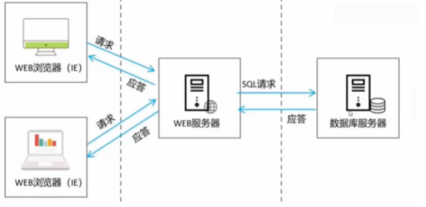

# 2、HTTP

## 2.1 概念

HTTP定义了 客户端和服务器通信时，发送数据的格式

基于 TCP / IP 的高级协议

默认端口号是：**80**

基于请求响应模型，一次请求对应一次响应，例如点击商品添加到购物车是一次请求

无状态的：每次请求之间相互独立，不能交互数据。例如点击商品添加到购物车和去购物车查看，这两个操作是相互独立的。这也是HTTP的缺陷，在Java中使用会话技术来解决这个问题。

## 2.2 历史版本

### 2.2.1 1.0 版本

每一次请求响应都会建立新的链接

### 2.2.2 1.1 版本

链接会进行复用

## 2.3 请求消息数据格式

### 2.3.1 请求行

         请求方式 请求url 请求协议/版本

例如：GET        /login.html  HTTP/1.1 

### 2.1.2 请求头

第二行开始，格式是key：value的格式

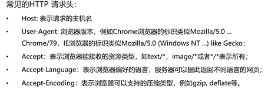

User-Agent中有浏览器的标识，用于处理不同浏览器的显示效果保持一致

### 2.1.3 请求体

POST请求的最后一部分，存放请求参数

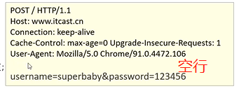


GET和POST的区别

- GET请求请求参数在请求行中，没有请求体。POST请求请求参数在请求体中
- GET请求请求参数大小有限制，POST没有

## 2.4 响应消息数据格式

### 2.4.1 响应行

组成：协议/版本 响应状态吗 状态码描述

```java
HTTP/1.1 200 OK
```

响应的状态码：服务器告诉客户端浏览器本次请求和响应的状态

状态码都是3位数字

状态码分类：

1xx：服务器接受客户端消息，但没有完成，等待一段时间之后，发送1xx多状态码（服务器给客户端发送）

2xx：成功。代表状态码200 当然200多的也表示成功

3xx：重定向。代表数字（重定向 302）（访问缓存 304）

4xx：客户端错误 代表（请求路径没有对应的资源 404）（请求方式没有对应的doXXX方法 405）

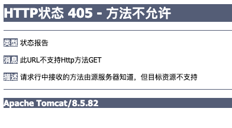

5xx：服务器端错误 代表 （服务器内部异常 500）


### 2.4.2 响应头

格式：头名称：值

常见的响应头

Content-Type：服务器告诉客户端本次响应体数据格式以及编码格式

Content-Length: 内容长度

Content-disposition：服务器告诉客户端以什么格式打开响应体数据

值：

in-line：默认值，在当前页面打开

attachment：以附件形式打开响应体。文件下载

### 2.4.3 响应体

```java
<html>
  <head>
    <title>$Title$</title>
  </head>
  <body>
    hello response
  </body>
</html>
```

# 3、Tomcat

web服务器是一个应用程序，对HTTP协议的操作进行封装，是程序员不必直接对协议进行操作，让web开发更加便捷。

## 3.1 服务器软件

### 3.2.1 什么是服务器

安装了服务器软件的计算机

### 3.2.2 服务器软件

接受用户的请求，处理请求，做出相应

### 3.2.3 web服务器软件

接受用户的请求，处理请求，做出相应，用户可以通过浏览器访问并浏览相应的内容

常见的javaweb服务器软件

webLogic：支持所有的JavaEE规范

webSphere：支持所有的JavaEE规范

JBOSS：支持所有的JavaEE规范

Tomcat：Apache基金组织，支持Servlet，jsp等规范

## 3.2 Tomcat下载和安装

### 3.2.1 下载

去官网下载即可

### 3.2.2 安装

解压压缩文件即可

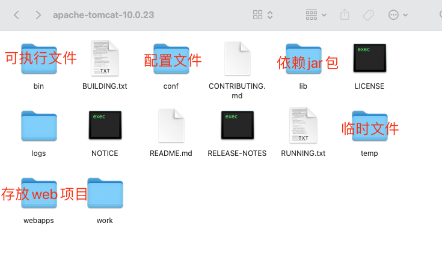

### 3.2.3 卸载

删除文件即可

### 3.2.4 启动

Mac需要cd到相应的目录，使用下面的命令启动

```bash
sh start.sh
```

然后在浏览器中127.0.0.1:8080就能进入（或者localhost:8080也能进入）用自己的ip地址也可以访问，这个是用同一局域网的手机访问获得的

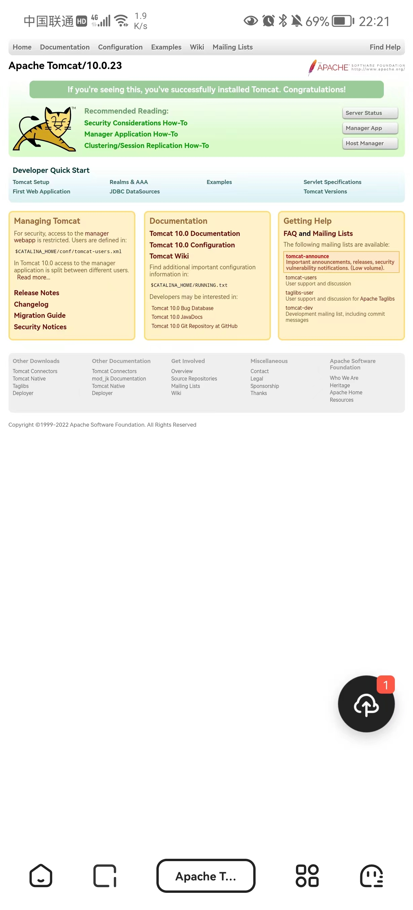

报错的情况

窗口一闪而过：没有正确的配置JAVA_HOME

启动报错

第一种：找到占用的端口号，并且找到对应的进程杀死该进程

```bash
netstat -ano
```

第二种：修改自身的端口号

一般将tomcat的端口号设置为默认80，这样在输入地址的时候不需要输入端口号

### 3.2.5 关闭

正常关闭：命令行sh shutdown.sh或者在命令行中ctrl+c

强制关闭：点击窗口的关闭

### 3.2.6 配置

项目部署的方式

第一种

创建一个自己的项目，然后将它放在webapp的目录当中

比如我们创建一个hello项目

我们访问的时候就需要localhost:8080/hello/index.html  注意端口号的位置

简化部署：将项目打包成一个war包，再将war包放置到webapps目录下，会自动解压缩，也会自动删除

第二种

比较灵活的一个方式，配置conf /server.xml

在<host>标签体中配置

```bash
<Context docBase="项目存放的物理路径" path="/虚拟路径">
```

这时只要一访问虚拟路径就行

第三种

在Catalina目录的localhost中，创建一个xml文件，把server.xml中刚刚的内容复制过来

静态项目和动态项目

目录结构

java动态项目的目录结构

项目的根目录

WEB-INF目录：

web.xml：web项目的核心配置文件

classes目录：放置字节码文件的目录

lib目录：放置依赖的jar包

**tomcat集成到IDEA中**

没法创建javaweb项目的解决方案

[2021新版idea创建java项目没有javaEE模块没有webApplication_实在不想秃的博客-CSDN博客_idea没有javaee](https://blog.csdn.net/qq_44764558/article/details/119684737)

还有一个问题搞了好久，就是一直404，原因是因为tomcat端口被占用了，首先kill掉这个端口，就可以正常访问我们的hello.html页面了。

## 3.3 IDEA中创建Maven Web项目

### 3.3.1 web项目结构

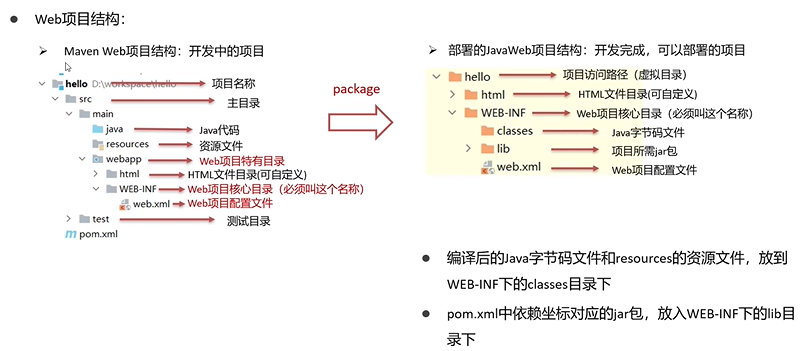


我们在maven中生成的模板

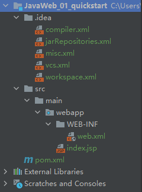

打包后的

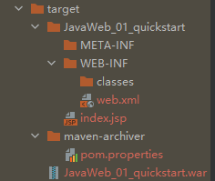


注意要补齐缺失的目录

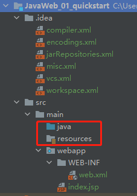

## 3.4 IDEA中集成Tomcat

### 3.4.1 IDEA的Tomcat插件

#### 1）添加tomcat server

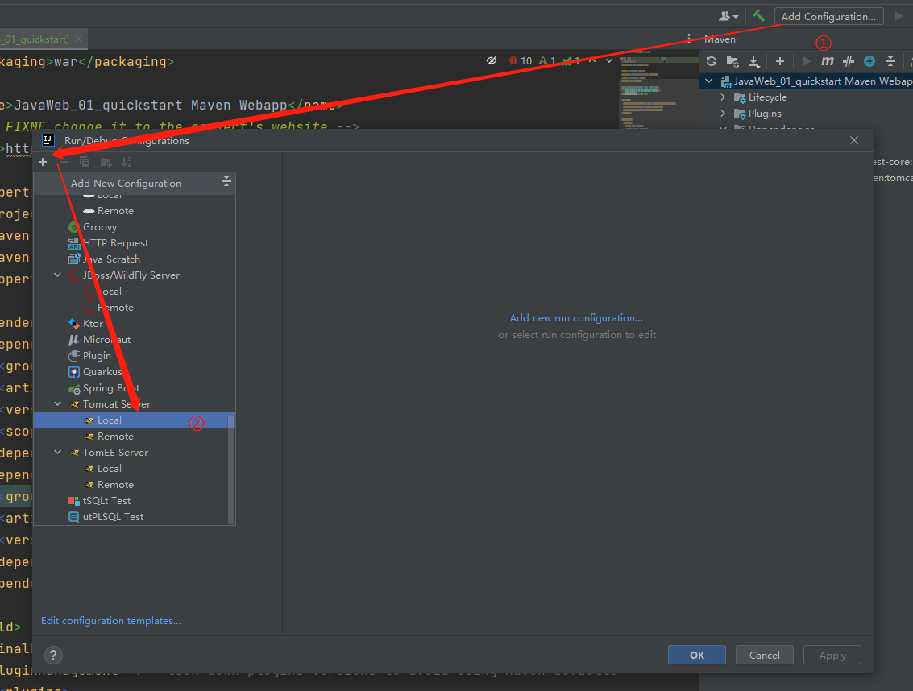


#### 2）选择下载的tomcat目录

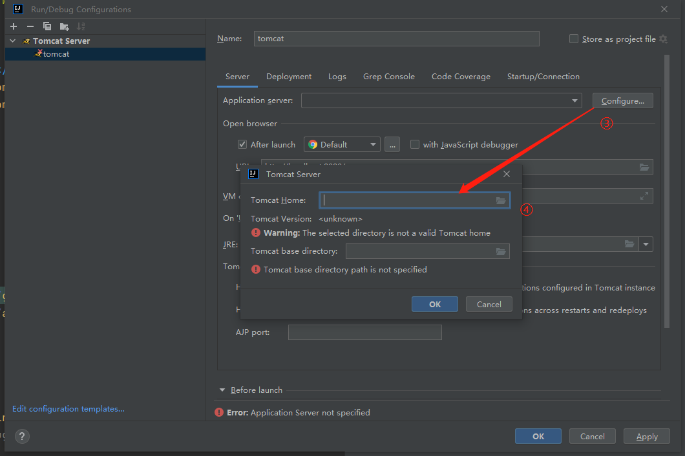

#### 3）访问a.html

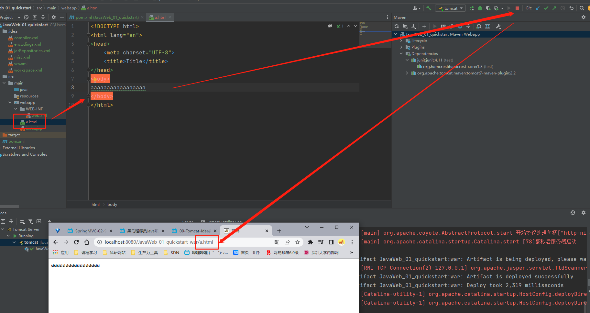


#### 4）tomcat插件启动

tomcat插件的速度比idea自带的更快

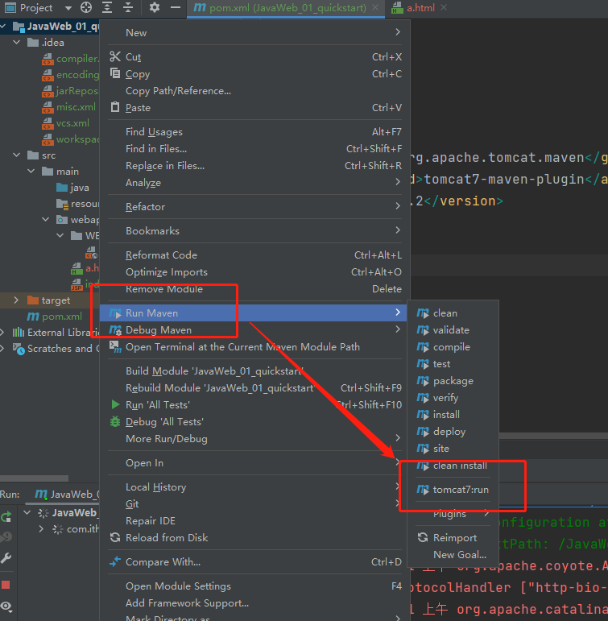

# 4、Servlet

## 4.1 概念 

Servlet是Java提供的一门动态web资源开发技术

那么我们需要做的就是写一个类实现Servlet接口，复写其中的方法。

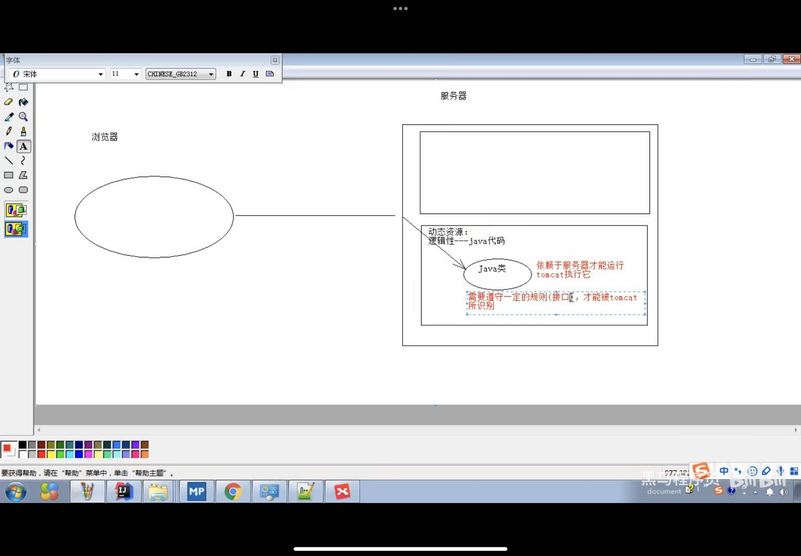

## 4.2 Servlet快速入门

### 4.2.1 导入坐标

```xml
<dependency>
  <groupId>javax.servlet</groupId>
  <artifactId>javax.servlet-api</artifactId>
  <version>4.0.1</version>
  <scope>provided</scope>
</dependency>
```

依赖范围必须是provided，provided在编译环境和测试环境有效，但是在运行环境无效，当我们打成war包时，不会有这个包，因为tomcat中已经有这个包了，所有如果我们还打进去，就会发生冲突。

### 4.2.2 创建类

```java
@Override
public void service(ServletRequest servletRequest, ServletResponse servletResponse) throws ServletException, IOException {
   System.out.println("service method excute");
}
```

### 4.2.3 配置注解

```java
@WebServlet("/demo1")
```

demo1表示当前这个类的资源路径

### 4.2.4 启动tomcat

启动tomcat之后，我们就能够看到service方法输出的内容

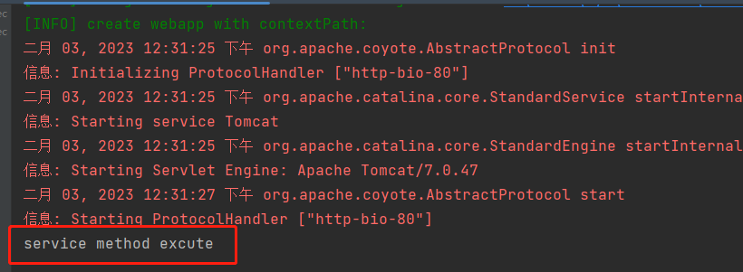


## 4.3 Servlet 执行流程

### 4.3.1 url访问

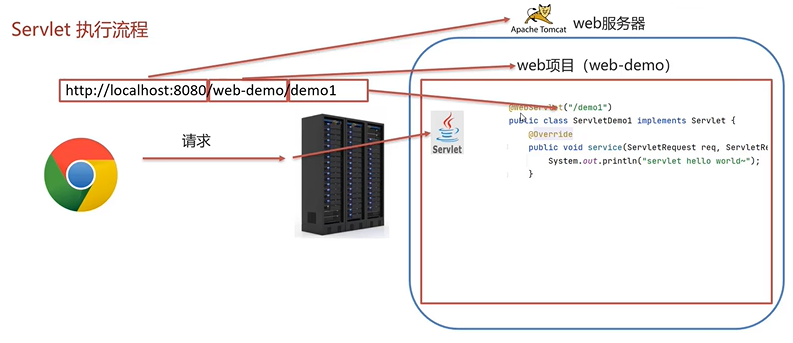

- localhost:8080 访问的是tomcat服务器
- web-demo访问的是项目
- demo1访问的是我们定义的类

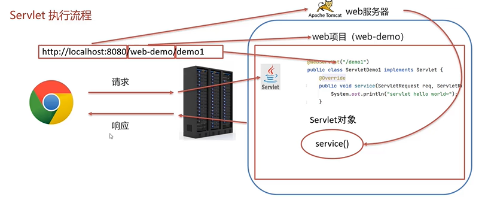

- servlet对象是由web服务器创建，其中的方法也是由web服务器调用

  

## 4.4 Servlet 声明周期

### 4.4.1 加载和实例化

默认情况下，当servlet第一次被访问的时候，由容器创建Servlet对象

### 4.4.2 初始化

servlet实例化之后，容器将调用Servlet中的init方法，完成加载配置文件、创建连接等初始化的工作，该方法只调用一次

### 4.4.3 请求处理

每次请求Servlet时，Servlet容器都会调用Servlet的Service方法对请求进行处理

### 4.4.4 服务终止

当要释放内存或者容器关闭的时候，容器就会调用Servlet的destroy方法完成对资源的释放。

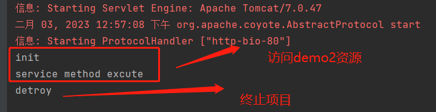

- inti 第一次访问时
- service 访问资源时
- destroy 终止项目

### 4.4.5 getServletInfo

```java
@Override
public String getServletInfo() {
   return null;
}
```

返回一些信息

### 4.4.6 getServletConfig

```java
public ServletConfig getServletConfig() {
   return null;
}
```

获取Servlet对象配置

## 4.5 Servlet 体系结构

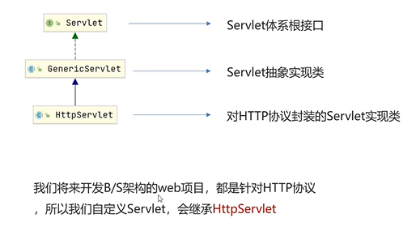

### 4.5.1 HttpServlet方法

```java
package com.itheima.web;

import javax.servlet.*;
import javax.servlet.annotation.WebServlet;
import javax.servlet.http.HttpServlet;
import javax.servlet.http.HttpServletRequest;
import javax.servlet.http.HttpServletResponse;
import java.io.IOException;

@WebServlet(urlPatterns = "/demo3")
public class WebServletDemo3 extends HttpServlet {
   @Override
   protected void doGet(HttpServletRequest req, HttpServletResponse resp) throws ServletException, IOException {
      System.out.println("get ...");
   }

   @Override
   protected void doPost(HttpServletRequest req, HttpServletResponse resp) throws ServletException, IOException {
      System.out.println("post ...");

   }
}
```

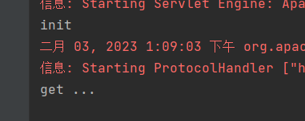


## 4.6 Servlet urlPattern配置


## 4.7 XML配置方式编写Servlet


# 5、Request和Response

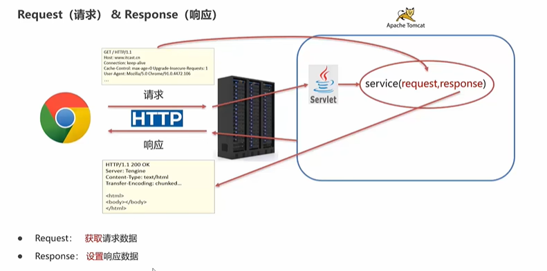

## 5.1 Request请求对象

```java
package com.itheima.web;

import javax.servlet.ServletException;
import javax.servlet.annotation.WebServlet;
import javax.servlet.http.HttpServlet;
import javax.servlet.http.HttpServletRequest;
import javax.servlet.http.HttpServletResponse;
import java.io.IOException;

@WebServlet("/demo4")
public class WebServletDemo1 extends HttpServlet {
   @Override
   protected void doGet(HttpServletRequest req, HttpServletResponse resp) throws ServletException, IOException {
      // 使用request对象，获取请求数据
      // 格式 url?name=XXX
      String name = req.getParameter("name");

      // 将获取的数据输出到页面中
      resp.setHeader("content-type","text/html;charset=utf-8");
      resp.getWriter().write(name + "你好！");
   }

   @Override
   protected void doPost(HttpServletRequest req, HttpServletResponse resp) throws ServletException, IOException {

   }
}
```


最终我们在地址栏中输入demo4?name=lyf

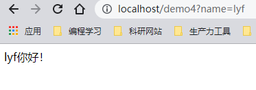

### 5.1.1 Request 继承体系

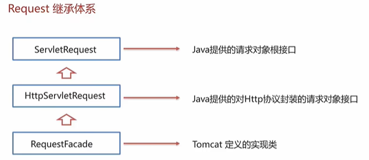

Tomcat需要解析请求数据，封装为request对象，并且创建request对象传递到service方法中。

使用request对象，由于RequestFacade只是一个实现类，其实现的是HttpServletRequest接口中的方法，所以我们只需要去看接口的api文档

我们尝试打印对象

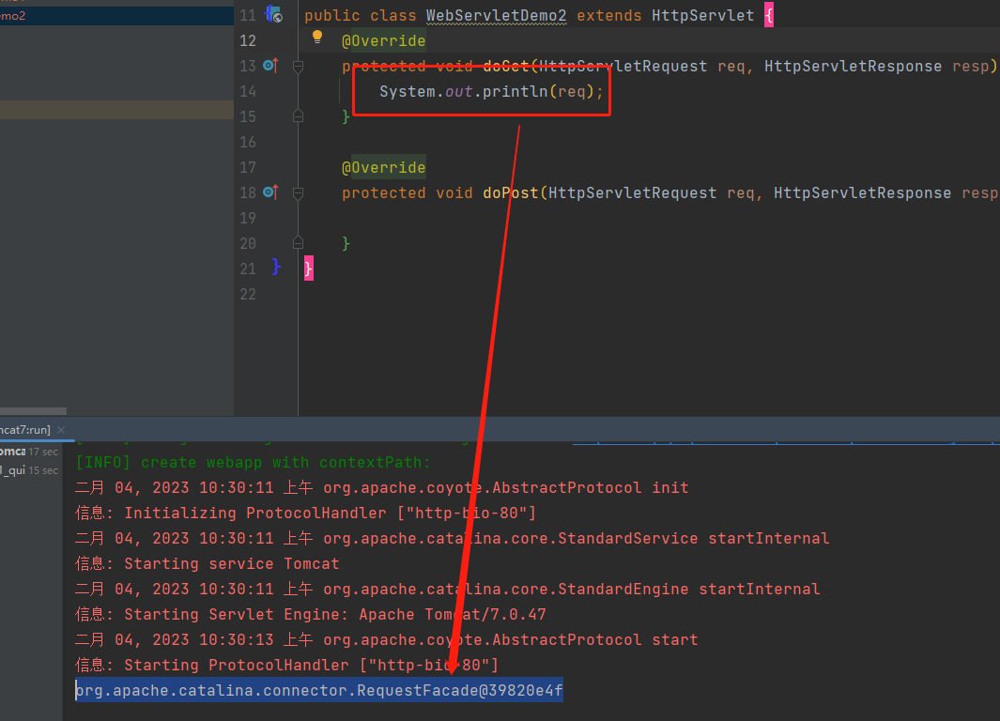

### 5.1.2 Request 获取请求数据

#### 1）请求行

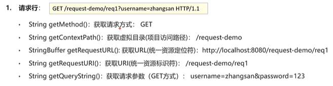

上面的方法调用之后，对应的结果如下

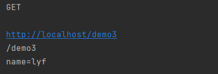

第二行输出为空是因为我们设置了资源虚拟目录为/ ，我们把它改回去默认，输出如下

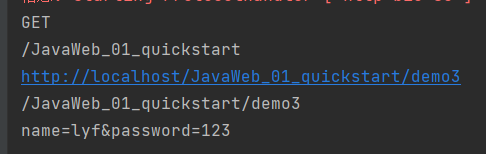


#### 2）请求头

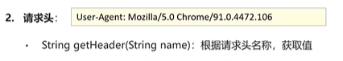

```java
System.out.println(req.getHeader("user-agent"));
```

返回的是用户系统的信息


#### 3）请求体

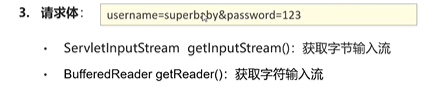

请求体是post请求中才有的

```html
<!DOCTYPE html>
<html lang="en">
<head>
    <meta charset="UTF-8">
    <title>Title</title>
</head>
<body>
    <form action="/demo3" method="post">
        <input type="text" name="username">
        <input type="password" name="password">
        <input type="submit">
    </form>
</body>
</html>
```

注意表单中/demo3是跳转的位置

```java
@Override
protected void doPost(HttpServletRequest req, HttpServletResponse resp) throws ServletException, IOException {
   // post请求体
   BufferedReader reader = req.getReader();
   String line = reader.readLine();
   System.out.println(line);

}
```


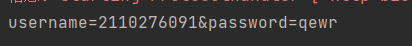

两种获取请求方式的区别

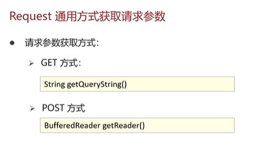

后面我们只要在post方法中，调用doGet方法，转而调用doGet方法进行统一处理即可。


请求参数如果有乱码，应该怎么处理

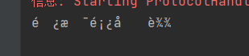


```java
// post 解决乱码
request.setCharacterEncoding("UTF-8");

String username = request.getParameter("username");
System.out.println(username);

// GET解决
// 先对乱码数据进行编码，转为字节数组
byte[] bytes = username.getBytes(StandardCharsets.ISO_8859_1);

// 字节数组解码
String string = new String(bytes, StandardCharsets.UTF_8);
System.out.println("解决乱码后" + string);
```


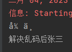


### 5.1.3 Request 请求转发

请求转发是一种在服务器内部的资源跳转方式

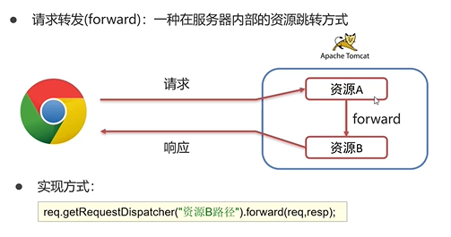

只需要一行代码

```java
request.getRequestDispatcher("/rep6").forward(request, response);
```

实现从demo5 跳转到demo6

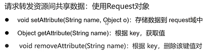

## 5.2 Response

### 5.2.1 Response 设置响应数据功能介绍

#### 1）响应行

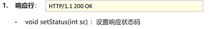


#### 2）响应头

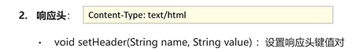


#### 3）响应体

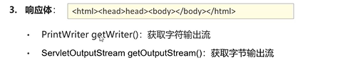


### 5.2.2 Response 完成重定向

一种资源跳转的方式，当浏览器请求资源a无法找到，那么资源A会返回一个状态码，然后给出另一个资源的位置信息，浏览器拿着这个资源信息再去寻找其他的资源。

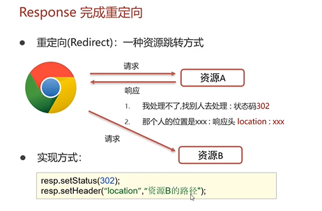

```java
// 设置响应状态码 302
response.setStatus(302);
// 设置响应头
response.setHeader("location","/Respdemo2");
```

还有简化的方式书写重定向

```java
response.sendRedirect("/Respdemo2");
```

注意与转发的区别。

- 重定向地址栏路径发生改变，请求转发地址栏路径不发生改变
- 重定向可以定义到任意位置的资源，请求转发只能转发到当前服务器的内部
- 重定向是两次请求，请求转发是一次请求


路径问题：

明确路径给谁使用，如果浏览器使用，则需要加虚拟目录。如果是给服务端使用，不需要加虚拟目录。


动态获取虚拟目录

```java
String contextPath = request.getContextPath();
response.sendRedirect(contextPath + "/Respdemo2");
```


### 5.2.3 Response 响应字符数据

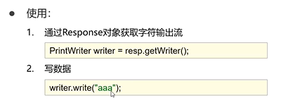


```java
PrintWriter writer = response.getWriter();
writer.write("aaaaaaaa");
```

写到页面上。流不需要关闭。

### 5.2.4 Response 响应字节数据

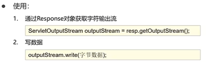

一般是用来向页面上写入图片等信息。

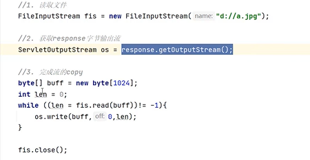

可以使用IOUtils实现流的对拷

```java
IOUtils.copy(fis,os)
```

# 6、JSP

## 6.1 概念

Java Server Pages，java服务端页面，里面即可以写静态内容，也可以写动态内容，这一块基本没人用了，暂时不看。


# 7、会话跟踪技术


