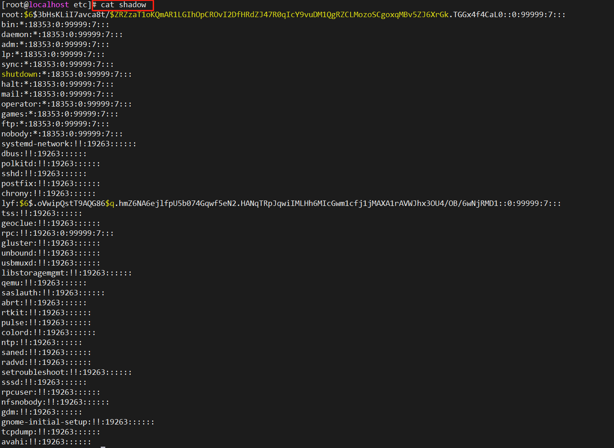
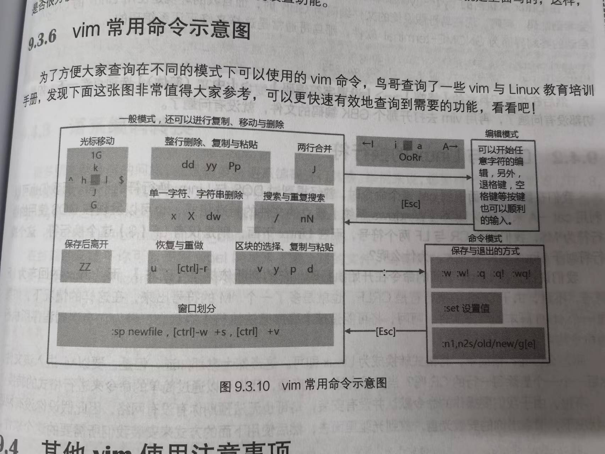

# Linux鸟哥私房菜-基础篇

[TOC]


# 第一部分 Linux的规则与安装

# 1、Linux是什么与如何学习

## 1.1 Linux是什么

# 第二部分 Linux文件、目录与磁盘格式

# 5、Linux的文件权限与目录配置

## 5.1 用户与用户组

在/etc 目录下的passwd文件中，记录了系统上的账号与一般身份用户，还有那个root的相关信息

在/etc 目录下的shadow文件中，记录了个人的密码，并且这个密码是经过加密的



在/etc 目录下的group文件中，记录了所有的组名


## 5.2 Linux文件权限概念

### 5.2.1 Linux文件属性

在我们使用如下的命令时

```bash
ls -al
```

其中-al表示显示文件详细的权限和属性，也包含了隐藏文件，我们能够看到对于每个文件，有七栏，我们挨个看。

**1）第一栏：文件的类型与权限**


第一栏进行细分实际上我们能够数出来，又分了10个位

**第一个字符：**表示当前文件是目录d、文件-、链接文件|、设备文件可存储的周边设备b、设备文件里的串行端口设备、

剩下的九个，三个为一组，均为r（读）w（写）x（执行）的三种组合方式，没有相应的权限用-进行表示

- 第一组（2-4位）文件拥有者可具备的权限
- 第二组（5-7位）加入此用户组织账号的权限
- 第三组（8-10位）非本人且没有加入本用户组的其他账号权限

有点抽象，举个例子

假设当前我们有一个这样的**文件类型与权限 [-] [rwx] [r-x] [r—]**

**那么该文件是一个文件，并且该文件的拥有者可以进行读写执行，跟当前用于处于同一个组的用户可以读执行，但不能进行修改，对于其他用户（不在该组）执行进行读操作**

所以第一个字符的权限我们可以这样记（**本人 同组 非同组**）

> 🤣 要注意，目录和文件的权限意义还是不一样的
> 

**第二栏：表示有多少文件名链接到此节点（inode）**


有多少不同的文件链接到了同一个inode

有关inode的介绍在第七章中会进行介绍

**第三栏：表示这个文件（或目录）的拥有者账号**


**第四栏：表示这个文件所属的用户组**

一个账号会加入到多个用户组当中，你在当前的用户组，可能就会执行某些权限，否则不能够执行你所不在组的一些权限。


**第五栏：这个文件的容量大小，默认单位是Bytes**


**第六栏：文件的创建日期或最近的修改日期**

如果时间太遥远，那么只会显示年份，比如说2013年的行


如果想要显示完整的时间，可以使用下面这个命令

```bash
ls -l --full-time
```

**第七栏：文件名**

如果这个文件名字前面多个 **.** ，则表示该文件是隐藏文件 -a能显示所有的文件，包括隐藏文件


> 关于文件权限还要注意的一点：root是不受系统的权限所限制，无论文件权限是什么，默认root都可以进行读写
> 

### 5.2.2 如何修改文件属性与权限

**1）修改所属用户组 chgrp**

> 注意：进行用户组修改时，必须保证用户组存在才能进行用户组修改
> 

例如，我们把anaconda-ks.cfg这个文件的用户组修改为users用户组，使用的命令如下

```bash
chgrp [-R] dirname/filename
```

-R 表示递归进行操作


可以看到修改后的所属用户组变为了users

**2）修改文件拥有者 chown**

与修改用户组同样的概念，修改所有者同样时要保证这个用户存在才能进行拥有者修改。

> chown能够同时修改用户组的名称
> 

举个例子 我们将刚才的文件所有者修改为bin

```bash
chown bin filename
```

然后我们再修改为拥有者为root 用户组为root

```bash
chown root:root fienale
# 账号名称：用户组名称
```


> 一般来说，建议使用冒号：分割拥有者和用户组
> 

因为chonw也能够单独的修改用户组，当我们在用户组前面加一个.

```bash
chown .sshd filename
# 与下面同样道理
chgrp sshd filename
```

**3）修改文件的权限 chmod**

语法如下

```bash
chmod [-R] xyz 文件或目录
# xyz表示权限属性 例如777最高权限
```

我们在使用vim编辑文件之后，其权限通常为-rw-rw--，也就是本用户和同组用户可以读写，但是非本组执行读，即664权限，如果我们希望该文件能够执行，并且不希望别人修改，那么我们想要的权限为-rwxr-xr-x，即755权限

还有一种修改文件权限的方法就是采用符号

通常是三位

第一位表示的是三种身份权限u（user） g（group） o（others），然后加一个a表示所有身份权限

第二位+加入 -移除 =设置

第三位 r w x 

举个例子，我们想对于一个文件设置一个权限

```bash
chmod u=rwx,go=rx filename
# go表示的是组权限和非组权限，可以连写
```

再比如对于所有加一个写权限

```bash
chmod a+w filename
```

再比如移除所有的执行权限

```bash
chmod a-x filename
```

### 5.2.3 目录与文件的权限意义

文件权限与目录权限的不同之处体现在哪里

**1）文件权限的重要性**

r（read）：读取文件的实际内容

w（write）：可以编辑、新增或修改文件的内容

x（eXecute）：被系统执行的权限

> 在linux下，文件是否可以执行，完全取决于x权限，跟文件名没有任何关系
> 

**2）目录权限的重要性**

r（read）表示拥有查询该目录下文件名的权限 例如ls

w（write）具有改动该目录结构列表的权限：建立新文件与目录、删除已经存在的文件与目录、已存在的文件或目录进行更名、移动目录中的文件

x：目录的执行权限，表示用户**能否进入该目录**将其成为工作目录。

### 5.2.4 Linux文件种类与扩展名

**1）文件种类**

**常规文件：**即 - 开头的文件，又可以细分为纯文本文件、二进制文件、数据文件

**目录：**即 d 开头的

**链接文件：l**，类似于快捷方式

**设备与设备文件：**通常在/dev 下面，又可以细分为区块设备文件（第一个属性为d）、字符设备文件（第一个属性为c）


**数据接口文件：**即 s 开头


**数据输送文件（FIFO）**

**2）Linux文件扩展名**

文件的扩展名只是帮助我们对于文件的种类进行区分，再次强调文件是否可以执行完全取决与 x 属性

> 文件具有可执行的权限和具有可执行的代码程序是两回事，即使文件具有可执行的权限，如果其中的内容是不可执行的一些东西，那么照样是无法执行的
> 

常用的扩展名：

***.sh** 脚本或批处理文件，采用shell编写

***.Z *.tar *.tar.gz *.zip *.tgz** 采用不同的压缩文件压缩

***.html *.php** 网页相关文件

**3）文件名的长度限制**

文件名的限制最大容许255字节，也就是最多255个ASCII英文或者128个汉字

**4）LInux文件名的限制**

最好避免一些特殊的字符，因为这些字符可能被当作特殊的用途

## 5.3 Linux目录配置

### 5.3.1 Linux目录配置的依据——FHS

FHS主要是想帮助用户了解到已安装软件通常放置于哪个目录下

|  | 可分享 | 不可分享 |
| --- | --- | --- |
| 不变 | /usr（软件存放处） | /etc（配置文件） |
|  | /opt（第三方辅助软件） | /boot（启动与内核文件） |
| 可变 | /var/mail（用户邮箱） | /var/run（程序相关） |
|  | /var/spool/news（新闻组） | /var/lock（程序相关） |

可分享：表示能够分享给其他系统挂载使用的目录

不可分享：自己机器上运行的设备文件

不变：随着发行的版本不会警察不该你懂

可变动：经常修改的数据，如日志文件等。

FHS仅规定了三个目录下面应该存放什么数据

/ 根目录 与启动系统有关

/usr 与软件安装执行有关系

/var 与系统运行过程有关

**1）根目录（/） 的意义与内容**

根目录不要放在非常大的分区，安装的软件最好不要与根目录放在同一个分区，保持根目录越小越好

**FHS要求必须存在的目录**

| 目录 | 应放置文件内容 |
| --- | --- |
| /bin | 放置在单人维护模式下还能够被使用的命令，主要有cat、chmod、chown、date、mv、mkdir、cp、bash |
| /boot | 启动时使用的文件，主要是Linux内核文件以及启动选项与启动所需配置文件等 |
| /dev | 设备和接口设别，只要读取文件，就相当于读取设备 |
| /etc | 系统的配置文件 |
| /lib | 系统启动时用到的函数库 |
| /media | 可删除的设备，例如光盘等 |
| /mnt | 临时挂载某些设备 |
| /opt | 第三方辅助软件放置的目录 |
| /run | 系统启动后所产生的各项信息 |
| /sbin | 放在sbin下的是启动过程中所需要的，包括了启动，修复等所需要的命令 |
| /srv | 网络服务启动之后，这些服务所需要的数据目录 |
| /tmp | 让一般用户或正在执行的程序暂时存放文件的地方 |
| /usr |  |
| /var |  |

**FHS建议可以存在的目录**

| /home |  |
| --- | --- |
| /lib<qual> |  |
| /root |  |

### 5.3.2 目录树

目录树的特点

- 目录树的起始点为根目录
- 每一个目录不止能使用本地分区的文件系统，也可以使用网络上的文件系统
- 每一个文件在此目录树中的文件名都是独一无二的

```bash
# 查看根目录下的内容
ls -l / 
```


### 5.3.3 绝对路径与相对路径

- 绝对路径：从根目录开始写的文件名或目录名称
- 相对路径：相对于目前路径的文件名写法，例如./home 等

# 6、Linux文件与目录管理

## 6.1 目录与路径

### 6.1.1 相对路径和绝对路径

相对路径：一般来说，对于不同的工作环境，相对路径更好用

绝对路径：绝对路径的准确性是最好的

### 6.1.2 目录的相关操作

```bash
. # 代表此层目录
.. # 代表上层目录
- # 代表前一个工作目录
~ # 代表目前使用者身份所在的家目录
~account # 代表account这个使用者的家目录
```


可以看到，root和lyf用户的家目录是不一样的

几个常用的处理目录的命令

```bash
cd # 切换目录
pwd # 显示当前目录
mkdir # 建立一个新目录
rmdir # 删除一个空目录
```

**1）cd命令**


cd - 表示回到之前的那个目录


**2）pwd命令**

```bash
pwd # 显示当前的路径（包括链接路径）
pwd -P # 显示出真正的路径，包括其链接路径的真实路径
```

比如下面这个路径


为什么不一样呢，这说明mail肯定是一个链接文件


l开头，说明一定是一个链接的文件其链接到了spool/mail 

**3）mkdir**

```bash
mkdir -m # 添加权限
mkdir -p # 递归创建
```


可以看到默认的权限是rwxr-xr-x

> 但是默认的与umask有关
> 

**4）rmdir**

```bash
rmdir -p # 递归删除 
```


如果当前目录不为空，那么应该递归删除，但是递归删除也要把完整目录写完


可以这样写，rm -r test1


直接这样更方便


### 6.1.3 关于执行文件路径的变量：$PATH

实际上ls命令所在的目录是/bin/ls


那为什么我们能够在任意的目录下执行ls命令呢？实际上是因为配置了$PATH

```bash
echo $PATH
```

可以看到如下内容


这些事已经配置好的一些环境，每一个用冒号分割，并且注意看这一条

```bash
/usr/bin
```

因为bin是连接到/usr/bin的，所以我们可以直接用/bin/ls代替/usr/bin/ls，并且二者的/bin下的内容确实也是一样的。

并且注意的是，如果有两个/usr/local/bin/ls 和 /bin/ls 那么先执行的是现在$PATH中查询到的，即/usr/local/bin

> 一般来说环境中的都是**绝对路径**
> 

> 不同身份用户的的PATH也是不一样的，比如我们切换到root用户
> 


## 6.2 文件与目录管理

### 6.2.1 文件与目录的查看 ls

ls默认显示的有：非隐藏文件的文件名、以文件名进行排序及文件名代表的颜色


ls另外一些常用的参数

**1）ls -al** 

将家目录下的所有文件列出来（含属性与隐藏文件）


> 目录一般都是以深蓝色显示
> 

**2）ls -alF --color=nerver**

不显示颜色，但是显示文件的类型


> 注意，以/结尾的都是表示目录，并且其下面还有东西
> 

3）ll 使用最多的

不显示隐藏文件


### 6.2.2 复制、删除与移动：cp、rm、mv

**1）cp 复制文件或目录**

**范例一：**用root身份，将家目录下的.bashrc复制到/tmp下，并更名为bashrc


> -i 能够对于是否存在进行判断，如果存在了，那么会进行询问
> 

**范例二：**切换目录到/tmp，并将/var/log/wtmp复制到/tmp且观察属性


如果想把时间也复制过来，就是完全拷贝

```bash
cp -a XXX XXX
```


> 在默认的条件中，cp的源文件与目标文件的权限是不同的，目标文件的拥有者通常会是命令操作者本身
> 

我们在cp一些特殊权限的文件时，不能直接cp过来使用，必须要加上-a或者-p

> -a 是
> 

> -p 是 连同文件的属性一起复制过去，而非使用默认属性（备份常用）
> 

**范例三：**复制/etc 这个目录下的所有内容到/tmp下

我们直接复制是不行的，因为/etc/是一个目录，下面还有很多东西，需要加上-r


范例四：将范例一复制的bashrc建立一个符号链接文件（symbolic link）


软硬链接的几个重要区别

> 硬链接
> 
- 相同inode节点号的多个文件互为硬链接文件
- 删除某几个硬链接，源文件不会被删除，只有所有的硬链接都被删除，源文件才会被删除

> 软链接
> 
- 软连接类似于windows的快捷方式
- 删除源文件，软连接还会存在，只是无法访问，软连接是一直在红光闪烁的


**范例五：**若~/.bashrc 比 /tmp/bashrc新，才复制过来


如果没有加选项，cp默认的会将原始文件拷贝过来，如果要复制链接文件的属性，就要使用-d


> 普通用户不能够复制完整的权限（例如与拥有者和用户组相关的）
> 

### 6.2.3 获取路径的文件名与目录名称

```bash
basename /etc/sysconfig/network
dirname /etc/sysconfig/network
```

一个是获取文件名，一个是获取目录名字


## 6.3 文件内容查看

### 6.3.1 直接查看文件内容

**1）cat 由第一行开始显示文件内容**

**范例一：查看/etc/issue文件的内容**


**范例二：查看/etc/issue文件的内容，并打印行号**

打印不显示空行的


打印显示空行的


**范例三：将 /etc/man_db.conf的内容完整的打印出来，包含特殊字符**

从部分结果可以看出，并不显示特殊字符，而是有点像转义的


$ 表示的是换行符

**2）反向显示 tac**

反向显示是指，从文件的最后一行反着显示


**3）nl添加行号打印**

**范例一：用nl列出/etc/issue的内容**


如果要显示空行，使用-b，与cat不一样，cat -b是不显示空行

如果想加上行号，并且在前面自动补0


可以看到默认的行号补0是六位数，现在我想把他改为占用三位数


### 6.3.2 可翻页查看

**1）more 一页一页的翻动**

more最终会显示当前显示了多少比例的内容，那么我们如何进行翻页呢？


**空格键：**代表向下翻一页

**Enter：**代表向下翻一行

**/字符串：**代表在显示的内容中，向下查找字符串这个关键字

**:f** 立刻显示出文件名以及目前显示的行数

**q** 代表立刻离开more，不再显示该文件内容

b或[ctrl]-b 代表往回翻页，只对文件有用，对管道无用

**2）less一页一页的翻动**

less中有更多的功能，只介绍比more多的功能

[Pagedown]：向下翻动一页

[Pageup]：向上翻动一页

?字符串，向上查找字符串的功能

n: 重复前一个查找（用了查找功能之后，跳到上一个，假设红色是当前，则n就是蓝色那个）

N：反向的重复前一个查找（绿色那个）


g：前进到这个数据的前一行，查找内容的第一行

G：前进到这个数据的最后一行去，查找内容的最后一行

q：离开less

### 6.3.3 数据截取

**1）取出前面几行**

显示前20行


在参数20的位置，如果我们写出负数，例如-100，那么后100行不显示，只显示除了最后100行之外的所有的行


**2）tail 取出后面几行**

默认显示最后10行


**范例一：如果不知道有几行，却只想列出100行之后的数据**

```bash
tail -n +100 filename
```


**范例二：持续检测/var/log/messages的内容（root权限）**


ctrl+c结束

### 6.3.4 非纯文本文件：od

对于二进制文件，我们应该怎么读取

**范例一：将/usr/bin/passwd的内容使用ASCII方式来显示**


**范例二：将/usr/issue 这个文件的内容以8进制列出存储值与ASCII的对照表**

```bash
od -t oCc
```

### 6.3.5 修改文件时间与创建新文件：touch

linux记录时间的参数：

- 修改时间：指的是文件**内容数据**变更，就会更新这个时间，并不是指文件属性或者状态
- 状态时间：文件权限与属性变更，才会更新这个时间
- 读取时间：文件内容被读取时，就会更新这个读取时间，例如cat就会更新这个时间


> 分号表示连续执行的指令
> 

**touch案例**

**1）案例一：新建一个空文件并观察时间**


我这个系统时间好像是不对的

[](https://blog.csdn.net/loyachen/article/details/47848675)

**2）范例二：将~/.bashrc 复制成为bashrc，假设复制完全的属性。检查日期**


mtime（modify time） 文件修改的时间，由于这个文件都没被动过，所以2013

atime（access time） 读取的时间，上一次读取的时间

ctime（status time） 状态时间，状态改变 

**3）范例三：修改案例二的bashrc文件，将日期调整为两天前**


注意看，**ctime没有变**

**4）将上个范例的bashrc日期改为 2014/06/15 2:02**


ctime 记录的是目前的时间

> touch 能够修改mtime和atime，但是ctime无法修改
> 

## 6.4 文件与目录的默认权限与隐藏权限

例题1：假设有一个用户，希望将~/.bashrc复制给他，并修改其权限


例题2：在/tmp下面新建一个目录，目录的拥有者为lyf。用户组为lyf，除了lyf之外，其他人都不能修改该目录下的文件，那么文件的权限应该是rwxr-xr-x


### 6.4.1 文件默认权限：umask

当我们在新建一个文件或目录的时候，他的默认权限是什么？ umask就是决定这个默认权限的默认值

```bash
umask # 获取umask
umask -S # 
```


默认情况下

- 如果用户建立为文件则默认没有可执行x权限，只有rw这两个，也就是最大666权限，默认权限就是rw-rw-rw-
- 如果用户建立为目录，则由于x与是否可以进入此目录有关，因此默认所有权限都开放，即777 rwxrwxrwx

umask的值我们只看022，这个表示的是被拿掉的权限，也就是，被拿掉的是2权限，也就是写的权限

那么在使用了umask之后，再建立文件或目录时，其权限如下（假设022）：

- 建立文件-rw-r--r--
- 建立目录 drwxr-xr-x


那么我们应该怎么设置这个umask呢？


> 一般来说，root的umask默认是022，对于一般的用户来说，umask一般是002
> 

> -d 应该是只显示文件夹的属性
> 


### 6.4.2 文件隐藏属性

**1）chattr 配置文件隐藏属性**

```bash
chattr [+-=][ASacdistu]
```

**案例：在tmp下建立文件，并加入i的参数**


+i 能够保证一个文件无法被修改

+a 能够保证文件可以增加但是不能修改旧数据与删除的参数

**2）显示文件隐藏属性**

```bash
lsattr [-adR] 文件或目录
```

比如我们使用上面的chattr更改了文件隐藏属性，那么attr就是用来查看文件的隐藏属性


> S属性保证对于文件的修改都是同步进行的，也不用死记，毕竟有好多的隐藏属性
> 

### 6.4.3 文件特殊权限：SUID、SGID、SBID

有两个文件的权限比较特殊


t和s是什么？

**1）Set UID**

当s这个标志出现在文件拥有者x权限上时，这个文件的权限状态被称为Set UID，简称为SUID的特殊权限。那么特殊在哪里

- SUID仅对二进制程序有效
- 执行者对于该程序需要具有x的可执行权限
- 本权限只在执行该程序的过程中有效
- 执行者将具有该程序**拥有者**的权限

试想一个事情，/etc/shadow这个文件中，只有root能够进行读写，但是我们仍然能够通过普通的账户，比如lyf修改自己的密码，从而也能够导致shadow文件的内容发生改变，那么这个就涉及到了SUID的东西了。

**举个例子**

/usr/bin/passwd这个文件的拥有者是root，但是他有一个特殊的权限s，当我们用户在执行passwd的过程中，会暂时获得root的权限，从而我们就能够变更/etc/shadow中的内容。

> 此外，SUID仅能用在二进制程序上，不能够用在shell脚本。并且其对于目录也是无效的。
> 

**2）Set GID**

- SGID对二进制程序有用
- 程序执行者对于该程序来说，需具备x的权限
- 执行者在执行的过程中将会获得该程序**用户组**的支持（注意是用户组）

**举个例子**

/usr/bin/locate 这个程序可以去查找 /var/lib/mlocate/mlocate.db的内容


SGID的原理与SUID的原理十分相似，当一个目录设置了SGID之后，将会拥有下面的功能

- 如果用户对于此目录具有w、x权限，就能够进入此目录
- 用户在此目录下的有效用户组将会变成该目录的用户组。（也就是拥有了该组的权限）
- 如果用户在此目录下具有w的权限，则用户所建立的新文件，该新文件的用户组与此目录的用户组相同

**3）Sticky Bit**

> 目前只针对目录有效，对于文件已经没有效果了
> 
- 当用户对于此目录具有w、x权限，就有写入的权限
- 当用户在该目录下建立文件或目录时，仅有自己与root才有权力删除该文件

简单来说，如果用户甲对于某个目录具有wx权限，那么其可以对这个文件夹中的其他人的目录或文件进行删除，但是加上了SBIT之后，甲只能对自己建立的文件或目录进行删除更名移动等操作。

**小案例：怎样使用这三种权限**

> 注意，SUID不能用在目录 SBIT不能用在文件
> 


755 对应的权限是 rwxr-xr-x，在前面加个4表示，增加了SUID权限，最终变为rwsr-xr-x

755 对应的权限是 rwxr-xr-x，在前面加个6表示，增加了SUID和SGID权限，最终变为rwsr-sr-x

755 对应的权限是 rwxr-xr-x，在前面加个1表示，增加了SBIT权限，最终变为rwxr-sr-t，**注意是t**

666 对应的权限是 rw-rw-rw-，在前面加个7表示增加SUID、SGID、SBIT的权限 rwSrwSrwT ，因为原来没有x权限，所以大写表示空权限

### 6.4.4 观察文件类型：file

如果想要知道某个文件的基本信息，例如是属于ASCII或者是数据文件或者二进制文件，且其中有没有使用到动态链接库等信息，就可以使用file这个命令查看


## 6.5 命令与文件的查找

### 6.5.1 脚本文件的查找

**1）which（查找[执行文件]）**

**范例1：**查找ifconfig这个命令的完整文件名


**范例2：**用which去找出which的文件名是什么


**范例3：**找出history这个命令的完整文件名


which这个命令是根据PATH这个环境变量所规范的路径，去查找执行文件的文件名。

> history这个常用的命令找不到，因为这个时bash内置的命令。而which找的是PATH内所设置的目录
> 

### 6.5.2 文件的查找

通常使用whereis和locate来检查

- whereis只找系统中某些特定目录下的文件
- locate则是利用数据库来查找文件名

**1）whereis**

**案例1：**找出ifconfig这个文件名


**案例2：**只找出跟passwd有关的[说明文件]文件名。


- -m 只有在man里面的文件名才显示出来，不加这个的话是全部显示出来
- -l 查看一共查询了多少个目录

> whereis主要针对/bin/sbin下面的执行文件，以及/usr/share/man下面的man page文件
> 

**2）locate / updatedb**

**案例1：**找出系统中所有与passwd相关的文件名，且只列出5个


**案例2：**列出locate查询所使用的数据库文件之文件名与各数据数量


但是locate有个问题是，当数据库更新后，你去查数据库更新前的数据，很可能就会查询不到。

**更新locate数据库的方法**

```bash
updatedb
```

- updatedb：根据 /etc/updatedb.conf的设置去查找系统硬盘内的文件，并更新 /var/lib/mlocate 内的数据库文件
- locate：依据 /var/lib/mlocate 内的数据库记录，找出用户所输入关键词的文件名

**3）find**

**范例1：**将过去系统上面24小时内有修改过内容的文件列出


0表示从当前时间的24小时之前，如果是3天前的，就是find / -mtime 3

**范例2：**寻找/etc/下面的文件，如果文件日期比/etc/passwd新就列出


**时间参数的意义**

-4 表示小与等于4天内的文件

```bash
find /var -mtime -4
```

+4 表示大于等于5天前的文件

```bash
find /var -mtime +4
```

4 表示4-5那一天的文件

```bash
find /var -mtime +4
```

# 第三部分 学习shell与shell script

# 9、vim程序编辑器

## 9.1 vi和vim

## 9.2 vi的使用

vi分为三种模式，一般命令模式、编辑模式与命令行模式。

**1）一般命令模式**

使用vi打开一个文件就直接进入一般命令模式。可以做的操作有上下左右移动光标，删除字符和删除整行来处理文件内容，使用复制粘贴处理文件内容。

**2）编辑模式**

在一般命令模式中可以进行删除、复制、粘贴等操作，但是无法编辑文件的内容。从一般命令模式进入到编辑模式的方法（i、l、o、O、a、A、r、R）就能进入

**3）命令行模式**

在一般模式当中，输入: / ? 三个中的任何一个按钮，就可以将光标移动到最下面的一行

### 9.2.1 简易执行范例

### 9.2.2 按键说明

**第一部分：**一般命令模式可用的功能按键

**移动光标的方法**

| h或者左箭头 | 左移一个字符 |
| --- | --- |
| j或向下箭头 | 下移一个字符 |
| k或向上箭头 | 上移一个字符 |
| l或向右箭头 | 右移一个字符 |

也可以使用组合键的方式，移动一定数量的字符，例如10 + 向下箭头，就会一次性向下移动10行

| ctrl+f | 屏幕向下移动一页 |
| --- | --- |
| ctrl+b | 屏幕向上移动一页 |
| ctrl+d | 屏幕向下移动半页 |
| ctrl+u | 屏幕向上移动半页 |

| + | 光标移动到非空格符的下一行 |
| --- | --- |
| - | 光标移动到非空格符的上一行 |

| n<space> | 在行中移动n个字符 |
| --- | --- |

| 0或者home | 回到这一行的最开头 |
| --- | --- |
| $或者End | 移动到这一行的最后一个位置 |
| G | 移动到这个文件的最后一行 |
| gg | 移动到文件的第一行 |
| n<Enter> | 向下移动n行 |

**查找与替换**

| /word | 向下找第一个为word的字符串 |
| --- | --- |
| :n1,n2s/word1/word2/g | 查找第n1行和第n2行之间的word1字符串，并将其替换为word2字符串 |
| :1,$s/word1/word2/g | 从第一行到最后一行寻找word1，并将其替换为word2 |
| :1,$s/word1/word2/gc | 从第一行到最后一行寻找word1，并将其替换为word2，在替换之前，询问是否进行替换 |

**删除、复制与粘贴**

| x与X | x是删除后一个字符，相当于del，X是删除前一个字符，相当于backspace |
| --- | --- |
| dd | 删除光标所在的一整行 |
| ndd | 删除光标下面的n行 |
| yy | 复制光标所在的哪一行 |
| nyy | 复制光标所在的n行 |
| p与P | p是粘贴在光标上一行，P是粘贴在上一行 |
| u | 恢复前一个操作 |
| ctrl+r | 重做上一个操作 |
| . | 小数点表示重复前一个操作 |

**第二部分：一般命令模式切换到编辑模式的可用的按键**

进入插入或替换的编辑模式

| i与I | 进入插入模式，i从当前光标所在处插入，I为在目前所在行的第一个非空格符处开始插入 |
| --- | --- |
| a与A | 进入插入模式，a表示从当前光标所在的下一个字符开始插入，A为从光标所在行的最后一个字符开始插入 |
| o与O | 进入插入模式，o在目前光标所在行的地方插入一个新行。O为在目标光标所在处的上一行插入新的一行。 |
| r与R | 进入替换模式，r会替换光标所在的那一个字符一次，R会一直替换光标所在的文字 |

**第三部分：一般命令模式切换到命令行模式**

| :w | 将编辑的数据写入硬盘文件中 |
| --- | --- |
| :w! | 若文件属性为只读，强制写入改文件，不过能不能写入，与该文件的文件权限有关 |
| :q | 退出vi |
| :q! | 强制退出不保存 |
| :wq | 保存后退出 |
| ZZ | 若文件没修改，则不保存退出，若文件已经被修改过，则保存后退出，注意没有冒号 |

### 9.2.3 案例

### 9.2.4 vim的缓存、恢复与打开时的警告信息

我们在使用vim进行编辑的时候，vim会再与被编辑的文件的目录下面，再建立一个.filename.swp的文件，当被不正常关闭的时候，这个文件就会发挥作用


六个按键的作用

- [O]pen Read-Only：打开此文件成为只读文件
- (E)dit angway：用正常的方式打开想要编辑的文件，**并不会加载缓存的内容**
- (R)ecover：加载缓存的内容，用于救回之前没有保存的工作
- (D)elete it：确定缓存无用，打开文件之前先将这个缓存删除
- (Q)uit：按下q就退出vim，不会进行任何操作回到命令提示字符
- (A)bort：忽略这个编辑操作

## 9.3 vim的额外功能


### 9.3.1 可视区块（Visual Block）

可视区块的按键

| v | 字符选择，会将光标经过的地方反白选择 |
| --- | --- |
| V | 行选择，会将光标经过的行反白选择 |
| ctrl+v | 可视区块，可以用举行的方式选择数据 |
| y | 将反白的地方复制起来 |
| d | 将反白的地方删除掉 |
| p | 将刚刚复制的区块，在光标所在处粘贴 |

[https://www.notion.so](https://www.notion.so)

首先按住ctrl+v 然后就能进行区块选择，然后选中要选中的区块之后，按下y，就能进行复制，然后就是p能粘贴到指定的位置

### 9.3.2 多文件编辑

同时打开好几个文件，就好像同时打开两个word文件，进行复制其中的部分内容。

首先我们创建两个文件 host1 和 host2

```bash
:files # 能够查看当前文件都有什么
:n # 进入下一个文件
:N # 进入上一个文件
```


不是很好用

### 9.3.3 多窗口功能

启动多个窗口，在一个vim中，输入 sp: filename就能够打开双窗口模式


### 9.3.4 vim的关键词补全功能

### 9.3.5 vim环境设置与记录：~/.vimrc、~/.viminfo

vim会主动帮我们把曾经做过的操作记录下来

### 9.3.6 vim常用命令示意图



## 9.4 其他vim使用注意事项

### 9.4.1 中文编码问题

出现乱码可能是因为什么

- Linux系统默认支持的语系数据，与/etc/locale.conf有关
- 终端的语系：与LANG、LC_ALL有关
- 文件原本的编码
- 打开终端的软件

### 9.4.2 DOS与Linux的换行符

### 9.4.3 语系编码转换

# 10、认识与学习BASH

## 10.1 认识BASH这个shell

### 10.1.1 硬件、内核与shell

只要能够操作应用程序的软件都能被称为壳程序

### 10.1.2 为何学习

### 10.1.3 系统的合法 shell 与 /etc/shells功能

### 10.1.4 Bash shell的功能

bash的主要优点

- 历史命令：这些历史命令记录在.bash_history，注意，在前一次登录执行过的命令，当前这次登录的操作，命令先被缓存在内存中，当注销系统之后，这些命令才会被记录在.bash_history中
- 命令与文件补全功能
- 命令别名设置功能 alias
- 任务管理、前台、后台控制
- 脚本化程序
- 通配符

### 10.1.5 查询命令是否为Bash shell的内置命令 type

```bash
type [-tpa] name
```

**范例一：查询一下ls这个命令是否为bash内置**


加不加-t的区别在于，-t能够显示出name的意义，主要由下面几种

- file 表示为外部命令
- alias 表示该命令为命令别名所设置的名称
- builtin 表示该命令为bash内置的命令功能


-a会将所有包含name的路径显示出来

**范例二：type cd**


### 10.1.6 命令的执行与快速编辑按钮


## 10.2 Shell的变量功能

### 10.2.1 什么是变量

### 10.2.2 变量的使用与设置：echo、变量设置规则、unset

变量的使用：echo


如果一个变量没有被设置，那么在echo的时候会输出空值，我们可以对其进行赋值，然后再输出就不是空值了


- 变量的设置规则
    - 变量与变量内容以一个等号来连接
    - 等号两边不能直接接空格
    - 变量名称只能是英文字母与数字，但是开头不能是数字
    - 变量内容如果有空格可使用双引号或单引号将变量内容结合起来
        - 双引号内的特殊字符如$等，可以保有原本的属性
        - 单引号内的特殊字符则仅为一般字符(纯文本)

举例

案例1：设置变量name，且内容为Vbird


案例2：如变量含有特殊符号时，例如VBird’s name


可以用双引号嵌套的方式，也可以用\转义的方式

案例3：在PATH这个变量中，累加/home/lyf/bin 这个目录


案例4：将name的内容多出yes?


案例5：如何让我刚刚设置过name=VBird可以用在下个shell程序

在当前的shell去开启一个子进程，一般来说父进程的自定义变量是无法在子进程内使用的，但是通过export将变量编程环境变量之后，就能够在子进程下面使用。


案例6：如何进入当前内核的目录模块

```bash
cd /lib/modules/`uname -r`/kernel
cd /lib/modules/$(uname -r)/kernel
```

其中，单反引号` 作用是，被引起来的会先执行，并且作为一个外部传入，如果当前需要借助其他额外的命令所提供的信息时，那么可以使用单反引号

案例7：取消之前设置的name变量

```bash
unset name
```

**例题**

在变量的设置中，单引号与双引号有什么不同的用途


当时用单引号的时候，变量将会失去其原有的含义，变成单纯的字符的形式。

### 10.2.3 环境变量的功能

 使用两个命令来查看环境变量

```bash
env
export
```

**1）env**


- HOME 表示用户的根目录
- SHELL 告知我们目前linux使用的SHELL是哪个程序
- HISTSIZE 曾经执行过的历史命令，条数，比如上面显示1000，也就是可以记录1000条历史命令
- MAIL 当我们使用mail收信时，回去读取的邮箱文件
- PATH 执行文件查找的路径，目录与目录之间以：分割
- LANG 语系数据 也就是编码的格式
- RANDOM 随机数变量

export


当登录一个linux 并获取一个bash之后，bash就是一个独立的进程

子进程会继承父进程的环境变量，子进程不会继承父进程的自定义变量

### 10.2.4 影响显示结果的语系变量 locale

```bash
locale -a
```


### 10.2.5 变量的有效范围

环境变量=全局变量

自定义变量=局部变量

为什么环境变量的数据可以被子进程引用？

- 当启动一个shell，操作系统会分配一内存区域给shell使用，此内存中的变量可让子进程使用
- 若在父进程利用export功能，就可以让自定义变量的内容写到上述的内存区域当中
- 当加载另一个shell时，（即启动子进程，而离开原本的父进程），子shell可以将父shell的环境变量所在的区域导入自己的环境变量区块当中

### 10.2.6 变量键盘读取、数组与声明：read、array、declare

**1）read**

```bash
read [-pt] variable
# -p 后面可以接提示字符
# -t 后面可以接等待的秒数 
```