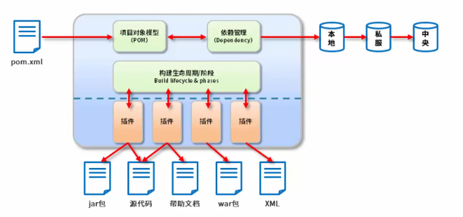

# Maven

[TOC]

# 一、Maven基础部分

## 1、Maven简介

### 1.1 传统项目管理状态分析

jar包不统一，jar包不兼容。工程升级维护过程操作繁琐

Maven的本质是一个项目管理工具，将项目开发和管理过程抽象成一个项目对象模型（POM 项目对象模型）



### 1.2 Maven的作用

项目构建：提供标准的、跨平台的自动化项目构建方式

依赖管理：方便快捷的管理项目以来的资源（jar包），避免资源间的版本冲突问题

统一开发结构：提供标准的、统一的项目结构


## 2、下载与安装

绿色软件，直接下载解压就行

### 2.1 环境配置

配置MAVEN_HOME,在系统变量中新建变量，然后添加


配置path


在cmd中运行，会提示报错


因为我们没有配置JAVA_HOME，直接使用的IDEA，所以还要配置一下，教程如下

[](https://www.jianshu.com/p/5cc991b7340c)

然后，**关闭cmd，重新打开，再次输入mvn**


## 3、Maven基础概念

### 3.1 仓库

用于存储资源，包含各种jar包


**仓库分类**

本地仓库和远程仓库，其中远程的仓库又分为中央仓库和私服

### 3.2 坐标

**3.2.1 什么是坐标**

Maven中的坐标用于描述仓库中资源的位置

**3.2.2 Maven坐标主要组成**

groupId（组织ID）：定义当前Maven项目隶属组织名称，通常是域名反写（org.mybatis）

artifactId（项目ID）：定义当前Maven项目名称（通常是模块名称，例如CRM、SMS）

version（版本号）：定义当前版本号。

[](https://mvnrepository.com/)

### 3.3 仓库的配置

如何更改仓库的路径


在setting.xml中进行修改


改成需要的保存的路径即可

### 3.4 镜像仓库的配置

在setting文件中配置阿里云镜像仓库，**注意这里是把所有的都替换掉**

```xml
1 <mirrors>
2      <mirror>
3         <id>nexus-aliyun</id>
4         <mirrorOf>*</mirrorOf>
5         <name>Nexus aliyun</name>
6         <url>http://maven.aliyun.com/nexus/content/groups/public</url>
7      </mirror> 
8 </mirrors>
```

### 3.5 全局setting与用户setting区别

全局setting定义了当前计算器中Maven的公共配置

用户setting定义了当前用户的配置

## 4、第一个Maven项目（手动制作）

### 4.1 Maven工程目录结构


### 4.2 构建命令

首先需要进入到POM文件的路径当中

```xml
mvn compile #编译
mvn clean #清理
mvn test #测试
mvn package #打包
mvn install #安装到本地仓库
```

**4.2.1 mvn compile**

编译后生成的文件如下


**遇到的问题**

1）mvn compile不再支持源选项 5。请使用 7 或更高版本。

[Maven问题：【不支持源选项5。请使用7或更高版本。】问题解决方案_夏志121的博客-CSDN博客](https://blog.csdn.net/m0_61961937/article/details/125461732?utm_medium=distribute.pc_relevant.none-task-blog-2~default~baidujs_title~default-0-125461732-blog-111478439.pc_relevant_multi_platform_whitelistv1&spm=1001.2101.3001.4242.1&utm_relevant_index=3)

**4.2.2 mvn clean**

将编译后的target文件进行清理。

**4.2.3 mvn test**


**4.2.4 mvn package**


**4.2.5 mvn install**

安装后的文件是安装到你的maven仓库中，按照com itheima project 1.0分层，最终在1.0下才是你的jar包


### 4.3 插件创建工程

这个也不常用


## 5、第一个Maven项目（IDEA生成）

### 5.1 快速创建java项目

**5.1.1 新建项目**


**5.1.2 更改项目结构**


如果想快速添加其他项目，并且与上一个项目同级，记得删掉这个部分


快速创建java项目


### 5.2 快速创建javaweb项目


### 5.3 Tomcat

如何添加Tomcat插件

到maven仓库搜索


选择一个版本


将其中的内容复制下来


如果说找不到，那么刷新一下maven就好了


学习到这里，综合来看一下，pom文件的组成都有哪些

```xml
<?xml version="1.0" encoding="UTF-8"?>

<project xmlns="http://maven.apache.org/POM/4.0.0" xmlns:xsi="http://www.w3.org/2001/XMLSchema-instance"
  xsi:schemaLocation="http://maven.apache.org/POM/4.0.0 http://maven.apache.org/xsd/maven-4.0.0.xsd">
  <!-- 指定pom的模型版本-->
  <modelVersion>4.0.0</modelVersion>
  <!-- 组织id-->
  <groupId>com.itheima</groupId>
    <!-- 项目id-->
  <artifactId>web02</artifactId>
    <!-- 版本号 RELEASE表示发行版 SNAPSHOT表示开发版-->
  <version>1.0-SNAPSHOT</version>
  <!-- 打包方式，web工程打包为war java工程 打包为jar-->
  <packaging>war</packaging>

  <name>web02 Maven Webapp</name>
  <!-- FIXME change it to the project's website -->
  <url>http://www.example.com</url>

  <properties>
    <project.build.sourceEncoding>UTF-8</project.build.sourceEncoding>
    <maven.compiler.source>1.7</maven.compiler.source>
    <maven.compiler.target>1.7</maven.compiler.target>
  </properties>

    <!-- 设置当前工程的所有依赖-->
  <dependencies>
      <!-- 具体的依赖-->
    <dependency>
      <groupId>junit</groupId>
      <artifactId>junit</artifactId>
      <version>4.11</version>
      <scope>test</scope>
    </dependency>
  </dependencies>

    <!-- 构建-->
  <build>
      <!-- 设置插件-->
    <plugins>
        <!-- 具体的插件-->
      <plugin>
        <groupId>org.apache.tomcat.maven</groupId>
        <artifactId>tomcat7-maven-plugin</artifactId>
        <version>2.2</version>
        <configuration>
          <port>80</port>
          <path>/</path>
        </configuration>
      </plugin>
    </plugins>
  </build>
</project>
```

## 6、依赖管理

### 6.1 配置依赖

```xml
<dependencies>
    <dependency>
      <groupId>log4j</groupId>
      <artifactId>log4j</artifactId>
      <version>1.2.12</version>
    </dependency>
</dependencies>
```

### 6.1 依赖传递（重要）

加入我们想要在项目2中使用项目3


依赖传递冲突问题


### 6.3 可选依赖（控制别人是否看到）

我们如果不想让别人使用该项目的某个依赖，那么可以加个optional

```
<dependencies>
  <dependency>
    <groupId>log4j</groupId>
    <artifactId>log4j</artifactId>
    <version>1.2.12</version>
    <optional>true</optional>
  </dependency>
</dependencies>
```


### 6.4 排除依赖（主动断开）

如果我不想使用某些依赖，那么直接在项目中写明排除哪些依赖，不需要写版本号

```xml
<dependencies>
    <dependency>
      <groupId>org.example</groupId>
      <artifactId>MavenProject03</artifactId>
      <version>1.0-SNAPSHOT</version>
      <exclusions>
        <exclusion>
          <groupId>log4j</groupId>
          <artifactId>log4j</artifactId>
        </exclusion>
      </exclusions>
    </dependency>
  </dependencies>
```

排除前


排除后


### 6.5 依赖范围

依赖的jar默认情况可以在任何地方使用，可以通过scope标签设定其作用范围

**6.5.1 作用范围**

主程序范围有效（main文件夹范围内）

测试程序范围有效（test文件夹范围内）

是否参与打包（package指令范围内）


注意第三个是千万不能打包进去。

**6.5.2 依赖范围传递性**


## 7、生命周期与插件

### 7.1 三个生命周期

clean：清理工作

pre-clean

clean

post-clean

default：核心工作：编译测试打包部署。执行到哪，就把前面的全部执行完。


site：产生报告，发布站点

# 二、Maven提高部分

这块先把SSM学了