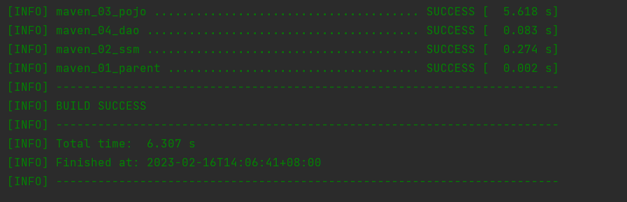
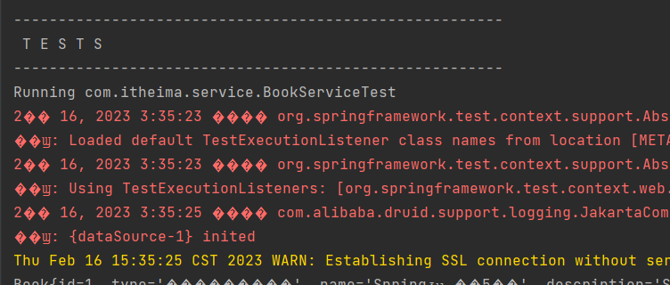
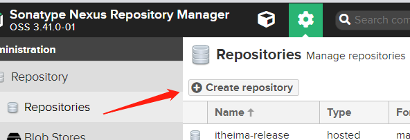

# Maven

[TOC]

# 一、Maven基础部分

## 1、Maven简介

### 1.1 传统项目管理状态分析

jar包不统一，jar包不兼容。工程升级维护过程操作繁琐

Maven的本质是一个项目管理工具，将项目开发和管理过程抽象成一个项目对象模型（POM 项目对象模型）


### 1.2 Maven的作用

项目构建：提供标准的、跨平台的自动化项目构建方式

依赖管理：方便快捷的管理项目以来的资源（jar包），避免资源间的版本冲突问题

统一开发结构：提供标准的、统一的项目结构


## 2、下载与安装

绿色软件，直接下载解压就行

### 2.1 环境配置

配置MAVEN_HOME,在系统变量中新建变量，然后添加


配置path


在cmd中运行，会提示报错


因为我们没有配置JAVA_HOME，直接使用的IDEA，所以还要配置一下，教程如下

[](https://www.jianshu.com/p/5cc991b7340c)

然后，**关闭cmd，重新打开，再次输入mvn**


## 3、Maven基础概念

### 3.1 仓库

用于存储资源，包含各种jar包


**仓库分类**

本地仓库和远程仓库，其中远程的仓库又分为中央仓库和私服

### 3.2 坐标

**3.2.1 什么是坐标**

Maven中的坐标用于描述仓库中资源的位置

**3.2.2 Maven坐标主要组成**

groupId（组织ID）：定义当前Maven项目隶属组织名称，通常是域名反写（org.mybatis）

artifactId（项目ID）：定义当前Maven项目名称（通常是模块名称，例如CRM、SMS）

version（版本号）：定义当前版本号。

[](https://mvnrepository.com/)

### 3.3 仓库的配置

如何更改仓库的路径


在setting.xml中进行修改


改成需要的保存的路径即可

### 3.4 镜像仓库的配置

在setting文件中配置阿里云镜像仓库，**注意这里是把所有的都替换掉**

```xml
1 <mirrors>
2      <mirror>
3         <id>nexus-aliyun</id>
4         <mirrorOf>*</mirrorOf>
5         <name>Nexus aliyun</name>
6         <url>http://maven.aliyun.com/nexus/content/groups/public</url>
7      </mirror> 
8 </mirrors>
```

### 3.5 全局setting与用户setting区别

全局setting定义了当前计算器中Maven的公共配置

用户setting定义了当前用户的配置

## 4、第一个Maven项目（手动制作）

### 4.1 Maven工程目录结构


### 4.2 构建命令

首先需要进入到POM文件的路径当中

```xml
mvn compile #编译
mvn clean #清理
mvn test #测试
mvn package #打包
mvn install #安装到本地仓库
```

**4.2.1 mvn compile**

编译后生成的文件如下


**遇到的问题**

1）mvn compile不再支持源选项 5。请使用 7 或更高版本。

[Maven问题：【不支持源选项5。请使用7或更高版本。】问题解决方案_夏志121的博客-CSDN博客](https://blog.csdn.net/m0_61961937/article/details/125461732?utm_medium=distribute.pc_relevant.none-task-blog-2~default~baidujs_title~default-0-125461732-blog-111478439.pc_relevant_multi_platform_whitelistv1&spm=1001.2101.3001.4242.1&utm_relevant_index=3)

**4.2.2 mvn clean**

将编译后的target文件进行清理。

**4.2.3 mvn test**


**4.2.4 mvn package**


**4.2.5 mvn install**

安装后的文件是安装到你的maven仓库中，按照com itheima project 1.0分层，最终在1.0下才是你的jar包


### 4.3 插件创建工程

这个也不常用


## 5、第一个Maven项目（IDEA生成）

### 5.1 快速创建java项目

**5.1.1 新建项目**


**5.1.2 更改项目结构**


如果想快速添加其他项目，并且与上一个项目同级，记得删掉这个部分


快速创建java项目


### 5.2 快速创建javaweb项目


### 5.3 Tomcat

如何添加Tomcat插件

到maven仓库搜索


选择一个版本


将其中的内容复制下来


如果说找不到，那么刷新一下maven就好了


学习到这里，综合来看一下，pom文件的组成都有哪些

```xml
<?xml version="1.0" encoding="UTF-8"?>

<project xmlns="http://maven.apache.org/POM/4.0.0" xmlns:xsi="http://www.w3.org/2001/XMLSchema-instance"
  xsi:schemaLocation="http://maven.apache.org/POM/4.0.0 http://maven.apache.org/xsd/maven-4.0.0.xsd">
  <!-- 指定pom的模型版本-->
  <modelVersion>4.0.0</modelVersion>
  <!-- 组织id-->
  <groupId>com.itheima</groupId>
    <!-- 项目id-->
  <artifactId>web02</artifactId>
    <!-- 版本号 RELEASE表示发行版 SNAPSHOT表示开发版-->
  <version>1.0-SNAPSHOT</version>
  <!-- 打包方式，web工程打包为war java工程 打包为jar-->
  <packaging>war</packaging>

  <name>web02 Maven Webapp</name>
  <!-- FIXME change it to the project's website -->
  <url>http://www.example.com</url>

  <properties>
    <project.build.sourceEncoding>UTF-8</project.build.sourceEncoding>
    <maven.compiler.source>1.7</maven.compiler.source>
    <maven.compiler.target>1.7</maven.compiler.target>
  </properties>

    <!-- 设置当前工程的所有依赖-->
  <dependencies>
      <!-- 具体的依赖-->
    <dependency>
      <groupId>junit</groupId>
      <artifactId>junit</artifactId>
      <version>4.11</version>
      <scope>test</scope>
    </dependency>
  </dependencies>

    <!-- 构建-->
  <build>
      <!-- 设置插件-->
    <plugins>
        <!-- 具体的插件-->
      <plugin>
        <groupId>org.apache.tomcat.maven</groupId>
        <artifactId>tomcat7-maven-plugin</artifactId>
        <version>2.2</version>
        <configuration>
          <port>80</port>
          <path>/</path>
        </configuration>
      </plugin>
    </plugins>
  </build>
</project>
```

## 6、依赖管理

### 6.1 配置依赖

```xml
<dependencies>
    <dependency>
      <groupId>log4j</groupId>
      <artifactId>log4j</artifactId>
      <version>1.2.12</version>
    </dependency>
</dependencies>
```

### 6.1 依赖传递（重要）

加入我们想要在项目2中使用项目3


依赖传递冲突问题


### 6.3 可选依赖（控制别人是否看到）

我们如果不想让别人使用该项目的某个依赖，那么可以加个optional

```
<dependencies>
  <dependency>
    <groupId>log4j</groupId>
    <artifactId>log4j</artifactId>
    <version>1.2.12</version>
    <optional>true</optional>
  </dependency>
</dependencies>
```


### 6.4 排除依赖（主动断开）

如果我不想使用某些依赖，那么直接在项目中写明排除哪些依赖，不需要写版本号

```xml
<dependencies>
    <dependency>
      <groupId>org.example</groupId>
      <artifactId>MavenProject03</artifactId>
      <version>1.0-SNAPSHOT</version>
      <exclusions>
        <exclusion>
          <groupId>log4j</groupId>
          <artifactId>log4j</artifactId>
        </exclusion>
      </exclusions>
    </dependency>
  </dependencies>
```

排除前


排除后


### 6.5 依赖范围

依赖的jar默认情况可以在任何地方使用，可以通过scope标签设定其作用范围

**6.5.1 作用范围**

主程序范围有效（main文件夹范围内）

测试程序范围有效（test文件夹范围内）

是否参与打包（package指令范围内）


注意第三个是千万不能打包进去。

**6.5.2 依赖范围传递性**


## 7、生命周期与插件

### 7.1 三个生命周期

clean：清理工作

pre-clean

clean

post-clean

default：核心工作：编译测试打包部署。执行到哪，就把前面的全部执行完。


site：产生报告，发布站点

# 二、Maven提高部分

## 2.1 分模块开发与设计

将原始模块按照功能拆分成若干个子模块，方便模块之间的互相调用，接口共享


注意，分模块开发中，如果要用到别人的包，需要先把别人的包install到本地，然后再引用依赖才行。

#### 小案例：将domain单独抽出一个模块

第一步：

把原始项目中的domain模块拿下来，放入到新建的模块中。


第二步：

由于我们把原始模块的东西抽出来了，那么如果想用，就必须在原始模块中引入新模块的坐标


导入后的结果


第三步：

虽然已经导入了坐标，但是还是没法运行，因为我们没有将打包的maven_03_pojo放入到02中。

目前使用的这些spring的坐标实际上是在你的本地仓库中


然而你并没有将maven_03_pojo放入到本地的仓库，所以在02中是找不到的。


这里打包的方式不要war包，会报错。

现在我们的本地仓库中有对应的03模块了


那么我们重新启动项目，可以正常访问

## 2.2 依赖管理

### 2.2.1 依赖传递


红色的是直接依赖，绿色是间接依赖，当然只是针对于紫色来说。**只要是所有依赖中有的就可以通用**。

### 2.2.2 依赖冲突

但是容易造成一个问题就是，同一个比如MyBatis，使用了不同的版本，就有可能造成依赖冲突

- 同级配置了相同的资源，但是版本不同，那么后配置的会覆盖先配置的
- 依赖中出现相同资源，层级越深，优先级越低。层级越浅，优先级越高。黄色的优于蓝色的
  - 
- 声明优先：当资源在相同层级被依赖时，配置顺序靠前的覆盖配置顺序靠后的。

### 2.2.3 可选依赖

可选依赖简单来说，是我们自己配置的pom文件，然后做一些配置，不想让别人看到的


### 2.2.4 排除依赖

排除依赖中pom是别人配置的，我不想用某些资源，就主动的断开（排除掉）

使用exclusion隐藏当前资源中我不想用的一些依赖，**不需要指定版本**


## 2.3 聚合与继承

### 2.3.1 聚合

#### 1）聚合概述

如果pojo模块进行更新，那么很可能依赖他的其他模块可能不能继续使用。


聚合：将多个模块组织成一个整体，同时进行项目构建的过程称为聚合。


左边红框这个称为聚合工程，通常是一个不具有业务功能的空工程（有且仅有一个pom文件），作用就是将多个功能进行编组，通过对聚合功能进行构建，实现对所包含模块进行同步构建。

####  2）使用方式

单独新建一个模块，用于当做聚合工程的模块。

**设置打包方式**

聚合工程的模块打包方式与其他的不同，使用pom的方式进行打包

**设置管理的模块名称**

```xml
<modules>
    <module>../maven_02_ssm</module>
    <module>../maven_03_pojo</module>
    <module>../maven_04_dao</module>
</modules>
```

项目构建的顺序与我们的书写顺序没关系，它是按照依赖最少的先构建。因为03中没有任何依赖所以先构建，然后04中是有03的依赖，然后ssm中有03和04的依赖，依次类推进行构建。



### 2.3.2 继承

三个问题

- 所有模块相同的依赖如何简化
- 部分模块相同的依赖如何简化
- 不同模块相同的依赖如何快速升级

#### 1）概念

继承描述的是两个工程间的关系，子工程可以继承父工程中的配置信息，常见于依赖关系的继承。

#### 2）作用

简化配置，版本管理

#### 3）使用

首先我们在01中把所有能用到的都写到01中。

然后在02中，我们可以用下面xml的进行继承

```xml
<parent>
  <groupId>com.itheima</groupId>
  <artifactId>maven_01_parent</artifactId>
  <version>1.0-SNAPSHOT</version>
  <relativePath>../maven_01_parent/pom.xml</relativePath>
</parent>
```

03和04同理

然后我们可以定义一些可选择的依赖，在子工程中不必一定继承，但是如果想用的话要自己写，但是不需要自己写版本号。

父工程中

```xml
<!-- 定义依赖管理-->
<dependencyManagement>
    <dependencies>
        <dependency>
            <groupId>junit</groupId>
            <artifactId>junit</artifactId>
            <version>4.12</version>
            <scope>test</scope>
        </dependency>
    </dependencies>
</dependencyManagement>
```

子工程中，并且版本在父工程中进行统一的管理，只要在父工程中进行版本管理就可以。


## 2.4 属性管理

### 2.4.1 配置文件的简单使用

当我们使用的依赖当中有多个相同的版本的时候，怎么实现一改全改？只需要在properties中进行属性定义，属性的名字是自己写的，使用的时候只需要${}进行引用即可。


### 2.4.2 配置文件加载属性

原来我们的resources中的配置采用的是直接写入值的方式，现在我们想在pom中对于文件属性进行书写，然后配置文件中通过${}能够获取到我们的配置。

首先我们要在属性中写入配置

```xml
<!-- 定义属性-->
<properties>
    <jdbc.url>jdbc:mysql://localhost:3306/ssm_db</jdbc.url>
</properties>
```

然后在build中设置

```xml
<build>
    <resources>
        <resource>
            <directory>${project.basedir}/src/main/resources</directory>
            <filtering>true</filtering>
        </resource>
    </resources>
</build>
```

在properties中我们就不用直接用${}获取我们pom中配置的url

```xml
jdbc.url=${jdbc.url}
```


### 2.4.3 常见的属性


## 2.5 版本管理

### 2.5.1 版本的命名规则

#### 1）工程版本

##### SNAPSHOT

快照版本，正在开发的一些版本

##### RELEASE

项目团队向外发布的比较稳定的版本

#### 2）发布版本

##### alpha版

##### beta版

##### 纯数字版

## 2.6 多环境配置与应用

### 2.6.1 多环境开发


我们使用Profiles配置多个环境

```xml
<profiles>
    <profile>
        <!-- 开发环境-->
        <id>env_dep</id>
        <properties>
            <jdbc.url>jdbc:mysql://127.0.0.1:3306/ssm_db</jdbc.url>
        </properties>
        <activation>
            <activeByDefault>true</activeByDefault>
        </activation>
    </profile>
    <profile>
        <!-- 生产环境-->
        <id>env_pro</id>
        <properties>
            <jdbc.url>jdbc:mysql://127.1.1.1:3306/ssm_db</jdbc.url>
        </properties>
    </profile>
    <profile>
        <!-- 开发环境-->
        <id>env_test</id>
        <properties>
            <jdbc.url>jdbc:mysql://127.2.2.1:3306/ssm_db</jdbc.url>
        </properties>
    </profile>
</profiles>
```

然后我们进行环境之间的切换，最常用的方式是


新版idea这里可以选择


### 2.6.2 跳过测试

下面这些就是测试的过程



#### 1）简单方式

小闪电标志，test这个就略过了


#### 2）细粒度控制跳过测试

上面小闪电是默认跳过所有的测试。

```xml
            <plugin>
                <artifactId>maven-surefire-plugin</artifactId>
                <version>2.12.4</version>
                <configuration>
                    <skipTests>false</skipTests>
<!--                    排除掉不参与测试的程序-->
                    <excludes>
                        <exclude>**/BookServiceTest.java</exclude>
                    </excludes>
                </configuration>
            </plugin>
```

注意<skipTests>false</skipTests>是需要测试，但是我们需要跳过某些东西，使用<exclude>，需要指定的测试我们用<include>


## 2.7 私服

### 2.7.1 私服简介


有一个Nexus，是一个私服产品

### 2.7.2 私服仓库分类


主要分为三种仓库


### 2.7.3 资源上传与下载

#### 1）配置本地仓库对私服的访问权限


这个就是配置对私服的访问权限，然后这个id需要我们去私服中进行配置。

新建两个仓库



#### 2）配置仓库映射

```xml
<mirror>
  <id>maven-public</id>
  <mirrorOf>*</mirrorOf>
  <url>http://localhost:8081/repository/maven-public/</url>
</mirror>
```

#### 3）当前项目发布到那个私服

```xml
<!-- 配置当前工程保存在私服中的具体位置-->
<distributionManagement>
    <repository>
        <id>itheima-release</id>
        <url>http://localhost:8081/repository/itheima-release/</url>
    </repository>
    <snapshotRepository>
        <id>itheima-snapshot</id>
        <url>http://localhost:8081/repository/itheima-snapshot/</url>
    </snapshotRepository>
</distributionManagement>
```

然后我们默认的是SNAPSHOT，因为我们在程序中写的是这个


然后如果我们写RELEASE，那么就是发布到RELEASE仓库


此外，我们可以设置远程中央仓库的位置，这样没有的资源从阿里仓库拿，会快一点。

