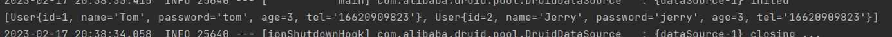
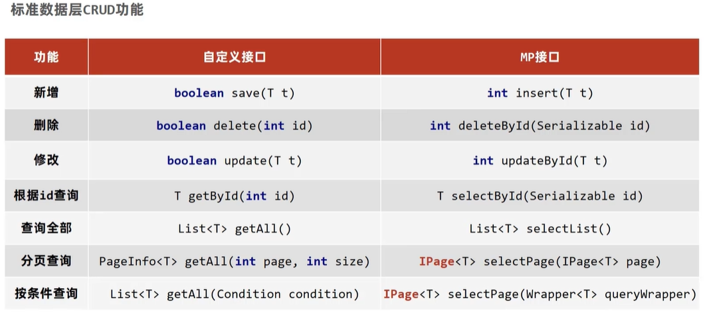
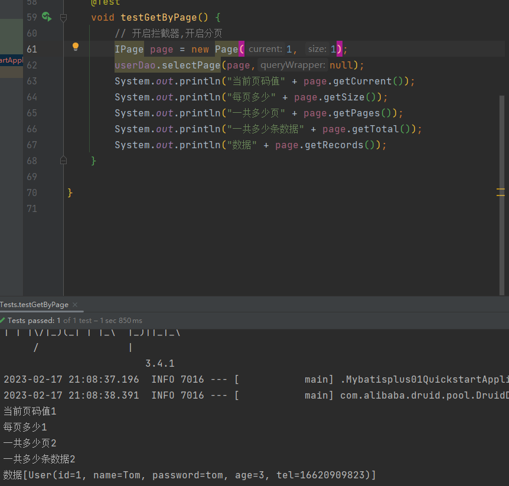
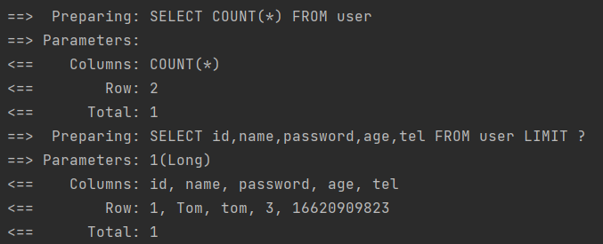
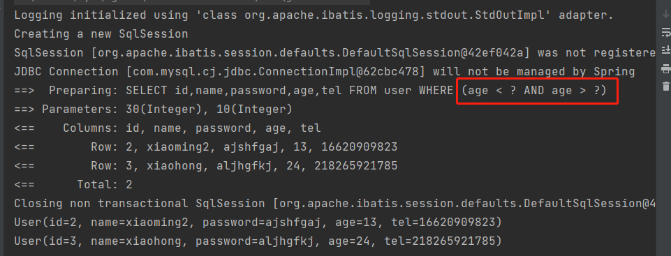
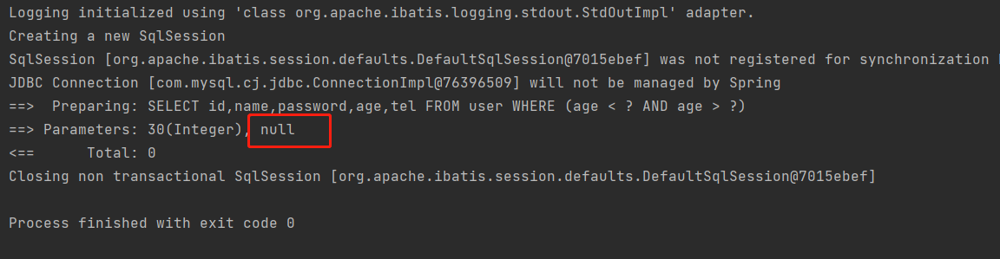
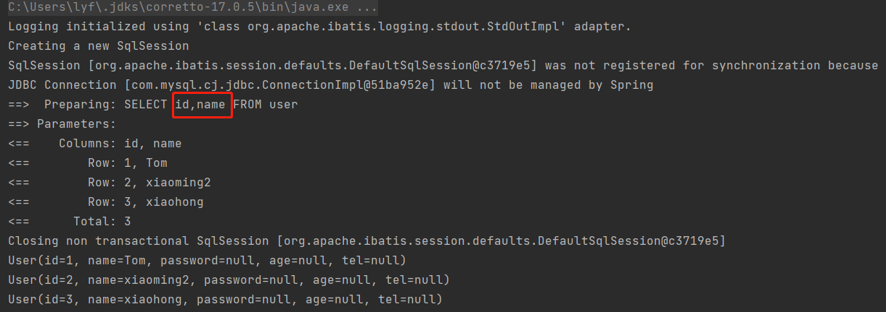
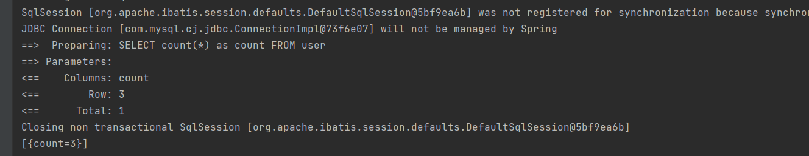
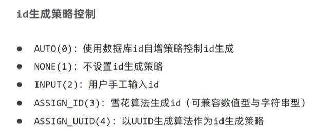
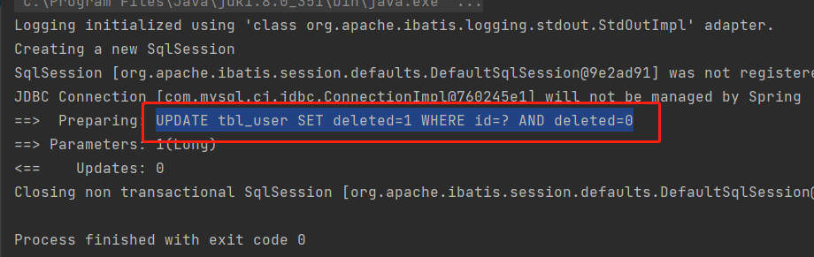

# MyBatisPlus

[TOC]

# 1、MyBatisPlus入门案例

基于MyBatis框架基础上开发的增强型工具

## 1.1 案例

创建完工程之后，再导入MyBatisPlus的坐标

```xml
<dependency>
   <groupId>com.baomidou</groupId>
   <artifactId>mybatis-plus-boot-starter</artifactId>
   <version>3.4.1</version>
</dependency>
```

然后我们都不需要写mysql，直接继承一个类，就能调用其中的sql语句

```java
package com.itheima.dao;

import com.baomidou.mybatisplus.core.mapper.BaseMapper;
import com.itheima.domain.User;
import org.apache.ibatis.annotations.Mapper;

@Mapper
public interface UserDao extends BaseMapper<User> {

}
```

然后在测试类中进行查询

```java
package com.itheima;

import com.itheima.dao.UserDao;
import com.itheima.domain.User;
import org.junit.jupiter.api.Test;
import org.springframework.beans.factory.annotation.Autowired;
import org.springframework.boot.test.context.SpringBootTest;

import java.util.List;

@SpringBootTest
class Mybatisplus01QuickstartApplicationTests {

   @Autowired
   private UserDao userDao;
   @Test
   void testGetAll() {
      List<User> users = userDao.selectList(null);
      System.out.println(users);
   }

}
```



# 2、标准数据层开发

## 2.1 标准层CRUD功能



### 2.1.1 新增操作

```java
@Test
void testInsert() {
   User user = new User();
   user.setId(3L);
   user.setAge(13);
   user.setName("xiaoming");
   user.setPassword("ajshfgaj");
   int res = userDao.insert(user);
   System.out.println(res);
}
```

### 2.1.2 删除操作

```java
@Test
void testDelete() {
   int res = userDao.deleteById(1626563824146468866L);
   System.out.println(res);
}
```

### 2.1.3 修改操作

```java
@Test
void testUpdateById() {
   User user = new User();
   user.setId(2L);
   user.setAge(13);
   user.setName("xiaoming2");
   user.setPassword("ajshfgaj");
   int res = userDao.updateById(user);
   System.out.println(res);
}
```

### 2.1.4 根据id查询

```java
@Test
void testGetById() {
   User user = userDao.selectById(2L);
   System.out.println(user);
}
```

### 2.1.5 查询全部

```java
@Test
void testGetAll() {
   List<User> users = userDao.selectList(null);
   System.out.println(users);
}
```

### 2.1.6 分页查询



我们需要手动的开启一个过滤器，用于开启分页

```java
package com.itheima.config;

import com.baomidou.mybatisplus.extension.plugins.MybatisPlusInterceptor;
import com.baomidou.mybatisplus.extension.plugins.inner.PaginationInnerInterceptor;
import org.springframework.context.annotation.Bean;
import org.springframework.context.annotation.Configuration;

@Configuration
public class MpConfig {

   @Bean
   public MybatisPlusInterceptor mybatisPlusInterceptor(){
      MybatisPlusInterceptor mybatisPlusInterceptor = new MybatisPlusInterceptor();
      mybatisPlusInterceptor.addInnerInterceptor(new PaginationInnerInterceptor());
      return mybatisPlusInterceptor;
   }
}
```

在yml中开启MyBatis的日志

```yaml
# 开启mp的日志
mybatis:
  configuration:
    log-impl: org.apache.ibatis.logging.stdout.StdOutImpl
```




## 2.2 lombok快速实体类开发

首先导入坐标

```xml
<dependency>
   <groupId>org.projectlombok</groupId>
   <artifactId>lombok</artifactId>
</dependency>
```

然后用注解代替我们的一些方法就可以了

```java
package com.itheima.domain;

import lombok.*;

@Setter
@Getter
@ToString
@NoArgsConstructor
@AllArgsConstructor
@EqualsAndHashCode

public class User {
    private Long id;
    private String name;
    private String password;
    private Integer age;
    private String tel;
}
```

或者用@Data，它包含了@Setter、@Getter、@ToString、@EqualsAndHashCode

# 3、DQL编程控制

## 3.1 条件查询方式

### 3.1.1 QueryWrapper方式

```java
@Test
void testGetAll() {
   // 设置查询条件
   QueryWrapper qw = new QueryWrapper();
   qw.lt("age",2);
   List<User> users = userDao.selectList(qw);
   System.out.println(users);
}
```

### 3.1.2 lambda方式

```java
QueryWrapper<User> qw = new QueryWrapper();
qw.lambda().lt(User::getAge,2);
List<User> users = userDao.selectList(qw);
System.out.println(users);
```

### 3.1.3 lambda接口方式

```java
LambdaQueryWrapper<User> qw = new LambdaQueryWrapper();
qw.lt(User::getAge,2);
List<User> users = userDao.selectList(qw);
System.out.println(users);
```

多条件查询

```java
LambdaQueryWrapper<User> qw = new LambdaQueryWrapper();
qw.lt(User::getAge,10);
qw.gt(User::getAge,1);
List<User> users = userDao.selectList(qw);
System.out.println(users);
```

链式编程（and关系）

```java
LambdaQueryWrapper<User> qw = new LambdaQueryWrapper();
qw.lt(User::getAge,10).gt(User::getAge,1);
List<User> users = userDao.selectList(qw);
System.out.println(users);
```

链式编程（或者关系）

```java
LambdaQueryWrapper<User> qw = new LambdaQueryWrapper();
qw.lt(User::getAge,1).or().gt(User::getAge,10);
List<User> users = userDao.selectList(qw);
System.out.println(users);
```

### 3.1.4 条件查询null值处理

```java
// 过滤空的查询条件
UserQuery uq = new UserQuery();
uq.setAge(10);
uq.setAge2(30);

// null 判定
LambdaQueryWrapper<User> lqw = new LambdaQueryWrapper<User>();
lqw.lt(User::getAge,uq.getAge2()); // 小于30
lqw.gt(User::getAge,uq.getAge()); // 大于10
List<User> users = userDao.selectList(lqw);
for (User user : users) {
   System.out.println(user);
}
```



如果age和age2都没有空的情况，查询是正常的，现在假设age为空.



没有完成查询，当然可以使用if判断一下，但是这样代码太冗余了。

```java
lqw.lt(uq.getAge2() != null,User::getAge,uq.getAge2()); // 小于30
lqw.gt(uq.getAge() != null,User::getAge,uq.getAge()); // 大于10
```

这个已经为我们进行了简化，就不用再写if判断了，只有不为空的时候，进行条件连接。


## 3.2 查询投影

只查询出某些字段

```java
LambdaQueryWrapper<User> lqw = new LambdaQueryWrapper<User>();
lqw.select(User::getId,User::getName);
List<User> users = userDao.selectList(lqw);
```



上面这种方式只适用于lambda的方式

不采用lambda的方式写法如下

```java
QueryWrapper<User> qw = new QueryWrapper<User>();
qw.select("id","name");
List<User> users2 = userDao.selectList(qw);
```

查count

```java
QueryWrapper<User> qw = new QueryWrapper<User>();
qw.select("count(*) as count");
List<Map<String, Object>> maps = userDao.selectMaps(qw);
System.out.println(maps);
```




## 3.3 查询条件设定

```java
LambdaQueryWrapper<User> lqw = new LambdaQueryWrapper<>();
// = 条件
lqw.eq(User::getName,"Tom");
User user = userDao.selectOne(lqw);

// 范围查询 lt le gt ge between
lqw.between(User::getAge,10,30);

// 模糊匹配
lqw.like(User::getName,"T"); //
lqw.likeLeft(User::getName,"om"); // %om
lqw.likeRight(User::getName,"To"); // To%
System.out.println(user);
```

## 3.4 字段映射与表名映射

如果数据库中的字段名与java代码的属性名不同怎么办？

- 使用@TableField属性关联数据库中的字段名

  - 

  - ```java
    @Data
    @TableName("tbl_user")
    public class User {
        private Long id;
        private String name;
        @TableField(value = "pwd")
        private String password;
        private Integer age;
        private String tel;
    }
    ```

如果Java代码中增加一个属性，在数据库中没有这个字段，怎么办

- 使用@TableField的值exist=false

  - 

  - ```java
    @Data
    @TableName("tbl_user")
    public class User {
        private Long id;
        private String name;
        @TableField(value = "pwd")
        private String password;
        private Integer age;
        private String tel;
        @TableField(exist = false)
        private Integer online;
    }
    ```

默认查询开放了更多字段的查看权限，例如密码不应该被查出来

- 使用@TableField的值select=false

  - ```java
    @Data
    @TableName("tbl_user")
    public class User {
        private Long id;
        private String name;
        @TableField(value = "pwd",select = false)
        private String password;
        private Integer age;
        private String tel;
        @TableField(exist = false)
        private Integer online;
    }
    ```

表名与编码开发设计不同步

- 在实体类外面挂上@TableName("xxx")

  - 

  - ```java
    @Data
    @TableName("tbl_user")
    public class User {
        private Long id;
        private String name;
        private String password;
        private Integer age;
        private String tel;
    }
    ```

# 4、DML编程控制

## 4.1 id生成策略

自增类型、特殊规则等等

使用@TableId

```java
@TableId(type = IdType.AUTO)
private Long id;
```

我们设置id每次自增10

```java
@Test
void testSave() {
   User user = new User();
   user.setName("黑马");
   user.setPassword("itheima");
   user.setAge(12);
   user.setTel("4006");
   int res = userDao.insert(user);
   System.out.println(res);
}
```

插入数据

常见的策略



在yml配置中设置id生成策略

```yaml
mybatis-plus:
  global-config:
    banner: false
    db-config:
      id-type: assign_id
```


类名前缀

```yaml
mybatis-plus:
  global-config:
    db-config:
      table-prefix: tbl_
```

## 4.2 多条数据同时删除

```java
@Test
void testDeleteMore() {
   List<Long> list = new ArrayList<>();
   list.add(2L);
   list.add(3L);
   list.add(666L);
   int delRes = userDao.deleteBatchIds(list);
   System.out.println(delRes);
}
```

同样的道理也可以同时查询多条

## 4.3 逻辑删除

日常的删除会从数据库删除，但是可能这个数据还是有用的

我们在java程序中新加一个属性，使用@TableLogic(value = "0",delval = "1"),0代表没删，1代表删了。注意sql语句是怎么写的，执行的是update



从yml文件中配置

```yaml
mybatis-plus:
  global-config:
    banner: false
    db-config:
      logic-delete-field: deleted
      logic-delete-value: 1
      logic-not-delete-value: 0
```

## 4.4 乐观锁

数据库加字段、实体类加属性、加拦截器（拦截器一般就是用来动态追加sql语句的）

# 5、快速开发

代码生成器
