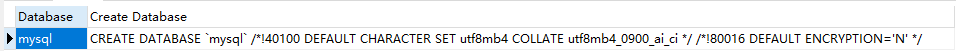

# MySQL

[TOC]


# 一、MySQL安装

[MySQL安装手把手](https://zhuanlan.zhihu.com/p/336788776)

# 二、MySQL常用指令

## 2.1 数据库的基本概念

实际上是一个文件系统，但是区别于普通的txt文件，数据库方便对数据进行管理。

## 2.2 MySQL数据库软件

### 2.2.1 安装

一般来说一直默认安装就可以

### 2.2.2 卸载

在mysql的安装目录找到my.ini文件

卸载MySQL

删除C:/ProgtamData目录下的Mysql文件夹

### 2.2.3 配置

```jsx
net start mysql 启动服务
net stop mysql 关闭服务
```

### 2.2.4 MySQL登录

```bash
mysql -uroot -proot
mysql -hip -uroot -p链接目标的密码  # 这种一般是链接远程的

mysql --host=ip --user=root --password=链接目标的密码 # 这种写法也是可以的，但是比较麻烦
```

### 2.2.5 MySQL退出

```jsx
exit
```

## 2.3 SQL语句

### 2.3.1 什么是SQL

定义了操作所有关系型数据库的规则

### 2.3.2 SQL常用的语法

① 可以单行书写也可以多行书写，但是以分号结尾

② 可以使用空格和缩进来增强语句的可读性

③ MySQL数据库SQL不区分大小写，关键字建议使用大写

④ 三种注释方式

单行注释  - - 注释内容（两个横杠**必须在注释内容前面加空格**） 或者 # mysql特有的以井号

多行注释 /* 注释 */

### 2.3.3 SQL分类

DDL（操作数据库、表）

DML（增删改表中的数据）

DQL（查询表中的数据）

DCL（授权）

## 2.4 DDL：操作数据库、表

### 2.4.1 操作数据库：CRUD

① C 创建

1）创建数据库

为了防止重复创建数据库，我们进行这样的操作，先进行判断

```sql
CREATE DATABASE if not EXISTS db1;
```

这样写，如果存在了就不会再次创建，不存在才进行创建

2）创建一个默认字符集为gbk的 数据库

```sql
CREATE DATABASE db3 CHARACTER SET gbk;
```

3）创建数据库，判断是否存在，并设置字符集为gbk

```sql
CREATE DATABASE if not EXISTS db4 CHARACTER SET gbk;
```

② R 查询

1）查询所有数据库的名称

```sql
show databases;
```

查询的结果默认有四个数据库，分别是

information_schema 实际上存放的是视图，并不对应真正的物理文件

mysql 核心数据库，存放很多核心数据库文件

performance_schema 对于性能提升作相应提升

2）查询对应数据库的字符集

```sql
show create mysql database;
```

输出的结果（可以用来查看怎么创建数据库）



③ U 修改

1）修改数据库的字符集

```sql
ALTER DATABASE db4 CHARACTER SET utf8
```

注意如果你已经设置了表，但是后改的字符集格式，原来表的字符集格式不会该，仍然维持原来的。

④ D 删除

1）删除数据库，注意也要判断一下数据库是否存在，不存在的如果进行删除操作，那么会报错

```sql
DROP DATABASE if EXISTS db1;
DROP DATABASE if EXISTS db3;
DROP DATABASE if EXISTS db4;
```

⑤ 使用数据库

1）查询当前正在使用的数据库名称

```sql
CREATE DATABASE IF NOT EXISTS db1;
USE db1;
SELECT DATABASE();

CREATE DATABASE IF NOT EXISTS db2;
SELECT DATABASE();
```

运行的结果


如果没有正在运行的数据库


2）使用数据库

```sql
USE DATABASE();
```

### 2.4.2 操作表

① C 创建

1）创建表的基本语法

```sql
create table 表名{
	列名1 数据类型1,
	列名2 数据类型2,
	...
	列名n 数据类型n
}
```

常见的数据类型

int 表示整数类型

double 小数类型 例如 score double(5,2)表示一共五位，有两位是小数

data 日期，只包含年月日

datatime 包含年月日时分秒 yyyy-MM-dd HH:mm:ss

timestamp:时间戳类型 也是精确到秒，如果不给这个字段赋值，那么就默认使用当前系统的时间

varchar 字符串类型 zhangsan是8个字符 张三是2个字符

**2）创建表（学生信息表）**

编号、姓名、年龄、分数、出生日期、添加时间

```sql

```

- [x]  这里有个问题，创建date的列总是会报错，参照下面的链接进行修改my.ini也是会出问题

[MySQL 开启/关闭 严格模式（Strict Mode）](https://www.mzh.ren/mysql-turn-on-strict-mode.html)

我傻逼了**create table ( ) 是小括号不是大括号！！！！！**

3）将表复制一份

```sql
CREATE TABLE 新表名 LIKE 被复制的表名
```

② R 查询

1）查询数据库中所有表的名称

```sql
-- 查询数据库中所有表的名称
USE mysql;
SHOW TABLES
```


2） 查询表结构

```sql
desc 表名;
```

里如果我们查看mysql数据库中db表的结构

```sql
desc db;
```

运行结果


③ U 修改

1）修改表的名称

```sql
alter table 表名 rename to 新的表名;
```

2）修改表的字符集

```sql
# 首先查看表的字符集
show create table 表名;
alter table 表名 character set utf8
```


3）添加一列

```sql
alter table 表名 add 列名 数据类型;
```

查询表结构

未修改之前


修改之后


4）修改列名称 类型

```sql
# 即改列名字，也该数据类型
alter table 表名 change 原列名 新列名 数据类型;

# 只改数据类型类型
alter table 表名 modify 列名 新数据类型; 
```

修改列名后的表


只修改数据类型


5）删除列

```sql
alter table 表名 drop 列名;
```


④ D 删除

注意做判断

```sql
drop table 表名;
drop table if exists 表名;
```

## 2.5 DML 增删改查表中的数据

### 2.5.1 添加数据

① 语法

```sql
insert into 表名(列名1，列名2，...,列名n) values (值1，值2，...，值n);
```

注意插入date类型的，不能写1998-10-13而是要写19981013

```sql
INSERT INTO stu2(s_id,s_name,s_birth) VALUES (1,'lyf',19981013)
```

### 2.5.2 删除数据

```sql
delete from 表名 [where 条件]
```

如果不加条件的话，那么删除的是所有的内容。

如果是想删除表中的内容的话，可以是用下面这条语句

这条语句能够删除表中的所有内容，并且，还能够创建跟原来表头一模一样的表，只不过内容删掉了

```sql
TRUNCATE TABLE 表名
```

### 2.5.3 修改数据

```sql
update 表名 set 列名1=值1,列名2=值2,... [where 条件];
```

 如果不加条件，那么会将表中所有的内容都修改！

## 2.6 DQL 查询表中的数据

语法比较复杂

```sql
select 字段列表
from 表名列表
where 条件列表
group by 分组字段 
having 分组之后的条件
order by 排序
limit 分页限定
```

### 2.6.1 基础查询

1）多个字段的查询

```sql
select 多个字段 from 表名
```

2）去除重复

```sql
select DISTINCT 多个字段 from student
```

3）计算列

```sql
select 字段，math，english，math+english from 表名 
```

注意如果有null该怎么处理

```sql
select 字段，math，english，math + IFNULL(english,0) from 表名 
```


4）起别名

```sql
select 字段，math，english，math + IFNULL(english,0) as score from 表名 
```


### 2.6.2 条件查询

1）where子句后跟条件

都有哪些运算符

>、<、< =、 > =  、= ****、<>（不等于）

BETWEEN AND

IN

LIKE 模糊查询

_ 单个任意字符    想要查询姓名是三个字的  ___ 三个下划线

% 任意多个字符

IS NULL

与 and &&

或 or ||

非 not |

2）运算符

### 2.6.2 DQL 查询语法

1）排序查询

```sql
order by 子句
# 可以针对不同的字段进行不同的排序方式
order by 排序字段1 排序方式1，排序字段2 排序方式2... 先使用第一排序条件
```

排序方式：ASC升序（默认）、DESC降序

2）聚合函数

将一列数据作为一个整体，进行纵向的计算

① count 计算个数

```sql
SELECT COUNT(字段) from student 
```

解决空值的方法

**第一种**

```sql
SELECT COUNT(IFNULL(字段名,0)) from student
```

**第二种**

直接避免使用带有空值的列。

② max：计算最大值

③ min：计算最小值

④ sum：计算和

⑤ avg：计算平均值

注意：聚合函数会排除null值

3）分组查询

```sql
group by 分组的字段
```

注意：分组之后查询的字段：分组字段、聚合函数

例如可以这样写

```sql
SELECT **分组字段**，聚合函数 FROM 表 where math > 值 group by **分组字段** 
```

现在我想实现一个需求，就是我在分完组之后，每个组的人的数量要大于某个值，那么这是我们需要用到having


此时，因为男同学一共就两个人，所以，这个时候就只会显示女同学。


**注意：where不能跟聚合函数，having可以跟聚合函数**

4）分页查询

```sql
select * from limit 开始的索引,每页查询的条数
```

注意一个公式，

**开始的索引 = （当前的页码 - 1） * 每页显示的条数**

不同SQL的分页方式可能不同。

## 2.7 约束

对表中的数据进行限定，保证数据的正确性、有效性和完整性。

### 2.7.1 分类

1）主键约束：primary key

非空且唯一

一张表只能有一个字段为主键

主键就是表中记录的唯一标识

① 创建表的时候，添加主键

```sql
CREATE TABLE stu4(

	id INT PRIMARY KEY,
	name VARCHAR(20) NOT NULL, -- name 非空
	phone_num VARCHAR(20) UNIQUE
);
```

② 删除主键的方式

```sql
ALTER TABLE stu4 DROP PRIMARY KEY;
```

③ 表创建完之后，添加主键

```sql
ALTER TABLE stu4 modify id int primary key
```

④ 自动增长

如果某一列是数值型的，使用auto_increment 可以完成值的自动增长

在创建表时进行主键的自增长。

```sql
CREATE TABLE stu4(

	id INT PRIMARY KEY auto_increment,
	name VARCHAR(20) NOT NULL, -- name 非空
	phone_num VARCHAR(20) UNIQUE
);
```

注意，如果指定了值为10，即使当前自增长到5，那么下一个是11，而不是6，因为自动增长是从上一个开始的增长。

删除自动增长

```sql
ALTER TABLE stu4 modify id int id INT PRIMARY KEY,
```

添加自动增长

```sql
ALTER TABLE stu4 modify id int id INT PRIMARY KEY auto_increment,
```

2）非空约束：not null

① 创建表时添加约束

```sql
CREATE TABLE stu(

	id INT,
	name VARCHAR(20) NOT NULL -- name 非空
);
```

② 删除约束

```sql
ALTER TABLE stu MODIFY name VARCHAR(20)
```

③ 创建表完成之后，添加非空约束

```sql
ALTER TABLE stu MODIFY name VARCHAR(20) NOT NULL
```

3）唯一约束：unique

某一列的值不能重复，允许**NULL存在，但是只允许一行**

① 创建表时添加唯一约束

```sql
CREATE TABLE stu3(

	id INT,
	name VARCHAR(20) NOT NULL, -- name 非空
	phone_num VARCHAR(20) UNIQUE
);
```

② 删除约束（比较特殊）

```sql
ALTER TABLE stu3 DROP INDEX phone_num
```

③ 创建表完成之后，添加唯一约束（要保证数据是没有重复的，否则添加不上约束）

```sql
ALTER TABLE stu MODIFY phone_num VARCHAR(20) UNIQUE
```

4）外键约束：foreign key

① 在创建表时，可以添加外键

```sql
create table 表名(
	...
	外键列
	constraint 外键名称 foreign key (外键列名称) references 主表名称(主表列名称)
);
```

一个创建的例子

```sql
CREATE TABLE department(
	id INT PRIMARY key AUTO_INCREMENT,
	dep_name VARCHAR(20),
	dep_locationion VARCHAR(20)
);

CREATE TABLE employee(
	id INT PRIMARY key AUTO_INCREMENT,
	name VARCHAR(20),
	age INT,
	dep_id INT,
	CONSTRAINT emp_dept_fk FOREIGN KEY (dep_id) REFERENCES department(id) -- 外键对应主表的主键
);
```

② 删除外键

```sql
ALTER TABLE employee DROP FOREIGN KEY emp_dept_fk -- 这个是外键的名称，是随便起的
```

③ 创建表后，再添加外键

```sql
ALTER TABLE employee ADD CONSTRAINT emp_dept_fk FOREIGN KEY (dep_id) REFERENCES department(id)
```

④ 级联操作

级联操作能够简化带有外键约束的表之间的外键的值的操作！

需要在外键添加的时候设置级联更新。

级联更新操作：当我们更改外键约束的时候，能够自动更新两张表的外键约束值，保持统一

```sql
CONSTRAINT emp_dept_fk FOREIGN KEY (dep_id) REFERENCES department(id) 
**ON UPDATE CASCADE**
```

级联删除：当我们删除外键约束的时候。能够自动在另一张表中删除外键约束的值。

```sql
CONSTRAINT emp_dept_fk FOREIGN KEY (dep_id) REFERENCES department(id) 
**ON UPDATE CASCADE
ON DELETE CASCADE**
```

## 2.8 数据库的设计

### 2.8.1 多表之间的关系

1）一对一关系

身份证和人是一对一

2）一对多

部门和员工

3）多对一

员工和部分

4）多对多

**学生和课程**

### 2.8.2 实现关系

**一对多**：在多的一方建立外键，指向一的一方的主键。


**多对多**：借助于中间表


中间表是两个外键，分别指向学生表和课程表的主键

**一对一关系**：在任意一方添加外键，指向另一个的主键

**小案例：**


## 2.9 范式

### 2.9.1 第一范式 1NF

每一列都是不可分割的原子数据项


中间的系不符合第一范式的要求，需要拆分。

拆分后的表就符合第一范式了。


但是存在数据的冗余。并且，如果我新添加一个开设的系或者某个学生毕业了，那么就会出现下面这个问题。删除的时候会把系和系主任一起删除！


### 2.9.2 第二范式 2NF （消除部分依赖）

在1NF的基础上，非码属性必须完全依赖于候选码（在1NF基础上消除非主属性对主码的部分函数依赖）

函数依赖：A-》B 如果通过A的属性（属性组）的值，可以确定唯一B属性的值，则称B依赖于A

例如，**学号—》姓名** 我们可以通过学号唯一的确定这个学生的姓名 

完全函数依赖：

例如，**学号，课程名称**—》分数

部分函数依赖：

例如，学号，课程名称—》姓名   实际上只有学号就能够确定姓名了，那么这个课程名称是多余的。

传递函数依赖

A—>B ,  B—>C

学号——>系名   系名——》系主任

码：在一张表中，一个属性或者属性组，被其他所有属性完全依赖，则称这个属性为该表的码

比如这个表中，学号和课程名称就能确定所有的其他列，那么这个属性组就是该表的码

主属性：码属性组中的所有属性，这里就是**学号**和**课程名称**。

非主属性：除了码属性组的其他属性，这里就是**系名，系主任，姓名，分数**

那么再看第二范式，就是要消除部分依赖！


其中，分数完全依赖于学号和课程名称

并且，姓名，系名，系主任，完全依赖于学号。

但是有两个问题还是没解决。

### 2.9.3 第三范式 3NF

在2NF的基础上，任何非主属性不依赖于其他非主属性（在2NF的基础上消除传递依赖）

学生表中，学号 系名 系主任 这三个存在传递依赖！


剩下的两个问题都解决了


## 2.10 数据库的备份和还原

### 2.10.1 命令行的方式

```sql
# 备份
mysqldump -u用户名 -p密码 数据库名字 > 保存的路径

# 还原
登录数据库
创建数据库
使用数据库
执行文件。source 文件路径
```

### 2.10.2 图形化工具

## 2.11 多表查询

### 2.11.1 多表查询的分类

1）内连接查询

隐式内连接：使用where条件消除无用信息

```sql
SELECT * FROM emp,dept WHERE emp.dept_id = dept.id
```

上面的语句查询的结果


如果我们要把其中的某些字段查出来，例如，我们想查询ename,dname

比较正规的写法

```sql
SELECT 
	t1.ename, -- 员工名字
	t2.dname -- 部门名字
FROM 
	emp t1, -- 
	dept t2
WHERE 
	emp.dept_id = dept.id;
```

这种写法更方便我们进行注释的书写！

显式内连接：

```sql
select 字段列表 from 表名1 inner join 表名2 on 条件
```

内连接查询需要注意的事项

① 从哪些表中查询数据

② 查询条件是什么

③ 查询哪些字段

2）外连接查询

**左外连接：**

```sql
select 字段列表 from 表1 left [outer] join 表2 on 条件
```

查询的是左表所有数据以及其交集内容

**右外连接：**

```sql
select 字段列表 from 表1 right [outer] join 表2 on 条件
```

3）子查询

在一个select 中嵌套另一个select

例如我们想要查询最高工资的员工信息

```sql
SELECT * FROM emp WHERE salary = (SELECT MAX(salary) from emp);
```

查询结果：


  **子查询的不同情况**

① 子查询的结果是单行单列的

子查询可以作为条件，使用运算符去判断

就比如我们上面这个例子，查出最高的工资，作为条件。

② 子查询的结果是多行单列的

使用运算符IN 进行判断

③ 子查询的结果是多行多列的

例如查询员工的入职日期是>2001-11-11，


这时的子查询可以作为一个虚拟表。

## 2.12 事务

### 2.12.1 事务的基本介绍

1） 概念：如果一个包含多个步骤的业务操作，被事务管理，那么这些操作要么同时成功，要么同时失败。

2）操作

开启事务：start transaction

回滚: roolback

提交: commit

```sql
CREATE TABLE account(
	id INT PRIMARY KEY auto_increment,
	name VARCHAR(10),
	balance DOUBLE
);

INSERT INTO account (name,balance) VALUES ('zhangsan',1000),('lisi',1000)
```

张三给李四转账500元。

```sql
start transaction;
UPDATE account SET balance = balance - 500 WHERE name = 'zhangsan';
UPDATE account SET balance = balance + 500 WHERE name = 'lisi';
-- 发现没有问题，提交事务
commit;
-- 发现有问题，回滚事务
rollback;
```

MySQL数据库中事务默认自动提交

事务提交的两种方式：

自动提交

mysql就是自动提交的

一条DML（增删改）语句会自动提交一次事务

手动提交

需要先开启事务，再提交。

修改事务的默认提交方式

查看默认的提交方式

```sql
SELECT @@autocommit; -- 1表示自动提交 0表示手动提交
SELECT @@autocommit = 0;
```

### 2.12.2 事务的四大特征

原子性：不可分割的最小操作单位，要么同时成功，要么同时失败

持久性：当事务提交或者回滚后，数据库会持久化的保存数据

隔离性：多个事务之间。相互独立

一致性：事务操作前后，数据总量保持不变。

### 2.12.3 事务的隔离级别（了解）

1）概念：多个事务之间是隔离的，但是如果多个事务同时操作统一数据，会出现问题。

脏读：一个事务，读取到另一个事务中没有提交的数据

不可重复度：同一事物中，两次读取的数据不一样

幻读：一个事务操作（DML）数据表中所有记录，另一个事务添加了一条数据，则另一个事务查询不到自己的修改。

2）隔离级别

## 2.13 DCL

# 三、MySQL项目经验总结

# 四、MySQL常见问题解决

## 4.1 Navicat链接1251报错

[Mysql 解决1251- Client does not support authentication protocol requested by server...的问题_慕城南风的博客-CSDN博客_1251-client does not support](https://blog.csdn.net/lovedingd/article/details/106728292)