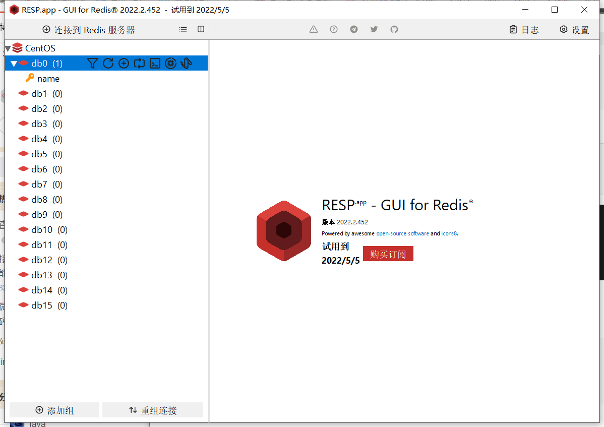

# Redis

[TOC]

# **一、Redis基础**

## **1、初识Redis**

### **1.1 认识NoSQL**


### **1.2 认识Redis**

Redis（**Re**mote **Di**ctionary **S**erver）远程词典服务，是一个基于内存的键值型NoSQL数据库。

**特征：**

键值型：value支持多种不同数据结构，功能丰富。

单线程：每个命令具备原子性，不会被打断。（Redis6.0多线程指的仅是**网络请求处理** ，核心的**命令的执行**仍然是单线程）

低延迟、速度快：**基于内存**、IO多路复用、良好的编码

支持数据持久化：定期将数据持久化到硬盘

主从集群：主从集群能够保证主集群宕机，仍然能够保证从集群能够获取到数据。

分片集群：数据的拆分，分到不同的结点

支持多语言客户端。

### **1.3 安装Redis**

在虚拟机中装一台CentOS，进行Redis安装。

#### **1.3.1 单机安装Redis**

##### **1）安装Redis依赖**

由于Redis是基于C编写的，所以我们需要先安装gcc依赖。

```bash
yum install -y gcc tcl
```

##### **2）上传安装包并解压**

解压安装包

```bash
tar -zxvf redis-6.2.6.tar.gz
```

进入redis-6.2.6

```bash
cd redis-6.2.6
```

安装，默认的安装目录是 /usr/local/bin

```bash
make && make install
```

进入到安装目录，显示如下列表表示安装成功


redis-cli 是redis提供的命令行客户端

redis-server是redis的服务端启动脚本

redis-sentinel是redis的哨兵启动脚本

##### **3）启动**

```bash
redis-server
```

然后就能够启动redis服务端，并且属于前台监听的方式。

那么如何后台启动呢？需要**指定配置启动**

先将redis.conf文件进行备份

```bash
cp redis.conf redis.conf.back
```

然后修改redis.conf的一些配置，一些常见的配置如下,如果不好找的话，可以使用查找的方式，例如

```
/要查找的名字
```

```bash
# 监听的地址，默认是127.0.0.1,会导致只能在本地访问，我们将其修改为0.0.0.0，则可以在任意IP访问，生产环境不要使用0.0.0.0
bind 0.0.0.0
# 守护进行，修改为yes即可在后台运行
daemonize yes
# 密码，设置后访问Redis必须输入密码
requirepass 123
```

另一些配置，可以选择性设置

```bash
# 监听的端口
port 6379
# 工作目录，默认是当前目录，也就是运行redis-server时的命令、日志、持久化文件都会保存在这个目录中    . 表示当前目录
dir .
# 数据库的数量，设置为1，代表只使用1和库，默认有16个库，编号为0-15
database 1
# 设置redis能够使用的最大内存
maxmemory 512mb
# 日志文件，默认为空，不记录日志，可以指定日志文件名
logfile "redis.log"
```

设置开机自启动

```bash
vi /etc/systemd/system/redis.service
```

```bash
[Unit]
Description=redis-server
After=network.target

[Service]
Type=forking
ExecStart=/usr/local/bin/redis-server /usr/local/src/redis-6.2.6/redis.conf
PrivateTmp=true

[Install]
WantedBy=multi-user.target
```

然后重载服务系统

```bash
systemctl daemon-reload
```

通过以下命令启动redis，并查看redis状态，也可以进行关闭，重启。

```bash
systemctl start redis
systemctl status redis
systemctl stop redis
systemctl restart redis
```

开机自启设置

```bash
systemctl enable redis
```

查看redis进程是否存在

```bash
ps -ef | grep redis
```

## **2、Redis常见命令**

### **2.1 Redis 基础命令及GUI**

首先来看一下如何进入到redis自带的客户端交互界面

使用命令

```bash

redis-cli [options] [commands]
# 常见的options
-h 127.0.0.1：指定需要链接的redis节点的IP地址，默认是127.0.0.1
-p 6379:指定要链接的redis节点的端口号，默认是6379
-a 123：指定redis的访问密码，注意一般不这么用
# 常用commands
ping
```

一般在进入到cli客户端再使用密码登录

```bash

AUTH 123
# 然后再使用ping，服务器会返回PONG
ping
```


也有图形化的客户端，需要自己去编译，也有现成的安装包了。

通过GUI界面链接的时候，注意要开放6379端口

```bash

# 开放端口 6379
firewall-cmd --zone=public --add-port=6379/tcp --permanent
# 重启防火墙
firewall-cmd --reload
```



可以通过一些简单的命令进行添加操作。

### **2.2 5种常见数据结构**

key一般是String，value的类型比较多。

#### 2.2.1 基本数据类型


#### 2.2.2 特殊数据类型


### **2.3 通用命令**

对于任何的数据类型都可以通用的命令，可以通过以下命令进行查看，注意要先进入redis-cli客户端

```bash

127.0.0.1:6379> help @generic
```

#### **2.3.1 KEYS**

官网使用文档 [https://redis.io/commands/keys/](https://redis.io/commands/keys/)

```
  KEYS pattern
  summary: Find all keys matching the given pattern
  since: 1.0.0
  group: generic
```

使用时这个pattern是一个模板，可以理解为匹配的规则是怎样的，比如*、？、[]等正则表达式等。逐字符匹配可以使用 \xxxx，下面是操作的例子。


实际上，模糊查询效率还是比较低的。

#### **2.3.2 DEL**

官方使用文档 [https://redis.io/commands/del/](https://redis.io/commands/del/)

```bash
  DEL key [key ...]
  summary: Delete a key
  since: 1.0.0
  group: generic
```

删除一个指定的key，也可以删除多个key


返回值代表的是成功删除的数量，所以即使你删除不存在的key，也不会产生错误。

#### **2.3.3 EXISTS**

官方使用文档 [https://redis.io/commands/exists/](https://redis.io/commands/exists/)

```bash
  EXISTS key [key ...]
  summary: Determine if a key exists
  since: 1.0.0
  group: generic
```

这个实际上就是返回存在的key的数量，如果存在那么就返回。

[https://www.notion.so](https://www.notion.so)

#### **2.3.4 EXPIRE**

官方使用文档 [https://redis.io/commands/expire/](https://redis.io/commands/expire/)

```bash
  EXPIRE key seconds
  summary: Set a key's time to live in seconds
  since: 1.0.0
  group: generic
```

为一个指定的key设置存活时间，过了这个时间就会自动删除这个key


为key2设置20s存活时间，那么20秒后就会被删除

#### **2.3.5 TTL**

官方使用文档 [https://redis.io/commands/ttl/](https://redis.io/commands/ttl/)

```
  TTL key
  summary: Get the time to live for a key
  since: 1.0.0
  group: generic
```

比如我们可以设置一个key的存活时间，然后再通过TTL查看其剩余时间。


### **2.4 不同数据结构的操作命令**

#### **2.4.1 String类型常用操作**

可以认为是最简单的存储数据类型，value根据赋值的不同可以分为不同的格式，例如string、int、float，其底层的存储都是以字符数组的形式进行存储的，当碰到整形、浮点型，会转化为相应的int、float的存储方式，节省存储空间。字符串类型的最大空间不能够超过512m。

##### **1）SET**

官方使用文档 [https://redis.io/commands/set/](https://redis.io/commands/set/)

```bash
  GET key
  summary: Get the value of a key
  since: 1.0.0
  group: string
```

添加或者修改已经存在的一个String类型的键值对


##### **2）GET**

官方使用文档 [https://redis.io/commands/get/](https://redis.io/commands/get/)

根据key获取String类型的value

```bash
  SET key value [EX seconds|PX milliseconds|EXAT timestamp|PXAT milliseconds-timestamp|KEEPTTL] [NX|XX] [GET]
  summary: Set the string value of a key
  since: 1.0.0
  group: string
```

##### **3）MSET**

官方使用文档 [https://redis.io/commands/mset/](https://redis.io/commands/mset/)

```bash
  MSET key value [key value ...]
  summary: Set multiple keys to multiple values
  since: 1.0.1
  group: string
```

批量的创建键值对


##### **4）MGET**

官方使用文档 [https://redis.io/commands/mget/](https://redis.io/commands/mget/)

```bash
  MGET key [key ...]
  summary: Get the values of all the given keys
  since: 1.0.0
  group: string
```

根据键批量获取多个键对应的值


##### **5）INCR**

官方使用文档 [https://redis.io/commands/incr/](https://redis.io/commands/incr/)

```bash
  INCR key
  summary: Increment the integer value of a key by one
  since: 1.0.0
  group: string
```

将一个整型的值自增1


##### **6）INCRBY**

官方使用文档 [https://redis.io/commands/incrby/](https://redis.io/commands/incrby/)

```bash
  INCRBY key increment
  summary: Increment the integer value of a key by the given amount
  since: 1.0.0
  group: string
```

指定整型的key自增指定的步长，例如自增2


##### **7）INCRBYFLOAT**

官方使用文档 [https://redis.io/commands/incrbyfloat/](https://redis.io/commands/incrbyfloat/)

```bash
  INCRBYFLOAT key increment
  summary: Increment the float value of a key by the given amount
  since: 2.6.0
  group: string
```

这个操作就是把浮点型的value值，自增操作，自增的步长也可以自己指定。


##### **8）SETNX**

官方使用文档 [https://redis.io/commands/setnx/](https://redis.io/commands/setnx/)

```bash
  SETNX key value
  summary: Set the value of a key, only if the key does not exist
  since: 1.0.0
  group: string
```

注意与SET的区别，SET对于已经存在的键，是可以使用的，这时候相当于修改操作。而SETNX只能够保证键不存在的条件下进行新建的操作，并且添加的是string类型。


##### **9）SETEX**

官方使用文档 [https://redis.io/commands/setex/](https://redis.io/commands/setex/)

```bash
  SETEX key seconds value
  summary: Set the value and expiration of a key
  since: 2.0.0
  group: string
```

之前提到的EXPIRE是一个通用方法，而SETEX是针对于string类型来说的。


**注意一下参数的顺序：key、存活时间、value**

也可以使用组合的方式，下面这种写法与上面的是一样的。

```bash
SET keyEX "keyEX" ex 30
```

**补充：Key的层级格式**

Redis没有类似于表的概念，那么如何区分不同类型的key？

可以指定一个命名的结构，比如说，我们这样进行命名

```bash
项目名：业务名：类型：id
```

比如我们可以定义项目heima，其中有两种不同的数据类型

```bash
heima:user:1
heima:product:1
```

定义如下的键值对

```bash
set heima:user:1 '{"id":1,"name":"Jack","age":21}'
set heima:user:2 '{"id":2,"name":"Rose","age":18}'
set heima:product:1 '{"id":1,"name":"xiaomi","price":2999}'
set heima:product:2 '{"id":2,"name":"huawei","price":5999}'
```

这样看起来没区别，但是在图形界面中会自动形成层级结构


#### 2.4.2 Hash类型及常用操作

##### 1、Hash与String的区别

Hash类型，其value是一个无序的字典，类似于HashMap结构。

不同于String的是，String只能通过JOSN字符串的形式，定义value，所以value是一个字符串，在针对字符串中的某一个字段进行修改时，往往需要**覆盖掉整个字符串**，不能对单独一个字符串进行赋值。


Hash结构又将value的每个字段进行独立的存储，又将其分为了field和value，可以针对每个单独字段进行操作。

[https://www.notion.so](https://www.notion.so)

##### 2 Hash类型常用操作

###### 2.1 HSET key field value

官方使用文档 [https://redis.io/commands/hset/](https://redis.io/commands/hset/)

```bash
HSET key field value [field value ...]
  summary: Set the string value of a hash field
  since: 2.0.0
  group: hash
```

举例：

```bash
HSET heima:user:1 "id" "1" "name" "Jack" "age" "23"
```

最终的结果（可视化界面）：


###### 2.2 HGET key field

官方使用文档 [https://redis.io/commands/hget/](https://redis.io/commands/hget/)

通过key field获取value的值

```bash
HGET key field
  summary: Get the value of a hash field
  since: 2.0.0
  group: hash
```

举例：

```bash
HGET heima:user:1 name
```

结果：


###### 2.3 HMSET

官方使用文档 [https://redis.io/commands/hmset/](https://redis.io/commands/hmset/)

批量的添加多个hash类型key的field的值，好像HSET也可以做到

```bash
HMSET key field value [field value ...]
  summary: Set multiple hash fields to multiple values
  since: 2.0.0
  group: hash
```

举例

```bash
HMSET heima:user:2 "id" "2" "name" "rose" "age" "18"
```

可视化结果


**注意：单独使用一个heima:user:1这种的并不会生成这种层级结构，当存在两个这种就会有层级结构。**

###### 2.4 HMGET

官方使用文档 [https://redis.io/commands/hmget/](https://redis.io/commands/hmget/)

批量获取多个hash类型key的field的值

```bash
HMGET key field [field ...]
  summary: Get the values of all the given hash fields
  since: 2.0.0
  group: hash
```

举例

```bash
HMGET heima:user:1 id name age not
```

结果

最后一个是不存在的field，所以返回的是nil，表示没有查询到


###### 2.5 HGETALL

官方使用文档 [https://redis.io/commands/hgetall/](https://redis.io/commands/hgetall/)

获取一个hash类型的某个key中的所有field和value

```bash
HGETALL key
  summary: Get all the fields and values in a hash
  since: 2.0.0
  group: hash
```

举例

```bash
HGETALL heima:user:2
```

结果


###### 2.6 HKEYS

官方使用文档 [https://redis.io/commands/hkeys/](https://redis.io/commands/hkeys/)

获取一个key中的所有field

```bash
HKEYS key
  summary: Get all the fields in a hash
  since: 2.0.0
  group: hash
```

举例

```bash
HKEYS heima:user:1
```

结果


###### 2.7 HVALS

官方使用文档 [https://redis.io/commands/hvals/](https://redis.io/commands/hvals/)

获取一个hash类型的key中的所有value

```bash
HVALS key
  summary: Get all the values in a hash
  since: 2.0.0
  group: hash
```

举例

```bash
HVALS heima:user:2
```

结果


###### 2.8 HINCRBY

官方使用文档 [https://redis.io/commands/hincrby/](https://redis.io/commands/hincrby/)

让一个hash类型key的字段值自增并指定步长，如果key不存在会创建，如果field不存在会设置为0

```bash
HINCRBY key field increment
  summary: Increment the integer value of a hash field by the given number
  since: 2.0.0
  group: hash
```

举例

为一个不存在的key，设置其不存在的filed，将其自增19

```bash
HINCRBY heima:user:3 age 19
```

结果


###### 2.9 HSETNX

官方使用文档 [https://redis.io/commands/hsetnx/](https://redis.io/commands/hsetnx/)

添加一个hash类型的key的field值，前提是这个field不存在，否则不会执行

```bash
HSETNX key field value
  summary: Set the value of a hash field, only if the field does not exist
  since: 2.0.0
  group: hash
```

举例

在heima:user:3中分别添加age、name、id，其中age会报错，因为已经存在

```bash
HSETNX heima:user:3 age 23
HSETNX heima:user:3 name "rose"
HSETNX heima:user:3 id 3
```

结果，可以看到第一个未生效。


可视化中可以看到age的value未改变


#### 2.4.3 List类型及常用操作

##### 1 List类型介绍

Redis的List类型与java中的LinkedList类似，可以看做是一个双向链表结构，支持正向检索，也支持反向检索。

特征：

- 有序
- 元素可以重复
- 插入和删除快
- 查询速度一般

##### 2  常见命令

###### 2.1 LPUSH key element

官方使用手册 [https://redis.io/commands/lpush/](https://redis.io/commands/lpush/)

向列表左侧插入一个或多个元素 

```bash
LPUSH key element [element ...]
  summary: Prepend one or multiple elements to a list
  since: 1.0.0
  group: list
```

举例：

我们插入多个元素

```bash
LPUSH list a b c d
```

结果：


###### 2.2  LPOP key

官方使用文档 [https://redis.io/commands/lpop/](https://redis.io/commands/lpop/)

移除并返回列表左侧的第一个元素，没有则返回nil

```bash
LPOP key [count]
  summary: Remove and get the first elements in a list
  since: 1.0.0
  group: list
```

举例：我们先返回一个，然后还可以指定count，即一次返回多个

```bash
LPOP list # 默认返回一个
LPOP list 2 # 如果有，返回两个
```

结果：


**注意：仅剩一个元素，但是要求返回两个时，只会将剩的一个输出，并没有nil，只有列表为空时取值，才会返回nil**

###### 2.3 RPUSH key element

官方使用文档  [https://redis.io/commands/rpush/](https://redis.io/commands/rpush/)

与LPUSH类似，不做过多说明

###### 2.4 RPOP key

官方使用文档  [https://redis.io/commands/rpush/](https://redis.io/commands/rpush/)

与LPOP类似，不做过多说明

###### 2.5 LRANGE key start end

官方使用文档 [https://redis.io/commands/lrange/](https://redis.io/commands/lrange/)

返回一个范围内的所有内容

举例：例如我们先创建一个list1，并插入一些元素 1 2 3 4 5

```bash
LPUSH list1 1 2 3 4 5
# 偏移量为正数
LRANGE list1 0 4
# 偏移量为负数
LRANGE list -5 -1
```

结果：

**正偏移量：下标从0开始，注意即使超了最大偏移量，也不会报错**


**负偏移量：最后一个元素的下标是-1，所以如果有5个元素，左边第一个元素的下标是-5**


并且注意一下没有RRANGE

###### 2.6 BLPOP和BRPOP

官方使用文档  [https://redis.io/commands/blpop/](https://redis.io/commands/blpop/) [https://redis.io/commands/brpop/](https://redis.io/commands/blpop/)

在列表中没有元素时，进行等待

**客户端2：因为list中没有元素，所以会卡住**


**客户端1：当我们在另一个客户端添加元素时，客户端2就会输出**


#### 2.4.4 Set类型及常用操作

##### 1 Set类型

Redis的Set结构类似于HashSet，可以看做是一个value为null的HashMap，因为是一个hash表，因此具备与HashSet类似的特征。

- 无序
- 元素不可重复
- 查找快
- 支持交集、并集、差集等功能

##### 2 Set常用操作

###### 2.1 SADD key member

官方使用文档 [https://redis.io/commands/sadd/](https://redis.io/commands/sadd/)

向set中添加一个或多个元素，如果重复将会被忽略

```bash
SADD key member [member ...]
  summary: Add one or more members to a set
  since: 1.0.0
  group: set
```

举例：向myset中插入 hello world world

```bash
SADD myset "hello" "world" "world"
```

结果：最后一个不会被插入


###### 2.2 SREM key member

官方使用文档 [https://redis.io/commands/srem/](https://redis.io/commands/srem/)

移除set中的指定元素，如果删除的元素不存在则操作被忽略

```bash
SREM key member [member ...]
  summary: Remove one or more members from a set
  since: 1.0.0
  group: set
```

举例：删除world元素

```bash
SREM myset world
```

###### 2.3 SCARD key

官方使用文档 [https://redis.io/commands/scard/](https://redis.io/commands/scard/)

返回set中元素的个数

```bash
SCARD key
  summary: Get the number of members in a set
  since: 1.0.0
  group: set
```

举例：

```bash
SCARD myset
```

结果：


###### 2.4 SISMEMBER key member

官方使用文档 [https://redis.io/commands/sismember/](https://redis.io/commands/sismember/)

判断一个元素是否存在于set中，返回1表示存在，0表示不存在

```bash
SISMEMBER key member
  summary: Determine if a given value is a member of a set
  since: 1.0.0
  group: set
```

举例：我们分别查看hello和world

```bash
SISMEMBER myset hello
SISMEMBER myset world
```

结果：由于之前吧world删掉了，所以结果如下


###### 2.5 SMEMBERS

官方使用文档 [https://redis.io/commands/smembers/](https://redis.io/commands/smembers/)

获取set中的所有元素

```bash
SMEMBERS key
  summary: Get all the members in a set
  since: 1.0.0
  group: set
```

举例

```bash
SMEMBERS myset
```

结果


###### 2.6 SINTER key1 key2 ...

官方使用文档 [https://redis.io/commands/sinter/](https://redis.io/commands/sinter/)

求set集合之间的交集

```bash
SINTER key [key ...]
  summary: Intersect multiple sets
  since: 1.0.0
  group: set
```

举例：我们新建一个set1和set2，其中set1的集合是a b c，set2的集合是 b c d。

```bash
SINTER set1 set2
```

结果：


###### 2.7 SDIFF key1 key2 ...

官方使用文档 [https://redis.io/commands/sdiff/](https://redis.io/commands/sdiff/)

求集合之间的差集，差集就是指 set1与 set1set2交集的补集。

```bash
SDIFF key [key ...]
  summary: Subtract multiple sets
  since: 1.0.0
  group: set
```

举例：我们求set1和set2的差集

```bash
SDIFF set1 set2
```

结果：


###### 2.8 SUNION key1 key2 ...

官方使用文档 [https://redis.io/commands/sunion/](https://redis.io/commands/sunion/)

求集合的并集

```bash
SUNION key [key ...]
  summary: Add multiple sets
  since: 1.0.0
  group: set
```

举例

```bash
SUNION set1 set2
```

结果


##### 3 Set小案例

Set集合的主要应用就是可以用于社交平台，比如进行共同好友的查询等操作。

将下列数据用Redis的Set集合来存储。

- 张三的好友有：李四、王五、赵六


- 李四的好友有：王五、麻子、二狗


利用Set做以下的操作

- 计算张三的好友有几人


- 计算张三和李四有哪些共同好友


- 查询哪些人是张三的好友却不是李四的好友


- 查询张三和李四的全部好友


**为啥没有赵六？**

很奇怪，后面再执行又有了


- 判断李四是否是张三的好友


- 判断张三是否是李四的好友


- 将李四从张三的好友列表中移除


#### 2.4.5 SortedSet类型及相关操作

##### 1 SortedSet

SortedSet是一个可排序的set集合，其底层是通过每一个元素带的score属性来对元素进行排序，底层的实现是一个跳表（SkipList）加hash表。

SortedSet满足以下特性

- 可排序
- 元素不重复
- 查询速度快

因为SortedSet的可排序性，经常被用来实现**排行榜**。

##### 2 SortedSet常见命令

**注意：如果想按照降序排序，只需要在Z后面加REV**

###### 2.1 ZADD key score member

添加一个或多个元素到sorted set，如果已经存在，则更新其score值

举例：

先向其中添加几个元素（**注意是一个key中，可以添加多个元素**）


ZADD有选项值，在键之后和第一个分数参数之前指定

- XX：只更新已经存在的元素。不要添加新元素

```bash
ZADD st1 XX 2 tom # 这个确实能够将tom的score值更新为2，但是返回0
ZADD st1 XX 3 qq # 不会添加新元素
```


- **NX**：只添加新元素。不要更新已经存在的元素

```bash
ZADD st1 NX 3 tom 
ZADD st1 NX 3 qq
```


- **LT**：仅当新分数低于**当前分数(指的是现有的分数，不是你输入的分数)**时才更新现有元素。此标志不会阻止添加新元素。

```bash
ZADD st1 LT 1 tom
```


- **GT**：仅当新分数大于当前分数时才更新现有元素。此标志不会阻止添加新元素。**与上面的同理**
- CH：将返回值从添加的新元素数修改为改变的元素总数。更改的元素是添加的新元素和已更新分数的元素。因此，命令行中指定的与过去得分相同的元素不计算在内。注意：通常返回值ZADD只计算添加的新元素的数量。


因为通常来说ZADD只计算添加的新元素的数量，而改变的不做提示，这就是为什么之前的返回值比较奇怪，CH就是将返回值改为了修改的返回值（包括添加）。

- INCR：指定此选项时的ZADD行为类似于ZINCRBY。在此模式下只能指定一个分数元素对。(就是增加分数)


###### 2.2 ZREM key member

删除sortedset中的一个指定元素

```bash
ZREM ST3 wan
ZREM ST3 lan
```

###### 2.3 ZSCORE key member

获取sortedset中指定元素的score值

```bash
ZSCORE st1 tom
```


###### 2.4 ZRANK key member

获取sortedset中的指定元素的排名

```bash
ZRANK st1 qq
```


排名是从0开始的。

###### 2.5 ZCARD key

获取sorted中的元素个数

```bash
ZCARD st1
```


###### 2.6 ZCOUNT key min max

统计score值在给定范围内的所有元素的个数

```bash
ZCOUNT st1 1 4
```


###### 2.7 ZINCRBY key increment member

让sortset中的指定元素自增，步长为指定的increment值

```bash
ZINCRBY st1 3 tom
```


###### 2.8 ZRANGE key min max

按照score排序后，获取指定排名范围的元素

```bash
ZRANGE st1 1 2
```


###### 2.9 ZRANGEBYSCORE key min max

按照score排序后，获取指定score范围内的元素

```bash
ZRANGEBYSCORE st1 1 2
```


###### 2.10 ZDIDD、ZINTER、ZUNION


st1中tom和st2中tom分数不一样，但交集还是有tom。所以比较的是元素，不是score。

## **3、Redis的Java客户端**

### 3.1 Jedis

#### 3.1.1 引入依赖

```xml
<!-- https://mvnrepository.com/artifact/redis.clients/jedis -->
<dependency>
    <groupId>redis.clients</groupId>
    <artifactId>jedis</artifactId>
    <version>4.3.1</version>
</dependency>
```

#### 3.1.2 建立连接

```java
	@Before
	public void setUp() throws Exception {
		// 建立连接
		jedis = new Jedis("192.168.26.128", 6379);

		// 设置密码
		jedis.auth("qwer");

		// 选择库
		jedis.select(0);

	}
```

#### 3.1.3 插入获取数据

```java
	@Test
	public void test() {
		// 测试String
		// 插入数据
		String result = jedis.set("name", "张三");
		System.out.println("result = " + result);

		// 获取数据
		String name = jedis.get("name");
		System.out.println("name = " + name);
	}
```

#### 3.1.4 释放资源

```java
@After
public void tearDown() throws Exception {
   // 释放资源
   if (jedis != null){
      jedis.close();
   }
}
```

### 3.2 Jedis连接池

Jedis本身是线程不安全的，频繁的创建和销毁连接会造成性能损耗，因此使用Jedis连接池代替之前的连接方式

#### 3.2.1 Jedis连接池配置类

```java
package com.itheima.jedis.util;

import redis.clients.jedis.Jedis;
import redis.clients.jedis.JedisPool;
import redis.clients.jedis.JedisPoolConfig;

import java.time.Duration;

public class JedisConnectionFactory {
   public static final JedisPool jedisPool;

   static {
      JedisPoolConfig jedisPoolConfig = new JedisPoolConfig();
      // 最大连接
      jedisPoolConfig.setMaxTotal(8);
      // 最大空闲连接
      jedisPoolConfig.setMaxIdle(8);
      // 最小空闲连接
      jedisPoolConfig.setMinIdle(0);

      // 设置等待时长 ms
      Duration duration = Duration.ofSeconds(2);
      jedisPoolConfig.setMaxWait(duration);

      // 创建连接池对象
      jedisPool = new JedisPool(jedisPoolConfig, "192.168.26.128", 6379, 1000, "qwer");
   }
   // 获取 jedis对象
   public static Jedis getJedis(){
      return jedisPool.getResource();
   }
}
```

### 3.2 Spring Data Redis


Jedis不支持数据序列化和反序列化

#### 3.2.1 常用API


其返回的对象就是对于各种类型的操作。

#### 3.2.2 快速入门

##### 1）引入依赖

```xml
<!--        Redis依赖-->
        <dependency>
            <groupId>org.springframework.boot</groupId>
            <artifactId>spring-boot-starter-data-redis</artifactId>
        </dependency>

<!--        连接池依赖-->
        <dependency>
            <groupId>org.apache.commons</groupId>
            <artifactId>commons-pool2</artifactId>
        </dependency>
```

##### 2）配置文件

```yaml
spring:
  redis:
    host: 192.168.26.128
    port: 6379
    password: qwer
    lettuce:
      pool:
        max-active: 8 # 最大连接
        max-idle: 8 # 最大空间连接
        min-idle: 0 # 最小空闲连接
        max-wait: 100 # 连接等待时间
```

##### 3）注入RedisTemplate

```java
@Autowired
private RedisTemplate redisTemplate;
```

最好加上泛型

```java
@Autowired
private RedisTemplate<String,String> redisTemplate;
```

##### 4）编写测试

```java
@Test
void RedisTest() {
   // 插入数据
   redisTemplate.opsForValue().set("name","李四");
   // 读取一条String类型的数据
   Object name = redisTemplate.opsForValue().get("name");
   System.out.println("name = " + name);
}
```


#### 3.2.3 配置RedisConfig进行序列化和反序列化

注意在redis数据库中，保存的是16进制，难道还加密了？


实际上是底层被ObjectOutputString序列化了。

我们需要重新定义一下RedisTemplate

```java
@Configuration
public class RedisConfig {
   @Bean
   public RedisTemplate<String, Object> redisTemplate(RedisConnectionFactory redisConnectionFactory) {
      // 创建RedisTemplate对象
      RedisTemplate<String, Object> redisTemplate = new RedisTemplate<>();
      // 设置连接工厂
      redisTemplate.setConnectionFactory(redisConnectionFactory);
      // 创建JSON序列化工具
      GenericJackson2JsonRedisSerializer jsonRedisSerializer = new GenericJackson2JsonRedisSerializer();
      // 设置Key的序列化
      redisTemplate.setKeySerializer(RedisSerializer.string());
      redisTemplate.setHashKeySerializer(RedisSerializer.string());
      // 设置Value的序列化
      redisTemplate.setValueSerializer(jsonRedisSerializer);
      redisTemplate.setHashValueSerializer(jsonRedisSerializer);
      // 返回
      return redisTemplate;
   }
}
```

上面的代码首先自己定义了RedisTemplate对象，然后将其连接到我们的工厂。之后针对key和value分别使用不同的序列化工具进行序列化，这里key使用RedisSerialize.string()序列化工具。而value使用的是json序列化工具。


尝试添加实体类到Redis中

```java
@Test
void testSaveUser() {
   // 写入数据
   redisTemplate.opsForValue().set("user:100",new User("虎哥",21));
   // 获取数据
   redisTemplate.opsForValue().get("user:100");

}
```

结果，并且是JSON风格，因为我们使用JSON对于value进行了序列化。

```java
{
  "@class": "com.itheima.redis.pojo.User",
  "name": "虎哥",
  "age": 21
}
```

#### 3.2.4 使用StringRedisTemplate完成手动序列化和反序列化

##### 1）操作实体类对象

为了节省内存，统一使用String序列化器，要求只能存储String类型的key和value，那么如果想存储对象，那么只能手工完成对象的序列化和反序列化。

Spring默认提供了StringRedisTemplate类，其key和value的序列化方法默认就是String，那么我们就不用再去配置RedisTemplate这个配置类了

ObjectMapper是一个序列化工具，也有其他的序列化工具，比如fastjson。

```java
// JSON 工具
public static final ObjectMapper mapper = new ObjectMapper();
```

```java
@Test
void testStringRedisTemplate() throws JsonProcessingException {
   // 准备对象
   User user = new User("虎哥哥",29);
   // 手动序列化
   String jsonStr = mapper.writeValueAsString(user);
   // 手写一条数据到Redis
   stringRedisTemplate.opsForValue().set("user:200",jsonStr);
   // 读取数据
   String val = stringRedisTemplate.opsForValue().get("user:200");

   // 反序列化
   User user200 = mapper.readValue(val,User.class);
   System.out.println("user200" + user200);
}
```


能够节省不少空间


##### 2）操作Hash

```java
@Test
void testHash() {
   stringRedisTemplate.opsForHash().put("user:400","name","虎哥");
   stringRedisTemplate.opsForHash().put("user:400","age","13");

   Map<Object, Object> entries = stringRedisTemplate.opsForHash().entries("user:400");
   System.out.println("entries = " + entries);
}
```


# **二、Redis实战**

## 2.1 短信登录功能

### 2.1.1 导入黑马点评项目

数据库的表，直接用hmfp.sql这个脚本文件生成。


项目的架构


前端部署在Nginx，后端部署在tomcat上，实现前后端分离。前端通过Nginx向后端请求，然后在后端查询数据并反馈给前端。

### 2.1.2 项目结构


### 2.1.3 **基于Session实现短信验证码登录**


### 2.1.4 获取验证码之后的点击登录功能


这里需要保证，既要验证码是正确的，也要保证手机号是正确的，因为你如果通过一个手机号获取了验证码，但是你改了手机号，但也能登录，说明在你点击登录按钮的时候，没有进行手机号的验证，就会出现bug。

### 2.1.5 验证登录状态


### 2.1.6 隐藏用户敏感信息


### 2.1.7 session共享

多台tomcat并不共享session存储空间，当请求切换到不同tomcat服务时导致数据丢失的问题。

使用redis的key value结构，代替session，实现存储。


## 2.2 商户查询缓存


## 2.3 优惠券秒杀


2.4 

# **三、Redis高级**

# **四、Redis原理**


