# MyBatis

[TOC]

# 1、为什么用MyBatis

## 1.1 JDBC的缺点

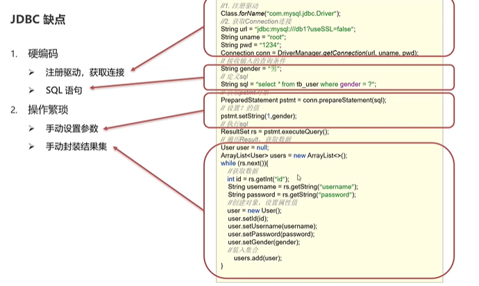

## 1.2 MyBatis简化

将硬编码写到配置文件中，将繁琐的操作也配置到配置文件中。

MyBatis免除了几乎所有的JDBC代码以及设置参数和获取结果集的工作

# 2、MyBatis快速入门

## 2.1 查询user表中所有数据

首先我们将准备的创建tb_user表的脚本写入Navicat中。

```mysql
create database mybatis;
use mybatis;

drop table if exists tb_user;

create table tb_user(
	id int primary key auto_increment,
	username varchar(20),
	password varchar(20),
	gender char(1),
	addr varchar(30)
);


INSERT INTO tb_user VALUES (1, 'zhangsan', '123', '男', '北京');
INSERT INTO tb_user VALUES (2, '李四', '234', '女', '天津');
INSERT INTO tb_user VALUES (3, '王五', '11', '男', '西安');


```

生成的表如下

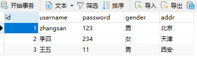


## 2.2 创建模块，导入坐标

一般需要下面这些依赖

```xml
<dependencies>
    <!--mybatis 依赖-->
    <dependency>
        <groupId>org.mybatis</groupId>
        <artifactId>mybatis</artifactId>
        <version>3.5.5</version>
    </dependency>

    <!--mysql 驱动-->
    <dependency>
        <groupId>mysql</groupId>
        <artifactId>mysql-connector-java</artifactId>
        <version>5.1.46</version>
    </dependency>

    <!--junit 单元测试-->
    <dependency>
        <groupId>junit</groupId>
        <artifactId>junit</artifactId>
        <version>4.13</version>
        <scope>test</scope>
    </dependency>


    <!-- 添加slf4j日志api -->
    <dependency>
        <groupId>org.slf4j</groupId>
        <artifactId>slf4j-api</artifactId>
        <version>1.7.20</version>
    </dependency>
    <!-- 添加logback-classic依赖 -->
    <dependency>
        <groupId>ch.qos.logback</groupId>
        <artifactId>logback-classic</artifactId>
        <version>1.2.3</version>
    </dependency>
    <!-- 添加logback-core依赖 -->
    <dependency>
        <groupId>ch.qos.logback</groupId>
        <artifactId>logback-core</artifactId>
        <version>1.2.3</version>
    </dependency>

</dependencies>
```

## 2.3 编写MyBatis核心配置文件

```xml
<?xml version="1.0" encoding="UTF-8" ?>
<!DOCTYPE configuration
        PUBLIC "-//mybatis.org//DTD Config 3.0//EN"
        "https://mybatis.org/dtd/mybatis-3-config.dtd">
<configuration>
    <properties resource="jdbc.properties"/>
    <environments default="development">
        <environment id="development">
            <transactionManager type="JDBC"/>
            <dataSource type="POOLED">
                <property name="driver" value="${jdbc.driverClassName}"/>
                <property name="url" value="${jdbc.url}"/>
                <property name="username" value="${jdbc.username}"/>
                <property name="password" value="${jdbc.password}"/>
            </dataSource>
        </environment>
    </environments>
    <mappers>
        <mapper resource="UserMapper.xml"/>
    </mappers>
</configuration>
```

通过<properties resource="jdbc.properties"/>  我们能够将数据库信息从配置文件中进行读取

## 2.4 编写SQL映射文件

```xml
<?xml version="1.0" encoding="UTF-8" ?>
<!DOCTYPE mapper
        PUBLIC "-//mybatis.org//DTD Mapper 3.0//EN"
        "https://mybatis.org/dtd/mybatis-3-mapper.dtd">
<!--
    namespace:名称空间
-->
<mapper namespace="test">
    <select id="selectAll" resultType="com.itheima.pojo.User">
        select * from tb_user;
    </select>

</mapper>
```

我们后面在用的时候，获取这一条数据库查询命令的时候，直接通过namespace.id的方式进行获取。

## 2.5 编码

### 2.5.1 定义POJO类

```java
package com.itheima.pojo;

public class User {
   private Integer id;
   private String username;
   private String password;
   private String gender;
   private String addr;

   public Integer getId() {
      return id;
   }

   public void setId(Integer id) {
      this.id = id;
   }

   public String getUsername() {
      return username;
   }

   public void setUsername(String username) {
      this.username = username;
   }

   public String getPassword() {
      return password;
   }

   public void setPassword(String password) {
      this.password = password;
   }

   public String getGender() {
      return gender;
   }

   public void setGender(String gender) {
      this.gender = gender;
   }

   public String getAddr() {
      return addr;
   }

   public void setAddr(String addr) {
      this.addr = addr;
   }

   @Override
   public String toString() {
      return "User{" +
            "id=" + id +
            ", username='" + username + '\'' +
            ", password='" + password + '\'' +
            ", gender='" + gender + '\'' +
            ", addr='" + addr + '\'' +
            '}';
   }
}
```

### 2.5.2 加载核心配置文件，获取SqlSessionFactory对象

```java
// 1、加载MyBatis的核心配置文件，获取SqlSessionFactory
String resource = "mybatis-config.xml";
InputStream inputStream = Resources.getResourceAsStream(resource);
SqlSessionFactory sqlSessionFactory = new SqlSessionFactoryBuilder().build(inputStream);
```

sqlSessionFactory是一个工厂对象，用于造SqlSession对象

### 2.5.3 获取SqlSession对象，执行SQL语句

```java
// 2、获取SqlSession对象，用于执行sql语句
SqlSession sqlSession = sqlSessionFactory.openSession();
```

```java
// 3、执行sql
List<User> users = sqlSession.selectList("test.selectAll");
```

### 2.5.4 释放资源

```java
// 4、释放资源
sqlSession.close();
```


这里遇到一个Navicat的坑

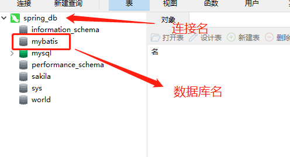

我一直把连接名当成数据库名了，所以一直报 Unknown Database的错误。

## 2.6 解决SQL映射文件的警告提示

产生的原因就是Idea与数据库没有建立连接。

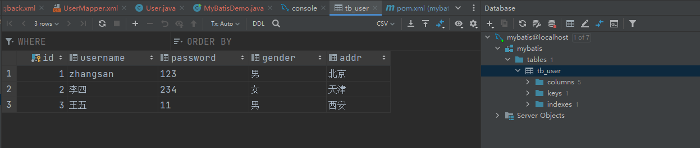


# 3、Mapper代理开发

上面的代码中，我们在执行sql的时候还是存在硬编码的问题

```java
// 3、执行sql
List<User> users = sqlSession.selectList("test.selectAll");
```

test.selectAll由于是写在mapper配置文件中，所以我们需要来回的对照去看。而Mapper代理的方式解决了硬编码的问题。其需要遵循下面的几点要求

## 3.1 第一步

定义与SQL映射文件同名的Mapper接口，并且将Mapper接口和SQL映射文件放置在同一目录下

编译完成之后的UserMapper接口的路径如下

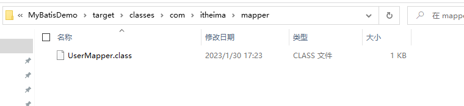

那么如何保证我们的UserMapper.xml编译完了也在这个位置呢?

我们在resources文件下创建与UserMapper相同的包接口的目录，但是注意，在resources中没有创建包的选项，只能创建directory，我们要用/分隔，而不是用.

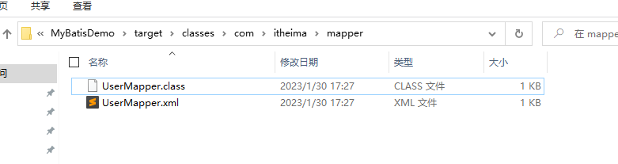

这样就能保证编译后在一个目录下了。

## 3.2 第二步

设置SQL映射文件的namespace属性为Mapper接口全限定名

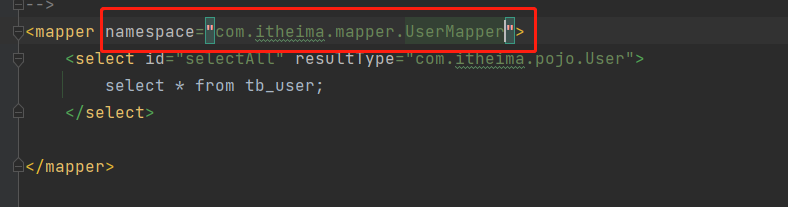

## 3.3 第三步 

在Mapper接口中定义方法，方法名就是SQL映射文件中sql语句的id，并保持参数类型和返回值类型一致


要注意，我们之前把UserMapper.xml的位置变了，所以我们要把config配置文件中的代理位置也改一下

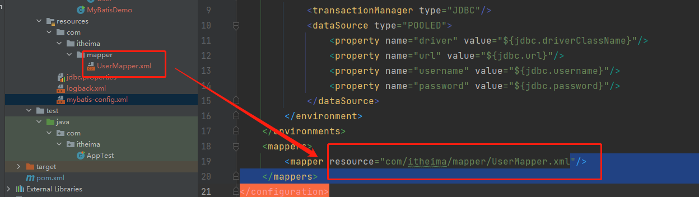


## 3.4 第四步 

编码

### 3.4.1 通过SqlSession的getMapper方法获取Mapper接口的代理对象

```java
UserMapper userMapper = sqlSession.getMapper(UserMapper.class);
```

### 3.4.2 调用对应方法完成sql的执行

```java
List<User> users = userMapper.selectAll();
```

如果com.itheima.mapper中存在很多的这种映射文件，那么我们就要写好多的mapper标签

可以采用Mapper代理的方式用包扫描

```xml
<mappers>
    <!--<mapper resource="com/itheima/mapper/UserMapper.xml"/>-->
    <package name="com.itheima.mapper"/>
</mappers>
```

# 4、MyBatis核心配置文件

```xml
<?xml version="1.0" encoding="UTF-8" ?>
<!DOCTYPE configuration
        PUBLIC "-//mybatis.org//DTD Config 3.0//EN"
        "https://mybatis.org/dtd/mybatis-3-config.dtd">
<configuration>
    <properties resource="jdbc.properties"/>
    <environments default="development">
        <environment id="development">
            <transactionManager type="JDBC"/>
            <dataSource type="POOLED">
                <property name="driver" value="${jdbc.driverClassName}"/>
                <property name="url" value="${jdbc.url}"/>
                <property name="username" value="${jdbc.username}"/>
                <property name="password" value="${jdbc.password}"/>
            </dataSource>
        </environment>
    </environments>
    <mappers>
<!--        <mapper resource="com/itheima/mapper/UserMapper.xml"/>-->
        <package name="com.itheima.mapper"/>
    </mappers>
</configuration>
```

## 4.1 environment

配置数据库连接环境信息。可以配置多个environment，通过default属性切换不同的environment

## 4.2 typeAliases

起别名

```xml
<typeAliases>
    <package name="com.itheima.pojo"/>
</typeAliases>
```

然后我们在UserMapper.xml就不需要写完整的包名了

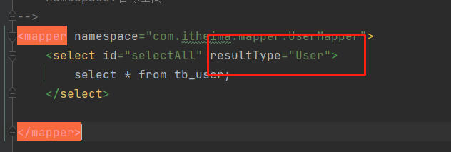

要注意，如果有properties，要保证其在最上面

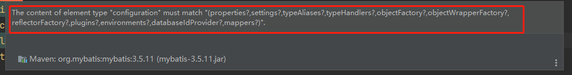

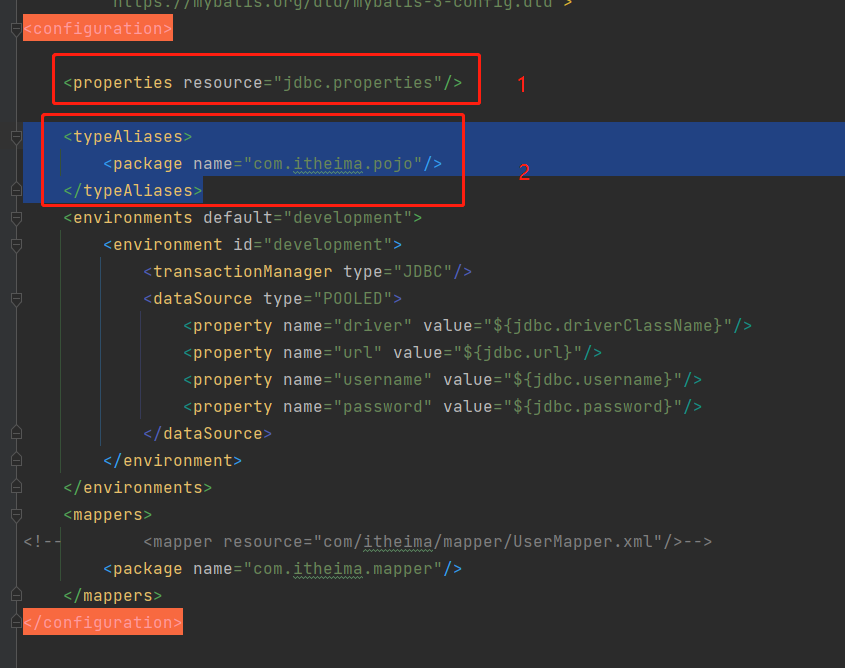

# 5、配置文件完成增删查改

## 5.1 前期准备

### 5.1.1 数据库表生成

```mysql
-- 删除tb_brand表
drop table if exists tb_brand;
-- 创建tb_brand表
create table tb_brand
(
    -- id 主键
    id           int primary key auto_increment,
    -- 品牌名称
    brand_name   varchar(20),
    -- 企业名称
    company_name varchar(20),
    -- 排序字段
    ordered      int,
    -- 描述信息
    description  varchar(100),
    -- 状态：0：禁用  1：启用
    status       int
);
-- 添加数据
insert into tb_brand (brand_name, company_name, ordered, description, status)
values ('三只松鼠', '三只松鼠股份有限公司', 5, '好吃不上火', 0),
       ('华为', '华为技术有限公司', 100, '华为致力于把数字世界带入每个人、每个家庭、每个组织，构建万物互联的智能世界', 1),
       ('小米', '小米科技有限公司', 50, 'are you ok', 1);


SELECT * FROM tb_brand;
```

### 5.1.2 Brand类

```java
package com.itheima.pojo;

/**
 * 品牌
 *
 * alt + 鼠标左键：整列编辑
 *
 * 在实体类中，基本数据类型建议使用其对应的包装类型
 */

public class Brand {
    // id 主键
    private Integer id;
    // 品牌名称
    private String brandName;
    // 企业名称
    private String companyName;
    // 排序字段
    private Integer ordered;
    // 描述信息
    private String description;
    // 状态：0：禁用  1：启用
    private Integer status;


    public Integer getId() {
        return id;
    }

    public void setId(Integer id) {
        this.id = id;
    }

    public String getBrandName() {
        return brandName;
    }

    public void setBrandName(String brandName) {
        this.brandName = brandName;
    }

    public String getCompanyName() {
        return companyName;
    }

    public void setCompanyName(String companyName) {
        this.companyName = companyName;
    }

    public Integer getOrdered() {
        return ordered;
    }

    public void setOrdered(Integer ordered) {
        this.ordered = ordered;
    }

    public String getDescription() {
        return description;
    }

    public void setDescription(String description) {
        this.description = description;
    }

    public Integer getStatus() {
        return status;
    }

    public void setStatus(Integer status) {
        this.status = status;
    }

    @Override
    public String toString() {
        return "Brand{" +
                "id=" + id +
                ", brandName='" + brandName + '\'' +
                ", companyName='" + companyName + '\'' +
                ", ordered=" + ordered +
                ", description='" + description + '\'' +
                ", status=" + status +
                '}';
    }
}
```

### 5.1.3 测试


将来的测试程序都放在这下面

### 5.1.4 插件MyBatisX

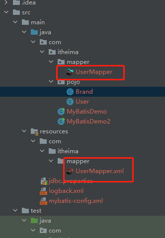

安装完了之后，会出现这些小鸟。

- XML和接口方法相互跳转
- 根据接口方法生成statement

## 5.2 查询

### 5.2.1 查询所有数据

首先，我们要定义好BrandMapper和BrandMapper.xml这两个文件

BrandMapper

```java
package com.itheima.mapper;

import com.itheima.pojo.Brand;

import java.util.List;

public interface BrandMapper {
   List<Brand> selectAll();
}
```

BrandMapper.xml

```java
<?xml version="1.0" encoding="UTF-8" ?>
<!DOCTYPE mapper
        PUBLIC "-//mybatis.org//DTD Mapper 3.0//EN"
        "https://mybatis.org/dtd/mybatis-3-mapper.dtd">
<!--
    namespace:名称空间
-->
<mapper namespace="com.itheima.mapper.BrandMapper">
    <select id="selectAll" resultType="Brand">
        select * from tb_brand;
    </select>
</mapper>
```

这个时候，我们查询的结果，有两个字段对应不上，因为在Brand类中，我们定义的是brandName和companyName，而数据库中使用的是brand_name和company_name，所以我们在写查询语句的时候，应该用取别名的方式，但是这种不太方便。

可以把这段查询提到外面，写一个sql片段

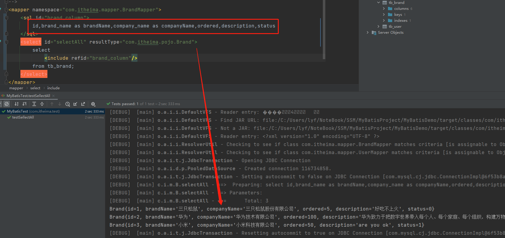

这样就能正常显示了。

但是还有问题，就是如果我不想全用这些字段，而是想用某些字段怎么办？

这个时候我们用ResultMap方案

```xml
<resultMap id="brandResultMap" type="com.itheima.pojo.Brand">
    <result column="brand_name" property="brandName"/>
    <result column="company_name" property="companyName"/>
</resultMap>
```

这个时候，我们就相当于给列起了别名，后面用的时候，可以直接select *

```xml
<select id="selectAll" resultMap="brandResultMap">
    select * from tb_brand;
</select>
```

这里我们不再用resultType了，而是用resultMap

### 5.2.2 查看详情

通过id查询

```xml
<!--
    参数占位符
        ${}: 不会替换成？ 容易sql注入
        #{}: 会替换成？
-->
<select id="selectById" parameterType="int" resultMap="brandResultMap">
    select * from tb_brand where id = #{id};
</select>
```

其他就不写了

注意特殊字符的处理，有两种方法

- 转义字符，例如小于号 &lt; 
- CDATA区 

```xml
select * from tb_brand where id <![CDATA[
    <
]]> #{id};
```

### 5.2.3 条件查询

#### 1）多条件查询

例如，我们想通过status、companyName和brandName进行查询，那么我们的sql语句应该这样写

```sql
select * from tb_brand where status = ? and companyName = ? and brandName = ?
```

知道了查询语句怎么写，那么接下来，我们配置BrandMapper和BrandMapper.xml中的一些内容

**BrandMapper**

```java
List<Brand> selectByCondition(@Param("status") int status, @Param("companyName")String companyName,@Param("brandName") String brandName);
```

要用@Param注解，表明形参之间的对应关系，防止在BrandMapper.xml找不到对应

除此之外，还有两种方法

- ```java
  List<Brand> selectByCondition(Brand brand);
  ```

- ```java
  List<Brand> selectByCondition(Map map) String brandName);
  ```

第一种：List<Brand> selectByCondition(Brand brand);

```java
Brand brandTemp = new Brand();
brandTemp.setStatus(1);
brandTemp.setCompanyName("华为技术有限公司");
brandTemp.setBrandName("华为");
List<Brand> brands = brandMapper.selectByCondition(brandTemp);
```

第二种：List<Brand> selectByCondition(Map map) String brandName);

```java
Map<String,String> map = new HashMap<>();
map.put("status","1");
map.put("companyName","华为技术有限公司");
map.put("brandName","华为");
List<Brand> brands = brandMapper.selectByCondition(map);
```


**BrandMapper.xml**

```xml
<!-- todo 按条件查询-->
<select id="selectByCondition" resultMap="brandResultMap">
    select * from tb_brand where status = #{status} and company_name like #{companyName} and brand_name like #{brandName}
</select>
```

注意where的条件，前半部分不能是别名。

最终的查询结果。

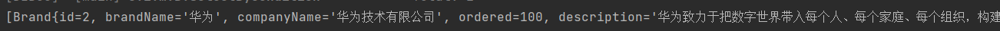


#### 2）多条件-动态条件查询

当用户在使用查询条件的时候，很可能不会把所有的查询条件都用上，所以这个时候，我们需要根据用户的选择生成动态的sql

```xml
<select id="selectByCondition" resultMap="brandResultMap">
    select *
    from tb_brand
    where 1 = 1
    <if test="status != null">
        and status = #{status}
    </if>
    <if test="companyName != null and companyName != ''">
        and company_name like #{companyName}
    </if>
    <if test="brandName != null and brandName != ''">
        and brand_name like #{brandName}
    </if>
</select>
```

写法如上，test中的字符串内容，是java。但是这样还是比较麻烦

我们不用1=1的写法，直接用where标签

```xml
    <select id="selectByCondition" resultMap="brandResultMap">
        select *
        from tb_brand
<!--        where 1 = 1-->
        <where>
            <if test="status != null">
                and status = #{status}
            </if>
            <if test="companyName != null and companyName != ''">
                and company_name like #{companyName}
            </if>
            <if test="brandName != null and brandName != ''">
                and brand_name like #{brandName}
            </if>
        </where>
    </select>
```

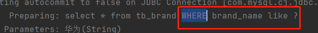

可以看到，每个条件前面的and被自动删除了。

#### 3）单条件-动态查询

<choose>和<when> 标签的配合使用

```xml
<select id="selectByConditionSingle" resultMap="brandResultMap">
    select *
    from tb_brand
    <where>
        <choose>
            <when test="status != null">
                status = #{status}
            </when>
            <when test="companyName != null and companyName != ''">
                company_name like #{companyName}
            </when>
            <when test="brandName != null and brandName != ''">
                brand_name like #{brandName}
            </when>
        </choose>
    </where>
</select>
```

## 5.3 添加

### 5.3.1 基础添加

#### 1）编写Mapper接口

```
<insert id="add">
    insert into tb_brand(brand_name,company_name,ordered,description,status)
    values (#{brandName},#{companyName},#{ordered},#{description},#{status});
</insert>
```

#### 2）参数是什么

除了id之外的所有值

#### 3）结果

不返回结果

#### 4）编写SQL语句

```mysql
insert into tb_brand(brand_name,company_name,ordered,description,status)
values (#{brandName},#{companyName},#{ordered},#{description},#{status});
```

但是执行完之后，数据库并没有更新，因为这里没有提交事务，所以我们需要手动提交一下事务。

```java
    @Test
   public void testAdd() throws Exception {
      // 1、加载MyBatis的核心配置文件，获取SqlSessionFactory
      String resource = "mybatis-config.xml";
      InputStream inputStream = Resources.getResourceAsStream(resource);
      SqlSessionFactory sqlSessionFactory = new SqlSessionFactoryBuilder().build(inputStream);

      // 2、获取SqlSession对象，用于执行sql语句
      SqlSession sqlSession = sqlSessionFactory.openSession();

      // 3、获取Mapper接口的代理对象
      BrandMapper brandMapper = sqlSession.getMapper(BrandMapper.class);

      Brand brandTemp = new Brand();
//    brandTemp.setId(4);
      brandTemp.setBrandName("byd");
      brandTemp.setCompanyName("比亚迪");
      brandTemp.setOrdered(100);
      brandTemp.setDescription("byd!!!!!!");
      brandTemp.setStatus(1);

      brandMapper.add(brandTemp);

      sqlSession.commit();
      // 4、释放资源
      sqlSession.close();
   }
```


### 5.3.2 主键返回

数据添加之后，返回主键的值。

xml文件中我们只需要添加两个属性

```xml
<insert id="add2" useGeneratedKeys="true" keyProperty="id">
    insert into tb_brand(brand_name,company_name,ordered,description,status)
    values (#{brandName},#{companyName},#{ordered},#{description},#{status});
</insert>
```

然后测试程序直接获取id即可

```java
Integer idReturn = brandTemp.getId();
System.out.println(idReturn);
```


## 5.4 修改

### 5.4.1 修改全部字段

#### 1）Mapper的sql语句

```xml
<update id="update">
    update tb_brand
    set brand_name = #{brandName},
    company_name = #{companyName},
    ordered = #{ordered},
    description = #{description},
    status = #{status}
    where id = #{id}
</update>
```

#### 2）测试程序

```java
@Test
public void testUpdate() throws Exception {
   // 1、加载MyBatis的核心配置文件，获取SqlSessionFactory
   String resource = "mybatis-config.xml";
   InputStream inputStream = Resources.getResourceAsStream(resource);
   SqlSessionFactory sqlSessionFactory = new SqlSessionFactoryBuilder().build(inputStream);

   // 2、获取SqlSession对象，用于执行sql语句
   SqlSession sqlSession = sqlSessionFactory.openSession();

   // 3、获取Mapper接口的代理对象
   BrandMapper brandMapper = sqlSession.getMapper(BrandMapper.class);

   Brand brandTemp = new Brand();
   brandTemp.setId(11);
   brandTemp.setBrandName("123");
   brandTemp.setCompanyName("asjfha");
   brandTemp.setOrdered(100);
   brandTemp.setDescription("afdgdfsg!!!!!!");
   brandTemp.setStatus(1);

   int updateReturn = brandMapper.update(brandTemp);
   System.out.println(updateReturn);

   sqlSession.commit();
   // 4、释放资源
   sqlSession.close();
}
```


### 5.4.2 修改动态字段

```xml
<update id="update2">
    update tb_brand
    <set>
        <if test="brandName != null and brandName != ''">
            brand_name=#{brandName},
        </if>
        <if test="companyName != null and brandName != ''">
            company_name=#{companyName}
        </if>
        <if test="ordered != null">
            ordered = #{ordered}
        </if>
        <if test="description != null">
            description = #{description}
        </if>
        <if test="status != null">
            status = #{status}
        </if>
    </set>
    where id=#{id}
</update>
```

使用<set> 标签规避逗号问题。


## 5.5 删除

### 5.5.1 删除一个

```xml
<delete id="deleteById">
    delete from tb_brand where id = #{id};
</delete>
```

```java
@Test
public void testDeleteById() throws Exception {
   // 1、加载MyBatis的核心配置文件，获取SqlSessionFactory
   String resource = "mybatis-config.xml";
   InputStream inputStream = Resources.getResourceAsStream(resource);
   SqlSessionFactory sqlSessionFactory = new SqlSessionFactoryBuilder().build(inputStream);

   // 2、获取SqlSession对象，用于执行sql语句
   SqlSession sqlSession = sqlSessionFactory.openSession();

   // 3、获取Mapper接口的代理对象
   BrandMapper brandMapper = sqlSession.getMapper(BrandMapper.class);

   int updateReturn = brandMapper.deleteById(12);
   System.out.println(updateReturn);

   sqlSession.commit();
   // 4、释放资源
   sqlSession.close();
}
```

### 5.5.2 批量删除

```xml
<delete id="deleteByIds">
    delete from tb_brand where id in
    <foreach collection="ids" item="id" separator="," open="(" close=")">
        #{id}
    </foreach>;
</delete>
```

要注意，这里使用ids是因为我们在Mapper类中，用@Param注解进行了重命名，如果不进行重命名的话，应该写array。因为我们传入的collection是数组

```java
int deleteByIds(@Param("ids") int[] id);
```

```java
@Test
public void testDeleteByIds() throws Exception {
   // 1、加载MyBatis的核心配置文件，获取SqlSessionFactory
   String resource = "mybatis-config.xml";
   InputStream inputStream = Resources.getResourceAsStream(resource);
   SqlSessionFactory sqlSessionFactory = new SqlSessionFactoryBuilder().build(inputStream);

   // 2、获取SqlSession对象，用于执行sql语句
   SqlSession sqlSession = sqlSessionFactory.openSession();

   // 3、获取Mapper接口的代理对象
   BrandMapper brandMapper = sqlSession.getMapper(BrandMapper.class);

   int updateReturn = brandMapper.deleteByIds(new int[]{8,9,10,11});
   System.out.println(updateReturn);

   sqlSession.commit();
   // 4、释放资源
   sqlSession.close();
}
```


# 6、注解完成增删查改

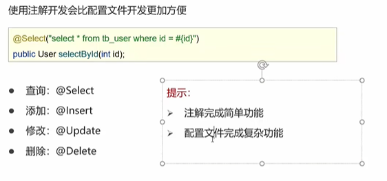
