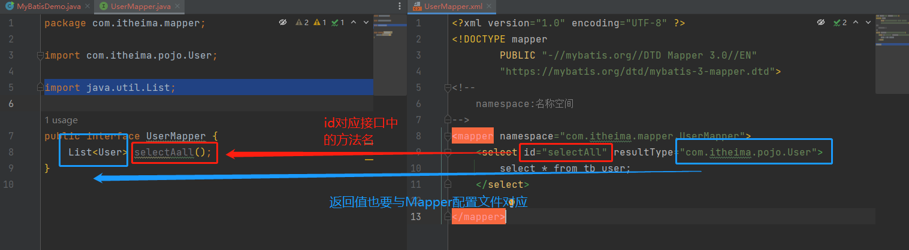

# MyBatis

[TOC]

# 1、为什么用MyBatis

## 1.1 JDBC的缺点


## 1.2 MyBatis简化

将硬编码写到配置文件中，将繁琐的操作也配置到配置文件中。

MyBatis免除了几乎所有的JDBC代码以及设置参数和获取结果集的工作

# 2、MyBatis快速入门

## 2.1 查询user表中所有数据

首先我们将准备的创建tb_user表的脚本写入Navicat中。

```mysql
create database mybatis;
use mybatis;

drop table if exists tb_user;

create table tb_user(
	id int primary key auto_increment,
	username varchar(20),
	password varchar(20),
	gender char(1),
	addr varchar(30)
);


INSERT INTO tb_user VALUES (1, 'zhangsan', '123', '男', '北京');
INSERT INTO tb_user VALUES (2, '李四', '234', '女', '天津');
INSERT INTO tb_user VALUES (3, '王五', '11', '男', '西安');


```

生成的表如下


## 2.2 创建模块，导入坐标

一般需要下面这些依赖

```xml
<dependencies>
    <!--mybatis 依赖-->
    <dependency>
        <groupId>org.mybatis</groupId>
        <artifactId>mybatis</artifactId>
        <version>3.5.5</version>
    </dependency>

    <!--mysql 驱动-->
    <dependency>
        <groupId>mysql</groupId>
        <artifactId>mysql-connector-java</artifactId>
        <version>5.1.46</version>
    </dependency>

    <!--junit 单元测试-->
    <dependency>
        <groupId>junit</groupId>
        <artifactId>junit</artifactId>
        <version>4.13</version>
        <scope>test</scope>
    </dependency>


    <!-- 添加slf4j日志api -->
    <dependency>
        <groupId>org.slf4j</groupId>
        <artifactId>slf4j-api</artifactId>
        <version>1.7.20</version>
    </dependency>
    <!-- 添加logback-classic依赖 -->
    <dependency>
        <groupId>ch.qos.logback</groupId>
        <artifactId>logback-classic</artifactId>
        <version>1.2.3</version>
    </dependency>
    <!-- 添加logback-core依赖 -->
    <dependency>
        <groupId>ch.qos.logback</groupId>
        <artifactId>logback-core</artifactId>
        <version>1.2.3</version>
    </dependency>

</dependencies>
```

## 2.3 编写MyBatis核心配置文件

```xml
<?xml version="1.0" encoding="UTF-8" ?>
<!DOCTYPE configuration
        PUBLIC "-//mybatis.org//DTD Config 3.0//EN"
        "https://mybatis.org/dtd/mybatis-3-config.dtd">
<configuration>
    <properties resource="jdbc.properties"/>
    <environments default="development">
        <environment id="development">
            <transactionManager type="JDBC"/>
            <dataSource type="POOLED">
                <property name="driver" value="${jdbc.driverClassName}"/>
                <property name="url" value="${jdbc.url}"/>
                <property name="username" value="${jdbc.username}"/>
                <property name="password" value="${jdbc.password}"/>
            </dataSource>
        </environment>
    </environments>
    <mappers>
        <mapper resource="UserMapper.xml"/>
    </mappers>
</configuration>
```

通过<properties resource="jdbc.properties"/>  我们能够将数据库信息从配置文件中进行读取

## 2.4 编写SQL映射文件

```xml
<?xml version="1.0" encoding="UTF-8" ?>
<!DOCTYPE mapper
        PUBLIC "-//mybatis.org//DTD Mapper 3.0//EN"
        "https://mybatis.org/dtd/mybatis-3-mapper.dtd">
<!--
    namespace:名称空间
-->
<mapper namespace="test">
    <select id="selectAll" resultType="com.itheima.pojo.User">
        select * from tb_user;
    </select>

</mapper>
```

我们后面在用的时候，获取这一条数据库查询命令的时候，直接通过namespace.id的方式进行获取。

## 2.5 编码

### 2.5.1 定义POJO类

```java
package com.itheima.pojo;

public class User {
   private Integer id;
   private String username;
   private String password;
   private String gender;
   private String addr;

   public Integer getId() {
      return id;
   }

   public void setId(Integer id) {
      this.id = id;
   }

   public String getUsername() {
      return username;
   }

   public void setUsername(String username) {
      this.username = username;
   }

   public String getPassword() {
      return password;
   }

   public void setPassword(String password) {
      this.password = password;
   }

   public String getGender() {
      return gender;
   }

   public void setGender(String gender) {
      this.gender = gender;
   }

   public String getAddr() {
      return addr;
   }

   public void setAddr(String addr) {
      this.addr = addr;
   }

   @Override
   public String toString() {
      return "User{" +
            "id=" + id +
            ", username='" + username + '\'' +
            ", password='" + password + '\'' +
            ", gender='" + gender + '\'' +
            ", addr='" + addr + '\'' +
            '}';
   }
}
```

### 2.5.2 加载核心配置文件，获取SqlSessionFactory对象

```java
// 1、加载MyBatis的核心配置文件，获取SqlSessionFactory
String resource = "mybatis-config.xml";
InputStream inputStream = Resources.getResourceAsStream(resource);
SqlSessionFactory sqlSessionFactory = new SqlSessionFactoryBuilder().build(inputStream);
```

sqlSessionFactory是一个工厂对象，用于造SqlSession对象

### 2.5.3 获取SqlSession对象，执行SQL语句

```java
// 2、获取SqlSession对象，用于执行sql语句
SqlSession sqlSession = sqlSessionFactory.openSession();
```

```java
// 3、执行sql
List<User> users = sqlSession.selectList("test.selectAll");
```

### 2.5.4 释放资源

```java
// 4、释放资源
sqlSession.close();
```


这里遇到一个Navicat的坑


我一直把连接名当成数据库名了，所以一直报 Unknown Database的错误。

## 2.6 解决SQL映射文件的警告提示

产生的原因就是Idea与数据库没有建立连接。


# 3、Mapper代理开发

上面的代码中，我们在执行sql的时候还是存在硬编码的问题

```java
// 3、执行sql
List<User> users = sqlSession.selectList("test.selectAll");
```

test.selectAll由于是写在mapper配置文件中，所以我们需要来回的对照去看。而Mapper代理的方式解决了硬编码的问题。其需要遵循下面的几点要求

## 3.1 第一步

定义与SQL映射文件同名的Mapper接口，并且将Mapper接口和SQL映射文件放置在同一目录下

编译完成之后的UserMapper接口的路径如下


那么如何保证我们的UserMapper.xml编译完了也在这个位置呢?

我们在resources文件下创建与UserMapper相同的包接口的目录，但是注意，在resources中没有创建包的选项，只能创建directory，我们要用/分隔，而不是用.


这样就能保证编译后在一个目录下了。

## 3.2 第二步

设置SQL映射文件的namespace属性为Mapper接口全限定名


## 3.3 第三步 

在Mapper接口中定义方法，方法名就是SQL映射文件中sql语句的id，并保持参数类型和返回值类型一致



要注意，我们之前把UserMapper.xml的位置变了，所以我们要把config配置文件中的代理位置也改一下


## 3.4 第四步 

编码

### 3.4.1 通过SqlSession的getMapper方法获取Mapper接口的代理对象

```java
UserMapper userMapper = sqlSession.getMapper(UserMapper.class);
```

### 3.4.2 调用对应方法完成sql的执行

```java
List<User> users = userMapper.selectAll();
```

如果com.itheima.mapper中存在很多的这种映射文件，那么我们就要写好多的mapper标签

可以采用Mapper代理的方式用包扫描

```xml
<mappers>
    <!--<mapper resource="com/itheima/mapper/UserMapper.xml"/>-->
    <package name="com.itheima.mapper"/>
</mappers>
```

# 4、MyBatis核心配置文件

```xml
<?xml version="1.0" encoding="UTF-8" ?>
<!DOCTYPE configuration
        PUBLIC "-//mybatis.org//DTD Config 3.0//EN"
        "https://mybatis.org/dtd/mybatis-3-config.dtd">
<configuration>
    <properties resource="jdbc.properties"/>
    <environments default="development">
        <environment id="development">
            <transactionManager type="JDBC"/>
            <dataSource type="POOLED">
                <property name="driver" value="${jdbc.driverClassName}"/>
                <property name="url" value="${jdbc.url}"/>
                <property name="username" value="${jdbc.username}"/>
                <property name="password" value="${jdbc.password}"/>
            </dataSource>
        </environment>
    </environments>
    <mappers>
<!--        <mapper resource="com/itheima/mapper/UserMapper.xml"/>-->
        <package name="com.itheima.mapper"/>
    </mappers>
</configuration>
```

## 4.1 environment

配置数据库连接环境信息。可以配置多个environment，通过default属性切换不同的environment

## 4.2 typeAliases

起别名

```xml
<typeAliases>
    <package name="com.itheima.pojo"/>
</typeAliases>
```

然后我们在UserMapper.xml就不需要写完整的包名了


要注意，如果有properties，要保证其在最上面


# 5、配置文件完成增删查改

## 5.1 前期准备

### 5.1.1 数据库表生成

```mysql
-- 删除tb_brand表
drop table if exists tb_brand;
-- 创建tb_brand表
create table tb_brand
(
    -- id 主键
    id           int primary key auto_increment,
    -- 品牌名称
    brand_name   varchar(20),
    -- 企业名称
    company_name varchar(20),
    -- 排序字段
    ordered      int,
    -- 描述信息
    description  varchar(100),
    -- 状态：0：禁用  1：启用
    status       int
);
-- 添加数据
insert into tb_brand (brand_name, company_name, ordered, description, status)
values ('三只松鼠', '三只松鼠股份有限公司', 5, '好吃不上火', 0),
       ('华为', '华为技术有限公司', 100, '华为致力于把数字世界带入每个人、每个家庭、每个组织，构建万物互联的智能世界', 1),
       ('小米', '小米科技有限公司', 50, 'are you ok', 1);


SELECT * FROM tb_brand;
```

### 5.1.2 Brand类

```java
package com.itheima.pojo;

/**
 * 品牌
 *
 * alt + 鼠标左键：整列编辑
 *
 * 在实体类中，基本数据类型建议使用其对应的包装类型
 */

public class Brand {
    // id 主键
    private Integer id;
    // 品牌名称
    private String brandName;
    // 企业名称
    private String companyName;
    // 排序字段
    private Integer ordered;
    // 描述信息
    private String description;
    // 状态：0：禁用  1：启用
    private Integer status;


    public Integer getId() {
        return id;
    }

    public void setId(Integer id) {
        this.id = id;
    }

    public String getBrandName() {
        return brandName;
    }

    public void setBrandName(String brandName) {
        this.brandName = brandName;
    }

    public String getCompanyName() {
        return companyName;
    }

    public void setCompanyName(String companyName) {
        this.companyName = companyName;
    }

    public Integer getOrdered() {
        return ordered;
    }

    public void setOrdered(Integer ordered) {
        this.ordered = ordered;
    }

    public String getDescription() {
        return description;
    }

    public void setDescription(String description) {
        this.description = description;
    }

    public Integer getStatus() {
        return status;
    }

    public void setStatus(Integer status) {
        this.status = status;
    }

    @Override
    public String toString() {
        return "Brand{" +
                "id=" + id +
                ", brandName='" + brandName + '\'' +
                ", companyName='" + companyName + '\'' +
                ", ordered=" + ordered +
                ", description='" + description + '\'' +
                ", status=" + status +
                '}';
    }
}
```

### 5.1.3 测试


将来的测试程序都放在这下面

### 5.1.4 插件MyBatisX


安装完了之后，会出现这些小鸟。

- XML和接口方法相互跳转
- 根据接口方法生成statement

## 5.2 查询

### 5.2.1 查询所有数据


### 5.2.2 查看详情


### 5.2.3 条件查询


## 5.3 添加


## 5.4 修改

### 5.4.1 修改全部字段


### 5.4.2 修改动态字段


## 5.5 删除

### 5.5.1 删除一个


### 5.5.2 批量删除


# 6、注解完成增删查改


# 7、动态SQL
