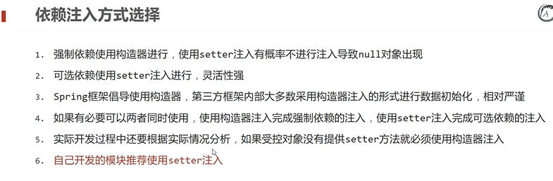

# Spring

[TOC]

# 1、初识Spring

Spring提供若干项目，每个项目用于完成特定的功能

Spring全家桶中比较常见的技术

- Spring Framework
- Spring Boot
- Spring cloud

Spring的发展

- Spring1.0 纯配置型的开发
- Spring2.0 引入注解开发
- Spring3.0 不写配置的开发模式
- Spring4.0 API变化
- Spring5.0 全面支持JDK8

# 2、Spring Framework系统架构

## 2.1 系统架构


Spring框架在4.0趋于完整，因此我们着重看4.0以后的架构

### 2.1.1 Core Container


容器中装的是对象

### 2.1.2 AOP和Aspects


AOP是一种编程思想，能够在不改变源程序得到前提下增强功能

Aspects是AOP思想的实现。

### 2.1.3 Data Access


Spring能够实现数据访问，并且能够集成其他方案。值得一提的是，Spring很好的实现了Transaction事务。

### 2.1.4 Web

Spring也能够进行Web开发


### 2.1.5 Test


Spring在单元测试和集成测试也进行了实现。

## 2.2 学习路线


# 3、核心概念

为了解决耦合度偏高的问题，在使用对象的时候，程序中不要主动使用new产生对象，转换为由**外部提供对象**。对象的控制权由程序转移到外部的思想就是控制反转。（对象的控制权）

Spring技术对IOC思想进行实现**（IoC管理Bean）IoC（inversion of Control）控制反转**

- Spring提供了一个容器，称为IOC容器，用来充当IOC思想中的外部。也就是说，现在对象我在IOC容器中往外拿。
- Ioc容器负责对象的创建、初始化等一系列的工作，被创建或被管理的对象在Ioc容器中统称为Bean

DI（dependency injection）依赖注入**（Bean的关系绑定）**

- 在容器中建立bean与bean之间的依赖关系的整个过程，称为依赖注入。


最终效果：使用对象的时候可以直接从IOC容器中获取，并且获取到的Bean已经绑定了所有的依赖关系

# 4、IoC入门案例思路分析及实现

## 4.1 IoC思路分析

### 4.1.1 管理什么？（Service与Dao）

先熟悉一下Java Web三层架构 https://www.cnblogs.com/cielosun/articles/5752272.html

我们的项目架构如下，也是常见的结构


每个代码的运行逻辑

**Dao层**

接口

```java
package com.itheima.dao;

public interface BookDao {
	public void save();
}

```

实现类

```java
package com.itheima.dao.impl;

import com.itheima.dao.BookDao;

public class BookDaoImpl implements BookDao {
	public void save(){
		System.out.println("book dao save ... ");
	}
}

```

**Service层**

接口

```java
package com.itheima.service;

public interface BookService {
	public void save();
}

```

实现类

```java
package com.itheima.service.impl;

import com.itheima.dao.BookDao;
import com.itheima.dao.impl.BookDaoImpl;
import com.itheima.service.BookService;

public class BookServiceImpl implements BookService {
   private BookDao bookDao = new BookDaoImpl();

   public void save(){
      System.out.println("book service save ...");
      bookDao.save();
   }
}
```

两个实现类都继承了各自的接口，主程序如下

```java
package com.itheima;

import com.itheima.service.BookService;
import com.itheima.service.impl.BookServiceImpl;

public class App {
	public static void main(String[] args) {
		BookService bookService = new BookServiceImpl();
		bookService.save();
	}
}

```

主程序中，我们首先创建了接口的对象（但是对象中没有构造方法，必须被继承的子类实现其中的抽象方法）所以都必须要实现其save方法。所以首先输出的是"book service save ..."，然后因为又创建了Dao的对象，所以执行bookDao.save();时，输出"book dao save ... "。这个例子还是比较简单的。

### 4.1.2 如何将被管理的对象告知IoC容器？（配置）

怎么去配置bean？

首先我们需要导入spring的依赖，这里我们使用下面的依赖

```xml
<!-- https://mvnrepository.com/artifact/org.springframework/spring-context -->
<dependency>
    <groupId>org.springframework</groupId>
    <artifactId>spring-context</artifactId>
    <version>6.0.4</version>
</dependency>
```

然后在resources里面创建一个spring，IDEA中创建的方式如图


创建好之后，我们就在XML文件中进行相关bean的配置，主要是两步

```xml
<?xml version="1.0" encoding="UTF-8"?>
<beans xmlns="http://www.springframework.org/schema/beans"
       xmlns:xsi="http://www.w3.org/2001/XMLSchema-instance"
       xsi:schemaLocation="http://www.springframework.org/schema/beans http://www.springframework.org/schema/beans/spring-beans.xsd">

    <!--    1、导入spring的坐标spring-context-->

    <!--    2、配置bean-->

    <bean id="bookDao" class="com.itheima.dao.impl.BookDaoImpl"/>
    <bean id="bookService" class="com.itheima.service.impl.BookServiceImpl"/>
</beans>
```

id表示起的名字，class表示是哪个类，是一个路径。

然后我们重新书写4.1.1中的代码

### 4.1.3 被管理的对象交给IoC容器，如何获取到IoC容器？（接口）

```java
// 3、获取IoC容器
// ApplicationContext是一个接口，不能实例化，应该用他的实现类
ApplicationContext ctx = new ClassPathXmlApplicationContext("applicationContext.xml");
```


### 4.1.4 IoC容器得到后，如何从容器中获取bean？（接口方法）

```java
// 4、获取bean
BookDao bookDao = (BookDao)ctx.getBean("bookDao");
bookDao.save();
```

ctx.getBean("bookDao"); 返回的结果是object，我们既然要使用BookDao（接口），那么应该对其进行转型。

然后直接调用方法就行。

这里碰到一个问题，就是spring framework与jdk的对应关系 https://blog.csdn.net/a321123b/article/details/123568578


比如我是jdk8然后导入的是6.0的spring，就会报如下的错误


我们只要改成spring5的版本就不会报错了。


同样的道理，我们也可以拿出Service

```java
BookService bookService = (BookService)ctx.getBean("bookService");
```


### 4.1.4 使用Spring导入哪些坐标？（pom.xml）

注意版本对应

```xml
<!-- https://mvnrepository.com/artifact/org.springframework/spring-context -->
<dependency>
  <groupId>org.springframework</groupId>
  <artifactId>spring-context</artifactId>
  <version>5.3.25</version>
</dependency>
```

## 4.2 实现

完整App2程序

```java
package com.itheima;

import com.itheima.dao.BookDao;
import com.itheima.service.BookService;
import org.springframework.context.ApplicationContext;
import org.springframework.context.support.ClassPathXmlApplicationContext;

public class App2 {
   public static void main(String[] args) {
      // 3、获取IoC容器
      // ApplicationContext是一个接口，不能实例化，应该用他的实现类
      ApplicationContext ctx = new ClassPathXmlApplicationContext("applicationContext.xml");

      // 4、获取bean
      BookDao bookDao = (BookDao)ctx.getBean("bookDao");
      BookService bookService = (BookService)ctx.getBean("bookService");
      bookDao.save();
      bookService.save();
   }
}
```

# 5、DI入门案例

在四中我们虽然实现了bean的配置，但是我们发现，在程序中，还是避免不了创建对象，例如


这个时候就需要用到我们的依赖注入

## 5.1 DI入门案例思路分析

### 5.1.1 基于IoC管理Bean


### 5.1.2 Service中使用new形式创建的Dao对象是否保留？（否）


### 5.1.3 Service中需要的Dao对象如何进入到Service中？（提供方法）

在这里我们提供的是Set方法

```java
public void setBookDao(BookDao bookDao) {
   this.bookDao = bookDao;
}
```

那么谁会用到这个setBookDao方法呢，很明显是bean要用到，那么怎么用，就需要我们在bean中进行配置。

### 5.1.4 Service与Dao间的关系如何描述？（配置）

在bean中，我们要明确调用关系。由于我们在service接口中调用了dao，所以我们在bean中也是需要在service标签中配置dao，配置关系如下

```xml
<?xml version="1.0" encoding="UTF-8"?>
<beans xmlns="http://www.springframework.org/schema/beans"
       xmlns:xsi="http://www.w3.org/2001/XMLSchema-instance"
       xsi:schemaLocation="http://www.springframework.org/schema/beans http://www.springframework.org/schema/beans/spring-beans.xsd">

    <!--    1、导入spring的坐标spring-context-->

    <!--    2、配置bean-->

    <bean id="bookDao" class="com.itheima.dao.impl.BookDaoImpl"/>
    <bean id="bookService" class="com.itheima.service.impl.BookServiceImpl">
    <!--
        配置service与dao的关系
        我们在service中，使用到了dao，所以我们在bean中应该在service中配置dao
    -->
        <property name="bookDao" ref="bookDao"/>
    </bean>
</beans>
```

注意两个标签：name和ref

- name标签 bookDao 指的是 service接口中命名的对象，即 private BookDao bookDao;
- ref标签 bookDao 指的是在当前的xml文件中，<bean id="bookDao" class="com.itheima.dao.impl.BookDaoImpl"/>  这一条中的id。

# 6、bean配置

## 6.1 bean基础配置


上面是之前学到的一些知识，但是如果不同人开发，bean的名字不一样怎么办，这就涉及到bean的别名配置

## 6.2 bean别名配置

bean别名配置只需要在标签中添加一个name属性，之间可以用逗号、分号、空格分隔。

```java
BookService bookService = (BookService)ctx.getBean("service3"); // 别名
```

并且这个别名也可以用于依赖注入，所以我们在bean中ref写别名也是可以的。

```xml
<bean id="bookService" name="service service2 service3" class="com.itheima.service.impl.BookServiceImpl">
<!--
    配置service与dao的关系
    我们在service中，使用到了dao，所以我们在bean中应该在service中配置dao
-->
    <property name="bookDao" ref="biemingdao"/>
</bean>
```

## 6.3 bean作用范围配置

当我们连续获取两次BookDao对象，对其地址进行输出不难发现，这实际上是同一个对象，也就是说，Spring构造的对象默认是单例的

```java
BookDao bookDao1 = (BookDao)ctx.getBean("bookDao");
BookDao bookDao2 = (BookDao)ctx.getBean("bookDao");
System.out.println(bookDao1);
System.out.println(bookDao2);
```

**输出**

​	com.itheima.dao.impl.BookDaoImpl@56235b8e
​	com.itheima.dao.impl.BookDaoImpl@56235b8e

那么如何变为多例，有一个scope标签

```xml
<bean id="bookDao" class="com.itheima.dao.impl.BookDaoImpl" scope="prototype"/>
```

**输出**

​	com.itheima.dao.impl.BookDaoImpl@56235b8e
​	com.itheima.dao.impl.BookDaoImpl@3632be31

结果已经变为多例。

### 6.3.1 为什么bean默认为单例

Spring管理的就是通用的对象，所以默认就是单例。

### 6.3.2 适合交给容器进行管理的bean

- 表现层对象：Servlet
- 业务层对象：Service
- 数据层对象：Dao
- 工具对象：

### 6.3.3 不适合交给容器进行管理的bean

封装实体的域对象

# 7、bean实例化

## 7.1 bean是如何创建的

### 7.1.1 使用构造方法进行创建的

```java
public BookDaoImpl(){
   System.out.println("dao is running ...");
}
```

当我们在接口的实现类中定义无参构造方法，最终输入了无参构造方法中的内容，说明Spring使用的是无参构造的方法进行对象创建，并且无论是public还是private，都能够进行对象创建，这里用到的是反射。

但是有参构造方法就会报错，Spring的报错信息应该怎么阅读。一般是从最底下看，逐渐往上找。大部分情况下最下面一条就能解决问题。


### 7.1.2 静态工厂造对象

工厂类的定义如下

```java
package com.itheima.factory;

import com.itheima.dao.OrderDao;
import com.itheima.dao.impl.OrderDaoImpl;

public class OrderDaoFactory {
   public static OrderDao getOrderDao() {
      System.out.println("set up");
       return new OrderDaoImpl();
   }
}
```

其中返回的是接口实现类的对象

我们在bean中，配置的是工厂类的class，并且还要指定哪个方法是用来生成对象的。

```xml
<bean id="orderDao" class="com.itheima.factory.OrderDaoFactory" factory-method="getOrderDao"/>
```

main程序中

```java
public class AppForInstanceOrder {
   public static void main(String[] args) {
        ApplicationContext ctx = new ClassPathXmlApplicationContext("applicationContext.xml");
      // 记得要在maven 中配置SpringFramework

      OrderDao orderDao = (OrderDao) ctx.getBean("orderDao");
      orderDao.save();
   }
}
```

注意maven中需要配置SpringFramework，并且还要与jdk的版本对应起来。

那么为什么不直接生成对象，因为工厂类中可能还要做一些其他的配置。

### 7.1.3 实例工厂造对象

在实例工厂中，我们定义的获取对象的方法如下，不再是静态方法

```java
package com.itheima.factory;

import com.itheima.dao.UserDao;
import com.itheima.dao.impl.UserDaoImpl;

public class UserDaoFactory {
   public UserDao getUserDao(){
      return new UserDaoImpl();
   }
}
```

我们配置的bean也有所差别，注意，我们首先需要把实例化工厂的bean配置好

```xml
<bean id="userFactory" class="com.itheima.factory.UserDaoFactory"/>
```

然后，我们再配置dao的bean

```xml
<bean id="userDao" factory-method="getUserDao" factory-bean="userFactory"/>
```

这个时候，dao不需要再写class，而是需要写factory-method和factory-bean这两个东西

- factory-method 是实例化产生对象的方法，getUserDao是方法名
- factory-bean 是我们配置的实例化工厂的bean，userFactory是id

在main方法中，我们获取bean仍然传入userDao字段

```java
public class AppForInstanceUser {
   public static void main(String[] args) {
      ApplicationContext ctx = new ClassPathXmlApplicationContext("applicationContext.xml");
      UserDao userDao = (UserDao) ctx.getBean("userDao");
      userDao.save();
   }
}
```

Spring对上面的过程进行了改进，我们就定义一个UserFactoryBean，这个类需要实现FactoryBean<UserDao>接口，并且泛型中要填入想要得到的类型。

```java
package com.itheima.factory;

import com.itheima.dao.UserDao;
import com.itheima.dao.impl.UserDaoImpl;
import org.springframework.beans.factory.FactoryBean;

public class UserDaoFactoryBean implements FactoryBean<UserDao> {

   @Override
   public UserDao getObject() throws Exception {
      return new UserDaoImpl();
   }

   @Override
   public Class<?> getObjectType() {
      return UserDao.class;
   }
}
```

其中重写两个方法，第一个是要返回的类型，第二个是返回的对象是什么类型的，这里填入UserDao的字节码。

然后在bean中，我们换一种新的写法。

```xml
<bean id="userDao" class="com.itheima.factory.UserDaoFactoryBean"/>
```

实际上又回归了最初的写法样式，这样更简单，并且能够得到相同的运行结果。

还有一个重写方法是用来指定是单例还是非单例的

```java
@Override
public boolean isSingleton() {
   return false;
}
```

# 8、bean生命周期

## 8.1 init() 和 destroy()

当我们需要对于容器进行初始化和销毁操作的时候，我们需要定义这么两个方法。

```java
public void init(){
   System.out.println("init ...");
}

public void destroy(){
   System.out.println("destory ...");
}
```

在调用这两个方法的时候，我们还是进行bean配置。

```xml
<?xml version="1.0" encoding="UTF-8"?>
<beans xmlns="http://www.springframework.org/schema/beans"
       xmlns:xsi="http://www.w3.org/2001/XMLSchema-instance"
       xsi:schemaLocation="http://www.springframework.org/schema/beans http://www.springframework.org/schema/beans/spring-beans.xsd">

    <bean id="bookDao" class="com.itheima.dao.impl.BookDaoImpl" init-method="init" destroy-method="destroy"/>
    <bean id="bookService" class="com.itheima.service.impl.BookServiceImpl">
        <property name="bookDao" ref="bookDao"/>
    </bean>
</beans>
```

其中

- init-method="init" 表示初始化的方法
- destroy-method="destroy" 表示销毁的方法

当我们运行程序的时候，运行结果如下


但是此时，并没有出现销毁容器中的内容，所以我们需要添加一个close方法，对于容器进行关闭。


直接进行关闭操作的话，实际上因为我们ctx是ApplicationContext类型，是没有close方法的。我们剖析一下这个类


可以看到，ClassPathXmlApplicationContext实现类只是继承了ApplicationContext接口实现类，而ApplicationContext中是没有close方法的

我们看一下在哪里有这个close方法，注意图中快捷键的用法，我们可以看到在AbstractApplicationContext中是有这个方法的，并且被声明为了public，所以是可以被子类继承的，那么我们可以通过ClassPathXmlApplicationContext子类，或者直接用AbstractApplicationContext，就可以调用容器的关闭方法。


## 8.2 设置关闭钩子

当需要关闭虚拟机的时候，让容器关闭完成再退。这个时候需要提前注册一个钩子来完成这个操作

```java
public class App {
   public static void main(String[] args) {
      AbstractApplicationContext ctx = new ClassPathXmlApplicationContext("applicationContext.xml");
      ctx.registerShutdownHook();
      BookDao bookDao = (BookDao) ctx.getBean("bookDao");
      bookDao.save();

//    ctx.close();
   }
}
```

### 8.3 按照Spring接口的方式执行bean声明周期

我们在service中实现相关的操作

```java
package com.itheima.service.impl;

import com.itheima.dao.BookDao;
import com.itheima.service.BookService;
import org.springframework.beans.factory.DisposableBean;
import org.springframework.beans.factory.InitializingBean;

public class BookServiceImpl implements BookService, InitializingBean, DisposableBean {
   private BookDao bookDao;
   @Override
   public void save() {
      System.out.println("service ...");
   }

   public void setBookDao(BookDao bookDao) {
      this.bookDao = bookDao;
   }

   @Override
   public void destroy() throws Exception {
      System.out.println("service destroy ...");

   }

   @Override
   public void afterPropertiesSet() throws Exception {
      System.out.println("service init ...");
   }
}
```

实现的两个接口

- InitializingBean bean初始化接口
- DisposableBean bean销毁接口

重写的两个方法

- destroy() 销毁的方法
- afterPropertiesSet() 这个是初始化的方法，名字有点奇怪，在属性设置之后。


总的来看一下bean生命周期的几个部分


# 9、依赖注入方式

细分可以分为四种

## 9.1 setter注入

### 9.1.1 setter注入简单类型

那么我们如果想注入简单类型，应该怎么做，我们在BookDao中进行演示

```java
package com.itheima.dao.impl;

import com.itheima.dao.BookDao;

public class BookDaoImpl implements BookDao {

   private int connectionNum;
   private String connectionName;

   public void setConnectionNum(int connectionNum) {
      this.connectionNum = connectionNum;
   }

   public void setConnectionName(String connectionName) {
      this.connectionName = connectionName;
   }

   @Override
   public void save() {
      System.out.println("bookdao ...." + connectionName + ", " + connectionNum + ".");
   }
}
```

首先在BookDao中添加方法，然后在bean中进行配合

```xml
<bean id="bookDao" class="com.itheima.dao.impl.BookDaoImpl">
    <property name="connectionName" value="mysql"/>
    <property name="connectionNum" value="10"/>
</bean>
```

一个小技巧


### 9.1.2 setter注入引用类型

前面讲过，使用ref那个，如果我们想要注入多个引用，那么只需要这样做

```java
package com.itheima.service.impl;

import com.itheima.dao.BookDao;
import com.itheima.dao.UserDao;
import com.itheima.service.BookService;
import org.springframework.beans.factory.DisposableBean;
import org.springframework.beans.factory.InitializingBean;

public class BookServiceImpl implements BookService {
   private BookDao bookDao;
   private UserDao userDao;
   @Override
   public void save() {
      bookDao.save();
      userDao.save();
   }

   public void setBookDao(BookDao bookDao) {
      this.bookDao = bookDao;
   }

   public void setUserDao(UserDao userDao) {
      this.userDao = userDao;
   }
}
```

我们只需要添加set方法，并且在bean中进行配置即可

```xml
<?xml version="1.0" encoding="UTF-8"?>
<beans xmlns="http://www.springframework.org/schema/beans"
       xmlns:xsi="http://www.w3.org/2001/XMLSchema-instance"
       xsi:schemaLocation="http://www.springframework.org/schema/beans http://www.springframework.org/schema/beans/spring-beans.xsd">

    <bean id="bookDao" class="com.itheima.dao.impl.BookDaoImpl"/>
    <bean id="userDao" class="com.itheima.dao.impl.UserDaoImpl"/>
    <bean id="bookService" class="com.itheima.service.impl.BookServiceImpl">
        <property name="bookDao" ref="bookDao"/>
        <property name="userDao" ref="userDao"/>
    </bean>
</beans>
```


## 9.2 构造器注入

### 9.2.1 构造器注入简单类型

简单类型在知道构造器注入引用类型之后就变得非常简单

```java
package com.itheima.dao.impl;

import com.itheima.dao.BookDao;

public class BookDaoImpl implements BookDao {

	private int connectionNum;
	private String connectionName;

	public BookDaoImpl(int connectionNum, String connectionName) {
		this.connectionNum = connectionNum;
		this.connectionName = connectionName;
	}

	@Override
	public void save() {
		System.out.println("bookdao ....");
	}
}

```

同样的，在bean中进行配置

```xml
<bean id="bookDao" class="com.itheima.dao.impl.BookDaoImpl">
    <constructor-arg name="connectionName" value="mysql"/>
    <constructor-arg name="connectionNum" value="10"/>
</bean>
```

思考一个问题就是，如果我们的形参名字变了，那么我们的name属性也要跟着变，所以这里的耦合度比较高

有两种解决的方案

1）使用type解决

```xml
<bean id="bookDao" class="com.itheima.dao.impl.BookDaoImpl">
    <constructor-arg type="java.lang.String" value="mysql"/>
    <constructor-arg type="int" value="10"/>
</bean>
```

但是如果两个参数的类型是一样的，那么又不行了

2）使用index占位

```xml
<bean id="bookDao" class="com.itheima.dao.impl.BookDaoImpl">
    <constructor-arg index="0" value="mysql"/>
    <constructor-arg index="1" value="10"/>
</bean>
```


### 9.2.2 构造器注入引用类型

常类似，代码如下

```java
package com.itheima.service.impl;

import com.itheima.dao.BookDao;
import com.itheima.dao.UserDao;
import com.itheima.dao.impl.BookDaoImpl;
import com.itheima.dao.impl.UserDaoImpl;
import com.itheima.service.BookService;

public class BookServiceImpl implements BookService {
   private BookDao bookDao;
   private UserDao userDao;

   public BookServiceImpl(BookDao bookDao, UserDao userDao) {
      this.bookDao = bookDao;
      this.userDao = userDao;
   }

   @Override
   public void save() {
      bookDao.save();
   }

}
```

然后我们配置的时候，用另外一个标签

```xml
<bean id="bookDao" class="com.itheima.dao.impl.BookDaoImpl"/>
<bean id="userDao" class="com.itheima.dao.impl.UserDaoImpl"/>
<bean id="bookService" class="com.itheima.service.impl.BookServiceImpl">
    <constructor-arg name="bookDao" ref="bookDao"/>
    <constructor-arg name="userDao" ref="userDao"/>
</bean>
```

要注意的是ref这里指的是 构造器的形参名称

## 9.3 依赖注入方式选择



看最后一条，自己开发的模块推荐使用setter注入。

# 10、依赖自动装配

IoC容器根据bean所依赖的资源在容器中自动查找并注入到bean中的过程称为自动装配。

## 10.1 自动装配方式

### 10.1.1 按类型（常用）

```java
package com.itheima.service.impl;

import com.itheima.dao.BookDao;
import com.itheima.service.BookService;

public class BookServiceImpl implements BookService {

   private BookDao bookDao;

   @Override
   public void save() {
      System.out.println("service ...");
   }
}
```

注意！ 我们使用自动类型装配的时候，不需要写set方法或者构造器方法了！

```xml
<?xml version="1.0" encoding="UTF-8"?>
<beans xmlns="http://www.springframework.org/schema/beans"
       xmlns:xsi="http://www.w3.org/2001/XMLSchema-instance"
       xsi:schemaLocation="http://www.springframework.org/schema/beans http://www.springframework.org/schema/beans/spring-beans.xsd">

    <bean id="bookDao" class="com.itheima.dao.impl.BookDaoImpl"/>
    <bean id="bookService" class="com.itheima.service.impl.BookServiceImpl" autowire="byType"/>
</beans>
```

autowire="byType"表示按照类型进行装箱，但是这个时候，不能有两个同类型的bean，例如

```xml
<bean id="bookDao" class="com.itheima.dao.impl.BookDaoImpl"/>
<bean id="bookDao2" class="com.itheima.dao.impl.BookDaoImpl"/>
```

就会报错。

### 10.1.2 按名称

autowire="byName" 表示按照名字进行装配

```xml
<?xml version="1.0" encoding="UTF-8"?>
<beans xmlns="http://www.springframework.org/schema/beans"
       xmlns:xsi="http://www.w3.org/2001/XMLSchema-instance"
       xsi:schemaLocation="http://www.springframework.org/schema/beans http://www.springframework.org/schema/beans/spring-beans.xsd">

    <bean id="bookDao" class="com.itheima.dao.impl.BookDaoImpl"/>
    <bean id="bookDao2" class="com.itheima.dao.impl.BookDaoImpl"/>
    <bean id="bookService" class="com.itheima.service.impl.BookServiceImpl" autowire="byName"/>
</beans>
```

例如我们还是这样写，由于我们的set方法名字为 setBookDao，也就是会自动找到bookDao这个bean。如果set方法的名字为setBookDao2，那么会自动遭到bookDao2这个bean。

### 10.1.3 按构造方法

### 10.1.4 不启用自动装配

## 10.2 依赖自动装配特征

- 自动装配用于引用类型依赖注入，**不能用于简单类型**
- 使用按类型装配时，byType 必须保障容器中相同类型的bean唯一，推荐使用
- 使用按名称装配时，byName 必须保障容器中具有指定名称的bean，因变量名与配置耦合，所以不推荐使用
- 自动装配优先级低于setter注入与构造器注入，同时出现时自动装配配置失效。

# 11、集合注入

集合注入比较少用，只需要看个写法就行了

```java
package com.itheiam.dao.impl;

import com.itheiam.dao.BookDao;

import java.util.*;

public class BookDaoImpl implements BookDao {

   private int[] array;
   private List<String> list;
   private Set<String> set;
   private Map<String,String> map;
   private Properties properties;

   public void setArray(int[] array) {
      this.array = array;
   }

   public void setList(List<String> list) {
      this.list = list;
   }

   public void setSet(Set<String> set) {
      this.set = set;
   }

   public void setMap(Map<String, String> map) {
      this.map = map;
   }

   public void setProperties(Properties properties) {
      this.properties = properties;
   }

   @Override
   public void save() {
      System.out.println(Arrays.toString(array));
      System.out.println(list);
      System.out.println(set);
      System.out.println(map);
      System.out.println(properties);
   }
}
```

在bean中的配置

```xml
<?xml version="1.0" encoding="UTF-8"?>
<beans xmlns="http://www.springframework.org/schema/beans"
       xmlns:xsi="http://www.w3.org/2001/XMLSchema-instance"
       xsi:schemaLocation="http://www.springframework.org/schema/beans http://www.springframework.org/schema/beans/spring-beans.xsd">

    <bean id="bookDao" class="com.itheiam.dao.impl.BookDaoImpl">
        <property name="array">
            <array>
                <value>1</value>
                <value>2</value>
                <value>3</value>
                <value>4</value>
            </array>
        </property>
        <property name="list">
            <list>
                <value>1</value>
                <value>2</value>
                <value>3</value>
                <value>4</value>
            </list>
        </property>
        <property name="set">
            <set>
                <value>1</value>
                <value>2</value>
                <value>3</value>
                <value>3</value>
            </set>
        </property>
        <property name="map">
            <map>
                <entry key="1" value="2"/>
                <entry key="3" value="2"/>
                <entry key="2" value="2"/>
                <entry key="14" value="2"/>
            </map>
        </property>
        <property name="properties">
            <props>
                <prop key="afasf">asfasf</prop>
                <prop key="dfgfd">asfafd</prop>
                <prop key="sgd">adfadf</prop>
            </props>
        </property>
    </bean>
</beans>
```

# 12、案例：Spring管理第三方数据源对象

## 12.1 Druid

我们以一个简单的例子Druid为例，我们需要明确需要配置那几个

- jdbc驱动的名字
- 数据库的url
- 用户名
- 密码

```xml
<?xml version="1.0" encoding="UTF-8"?>
<beans xmlns="http://www.springframework.org/schema/beans"
       xmlns:xsi="http://www.w3.org/2001/XMLSchema-instance"
       xsi:schemaLocation="http://www.springframework.org/schema/beans http://www.springframework.org/schema/beans/spring-beans.xsd">
    <bean id="dataSource" class="com.alibaba.druid.pool.DruidDataSource">
        <property name="driverClassName" value="com.mysql.jdbc.Driver"/>
        <property name="url" value="jdbc:mysql://localhost:3306/spring_db"/>
        <property name="username" value="root"/>
        <property name="password" value="lyf1577655659"/>
    </bean>
</beans>
```

driverClassName不会报错，而我们写driver会报错。

然后我们在主程序中获取bean

```java
public class App {
   public static void main(String[] args) {
      ApplicationContext ctx = new ClassPathXmlApplicationContext("applicationContext.xml");
      DataSource dataSource = (DataSource) ctx.getBean("dataSource");
      System.out.println(dataSource);
   }
}
```

输出的内容如下


当然，对于数据库来说，我们是知道要配置哪些东西的，但是如果是一个陌生的bean拿过来让我们配置，应该怎么配置呢？

## 12.2 C3P0

在看一个c3p0的配置

首先我们要配置maven，导入c3p0的坐标

```xml
<dependency>
  <groupId>com.mchange</groupId>
  <artifactId>c3p0</artifactId>
  <version>0.9.5.2</version>
</dependency>
```

然后我们配置好bean

```xml
<bean id="dataSource2" class="com.mchange.v2.c3p0.ComboPooledDataSource">
    <property name="driverClass" value="com.mysql.jdbc.Driver"/>
    <property name="jdbcUrl" value="jdbc:mysql://localhost:3306/spring_db"/>
    <property name="user" value="root"/>
    <property name="password" value="lyf1577655659"/>
</bean>
```

接下来就能够连接数据库了，结果如下


注意：Druid是带mysql驱动的，而c3p0不带驱动，但是我也没报错？很奇怪

## 12.3 使用properties配置

### 12.3.1 开启context命名空间


注意复制哪一行，不要复制错了

### 12.3.2 使用context命名空间，加载指定properties文件

```xml
<context:property-placeholder location="jdbc.properties"/>
```


### 12.3.3 使用${}读取加载的属性值

```xml
<bean id="dataSource" class="com.alibaba.druid.pool.DruidDataSource">
    <property name="driverClassName" value="${jdbc.driverClassName}"/>
    <property name="url" value="${jdbc.url}"/>
    <property name="username" value="${jdbc.username}"/>
    <property name="password" value="${jdbc.password}"/>
</bean>
```

注意在properties中，没有引号

```xml
jdbc.driverClassName=com.mysql.jdbc.Driver
jdbc.url=jdbc:mysql://localhost:3306/spring_db
jdbc.username=root
jdbc.password=lyf1577655659
```

注意一个坑，如果我们用的变量，与系统的冲突了，那么会造成我们配置的东西不起作用了。

例如

```xml
<bean id="bookDao" class="com.itheima.dao.impl.BookDaoImpl">
    <property name="name" value="${username}"/>
</bean>
```

这里的username在properties中是666，但是我们实际运行发现，输出的是


很明显不对，这个时候，我们需要加一个东西，在使用命名空间的时候

```xml
<context:property-placeholder location="jdbc.properties" system-properties-mode="NEVER"/>
```

这个就不会再调用系统的内容了，再次运行，输出正常


当我们需要加载多个配置文件


可以直接用逗号进行分隔，更好的方式是使用通配符，表示所有的都加载


更标准的要加上classpath，目前只能加载当前工程的配置文件


如果想要加载其他工程中的配置文件需要这样写


# 13、容器

## 13.1 两种创建容器的方式

```java
package com.itheima;

import com.itheima.dao.BookDao;
import org.springframework.context.ApplicationContext;
import org.springframework.context.support.ClassPathXmlApplicationContext;
import org.springframework.context.support.FileSystemXmlApplicationContext;

/**
 * Hello world!
 */
public class App {
   public static void main(String[] args) {
      // 第一种方式 从类路径加载
      ApplicationContext ctx = new ClassPathXmlApplicationContext("applicationContext.xml");
      // 第二种方式 从绝对路径加载
      ApplicationContext ctx2 = new FileSystemXmlApplicationContext("C:\\Users\\lyf\\NoteBook\\SSM\\Spring_09_container\\src\\main\\resources\\applicationContext.xml");

      BookDao bookDao = (BookDao) ctx2.getBean("bookDao");
      bookDao.save();
   }
}
```

## 13.2 三种获取容器的方式

```java
// 1、
BookDao bookDao = (BookDao) ctx.getBean("bookDao");

// 2、
BookDao bookDao2 = ctx.getBean("bookDao", BookDao.class);

// 3、
BookDao bookDao3 = ctx.getBean(BookDao.class); // 如果有多个参数，这个不方便使用
```

## 13.3 容器类层次结构


## 13.4 BeanFactory

BeanFactory是延迟加载bean，ApplicationContext是立即加载bean

# 14、注解开发

## 14.1 注解开发定义bean

我们之前进行spring开发的时候，用的是配置bean的方法，要给出bean的id、class，写起来非常麻烦，spring后期提供了注解开发的方式，简化了开发

我们使用的注解是 @Component 我们的xml文件书写方法如下

```xml
<?xml version="1.0" encoding="UTF-8"?>
<beans xmlns="http://www.springframework.org/schema/beans"
       xmlns:xsi="http://www.w3.org/2001/XMLSchema-instance"
       xmlns:context="http://www.springframework.org/schema/context"
       xsi:schemaLocation="
           http://www.springframework.org/schema/beans
           http://www.springframework.org/schema/beans/spring-beans.xsd
           http://www.springframework.org/schema/context
           http://www.springframework.org/schema/context/spring-context.xsd
       ">
    <context:component-scan base-package="com.itheima"/>
</beans>
```

base-package="com.itheima" 表示具体在哪个包下扫描这个注解。

注意@Component("xxx")和@Component的区别

- 前者是使用byName的方式
- 后者是使用byType的方式

体现在主程序中就是，前者传入用于获取bean的名称，后者传入的是类的字节码

```java
/**
 * Hello world!
 */
public class App {
   public static void main(String[] args) {
        ApplicationContext ctx = new ClassPathXmlApplicationContext("applicationContext.xml");
        BookDao bookDao = (BookDao) ctx.getBean("bookDao");
        System.out.println(bookDao);
      BookService bookService = ctx.getBean(BookService.class);
      System.out.println(bookService);
    }
}
```

为了能够更好的区分各层，@Component 又被分为了三种

- @Controller 用于表现层bean定义
- @Service 用于业务层bean定义
- @Repository 用于数据层bean定义

业务层注解

```java
package com.itheima.service.Impl;

import com.itheima.dao.BookDao;
import com.itheima.service.BookService;
import org.springframework.stereotype.Component;
import org.springframework.stereotype.Service;

//@Component
@Service
public class BookServiceImpl implements BookService {
   private BookDao bookDao;
   @Override
   public void save() {
      System.out.println("service ...");
      bookDao.save();
   }

   public void setBookDao(BookDao bookDao) {
      this.bookDao = bookDao;
   }
}
```

数据层注解

```java
package com.itheima.dao.Impl;

import com.itheima.dao.BookDao;
import org.springframework.stereotype.Component;
import org.springframework.stereotype.Repository;

//@Component("bookDao")
@Repository("bookDao")
public class BookDaoImpl implements BookDao {
   @Override
   public void save() {
      System.out.println("dao ...");
   }
}
```

## 14.2 纯注解开发

Spring3.0之后，升级了纯注解开发的方式，使用Java类代替配置文件。

首先我们要定义一个类用于替代我们之前的配置文件


注意两个注解的作用

- @Configuration 表示当前类是配置类，其作用是替代原始配置文件的壳子
- @ComponentScan 表示扫描的位置，如果有多个可以在大括号里面用逗号分隔，其替代的是<context:component-scan base-package="com.itheima"/>

另外一点需要改变的是，main函数中，我们在创建对象的时候，使用的是new AnnotationConfigApplicationContext 的方式

```java
package com.itheima;

import com.itheima.config.SpringConfig;
import com.itheima.dao.BookDao;
import com.itheima.service.BookService;
import org.springframework.context.ApplicationContext;
import org.springframework.context.annotation.AnnotationConfigApplicationContext;
import org.springframework.context.support.ClassPathXmlApplicationContext;

/**
 * Hello world!
 */
public class AppForAnnotation {
   public static void main(String[] args) {
        ApplicationContext ctx = new AnnotationConfigApplicationContext(SpringConfig.class);
        BookDao bookDao = (BookDao) ctx.getBean("bookDao");
        System.out.println(bookDao);
      BookService bookService = ctx.getBean(BookService.class);
      System.out.println(bookService);
    }
}
```

## 14.3 注解开发bean作用范围配置

在前面我们使用配置文件的方式，通过配置scope属性，设置当前类的单例和多例模式，在注解开发中，我们也可以通过注解的方式控制。

```java
@Repository
//@Scope("singleton") 单例
@Scope("prototype")
public class BookDaoImpl implements BookDao {
   @Override
   public void save() {
      System.out.println("dao ...");
   }
}
```

我们使用@Scope控制


## 14.4 生命周期

之前我们介绍了使用配置和继承接口两种方式进行bean生命周期的控制，当我们使用注解开发之后，就变得更为简单了，只需要在初始化方法和销毁方法之前添加注解即可。

```java
package com.itheima.dao.Impl;

import com.itheima.dao.BookDao;
import org.springframework.context.annotation.Scope;
import org.springframework.stereotype.Repository;

import javax.annotation.PostConstruct;
import javax.annotation.PreDestroy;

@Repository
//@Scope("singleton") 单例
@Scope("prototype")
public class BookDaoImpl implements BookDao {
   @Override
   public void save() {
      System.out.println("dao ...");
   }
   @PostConstruct
   public void init(){
      System.out.println("init ...");
   }
   @PreDestroy
   public void destroy(){
      System.out.println("destory ...");
   }
}
```

## 14.5 注解开发依赖注入

在下面这个案例中，由于在BookService中没有进行依赖注入，所以获取BookDao的时候出现了错误


我们使用自动装箱注解，就能够保证bookDao不再是空对象，并且@Autowired放在类中的任何位置都行

```java
package com.itheima.service.impl;

import com.itheima.dao.BookDao;
import com.itheima.service.BookService;
import org.springframework.beans.factory.annotation.Autowired;
import org.springframework.stereotype.Service;

@Service
public class BookServiceImpl implements BookService {
   @Autowired
   private BookDao bookDao;
   public void save(){
      System.out.println("book service save ...");
      bookDao.save();
   }

   public void setBookDao(BookDao bookDao) {
      this.bookDao = bookDao;
   }
}
```

更神奇的是，这个注解使用之后，可以不写set方法，都能保证程序正常运行。程序更加简洁


如果我有两个实现类


这个时候就需要按照名称进行装配


我们在装配的时候也要说明具体装配的是哪一个


使用@Value可以进行简单类型的注入，但是一般我们都是将这些写在配置文件中，那么如何加载配置文件中的内容，首先我们需要在配置类中加上注解@PropertySource("jdbc.properties")，并且这里不支持星号

```java
@Configuration
@ComponentScan("com.itheima")
@PropertySource("jdbc.properties")
public class SpringConfig {
}
```

然后就可以使用$符号进行加载


## 14.6 第三方bean管理

### 14.6.1 最原始写法

我们在SpringConfig中，手写代码获取，还是以Druid为例

```java
package com.itheima.config;

import com.alibaba.druid.pool.DruidDataSource;
import org.springframework.context.annotation.Bean;
import org.springframework.context.annotation.Configuration;

import javax.sql.DataSource;

@Configuration
public class SpringConfig {

   @Bean
   public DataSource dataSource(){
      DruidDataSource ds = new DruidDataSource();
      ds.setDriverClassName("com.mysql.jdbc.Driver");
      ds.setUrl("jdbc:mysql://127.0.0.1:3306/spring_db");
      ds.setUsername("root");
      ds.setPassword("lyf1577655659");
      return ds;
   }
}
```

在SpringConfig中用@Bean来写，有几个就加几个@bean，但是这样越来越多之后，容易把这个配置类写爆

### 14.6.2 扫描式

这种方式也不推荐，因为有两个@Configuration


### 14.6.3 导入式

@Import(JdbcConfig.class)只需要这一个，在JdbcConfig中不再需要写注解@Configuration

```java
@Configuration
@Import(JdbcConfig.class)
public class SpringConfig {

}
```


### 14.6.4 第三方bean注入资源

#### 1）注入简单类型

注入简单类型@Value的方式

```java
package com.itheima.config;

import com.alibaba.druid.pool.DruidDataSource;
import org.springframework.beans.factory.annotation.Value;
import org.springframework.context.annotation.Bean;
import org.springframework.context.annotation.Configuration;
import org.springframework.context.annotation.PropertySource;

import javax.sql.DataSource;

@PropertySource("jdbc.properties")
public class JdbcConfig {
   @Value("${jdbc.driverClassName}")
   private String driver;
   @Value("${jdbc.url}")
   private String url;
   @Value("${jdbc.username}")
   private String username;
   @Value("${jdbc.password}")
   private String password;
   @Bean
   public DataSource dataSource(){
      DruidDataSource ds = new DruidDataSource();
      ds.setDriverClassName(driver);
      ds.setUrl(url);
      ds.setUsername(username);
      ds.setPassword(password);
      return ds;
   }
}
```

#### 2）注入引用类型

注意我现在传入一个形参

```java
@Bean
public DataSource dataSource(BookDao bookDao){
   System.out.println(bookDao);
   DruidDataSource ds = new DruidDataSource();
   ds.setDriverClassName(driver);
   ds.setUrl(url);
   ds.setUsername(username);
   ds.setPassword(password);
   return ds;
}
```

也就是说我现在要获取这个引用类型的对象，那么怎么获取，首先我们要在**要获取的类中添加注解**，然后**在配置类中进行扫描**，注意二者缺一不可，只有这样，spring才能够获取到这个引用类型。

扫描

```java
@Configuration
@ComponentScan({"com.itheima.dao.Impl"})
@Import(JdbcConfig.class)
public class SpringConfig {

}
```

添加注解

```java
@Repository
public class BookDaoImpl implements BookDao {

   @Override
   public void save() {
      System.out.println("dao ...");
   }
}
```

### 14.6.5 总结


