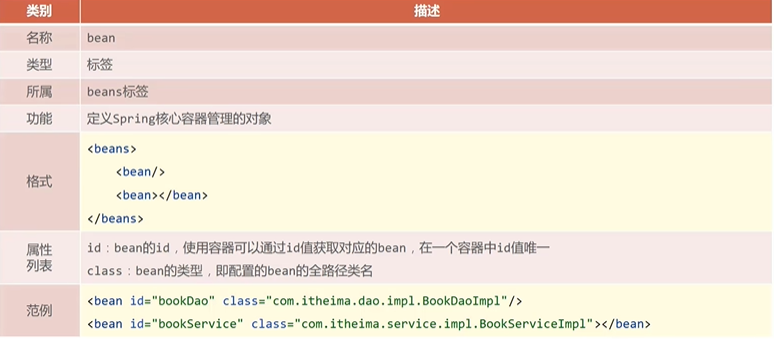

# Spring

[TOC]

# 一、初识Spring

Spring提供若干项目，每个项目用于完成特定的功能

Spring全家桶中比较常见的技术

- Spring Framework
- Spring Boot
- Spring cloud

Spring的发展

- Spring1.0 纯配置型的开发
- Spring2.0 引入注解开发
- Spring3.0 不写配置的开发模式
- Spring4.0 API变化
- Spring5.0 全面支持JDK8

# 二、Spring Framework系统架构

## 2.1 系统架构


Spring框架在4.0趋于完整，因此我们着重看4.0以后的架构

### 2.1.1 Core Container


容器中装的是对象

### 2.1.2 AOP和Aspects


AOP是一种编程思想，能够在不改变源程序得到前提下增强功能

Aspects是AOP思想的实现。

### 2.1.3 Data Access


Spring能够实现数据访问，并且能够集成其他方案。值得一提的是，Spring很好的实现了Transaction事务。

### 2.1.4 Web

Spring也能够进行Web开发


### 2.1.5 Test


Spring在单元测试和集成测试也进行了实现。

## 2.2 学习路线


# 三、核心概念

为了解决耦合度偏高的问题，在使用对象的时候，程序中不要主动使用new产生对象，转换为由**外部提供对象**。对象的控制权由程序转移到外部的思想就是控制反转。（对象的控制权）

Spring技术对IOC思想进行实现**（IoC管理Bean）IoC（inversion of Control）控制反转**

- Spring提供了一个容器，称为IOC容器，用来充当IOC思想中的外部。也就是说，现在对象我在IOC容器中往外拿。
- Ioc容器负责对象的创建、初始化等一系列的工作，被创建或被管理的对象在Ioc容器中统称为Bean

DI（dependency injection）依赖注入**（Bean的关系绑定）**

- 在容器中建立bean与bean之间的依赖关系的整个过程，称为依赖注入。


最终效果：使用对象的时候可以直接从IOC容器中获取，并且获取到的Bean已经绑定了所有的依赖关系

# 四、IoC入门案例思路分析及实现

## 4.1 IoC思路分析

### 4.1.1 管理什么？（Service与Dao）

先熟悉一下Java Web三层架构 https://www.cnblogs.com/cielosun/articles/5752272.html

我们的项目架构如下，也是常见的结构


每个代码的运行逻辑

**Dao层**

接口

```java
package com.itheima.dao;

public interface BookDao {
	public void save();
}

```

实现类

```java
package com.itheima.dao.impl;

import com.itheima.dao.BookDao;

public class BookDaoImpl implements BookDao {
	public void save(){
		System.out.println("book dao save ... ");
	}
}

```

**Service层**

接口

```java
package com.itheima.service;

public interface BookService {
	public void save();
}

```

实现类

```java
package com.itheima.service.impl;

import com.itheima.dao.BookDao;
import com.itheima.dao.impl.BookDaoImpl;
import com.itheima.service.BookService;

public class BookServiceImpl implements BookService {
   private BookDao bookDao = new BookDaoImpl();

   public void save(){
      System.out.println("book service save ...");
      bookDao.save();
   }
}
```

两个实现类都继承了各自的接口，主程序如下

```java
package com.itheima;

import com.itheima.service.BookService;
import com.itheima.service.impl.BookServiceImpl;

public class App {
	public static void main(String[] args) {
		BookService bookService = new BookServiceImpl();
		bookService.save();
	}
}

```

主程序中，我们首先创建了接口的对象（但是对象中没有构造方法，必须被继承的子类实现其中的抽象方法）所以都必须要实现其save方法。所以首先输出的是"book service save ..."，然后因为又创建了Dao的对象，所以执行bookDao.save();时，输出"book dao save ... "。这个例子还是比较简单的。

### 4.1.2 如何将被管理的对象告知IoC容器？（配置）

怎么去配置bean？

首先我们需要导入spring的依赖，这里我们使用下面的依赖

```xml
<!-- https://mvnrepository.com/artifact/org.springframework/spring-context -->
<dependency>
    <groupId>org.springframework</groupId>
    <artifactId>spring-context</artifactId>
    <version>6.0.4</version>
</dependency>
```

然后在resources里面创建一个spring，IDEA中创建的方式如图


创建好之后，我们就在XML文件中进行相关bean的配置，主要是两步

```xml
<?xml version="1.0" encoding="UTF-8"?>
<beans xmlns="http://www.springframework.org/schema/beans"
       xmlns:xsi="http://www.w3.org/2001/XMLSchema-instance"
       xsi:schemaLocation="http://www.springframework.org/schema/beans http://www.springframework.org/schema/beans/spring-beans.xsd">

    <!--    1、导入spring的坐标spring-context-->

    <!--    2、配置bean-->

    <bean id="bookDao" class="com.itheima.dao.impl.BookDaoImpl"/>
    <bean id="bookService" class="com.itheima.service.impl.BookServiceImpl"/>
</beans>
```

id表示起的名字，class表示是哪个类，是一个路径。

然后我们重新书写4.1.1中的代码

### 4.1.3 被管理的对象交给IoC容器，如何获取到IoC容器？（接口）

```java
// 3、获取IoC容器
// ApplicationContext是一个接口，不能实例化，应该用他的实现类
ApplicationContext ctx = new ClassPathXmlApplicationContext("applicationContext.xml");
```


### 4.1.4 IoC容器得到后，如何从容器中获取bean？（接口方法）

```java
// 4、获取bean
BookDao bookDao = (BookDao)ctx.getBean("bookDao");
bookDao.save();
```

ctx.getBean("bookDao"); 返回的结果是object，我们既然要使用BookDao（接口），那么应该对其进行转型。

然后直接调用方法就行。

这里碰到一个问题，就是spring framework与jdk的对应关系 https://blog.csdn.net/a321123b/article/details/123568578


比如我是jdk8然后导入的是6.0的spring，就会报如下的错误


我们只要改成spring5的版本就不会报错了。


同样的道理，我们也可以拿出Service

```java
BookService bookService = (BookService)ctx.getBean("bookService");
```


### 4.1.4 使用Spring导入哪些坐标？（pom.xml）

注意版本对应

```xml
<!-- https://mvnrepository.com/artifact/org.springframework/spring-context -->
<dependency>
  <groupId>org.springframework</groupId>
  <artifactId>spring-context</artifactId>
  <version>5.3.25</version>
</dependency>
```

## 4.2 实现

完整App2程序

```java
package com.itheima;

import com.itheima.dao.BookDao;
import com.itheima.service.BookService;
import org.springframework.context.ApplicationContext;
import org.springframework.context.support.ClassPathXmlApplicationContext;

public class App2 {
   public static void main(String[] args) {
      // 3、获取IoC容器
      // ApplicationContext是一个接口，不能实例化，应该用他的实现类
      ApplicationContext ctx = new ClassPathXmlApplicationContext("applicationContext.xml");

      // 4、获取bean
      BookDao bookDao = (BookDao)ctx.getBean("bookDao");
      BookService bookService = (BookService)ctx.getBean("bookService");
      bookDao.save();
      bookService.save();
   }
}
```

# 五、DI入门案例

在四中我们虽然实现了bean的配置，但是我们发现，在程序中，还是避免不了创建对象，例如


这个时候就需要用到我们的依赖注入

## 5.1 DI入门案例思路分析

### 5.1.1 基于IoC管理Bean


### 5.1.2 Service中使用new形式创建的Dao对象是否保留？（否）


### 5.1.3 Service中需要的Dao对象如何进入到Service中？（提供方法）

在这里我们提供的是Set方法

```java
public void setBookDao(BookDao bookDao) {
   this.bookDao = bookDao;
}
```

那么谁会用到这个setBookDao方法呢，很明显是bean要用到，那么怎么用，就需要我们在bean中进行配置。

### 5.1.4 Service与Dao间的关系如何描述？（配置）

在bean中，我们要明确调用关系。由于我们在service接口中调用了dao，所以我们在bean中也是需要在service标签中配置dao，配置关系如下

```xml
<?xml version="1.0" encoding="UTF-8"?>
<beans xmlns="http://www.springframework.org/schema/beans"
       xmlns:xsi="http://www.w3.org/2001/XMLSchema-instance"
       xsi:schemaLocation="http://www.springframework.org/schema/beans http://www.springframework.org/schema/beans/spring-beans.xsd">

    <!--    1、导入spring的坐标spring-context-->

    <!--    2、配置bean-->

    <bean id="bookDao" class="com.itheima.dao.impl.BookDaoImpl"/>
    <bean id="bookService" class="com.itheima.service.impl.BookServiceImpl">
    <!--
        配置service与dao的关系
        我们在service中，使用到了dao，所以我们在bean中应该在service中配置dao
    -->
        <property name="bookDao" ref="bookDao"/>
    </bean>
</beans>
```

注意两个标签：name和ref

- name标签 bookDao 指的是 service接口中命名的对象，即 private BookDao bookDao;
- ref标签 bookDao 指的是在当前的xml文件中，<bean id="bookDao" class="com.itheima.dao.impl.BookDaoImpl"/>  这一条中的id。

# 六、bean配置

## 6.1 bean基础配置



上面是之前学到的一些知识，但是如果不同人开发，bean的名字不一样怎么办，这就涉及到bean的别名配置

## 6.2 bean别名配置

bean别名配置只需要在标签中添加一个name属性，之间可以用逗号、分号、空格分隔。

```java
BookService bookService = (BookService)ctx.getBean("service3"); // 别名
```

并且这个别名也可以用于依赖注入，所以我们在bean中ref写别名也是可以的。

```xml
<bean id="bookService" name="service service2 service3" class="com.itheima.service.impl.BookServiceImpl">
<!--
    配置service与dao的关系
    我们在service中，使用到了dao，所以我们在bean中应该在service中配置dao
-->
    <property name="bookDao" ref="biemingdao"/>
</bean>
```

## 6.3 bean作用范围配置

当我们连续获取两次BookDao对象，对其地址进行输出不难发现，这实际上是同一个对象，也就是说，Spring构造的对象默认是单例的

```java
BookDao bookDao1 = (BookDao)ctx.getBean("bookDao");
BookDao bookDao2 = (BookDao)ctx.getBean("bookDao");
System.out.println(bookDao1);
System.out.println(bookDao2);
```

**输出**

​	com.itheima.dao.impl.BookDaoImpl@56235b8e
​	com.itheima.dao.impl.BookDaoImpl@56235b8e

那么如何变为多例，有一个scope标签

```xml
<bean id="bookDao" class="com.itheima.dao.impl.BookDaoImpl" scope="prototype"/>
```

**输出**

​	com.itheima.dao.impl.BookDaoImpl@56235b8e
​	com.itheima.dao.impl.BookDaoImpl@3632be31

结果已经变为多例。

### 6.3.1 为什么bean默认为单例

Spring管理的就是通用的对象，所以默认就是单例。

### 6.3.2 适合交给容器进行管理的bean

- 表现层对象：Servlet
- 业务层对象：Service
- 数据层对象：Dao
- 工具对象：

### 6.3.3 不适合交给容器进行管理的bean

封装实体的域对象

# 七、bean实例化

## 7.1 bean是如何创建的

### 7.1.1 使用构造方法进行创建的

```java
public BookDaoImpl(){
   System.out.println("dao is running ...");
}
```

当我们在接口的实现类中定义无参构造方法，最终输入了无参构造方法中的内容，说明Spring使用的是无参构造的方法进行对象创建，并且无论是public还是private，都能够进行对象创建，这里用到的是反射。

但是有参构造方法就会报错，Spring的报错信息应该怎么阅读。一般是从最底下看，逐渐往上找。大部分情况下最下面一条就能解决问题。


### 7.1.2 静态工厂造对象

工厂类的定义如下

```java
package com.itheima.factory;

import com.itheima.dao.OrderDao;
import com.itheima.dao.impl.OrderDaoImpl;

public class OrderDaoFactory {
   public static OrderDao getOrderDao() {
      System.out.println("set up");
       return new OrderDaoImpl();
   }
}
```

其中返回的是接口实现类的对象

我们在bean中，配置的是工厂类的class，并且还要指定哪个方法是用来生成对象的。

```xml
<bean id="orderDao" class="com.itheima.factory.OrderDaoFactory" factory-method="getOrderDao"/>
```

main程序中

```java
public class AppForInstanceOrder {
   public static void main(String[] args) {
        ApplicationContext ctx = new ClassPathXmlApplicationContext("applicationContext.xml");
      // 记得要在maven 中配置SpringFramework

      OrderDao orderDao = (OrderDao) ctx.getBean("orderDao");
      orderDao.save();
   }
}
```

注意maven中需要配置SpringFramework，并且还要与jdk的版本对应起来。

那么为什么不直接生成对象，因为工厂类中可能还要做一些其他的配置。

### 7.1.3 实例工厂造对象

在实例工厂中，我们定义的获取对象的方法如下，不再是静态方法

```java
package com.itheima.factory;

import com.itheima.dao.UserDao;
import com.itheima.dao.impl.UserDaoImpl;

public class UserDaoFactory {
   public UserDao getUserDao(){
      return new UserDaoImpl();
   }
}
```

我们配置的bean也有所差别，注意，我们首先需要把实例化工厂的bean配置好

```xml
<bean id="userFactory" class="com.itheima.factory.UserDaoFactory"/>
```

然后，我们再配置dao的bean

```xml
<bean id="userDao" factory-method="getUserDao" factory-bean="userFactory"/>
```

这个时候，dao不需要再写class，而是需要写factory-method和factory-bean这两个东西

- factory-method 是实例化产生对象的方法，getUserDao是方法名
- factory-bean 是我们配置的实例化工厂的bean，userFactory是id

在main方法中，我们获取bean仍然传入userDao字段

```java
public class AppForInstanceUser {
   public static void main(String[] args) {
      ApplicationContext ctx = new ClassPathXmlApplicationContext("applicationContext.xml");
      UserDao userDao = (UserDao) ctx.getBean("userDao");
      userDao.save();
   }
}
```

Spring对上面的过程进行了改进，我们就定义一个UserFactoryBean，这个类需要实现FactoryBean<UserDao>接口，并且泛型中要填入想要得到的类型。

```java
package com.itheima.factory;

import com.itheima.dao.UserDao;
import com.itheima.dao.impl.UserDaoImpl;
import org.springframework.beans.factory.FactoryBean;

public class UserDaoFactoryBean implements FactoryBean<UserDao> {

   @Override
   public UserDao getObject() throws Exception {
      return new UserDaoImpl();
   }

   @Override
   public Class<?> getObjectType() {
      return UserDao.class;
   }
}
```

其中重写两个方法，第一个是要返回的类型，第二个是返回的对象是什么类型的，这里填入UserDao的字节码。

然后在bean中，我们换一种新的写法。

```xml
<bean id="userDao" class="com.itheima.factory.UserDaoFactoryBean"/>
```

实际上又回归了最初的写法样式，这样更简单，并且能够得到相同的运行结果。

还有一个重写方法是用来指定是单例还是非单例的

```java
@Override
public boolean isSingleton() {
   return false;
}
```
