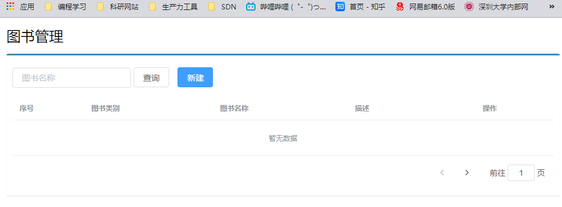
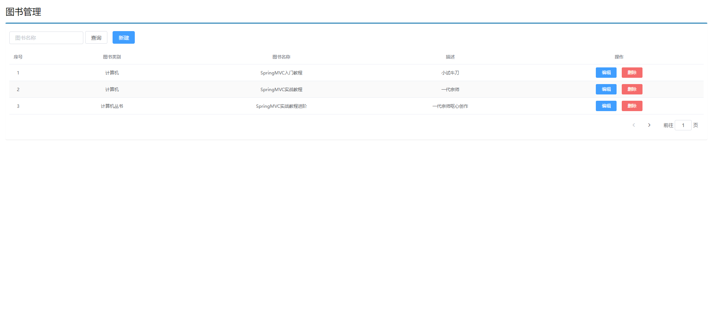
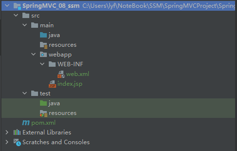
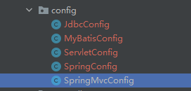
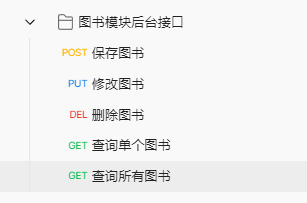
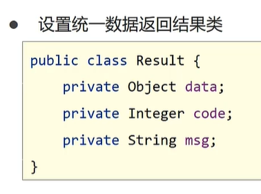

# SpringMVC

[TOC]

# 1、SpringMVC入门案例

## 1.1 导包

分别导入的是servlet和springmvc的maven包。注意springMVC的要与springframework版本保持一致

```xml
<dependency>
  <groupId>javax.servlet</groupId>
  <artifactId>javax.servlet-api</artifactId>
  <version>3.1.0</version>
</dependency>
<dependency>
  <groupId>org.springframework</groupId>
  <artifactId>spring-webmvc</artifactId>
  <version>5.3.23</version>
</dependency>
```


webmvc中的前几个都是spring中的东西，最后一个是创建一个mvc项目必不可少的。


## 1.2 创建控制器类

```java
package com.itheima.controller;

import org.springframework.stereotype.Controller;
import org.springframework.web.bind.annotation.RequestMapping;
import org.springframework.web.bind.annotation.ResponseBody;

// 2、定义controller
// 2.1 使用注解
@Controller
public class UserController {
   // 2.2 设置当前操作的访问路径
   @RequestMapping("/save")
   // 2.3 设置当前操作的返回值类型
   @ResponseBody
   public String save(){
      System.out.println("user save ...");
      return "'module':'springmvc'";
   }
}
```

### 1.2.1 @Controller

这个注解是保证当前类属于用bean进行管理，要保证能够扫描到这个类

### 1.2.2 @RequestMapping("/save")

设置Servlet访问的资源路径，也就是怎么样才能访问到这个类

### 1.2.3 @ResponseBody

设置当前操作的返回值类型


## 1.3 SpringMVC配置文件

springMVC配置文件类似于前面的spring在加载时的配置

```java
package com.itheima.config;

import org.springframework.context.annotation.ComponentScan;
import org.springframework.context.annotation.Configuration;

// 3、 创建SpringMVC的配置文件，加载controller对应的bean
@Configuration
@ComponentScan("com.itheima.controller")
public class SpringMvcConfig {

}
```


## 1.4 Servlet容器启动配置类

前面配置好了SpringMVC的内容和Servlet的内容，那么怎么把二者之间联系起来

```java
package com.itheima.config;

import org.springframework.web.context.WebApplicationContext;
import org.springframework.web.context.support.AnnotationConfigWebApplicationContext;
import org.springframework.web.servlet.support.AbstractDispatcherServletInitializer;

// 4、定义一个Servlet容器启动的配置类，在里面加载spring配置
public class ServletContainerInitConfig extends AbstractDispatcherServletInitializer {

   // 加载springmvc的容器配置
   @Override
   protected WebApplicationContext createServletApplicationContext() {
      AnnotationConfigWebApplicationContext ctx = new AnnotationConfigWebApplicationContext();
      ctx.register(SpringMvcConfig.class);
      return ctx;
   }

   // 设置哪些请求之归springmvc处理
   @Override
   protected String[] getServletMappings() {
      return new String[]{"/"}; // / 表示所有请求
   }

   // 加载spring容器配置
   @Override
   protected WebApplicationContext createRootApplicationContext() {
      return null;
   }
}
```

我们定义一个Servlet的初始化容器，这个容器继承了AbstractDispatcherServletInitializer这个类，其中有三个方法

还有更简单的写法


```java
public class ServletContainerInitConfig extends AbstractAnnotationConfigDispatcherServletInitializer{

   @Override
   protected Class<?>[] getRootConfigClasses() {
      return new Class[]{SpringConfig.class};
   }

   @Override
   protected Class<?>[] getServletConfigClasses() {
      return new Class[]{SpringMvcConfig.class};
   }

   @Override
   protected String[] getServletMappings() {
      return new String[]{"/"};
   }
}
```


### 1.4.1 createServletApplicationContext

这里面主要是加载springmvc的容器配置，然后返回springmvc容器的对象，这里用的是springmvc的专属容器AnnotationConfigWebApplicationContext

### 1.4.2 getServletMappings

用于设置哪些请求交给springmvc处理。/表示所有的请求

### 1.4.3 createRootApplicationContext

用于加载spring的容器，这里暂时还没用到，所以我们返回null

程序启动之后，我们在地址中加上/save，就能够看到返回的内容


这个项目中，一次配置这些，我们配置一次就行了，所以不用死记，或者说，直接copy就行了。

# 2、SpringMVC简介

## 2.1 SpringMVC入门案例流程分析


## 2.2 Controller加载控制与业务bean加载控制

SpringMVC加载的bean是表现层的bean，也就是使用注解@Controller标识的部分，而Spring控制的bean是业务层和功能层，即@service和@Repository标识的两部分，那么问题来了


我们在SpringMVCConfig和SpringConfig中都是在扫描com.itheima下面的包，也就是SpringMVC也会扫描到service和dao，Spring也会扫描到controller，那么如何让他们各自扫描各自的。

### 2.2.1 SpringMVC相关bean加载控制

SpringMVC加载的bean对应的包均在com.itheima.controller内

### 2.2.2 Spring相关bean加载控制

- 方式1：Spring加载的bean设置扫描范围为com.itheima，排除controller包内的bean
- 方式2：Spring加载的bean具体到service、dao包

我们创建一个相对来说完整的项目


方式1：

```java
@Configuration
//@ComponentScan({"com.itheima.dao","com.itheima.service"})
@ComponentScan(
   value = "com.itheima",
   excludeFilters = @ComponentScan.Filter(
         type = FilterType.ANNOTATION,
         classes = Controller.class
   )
)
public class SpringConfig {

}
```

方式2：


# 3、Postman工具

网页调试与发送网页HTTP请求的chrome插件，常用于进行接口测试


# 4、请求与响应 

## 4.1 请求映射路径

我们定义两个controller，其中UserController中有save和delete，BookController有save操作。

**UserController**

```java
package com.itheima.controller;

import org.springframework.stereotype.Controller;
import org.springframework.web.bind.annotation.RequestMapping;
import org.springframework.web.bind.annotation.ResponseBody;

@Controller
public class UserController {
   @RequestMapping("/save")
   @ResponseBody
   public String save() {
      System.out.println("book save ...");
      return "{'module':'book save'}";
   }

   @RequestMapping("/delete")
   @ResponseBody
   public String delete() {
      System.out.println("user delete ...");
      return "{'module':'user delete'}";
   }
}
```

**BookController**

```java
package com.itheima.controller;

import org.springframework.stereotype.Controller;
import org.springframework.web.bind.annotation.RequestMapping;
import org.springframework.web.bind.annotation.ResponseBody;

@Controller
public class BookController {
   // Servlet访问的资源路径
   @RequestMapping("/save")
   // 设置当前操作的返回值类型
   @ResponseBody
   public String save(){
      System.out.println("book save ...");
      return "{'module':'book save'}";
   }
}
```

当我们启动tomcat服务器，发生报错


原因就是，有重复的/save资源访问路径。

解决的方案就是每个使用各自的名称作为前缀

```java
@RequestMapping("/user/save")
@RequestMapping("/book/save")
```

这样就不会冲突了。这也写比较麻烦，如果方法多了，每个前面都要加前缀，那么干脆，我们把前缀提到类的外面。


## 4.2 请求

### 4.2.1 Get请求

#### 1）默认参数传递

我们在前端使用Get的方式传回参数，如何在后端代码中进行接受，代码如下，我们只需要在方法中写对应接受的形参即可

```java
package com.itheima.controller;

import org.springframework.stereotype.Controller;
import org.springframework.web.bind.annotation.RequestMapping;
import org.springframework.web.bind.annotation.ResponseBody;

@Controller
public class UserController {

   @RequestMapping("/commonParam")
   @ResponseBody
   public String commonParam(String name,int age){
      System.out.println("接受前端返回的参数 name = " + name);
      System.out.println("接受前端返回的参数 age = " + age);
      return "{'module':'common param'}";
   }
}
```

使用postman工具发送请求


最终后端的结果如下


这里有个问题，如果我们前端的字段不是name而是username，这时候会接受不到参数


使用@RequestParam注解，类似于起个别名


### 4.2.2 Post请求

#### 1）默认参数传递

使用postman工具怎么发请求


注意form-data和后面这个的区别，后面这个还能发送文件。


如果我们要发送的数据是汉字，会发生乱码


我们使用过滤器对乱码进行处理，在Servlet容器中设置过滤器

```java
// 乱码处理
@Override
protected Filter[] getServletFilters() {
   CharacterEncodingFilter filter = new CharacterEncodingFilter();
   filter.setEncoding("UTF-8");
   return new Filter[]{filter};
}
```

如果有多个过滤器，那么return new Filter[]{filter，filter2，....};依次写就行了。


### 4.2.3 其他类型的参数

#### 1）POJO类型参数

```java
// POJO 实体类对象参数
@RequestMapping("/pojoParam")
@ResponseBody
public String pojoParam(User user){
   System.out.println("pojo参数传递" + user);
   return "{'module':'pojo param'}";
}
```

然后我们前端仍然发送跟之前同样的请求


可以接受，但是还是要对应好属性名才能接受


#### 2）嵌套POJO类型参数

如果我们的对象中嵌套了其他的对象

后端代码不做大改变

```java
// POJO 实体类嵌套对象参数
@RequestMapping("/pojoNextParam")
@ResponseBody
public String pojoNextParam(User user){
   System.out.println("pojo参数传递" + user);
   return "{'module':'pojo param'}";
}
```

前端的请求我们要这样去写，采用实体类对象.属性的方式


这样仍然可以正常接受


#### 3）数组类型参数

我只需要在前端传相同key的几个值


#### 4）集合类型参数

```java
// array
@RequestMapping("/listParam")
@ResponseBody
public String listParam(@RequestParam List<String> likes){
   System.out.println("数组参数传递" + likes);
   return "{'module':'array param'}";
}
```

如果参数这个不写@RequestParam，spring会为我们创建List对象，但是又没法进行创建，因为List是个接口，所以我们要加上这个注解，只要是参数就往里扔。


### 4.2.4 JSON传参（最常用）

#### 1）坐标

JSON的坐标

```xml
<dependency>
  <groupId>com.fasterxml.jackson.core</groupId>
  <artifactId>jackson-databind</artifactId>
  <version>2.14.2</version>
</dependency>
```

#### 2）postman怎么发送json数据


#### 3）开启功能键

```java
@EnableWebMvc
```

开启json数据格式转换为对象的操作。

#### 4）参数前面加@RequestBody

```java
@RequestMapping("/jsonParam")
@ResponseBody
public String jsonParam(@RequestBody List<String> likes){
   System.out.println("数组参数传递" + likes);
   return "{'module':'array param'}";
}
```


其他格式的json怎么写

例如那种嵌套的

```json
{
    "name":"itheima",
    "age":15,
    "address":{
        "province":"shandong",
        "city":"yantai"
    }
}
```


### 4.2.5 @RequestBody和@RequestParam的区别


### 4.2.6 日期类型参数传递

springmvc默认的日期格式是yyyy/MM/dd

我们在接受格式的时候，需要手动指定格式

```java
@RequestMapping("/dateParam")
@ResponseBody
public String dataParam(Date date,
                  @DateTimeFormat(pattern = "yyyy-MM-dd") Date date1,
                  @DateTimeFormat(pattern = "yyyy-MM-dd HH:mm:ss")Date date2){
   System.out.println("date传递" + date);
   System.out.println("date传递" + date1);
   System.out.println("date传递" + date2);
   return "{'module':'pojo param'}";
}
```


之所以能够完成转换，是因为有一个Convert接口来做这些事

## 4.3 响应

### 4.3.1 响应页面

响应页面（进行页面的跳转）非常简单，只需要在方法中返回页面的名字

```java
@RequestMapping("/jumpToPage")
public String jumpToPage(){
   return "page.jsp";
}
```


### 4.3.2 响应数据

#### 1）文本数据

```java
@RequestMapping("/toText")
@ResponseBody
public String toText(){
   return "hello world!";
}
```

#### 2）json数据

响应POJO对象

```java
@RequestMapping("/toJsonPOJO")
@ResponseBody
public User toJsonPOJO(){
   User user = new User();
   user.setname("zhangsan");
   user.setAge(15);
   return user;
}
```


> @ResponseBody到底做了什么
>
> ​	>  设置当前控制器返回值作为响应体

# 5、REST风格

## 5.1 REST简介


表现形式状态转换。


REST风格的请求中，通过请求类型的动作来区分对资源进行了何种操作，例如下面这个图中


根据REST风格对资源进行访问称为RESTful

## 5.2 RESTful入门案例

我们来看看原来的代码应该怎么改

```java
@RequestMapping("/save")
@ResponseBody
public String save(User user){
   System.out.println("user save..." + user);
   return "{'module':'user save'}";
}
```

首先，不能用/save了，应该改成users，然后还要写上对应的请求方法。

```java
@RequestMapping(value = "/user",method = RequestMethod.POST)
@ResponseBody
public String save(){
   System.out.println("user save...");
   return "{'module':'user save'}";
}
```

改完之后，相当于限定了他的请求方式只能是post


那怎么传参呢，看这个例子

```java
@RequestMapping(value = "/users/{id}",method = RequestMethod.DELETE)
@ResponseBody
public String delete(@PathVariable Integer id){
   System.out.println("user delete..." + id);
   return "{'module':'user delete'}";
}
```

@PathVariable Integer id表示传入的这个参数来自于路径值，而我们的路径这样写"/users/{id}"，相当于一个占位符的作用，当我们再发请求时


路径中的这个1就传入到了形参中，id=1


下面是所有的更新后的RSET风格的书写

```java
package com.itheima.controller;

import com.itheima.domain.User;
import org.springframework.format.annotation.DateTimeFormat;
import org.springframework.stereotype.Controller;
import org.springframework.web.bind.annotation.*;

import java.io.UnsupportedEncodingException;
import java.net.URLDecoder;
import java.net.URLEncoder;
import java.util.ArrayList;
import java.util.Arrays;
import java.util.Date;
import java.util.List;

@Controller
public class UserController {
   // 查询所有
   @RequestMapping(value = "/users",method = RequestMethod.POST)
   @ResponseBody
   public String save(){
      System.out.println("user save...");
      return "{'module':'user save'}";
   }

   // 删除
   @RequestMapping(value = "/users/{id}",method = RequestMethod.DELETE)
   @ResponseBody
   public String delete(@PathVariable Integer id){
      System.out.println("user delete..." + id);
      return "{'module':'user delete'}";
   }

   // 更新
   @RequestMapping(value ="/users",method = RequestMethod.PUT)
   @ResponseBody
   public String update(@RequestBody User user){
      System.out.println("user save..." + user);
      return "{'module':'user save'}";
   }

   // 条件查找
   @RequestMapping(value ="/users/{id}",method = RequestMethod.GET)
   @ResponseBody
   public String getById(Integer id){
      System.out.println("user save..." + id);
      return "{'module':'user getById'}";
   }
   // 条件查找
   @RequestMapping(value ="/users",method = RequestMethod.GET)
   @ResponseBody
   public String getAll(){
      System.out.println("user save...");
      return "{'module':'user getall'}";
   }
}
```

几种参数传递方案


## 5.3 REST快速开发


终极简化

```java
package com.itheima.controller;

import com.itheima.domain.User;
import org.springframework.format.annotation.DateTimeFormat;
import org.springframework.stereotype.Controller;
import org.springframework.web.bind.annotation.*;

import java.io.UnsupportedEncodingException;
import java.net.URLDecoder;
import java.net.URLEncoder;
import java.util.ArrayList;
import java.util.Arrays;
import java.util.Date;
import java.util.List;

//@Controller
//@ResponseBody
@RestController
@RequestMapping("/users")
public class UserController {
   // 查询所有
// @RequestMapping(method = RequestMethod.POST)
   @PostMapping
   public String save(){
      System.out.println("user save...");
      return "{'module':'user save'}";
   }

   // 删除
   @DeleteMapping("/{id}")
   public String delete(@PathVariable Integer id){
      System.out.println("user delete..." + id);
      return "{'module':'user delete'}";
   }

   // 更新
   @PutMapping
   public String update(@RequestBody User user){
      System.out.println("user save..." + user);
      return "{'module':'user save'}";
   }

   // 条件查找
   @GetMapping("/{id}")
   public String getById(Integer id){
      System.out.println("user save..." + id);
      return "{'module':'user getById'}";
   }
   // 条件查找
   @GetMapping
   public String getAll(){
      System.out.println("user save...");
      return "{'module':'user getall'}";
   }
}
```

- //@Controller
  //@ResponseBody 用 @RestController简化
- @RequestMapping("/users") 提到类的外面
-  @RequestMapping(method = RequestMethod.POST) 用 @PostMapping 简化，其他的类似

## 5.4 案例：基于RESTful页面数据交互

### 5.4.1 编写controller代码

```java
package com.itheima.controller;

import com.itheima.domain.Book;
import org.springframework.web.bind.annotation.GetMapping;
import org.springframework.web.bind.annotation.PostMapping;
import org.springframework.web.bind.annotation.RequestMapping;
import org.springframework.web.bind.annotation.RestController;

import java.util.ArrayList;
import java.util.List;

@RestController
@RequestMapping("/books")

public class BookController {
   @PostMapping
   // 保存功能
   public String save(Book book){
      System.out.println("book save" + book);
      return "{'module':'book save success'}";
   }

   @GetMapping
   // 获取全部功能
   public List<Book> getAll(){
      List<Book> bookList = new ArrayList<>();
      Book book1 = new Book();
      book1.setType("asdasf");
      book1.setName("sdfhhsdhsdf");
      book1.setDescription("asdasasdf");
      bookList.add(book1);
      Book book2 = new Book();
      book2.setType("asdasf");
      book2.setName("sdfhhsdhsdf");
      book2.setDescription("asdasasdf");
      bookList.add(book2);

      return null;
   }
}
```

### 5.4.2 在postman中进行测试


### 5.4.3 前端代码

我们在访问页面的时候，可能加载不到资源，这是因为我们的所有页面都交给了mvc来处理这里我们新增一个类用于放行资源

```java
package com.itheima.config;

import org.springframework.context.annotation.Configuration;
import org.springframework.web.servlet.config.annotation.ResourceHandlerRegistry;
import org.springframework.web.servlet.config.annotation.WebMvcConfigurationSupport;

@Configuration
public class SpringMvcSupport extends WebMvcConfigurationSupport {
   @Override
   protected void addResourceHandlers(ResourceHandlerRegistry registry) {
      // 当访问/pages下的内容时，不要走mvc
      registry.addResourceHandler("/pages/**").addResourceLocations("/pages/");
      registry.addResourceHandler("/js/**").addResourceLocations("/js/");
      registry.addResourceHandler("/css/**").addResourceLocations("/css/");
      registry.addResourceHandler("/plugins/**").addResourceLocations("/plugins/");
   }
}
```


成功访问




查询所有数据



# 6、SSM整合

## 6.1 SSM整合流程

### 6.1.1 创建工程

下面是一个较为完整的项目结构



然后我们需要引入一些必要的jar包，主要有下面这些

Spring整合web开发的模块

```xml
<dependency>
  <groupId>org.springframework</groupId>
  <artifactId>spring-webmvc</artifactId>
  <version>5.2.10.RELEASE</version>
</dependency>
```

Spring整合jdbc

```xml
<dependency>
  <groupId>org.springframework</groupId>
  <artifactId>spring-jdbc</artifactId>
  <version>5.2.10.RELEASE</version>
</dependency>
```

Spring测试

```xml
<dependency>
  <groupId>org.springframework</groupId>
  <artifactId>spring-test</artifactId>
  <version>5.2.10.RELEASE</version>
</dependency>
```

MyBatis相关和Spring整合MyBatis

```xml
<dependency>
  <groupId>org.mybatis</groupId>
  <artifactId>mybatis</artifactId>
  <version>3.5.6</version>
</dependency>

<dependency>
  <groupId>org.mybatis</groupId>
  <artifactId>mybatis-spring</artifactId>
  <version>1.3.0</version>
</dependency>
```

mysql驱动

```xml
<dependency>
  <groupId>mysql</groupId>
  <artifactId>mysql-connector-java</artifactId>
  <version>5.1.47</version>
</dependency>
```

Druid数据源

```xml
<dependency>
  <groupId>com.alibaba</groupId>
  <artifactId>druid</artifactId>
  <version>1.1.16</version>
</dependency>
```

Junit

```xml
<dependency>
  <groupId>junit</groupId>
  <artifactId>junit</artifactId>
  <version>4.12</version>
  <scope>test</scope>
</dependency>
```

Spring整合Servlet容器

```xml
<dependency>
  <groupId>javax.servlet</groupId>
  <artifactId>javax.servlet-api</artifactId>
  <version>3.1.0</version>
  <scope>provided</scope>
</dependency>
```

JSON

```xml
<dependency>
  <groupId>com.fasterxml.jackson.core</groupId>
  <artifactId>jackson-databind</artifactId>
  <version>2.9.0</version>
</dependency>
```

### 6.1.2 SSM整合

#### 1）Spring

##### SpringConfig配置类


#### 2）MyBatis

##### MyBatisConfig配置类


##### JdbcConfig配置类


##### jbdc.properties配置文件


#### 3）SpringMVC

##### ServletConfig配置类


##### SpringMvcConfig配置类



主要是五个配置类 都是一些固定的格式


### 6.1.3 功能模块

#### 1）表与实体类

```java
package com.itheima.domain;

public class Book {
   private Integer id;
   private String type;
   private String name;
   private String description;

   @Override
   public String toString() {
      return "Book{" +
            "id=" + id +
            ", type='" + type + '\'' +
            ", name='" + name + '\'' +
            ", description='" + description + '\'' +
            '}';
   }

   public Integer getId() {
      return id;
   }

   public void setId(Integer id) {
      this.id = id;
   }

   public String getType() {
      return type;
   }

   public void setType(String type) {
      this.type = type;
   }

   public String getName() {
      return name;
   }

   public void setName(String name) {
      this.name = name;
   }

   public String getDescription() {
      return description;
   }

   public void setDescription(String description) {
      this.description = description;
   }
}
```

#### 2）dao（接口+自动代理）

```java
package com.itheima.dao;

import com.itheima.domain.Book;
import org.apache.ibatis.annotations.Delete;
import org.apache.ibatis.annotations.Insert;
import org.apache.ibatis.annotations.Select;
import org.apache.ibatis.annotations.Update;

import java.util.List;

public interface BookDao {
   @Insert("insert into tbl_book (type,name,description) values (#{type},#{name},#{description})")
   public void save(Book book);

   @Update("update tbl_book set type = #{type},name = #{name},description = #{description} where id = #{id}")
   public void update(Book book);

   @Delete("delete from tbl_book where id = #{id}")
   public void delete(Integer id);

   @Select("select * from tbl_book where id = #{id}")
   public Book getById(Integer id);

   @Select("select * from tbl_book")
   public List<Book> getAll();
}
```

#### 3）service（接口+实现类）

```java
package com.itheima.service.Impl;

import com.itheima.dao.BookDao;
import com.itheima.domain.Book;
import com.itheima.service.BookService;
import org.springframework.beans.factory.annotation.Autowired;
import org.springframework.stereotype.Service;

import java.util.List;

@Service
public class BookServiceImpl implements BookService {
   @Autowired
   private BookDao bookDao;

   public boolean save(Book book) {
      bookDao.save(book);
      return true;
   }

   public boolean update(Book book) {
      bookDao.update(book);
      return true;
   }

   public boolean delete(Integer id) {
      bookDao.delete(id);
      return true;
   }

   public Book getById(Integer id) {
      return bookDao.getById(id);
   }

   public List<Book> getAll() {
      return bookDao.getAll();
   }
}
```

##### 业务层接口测试（整合JUnit）

```java
package com.itheima.service;

import com.itheima.config.SpringConfig;
import com.itheima.domain.Book;
import com.itheima.service.Impl.BookServiceImpl;
import org.junit.Test;
import org.junit.runner.RunWith;
import org.springframework.beans.factory.annotation.Autowired;
import org.springframework.test.context.ContextConfiguration;
import org.springframework.test.context.junit4.SpringJUnit4ClassRunner;

import java.util.List;

@RunWith(SpringJUnit4ClassRunner.class)
@ContextConfiguration(classes = SpringConfig.class)
public class BookServiceTest {
   @Autowired
   private BookService bookService;
   @Test
   public void testSave(){

   }

   @Test
   public void testUpdate(){

   }

   @Test
   public void testDelete(){

   }

   @Test
   public void testGetById(){
      Book book = bookService.getById(1);
      System.out.println(book);
   }

   @Test
   public void testGetAll(){
      List<Book> all = bookService.getAll();
      for (Book book : all) {
         System.out.println(book);
      }

   }
}
```

#### 4）controller

##### 表现层接口测试（PostMan）



```java
package com.itheima.controller;

import com.itheima.dao.BookDao;
import com.itheima.domain.Book;
import com.itheima.service.BookService;
import org.springframework.beans.factory.annotation.Autowired;
import org.springframework.stereotype.Controller;
import org.springframework.stereotype.Service;
import org.springframework.web.bind.annotation.*;

import java.util.List;

@RestController
@RequestMapping("/books")
public class BookController {
   @Autowired
   private BookService bookService;

   @PostMapping
   public boolean save(@RequestBody Book book) {
      return bookService.save(book);
   }

   @PutMapping
   public boolean update(@RequestBody Book book) {
      bookService.update(book);
      return bookService.update(book);
   }
   @DeleteMapping("/{id}")
   public boolean delete(@PathVariable Integer id) {
      return bookService.delete(id);
   }
   @GetMapping("/{id}")
   public Book getById(@PathVariable Integer id) {
      return bookService.getById(id);
   }
   @GetMapping
   public List<Book> getAll() {
      return bookService.getAll();
   }
}
```

#### 5）开始事务

- 开启注解式事务驱动

  - SpringConfig中 @EnableTransactionManagement

- 配置事务的管理器

  - JdbcConfig中 

  - ```java
    @Bean
    public PlatformTransactionManager transactionManager(DataSource dataSource) {
        DataSourceTransactionManager ds = new DataSourceTransactionManager();
       ds.setDataSource(dataSource);
       return ds;
    }
    ```

- 配置事务@Transaction到业务层接口上

  - ```java
    @Transactional
    public interface BookService {
       public boolean save(Book book);
    
       public boolean update(Book book);
    
       public boolean delete(Integer id);
    
       public Book getById(Integer id);
    
       public List<Book> getAll();
    }
    ```

## 6.2 表现层数据封装

说简单点，就是前后端实现数据交互的一种数据形式的规定



这个格式不唯一，需要商量决定

定义两个类，分别用返回结果和状态码

Result类

```java
package com.itheima.controller;

public class Result {
   private Object data;
   private Integer code;
   private String msg;

   public Result(){

   }

   public Result(Object data, Integer code, String msg) {
      this.data = data;
      this.code = code;
      this.msg = msg;
   }

   public Result(Object data, Integer code) {
      this.data = data;
      this.code = code;
   }

   @Override
   public String toString() {
      return "Result{" +
            "data=" + data +
            ", code=" + code +
            ", msg='" + msg + '\'' +
            '}';
   }

   public Object getData() {
      return data;
   }

   public void setData(Object data) {
      this.data = data;
   }

   public Integer getCode() {
      return code;
   }

   public void setCode(Integer code) {
      this.code = code;
   }

   public String getMsg() {
      return msg;
   }

   public void setMsg(String msg) {
      this.msg = msg;
   }
}
```

Code类

```java
package com.itheima.controller;

public class Code {
   public static final Integer SAVE_OK = 20011;
   public static final Integer DELETE_OK = 20021;
   public static final Integer UPDATE_OK = 20031;
   public static final Integer GET_OK = 20041;

   public static final Integer SAVE_ERR = 20010;
   public static final Integer DELETE_ERR = 20020;
   public static final Integer UPDATE_ERR = 20030;
   public static final Integer GET_ERR = 20040;
}
```


然后我们Controller类中的返回结果需要改成我们指定的格式

```java
package com.itheima.controller;

import com.itheima.dao.BookDao;
import com.itheima.domain.Book;
import com.itheima.service.BookService;
import com.sun.org.apache.xerces.internal.impl.xpath.regex.REUtil;
import org.springframework.beans.factory.annotation.Autowired;
import org.springframework.stereotype.Controller;
import org.springframework.stereotype.Service;
import org.springframework.web.bind.annotation.*;

import java.util.List;

@RestController
@RequestMapping("/books")
public class BookController {
   @Autowired
   private BookService bookService;

   @PostMapping
   public Result save(@RequestBody Book book) {
      boolean flag = bookService.save(book);
      return new Result(flag ? Code.SAVE_OK:Code.SAVE_ERR,flag);
   }

   @PutMapping
   public Result update(@RequestBody Book book) {
      boolean flag = bookService.update(book);
      return new Result(flag ? Code.UPDATE_OK:Code.UPDATE_ERR,flag);
   }

   @DeleteMapping("/{id}")
   public Result delete(@PathVariable Integer id) {
      boolean flag = bookService.delete(id);
      return new Result(flag ? Code.DELETE_OK:Code.DELETE_ERR,flag);
   }

   @GetMapping("/{id}")
   public Result getById(@PathVariable Integer id) {
      Book book = bookService.getById(id);
      Integer code = book != null ? Code.GET_OK : Code.GET_ERR;
      String msg = book != null ? "" : "数据查询失败，请重试！";
      return new Result(code,book,msg);
   }

   @GetMapping
   public Result getAll() {
      List<Book> books = bookService.getAll();
      Integer code = books != null ? Code.GET_OK : Code.GET_ERR;
      String msg = books != null ? "" : "数据查询失败，请重试！";
      return new Result(code,books,msg);
   }
}
```

## 6.3 异常处理器

