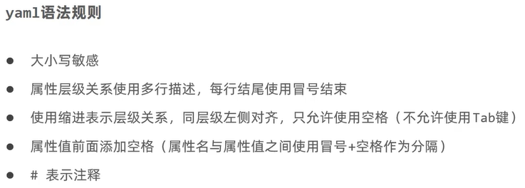

# SpringBoot

[TOC]

# 1、入门工程案例

## 1.1 项目结构


这里maven一直显示导入依赖失败，问题应该出在jdk版本和springboot的版本不对应的问题上，一开始选择了springboot3.0以上的版本，其最低支持的jdk是17。

## 1.2 简单程序

我们不需要再像之前一样配置繁琐的配置类，只需要写好我们的业务操作，然后程序就能运行，可以看到，springboot已经帮我们集成了tomcat。


然后我们在postman中进行测试，注意默认的是8080端口


后台也输出了对应的id值


## 1.3 Spring和SpringBoot程序的区别


注意SpringBoot要联网才能创建，因为走的是人家官网的东西。

## 1.4 Springboot项目快速启动

### 1.4.1 前后端分离合作开发

前端想要执行后端程序，不需要下载一系列的tomcat、idea等，只需要把后端程序打个jar包。


然后前端拿到jar包之后，在cmd窗口中直接敲命令，就能启动后端的项目，包括tomcat

```bash
java -jar springboot_01_quickstart-0.0.1-SNAPSHOT.jar
```


> 注意，之前我们java程序打包出来的jar是没办法直接使用java -jar命令运行的，只有springboot打包的jar才能运行，因为其中使用了spring-boot-maven-plugin插件。

# 2、SpringBoot简介

## 2.1 概述

springboot对于spring的改进

- 自动配置
  - 把所有可以用的依赖版本都给配置好了
- 起步依赖
  - starter：springboot中的常见项目名称，定义的是当前项目使用的所有坐标，达到减少依赖配置的目的。
  - parent：定义了springboot项目要继承的项目，定义了若干个坐标版本号，达到减少依赖冲突的目的。
  - 实际开发中，使用坐标GAV只写GA，因为V都由Springboot给定义好了，如果发生坐标错误，再指定version，比如一开始我们的插件报错。
- 辅助功能（内置服务器）
  - spring-boot-start-web这一类的辅助依赖


springboot的主启动类

```java
package com.itheima;

import org.springframework.boot.SpringApplication;
import org.springframework.boot.autoconfigure.SpringBootApplication;

@SpringBootApplication
public class Springboot01QuickstartApplication {

   public static void main(String[] args) {
      SpringApplication.run(Springboot01QuickstartApplication.class, args);
   }

}
```


切换服务器为jetty

首先由于springboot内置了tomcat服务器，我们应该主动断开依赖

```xml
<dependency>
    <groupId>org.springframework.boot</groupId>
    <artifactId>spring-boot-starter-web</artifactId>
    <exclusions>
        <exclusion>
            <groupId>org.springframework.boot</groupId>
            <artifactId>spring-boot-starter-tomcat</artifactId>
        </exclusion>
    </exclusions>
</dependency>
```

然后我们导入jetty的依赖即可

```xml
<dependency>
    <groupId>org.springframework.boot</groupId>
    <artifactId>spring-boot-starter-jetty</artifactId>
</dependency>
```

最终启动如下


jetty比tomcat更轻量级，扩展性更强。但是tomcat还是东西更全

# 3、基础配置

## 3.1 配置格式

### 3.1.1 修改服务器端口

下面三种方式的优先级 **properties > yml > yaml**

#### 1）application.properties配置

之前spring的端口修改我们在pom文件中修改，在springboot中提供了一个properties文件，直接在这里面写（而且有智能提示）


修改后的


#### 2）application.yml配置（常用）

注意格式


#### 3）application.yaml配置

与application.yml一样


### 3.1.2 yaml（一种数据序列化格式）

以数据为核心，重数据格式

.yml和.yaml都可以。

#### 1）一般格式




#### 2）数组格式

```yaml
likes:
 - a
 - b
```

### 3.1.3 yaml数据读取三种方式

我们提前在yml文件中写入如下内容（注意在springboot中都用application作为文件开头）

```yaml
lesson: SpringBoot
server:
  port: 80

enterprise:
  name: lyf
  age: 24
  tel: 16620909823
  subject:
    - Java
    - mysql
    - SpringBoot
```

#### 1）@Value方式

```java
package com.itheima.controller;

import org.springframework.beans.factory.annotation.Value;
import org.springframework.web.bind.annotation.GetMapping;
import org.springframework.web.bind.annotation.PathVariable;
import org.springframework.web.bind.annotation.RequestMapping;
import org.springframework.web.bind.annotation.RestControllerAdvice;

import java.util.Arrays;

@RestControllerAdvice
@RequestMapping("/books")
public class BookController {

   @Value("${lesson}")
   private String lesson;

   @Value("${server.port}")
   private Integer port;

   @Value("${enterprise.subject[0]}")
   private String subject_00;

   @GetMapping("/{id}")
   public String getById(@PathVariable Integer id) {
      System.out.println("id = " + id);
      System.out.println(lesson);
      System.out.println(port);
      System.out.println(subject_00);
      return "hello spring boot!";
   }
}
```

挨个获取，但是弊端就是如果变量很多，那么我们要写很多的变量

#### 2）定义Environment对象

定义对象，然后他会把所有的都装配到这个对象中，然后我们使用getProperty通过字段名获取

```java
package com.itheima.controller;

import org.springframework.beans.factory.annotation.Autowired;
import org.springframework.beans.factory.annotation.Value;
import org.springframework.core.env.Environment;
import org.springframework.web.bind.annotation.GetMapping;
import org.springframework.web.bind.annotation.PathVariable;
import org.springframework.web.bind.annotation.RequestMapping;
import org.springframework.web.bind.annotation.RestControllerAdvice;

import java.util.Arrays;

@RestControllerAdvice
@RequestMapping("/books")
public class BookController {

   @Autowired
   private Environment environment;

   @GetMapping("/{id}")
   public String getById(@PathVariable Integer id) {
      System.out.println(environment.getProperty("server.port"));
      System.out.println(environment.getProperty("enterprise.age"));
      System.out.println(environment.getProperty("enterprise.subject[1]"));
      return "hello spring boot!";
   }
}
```


#### 3）实体类封装属性

首先我们定义与yml文件中属性相对应的实体类

```java
package com.itheima.domain;

import org.springframework.boot.context.properties.ConfigurationProperties;
import org.springframework.stereotype.Component;

import java.util.Arrays;

@Component
@ConfigurationProperties(prefix = "enterprise")
public class Enterprise {
   private String name;
   private Integer age;
   private String tel;
   private String[] subject;

   @Override
   public String toString() {
      return "Enterprise{" +
            "name='" + name + '\'' +
            ", age=" + age +
            ", tel='" + tel + '\'' +
            ", subject=" + Arrays.toString(subject) +
            '}';
   }

   public String getName() {
      return name;
   }

   public void setName(String name) {
      this.name = name;
   }

   public Integer getAge() {
      return age;
   }

   public void setAge(Integer age) {
      this.age = age;
   }

   public String getTel() {
      return tel;
   }

   public void setTel(String tel) {
      this.tel = tel;
   }

   public String[] getSubject() {
      return subject;
   }

   public void setSubject(String[] subject) {
      this.subject = subject;
   }
}
```

注意两个注解

- @Component 用于spring识别
- @ConfigurationProperties(prefix = "enterprise") 从yml中的配置信息进行读取，读取的是prefix = "enterprise"这一块
  - 

然后我们就可以自动装配实体类对象，通过get方法获取属性

```java
package com.itheima.controller;

import com.itheima.domain.Enterprise;
import org.springframework.beans.factory.annotation.Autowired;
import org.springframework.beans.factory.annotation.Value;
import org.springframework.core.env.Environment;
import org.springframework.web.bind.annotation.GetMapping;
import org.springframework.web.bind.annotation.PathVariable;
import org.springframework.web.bind.annotation.RequestMapping;
import org.springframework.web.bind.annotation.RestControllerAdvice;

import java.util.Arrays;

@RestControllerAdvice
@RequestMapping("/books")
public class BookController {

   @Autowired
   private Enterprise enterprise;

   @GetMapping("/{id}")
   public String getById(@PathVariable Integer id) {
      System.out.println(enterprise);
      return "hello spring boot!";
   }
}
```


## 3.2 多环境开发配置

### 3.2.1 yml配置

```yaml
spring:
  profiles:
    active: test
---
# 测试环境
spring:
  config:
    activate:
      on-profile: test
server:
  port: 81
---
# 生产环境
spring:
  config:
    activate:
      on-profile: pro
server:
  port: 80
---
# 开发环境
spring:
  config:
    activate:
      on-profile: dev
server:
  port: 82
```

### 3.2.2 properties配置

创建多个properties文件，然后在application.properties里面选择启用的环境


### 3.2.3 多环境启动命令格式

#### 1）切换启动的环境

```bash
java -jar springxxxxxxxxxxxxxx spring.profiles.active=test
```


#### 2）切换启动的端口

```bash
java -jar .\springboot_04_profile-0.0.1-SNAPSHOT.jar --spring.profiles.active=test --server.port=88
```


#### 3.2.4 多环境开发控制

jar包是maven进行最终打包的，maven进行主要的profile配置。


我们比较常用的是，通过在maven中的配置，让其加载到yml文件中

首先，在pom文件中

```xml
            <plugin>
                <groupId>org.apache.maven.plugins</groupId>
                <artifactId>maven-resources-plugin</artifactId>
                <version>3.2.0</version>
                <configuration>
                    <useDefaultDelimiters>true</useDefaultDelimiters>
                </configuration>
            </plugin>
```

```xml
<profiles>
    <profile>
        <id>dev</id>
        <properties>
            <profile.active>dev</profile.active>
        </properties>
    </profile>

    <profile>
        <id>pro</id>
        <properties>
            <profile.active>pro</profile.active>
        </properties>
        <activation>
            <activeByDefault>true</activeByDefault>
        </activation>
    </profile>

    <profile>
        <id>test</id>
        <properties>
            <profile.active>test</profile.active>
        </properties>
    </profile>
</profiles>
```

然后在yml文件中去读取

```yaml
spring:
  profiles:
    active: ${profile.active}
```

## 3.3 配置文件分类


在idea中，我们使用的这两级是用于开发时使用的

在文件中，我们的这两级是用于程序上线的时候使用的，也就是可以在程序外面设定端口。

# 4、整合第三方技术

## 4.1 SpringBoot整合JUnit

目录结构如下


在springboot提供的测试类中，给了一个contextLoads方法，我们只需要自动装配对象，然后直接在这个方法中调用即可。

```java
package com.itheima;

import com.itheima.service.BookService;
import org.junit.jupiter.api.Test;
import org.springframework.beans.factory.annotation.Autowired;
import org.springframework.boot.test.context.SpringBootTest;

@SpringBootTest
class Springboot07TestApplicationTests {
   @Autowired
   private BookService bookService;
   @Test
   void contextLoads() {
      bookService.save();
   }

}
```


上面这个类是启动类，测试程序会自动扫描引导类包下的所有子包，也就是会扫描com.itheima下的所有东西，如果测试类和启动类不在com.itheima下的路径，会报错，如果想用的话，在前面加类路径。

```java
@SpringBootTest(classes = Springboot07TestApplication.class)
```

## 4.2 SpringBoot整合SSM

### 4.2.1 整合细节

主要还是整合MyBatis


只需要搞个配置yml

```yaml
spring:
  datasource:
    driver-class-name: com.mysql.cj.jdbc.Driver
    url: jdbc:mysql://localhost:3306/ssm_db
    username: root
    password: lyf1577655659
    type: com.alibaba.druid.pool.DruidDataSource
```

其他的几乎不用做任何处理，再就是需要在BookDao上面**加个自动代理@Mapper**

```java
package com.itheima.dao;

import com.itheima.domain.Book;
import org.apache.ibatis.annotations.Mapper;
import org.apache.ibatis.annotations.Select;
import org.springframework.stereotype.Repository;


@Mapper
public interface BookDao {
   @Select("select * from tbl_book where id = #{id}")
   public Book getById(Integer id);
}
```

### 4.2.2 SpringBoot整合案例

详情见NoteBook\SpringBoot\SpringBootProject\springboot_09_page整合案例

