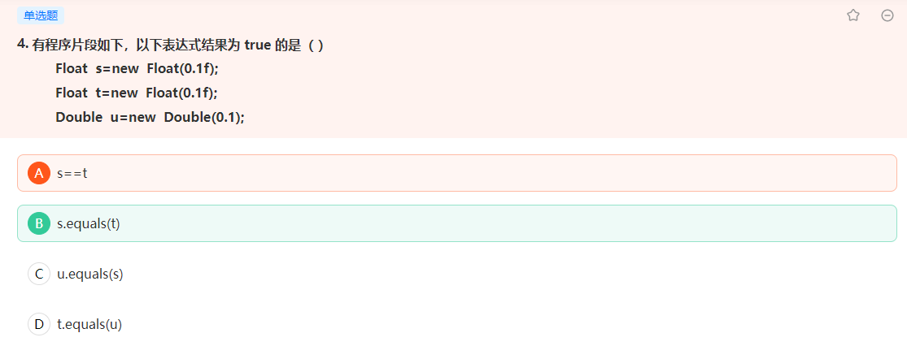
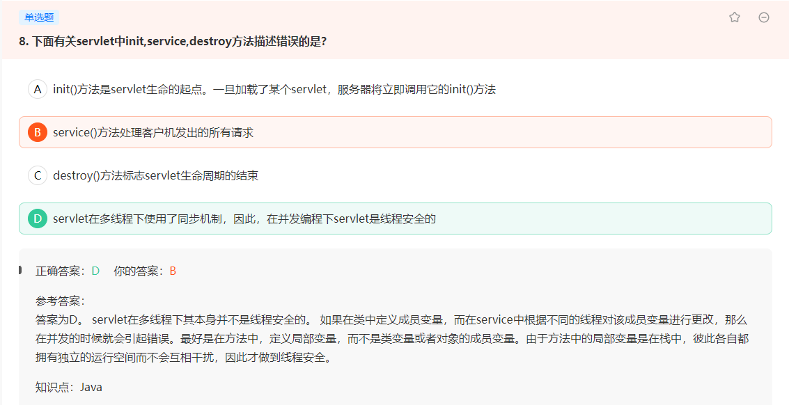
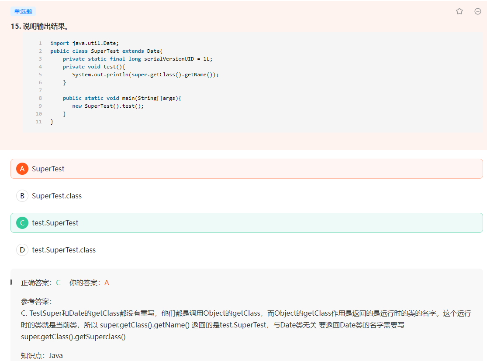
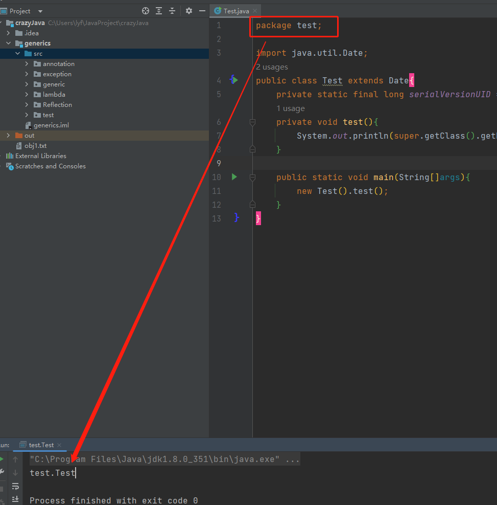
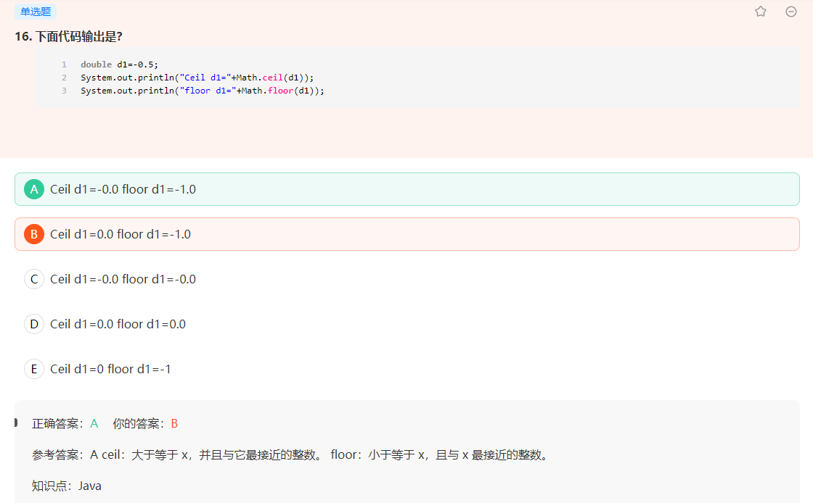
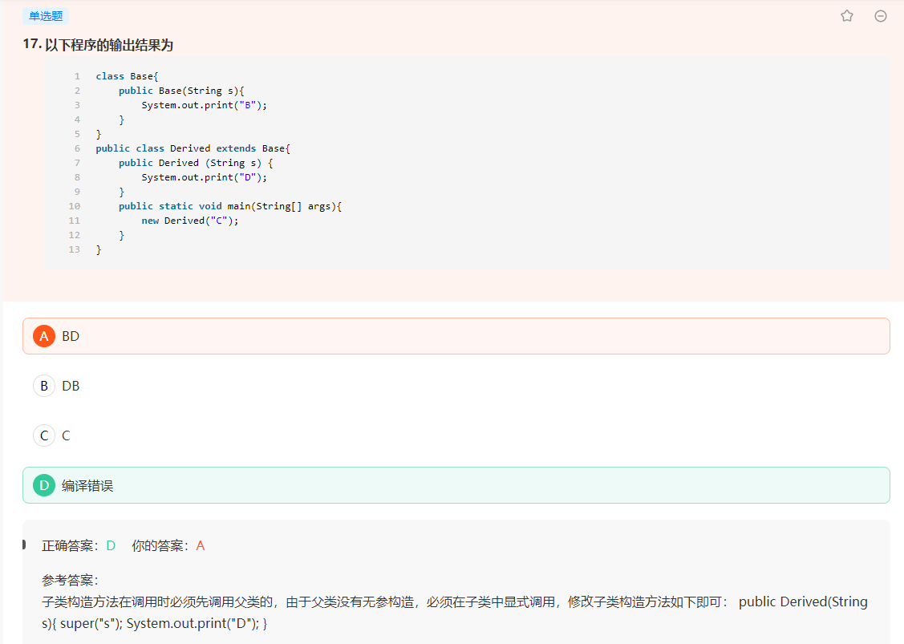
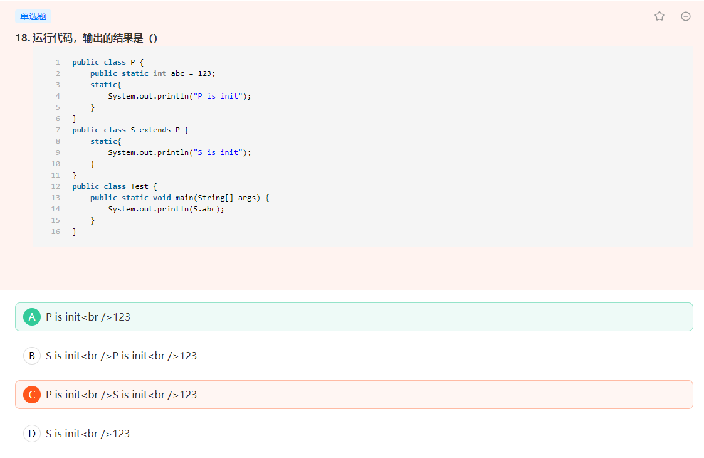

[TOC]

# 包装类比较问题



包装类不能用 == ，只能用 s.equals() 进行比较。由于Double和Float是不同的对象，所以在源码中我们也能看到，直接就返回false了。

```java
public boolean equals(Object obj) {
    return (obj instanceof Float)
           && (floatToIntBits(((Float)obj).value) == floatToIntBits(value));
}
```

```java
public boolean equals(Object obj) {
    return (obj instanceof Double)
           && (doubleToLongBits(((Double)obj).value) ==
                  doubleToLongBits(value));
}
```


# Servlet线程安全



Servlet在多线程下并不是安全的，因为service根据不同的线程进行更改成员变量，就会引起并发错误。所以最好定义**局部变量**，因为局部变量在栈中，拥有彼此独立的运行空间。 


# getClass方法



getClass()方法返回的是运行时类的名字，因为当前这个类是运行类，所以应该返回class SuperTest，getName只是用来获取这个名字的SuperTest，我运行的结果就是SuperTest，这个test应该是包的名字。

下面是加上test包的结果




# Math.ceil和Math.floor



下面是jdk1.8中的专业解答


# super使用



子类方法在调用构造方法的时候必须调用父类的构造方法，如果父类没有无参构造方法，那么必须在子类中通过super(xxx)的方式去显式的调用父类有参构造方法

```java
package test;

class Base{
   public Base(String s){
      System.out.print("B");
   }
}
public class Test extends Base{
   public Test (String s) {
      super(s);
      System.out.print("D");
   }
   public static void main(String[] args){
      new Test("C");
   }
}
```

 


# 被动引用

https://blog.csdn.net/dhaibo1986/article/details/107121098

这个题就是**通过子类引用父类的静态字段，不会导致子类初始化**

所以S类中的静态代码块不会被引用



