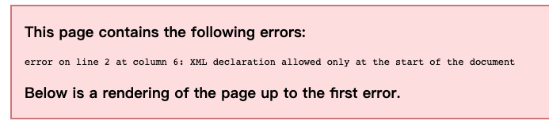
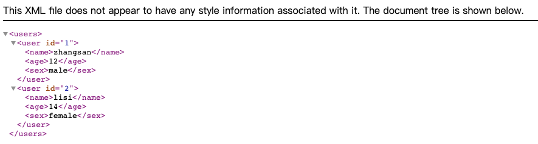
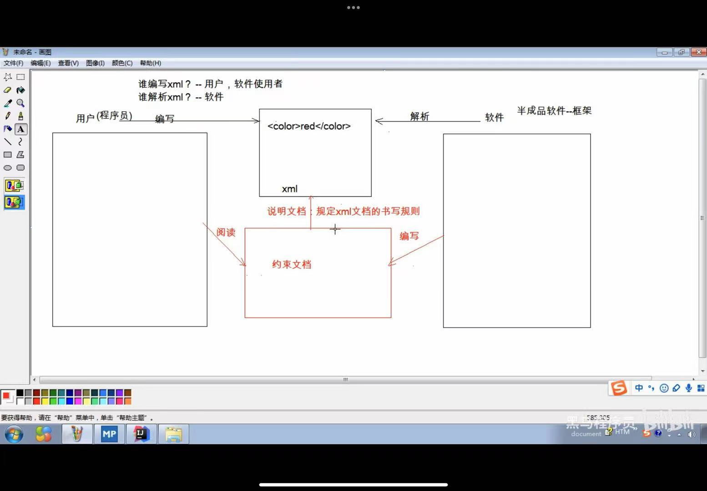

# XML

[TOC]

# 1、概念

extensible markup language 可扩展标记语言

标签都是自定义的 <user> <student>等

# 2、功能

# 3、XML和HTML的区别

XML标签都是自定义的，HTML标签是预定义的

XML语法严格，HTML语法松散

XML是存储数据的，HTML是展示数据的

# 4、XML语法

## 4.1 基本语法

1⃣️  XML文档的后缀名是.xml

2⃣️  XML第一行必须定义文档声明，如果有空行，则会报错



正确的输出是拖到浏览器中，会显示如下内容



3⃣️  xml文档当中有且仅有一个根标签

## 4.2 快速入门

```xml
<?xml version="1.0" encoding="gbk" standalone="yes"?>

<users>
    <user id="1">
        <name>张三</name>
        <age>12</age>
        <sex>male</sex>
    </user>

    <user id="2">
        <name>lisi</name>
        <age>14</age>
        <sex>female</sex>
    </user>
</users>
```

例如这里的<users>就是根标签

4⃣️  属性值必须使用引号，例如id=“1”

5⃣️  标签必须正确关闭，要么是自闭和，要么成对使用

6⃣️  XML标签区分大小写 <users> 和 <Users>是不一样的

## 4.3 组成部分

1⃣️  文档声明

格式：<?xml 属性列表 ?>

属性列表：

version：版本号，必须的属性，不写会报错，一般写1.0

encoding：编码方式，默认是ISO-8859-1，高级编译器会自动识别你写的编码方式，使编码和解码格式相同。

standalone：是否独立，yes表示独立，no表示不能够独立存在

2⃣️  指令：结合CSS现在用的比较少

3⃣️  标签：标签名称自定义的

规则

可以包含字母、数字以及其他的字符

名称不能以数字或者标点符号开始

不能以字母 xml 或者XML、Xml等开始

名称不能包含空格

4⃣️  属性

id值唯一

5⃣️  文本

CDATA区，可以把一些代码写入到<code>中，并且不用进行转译

```xml
<?xml version="1.0" encoding="gbk" standalone="yes"?>

<users>
    <user id="1">
        <name>张三</name>
        <age>12</age>
        <sex>male</sex>
    </user>

    <user id="2">
        <name>lisi</name>
        <age>14</age>
        <sex>female</sex>
    </user>

    <code>
        <![CDATA[
            if(a > b){
            
            }
        ]]>
    </code>
</users>
```

6⃣️  约束

谁编写xml 用户编写

谁解析xml 软件



作为框架的使用者，能够在xml中引入约束文档，能够简单的读懂约束文档！

约束的分类

DTD：一种简单的约束技术

练习：给出一个DTD文档，能够写出其对应的xml文档

DTD文档

```xml
<!ELEMENT students (student*) >   *表示student要出现0次或多次 +表示出现一次及以上
<!ELEMENT student (name,age,sex) >
<!ELEMENT name (#PCDATA) >
<!ELEMENT age (#PCDATA) >
<!ELEMENT sex (#PCDATA) >
<!ATTLIST student number ID #REQUIRED >
```

XML文档

首先要将DTD文档引入到xml文件中

内部DTD：将约束规则定义在xml文档中

外部DTD：将约束的规则定义在外部的DTD文档中

本地：<!DOCTYPE 根标签名 SYSTEM “DTD文件的位置”>    这是一个固定的写法

网络：<!DOCTYPE 根标签名 PUBLIC “DTD文件名字” “DTD文件的位置URL”>

```xml
<?xml version="1.0" encoding="UTF-8"?>
<!DOCTYPE students SYSTEM "student.dtd">

<students>
    <student number="s001"> 注意这里要写字符串，单纯写数字报错了
        <name>John</name>
        <age>16</age>
        <sex>M</sex>
    </student>
    <student number="s002">
        <name>tom</name>
        <age>18</age>
        <sex>M</sex>
    </student>
    <student number="s003">
        <name>jack</name>
        <age>14</age>
        <sex>F</sex>
    </student>
    <student number="s004">
        <name>lisen</name>
        <age>12</age>
        <sex>M</sex>
    </student>
</students>
```

Schema：一种复杂的约束技术

弥补了DTD文档的缺陷，比如没有对于某些字段进行范围限制

引入的规则

1. 填写xml文档的根元素 
2. 引入xsi前缀
   
    ```xml
    xmlns:xsi="http://www.w3.org/2001/XMLSchema-instance"
    ```
    
3. 引入xsd文件命名空间
   
    ```xml
    xsi:schemaLocation="http://www.itcast.cn/xml student.xsd" 
    
    http://www.itcast.cn/xml 是一个别名，如果对应多个约束，那么应该针对于不同的约束起不同的前缀
    ```
    
4. 为每一个xsd约束声明一个前缀，作为标识

```xml
xmlns="http://www.itcast.cn/xml"
```

Schema文档

```xml
<?xml version="1.0" encoding="UTF-8"?>
<xsd:schema xmlns:xsd="http://www.w3.org/2001/XMLSchema">
    <xsd:element name="studnets" type="studentsType" />

    <!--
        复杂约束
    -->
    <xsd:complexType name="studentsType">
        <xsd:sequence>
            <xsd:element name="student" type="studentType" minOccurs="0" maxOccurs="unbounded" />
        </xsd:sequence>
    </xsd:complexType>

    <xsd:complexType name="studentType">
        <xsd:sequence>
            <xsd:element name="name" type="xsd:string" />
            <xsd:element name="age" type="ageType" />
            <xsd:element name="sex" type="sexType" />
        </xsd:sequence>
        <xsd:attribute name="number" type="numberType" use="required"/>
    </xsd:complexType>

    <xsd:simpleType name="sexType">
        <xsd:restriction base="xsd:string">
            <xsd:enumeration value="male"/>
            <xsd:enumeration value="female"/>
        </xsd:restriction>
    </xsd:simpleType>

    <xsd:simpleType name="ageType">
        <xsd:restriction base="xsd:integer"/>
    </xsd:simpleType>

    <xsd:simpleType name="numberType">
        <xsd:restriction base="xsd:integer">
            <xsd:pattern value="heima_\d{4}"/>
        </xsd:restriction>
    </xsd:simpleType>
</xsd:schema>
```

对应的XML文档

```xml
<students 这里应该写引入的规则>
    <student number="heima_0001">
        <name>zhangsan</name>
        <age>24</age>
        <sex>female</sex>
    </student>
</students>
```

7⃣️  解析

操作XML文档，将文档中的数据读取到内存中

操作XML文档

1. 解析（读取）：将文档中的数据读取到内存中
2. 写入：将内存中的数据保存到xml文档中。进行持久化的存储

解析xml的方式

1. DOM：将标记语言文档**一次性加载**进内存，形成DOM树，多用于web
    1. 优点：操作比较方便，可以对文档进行crud的所有操作
    2. 缺点：比较占用内存
2. SAX：逐行读取，基于事件驱动，多用于手机端
    1. 优点：读一行就释放一行，内存占有比较小
    2. 缺点：只能读取，不能增删改

常见的解析器

JAXP：sun公司提供的解析器，支持dom和sax两种

DOM4J：一款非常优秀的解析器

Jsoup：用于解析HTML，也可以用于解析XML

PULL：Android内置的解析器

## 4.4 **Jsoup**

### 4.4.1 快速入门

步骤

1⃣️  导入jar包

2⃣️  获取Document对象

3⃣️  获取对应的标签

4⃣️  获取数据

```java
package main.Jsoup;

import org.jsoup.Jsoup;
import org.jsoup.nodes.Document;
import org.jsoup.nodes.Element;
import org.jsoup.select.Elements;

import java.io.File;
import java.io.IOException;

/**
 * Jsoup快速入门
 */

public class JsoupDemo1 {
    public static void main(String[] args) throws IOException {
        // 2. 获取Document对象
        // 第一种 根据xml文档进行获取
        // 2.1 获取student.xml的path
        String path = JsoupDemo1.class.getClassLoader().getResource("student.xml").getPath(); // 注意放到src下面
        // 2.2 解析xml文档，加载文档进内存，获取dom树
        Document document = Jsoup.parse(new File(path),"utf-8");
        // 3 获取元素对象 Element
        Elements elements = document.getElementsByTag("name");
        System.out.println(elements.size());
        // 3.1 获取第一个name的Elements对象
        Element element = elements.get(0);
        String name = element.text();
        System.out.println(name);
    }
}
```

### 4.4.2 Jsoup对象的使用

Jsoup：工具类，可以解析html或xml文档，返回document

parse方法：解析html或xml文档，返回document

```java
parse(file in, String charseName)  解析xml或html文档
parse(String html)  解析xml或html字符串
parse(URL url, int timeoutMillis) 通过URL获取xml或html文档
```

Document：文档对象，代表内存中的dom树

主要获取Elements对象

```java
getElementById(String id) 根据id属性值获取唯一的element对象
getElementsByTag(String tagName) 根据标签名称获取元素对象集合
getElementsByAttribute(String key) 根据属性名称获取元素对象集合
getElementsByAttributeValue(String key,String value) 根据对应的属性名和属性值获取元素对象集合
```

```java
package main.Jsoup;

import org.jsoup.Jsoup;
import org.jsoup.nodes.Document;
import org.jsoup.nodes.Element;
import org.jsoup.select.Elements;

import java.io.File;
import java.io.IOException;

public class JsoupDemo4 {
    public static void main(String[] args) throws IOException {
        // 1、获取student.xml的path
        String path = JsoupDemo4.class.getClassLoader().getResource("student.xml").getPath();

        // 2、获取document对象
        Document document = Jsoup.parse(new File(path), "utf-8");

        // 3、获取elements对象
        // 根据id来获取
        Element element1 = document.getElementById("heima_0001");
//        System.out.println(element1);
        // 根据标签名称获取
        Elements elements = document.getElementsByTag("name");
//        System.out.println(elements);
        // 根据属性名称获取
        Elements elements1 = document.getElementsByAttribute("id");
//        System.out.println(elements1);
        // 根据属性名称和属性值来获取
        Elements elements2 = document.getElementsByAttributeValue("number","heima_0001");
        System.out.println(elements2);

    }
}
```

Elements：元素Element对象的集合。可以当作ArrayList<Element>来使用

Element：元素对象

获取子元素对象

```java
getElementById(String id) 根据id属性值获取唯一的element对象
getElementsByTag(String tagName) 根据标签名称获取元素对象集合
getElementsByAttribute(String key) 根据属性名称获取元素对象集合
getElementsByAttributeValue(String key,String value) 根据对应的属性名和属性值获取元素对象集合
```

获取属性值

```java
String attr(String key) 根据属性名称获取属性值
```

获取文本内容

```java
String text() 获取文本内容
String html() 获取标签体的所有内容 包括字标签的字符串内容
```

```java
package main.Jsoup;

import org.jsoup.Jsoup;
import org.jsoup.nodes.Document;
import org.jsoup.nodes.Element;
import org.jsoup.select.Elements;

import java.io.File;
import java.io.IOException;

public class JsoupDemo5 {
    public static void main(String[] args) throws IOException {
        // 1、获取student.xml的path
        String path = JsoupDemo5.class.getClassLoader().getResource("student.xml").getPath();

        // 2、获取document对象
        Document document = Jsoup.parse(new File(path), "utf-8");

        // 通过Element对象获取子标签对象
        Element element_student = document.getElementsByTag("student").get(0);
        Elements name = element_student.getElementsByTag("name");
        System.out.println(name);

        // 获取student对象的属性值
        String number = element_student.attr("number");
        System.out.println(number);

        // 获取文本内容
        String text = name.text();
        System.out.println(text);

        String html = element_student.html();
        System.out.println(html);
    }
}

```

String text = name.text(); 输出的是文本内容，而String html = element_student.html();会连带标签内容一起输出，类似输出源码。

Node：节点对象

是Document和Element的父类

### 4.4.3 快捷查询方式

1⃣️  selector：选择器

```java
package main.Jsoup;

import org.jsoup.Jsoup;
import org.jsoup.nodes.Document;
import org.jsoup.nodes.Element;
import org.jsoup.select.Elements;

import java.io.File;
import java.io.IOException;

public class JsoupDemo6 {
    public static void main(String[] args) throws IOException {
        // 1、获取student.xml的path
        String path = JsoupDemo6.class.getClassLoader().getResource("student.xml").getPath();

        // 2、获取document对象
        Document document = Jsoup.parse(new File(path), "utf-8");

				// 3、使用选择器
        Elements elements = document.select("name");
        System.out.println(elements);
        System.out.println("------------");
        Elements elements1 = document.select("#001");
        System.out.println(elements1);
    }
}
```

小案例

获取student标签并且number属性值为heima_0001的age子标签

```java
Elements student = document.select("student[number=\"heima_0001\"] > age");
System.out.println(student);
```

格式有点类似于d3js

2⃣️  XPath：即为XML路径语言，是一种用来确定XML文档中某部分位置的语言

使用Jsoup的Xpath需要额外导入jar包

```java
package Jsoup;

import cn.wanghaomiao.xpath.model.JXDocument;
import cn.wanghaomiao.xpath.model.JXNode;
import org.jsoup.Jsoup;
import org.jsoup.nodes.Document;

import java.io.File;
import java.io.IOException;
import java.util.List;

public class JsoupDemo7 {
    public static void main(String[] args) throws IOException {
        // 1、获取student.xml的path
//        String path = JsoupDemo7.class.getClassLoader().getResource("src/main/java/student.xml").getPath();

        // 2、获取document对象
        Document document = Jsoup.parse(new File("src/main/java/student.xml"), "utf-8");

        // 3、创建JXDocument对象，创建对象
        JXDocument jxDocument = new JXDocument(document);

        // 4、结合xpath语法查询
        List<JXNode> jxNodes = jxDocument.selN("//student");
        for (JXNode jxNode : jxNodes) {
            System.out.println(jxNode);
        }
    }
}

```

第一步一直获取不到路径，很奇怪，是反射的知识点。